**Project convention.** When the work involves **optimizing or prioritizing tasks** — a dependency graph, "what's unblocked?", sequencing, "optimize for time", critical-path / parallelization questions — ALWAYS produce a task-dependency graph **and render it to a PNG (plus SVG) and display it via `SendUserFile`**. Inline mermaid text alone is not enough; the rendered picture is the deliverable.

**Why:** The user repeatedly asked for the dependency graph throughout the 2026-05 gbdt sessions and asked to make it a standing **project-level** convention to always create the graph and always display it as a PNG. Prioritization is consumed visually here. The house style below was dialed in interactively on 2026-05-29 (the user supplied a reference image and refined it).

**How to apply:**
- **Trigger automatically** (don't wait to be asked) whenever about to present multi-task sequencing, answer "is anything unblocked?", lay out a plan's phases, or discuss critical path / parallelization.
- **Render locally with graphviz `dot`** — installed at `/usr/bin/dot`. `mmdc` / `@mermaid-js/mermaid-cli` is NOT usable here (its npm install skips the headless-browser download and fails), so do NOT depend on mermaid-cli. Also present: `rsvg-convert`, `npx`, `node`; absent: `mmdc`, `inkscape`. Python: `graphviz` + `matplotlib` present; `pydot`/`networkx`/`cairosvg` absent.
- **Recipe** (proven 2026-05-29):
  1. Write a DOT file (e.g. `/tmp/optimize.dot`) following the house style below.
  2. `dot -Tpng -Gdpi=150 g.dot -o g.png` and `dot -Tsvg g.dot -o g.svg` — give both (SVG vector + PNG raster).
  3. `SendUserFile` the PNG (and SVG) — `status:"proactive"` if surfacing unprompted, `"normal"` if replying.
- **Do not** upload graphs to an external mermaid/Kroki web renderer — render locally (privacy + reliability).

## House style (keep consistent so graphs read at a glance)

- **Layout: `rankdir=TB`** (top-to-bottom flow), `splines=true`.
- **Title:** `Agent-Driven Investment — <subject> (<YYYY-MM-DD HH:MM TZ>)`. The title MUST carry **both date AND time** (get it from `date '+%Y-%m-%d %H:%M %Z'`). Do NOT put the legend text in the title — the legend is its own subgraph (below).
- **Group nodes into labeled cluster boxes** by module / phase / workstream (e.g. `gbdt · V1.2 — XGBoost backend`, `gbdt · V1.1 — agent-driven loop`, `data_pipelines / sweep`). Rounded, `color="#b0b0b0"`, `labelloc="t"`, bold cluster label. Cross-cluster edges are fine.
- **Recurring loops / monitors live in their own `scheduled tasks / loops` cluster** — the hourly wakeup (#94) and any other always-on schedulers/monitors go here, NOT mixed into the work clusters.
- **Node fills/styles** (each visually distinct — pending vs done was a confusable pair, now resolved):
  - actionable now: `fillcolor="#d4edda"`, `color="#155724"` (green)
  - in flight / running: `fillcolor="#d1ecf1"`, `color="#0c5460"` (blue)
  - goal: `fillcolor="#ffe69c"`, `color="#856404"`, `penwidth=2` (gold)
  - **pending / gated: `fillcolor="#ffffff"`, `color="#adb5bd"`, `style="rounded,filled,dashed"`** (WHITE box, dashed gray outline — reads as "not started")
  - **done / merged: `fillcolor="#ced4da"`, `color="#495057"`** (filled medium-gray — reads as "complete"; clearly darker than the white pending box)
  - recurring (paused between ticks): `fillcolor="#d1ecf1"`, `color="#0c5460"`, `style="rounded,filled,dotted"` (blue, DOTTED border — always-on but idle right now)
  - blocked on data: `fillcolor="#f8d7da"`, `color="#842029"` (red)
- **Edges:** solid = hard dependency; `style=dashed` = soft/informational; color a workstream's critical path (e.g. orange `#d9534f` = catboost/V1.1 path, purple `#5a3e9e` = xgboost/V1.2 path). Put the meaning in the legend, not the title.
- **Legend = a `cluster_legend` subgraph of swatch nodes in a horizontal row, forced to the TOP** (NOT a text blob, NOT a bottom table). One swatch node per state using its real fill/style, chained with `[style=invis]` + `{rank=same; ...}` to keep them a row; force above the graph with invisible edges from a legend node down to each top-of-graph source node.

## Canonical DOT skeleton

```dot
digraph deps {
  rankdir=TB;
  graph [fontname="Helvetica", bgcolor="white", splines=true, nodesep=0.35, ranksep=0.7,
         labelloc="t", fontsize=15,
         label="Agent-Driven Investment — <subject> (2026-05-29 00:57 IST)"];
  node [shape=box, style="rounded,filled", fontname="Helvetica", fontsize=10, margin="0.16,0.09", color="#444444"];
  edge [fontname="Helvetica", fontsize=8, color="#888888"];

  subgraph cluster_legend {
    label="Legend"; labelloc="t"; fontsize=12; fontname="Helvetica-Bold"; style="rounded"; color="#999999"; margin=8;
    node [shape=box, style="rounded,filled", fontsize=9, margin="0.12,0.05", height=0.32];
    lg_action [label="actionable now",     fillcolor="#d4edda", color="#155724"];
    lg_flight [label="in flight / running", fillcolor="#d1ecf1", color="#0c5460"];
    lg_goal   [label="goal",                fillcolor="#ffe69c", color="#856404"];
    lg_pend   [label="pending / gated",     fillcolor="#ffffff", color="#adb5bd", style="rounded,filled,dashed"];
    lg_done   [label="done / merged",       fillcolor="#ced4da", color="#495057"];
    lg_recur  [label="recurring (paused)",  fillcolor="#d1ecf1", color="#0c5460", style="rounded,filled,dotted"];
    lg_block  [label="blocked on data",     fillcolor="#f8d7da", color="#842029"];
    lg_action -> lg_flight -> lg_goal -> lg_pend -> lg_done -> lg_recur -> lg_block [style=invis];
    { rank=same; lg_action; lg_flight; lg_goal; lg_pend; lg_done; lg_recur; lg_block; }
  }

  subgraph cluster_work { label="<module · phase>"; labelloc="t"; fontsize=12; fontname="Helvetica-Bold"; style="rounded"; color="#b0b0b0"; margin=12;
    /* work nodes here */ }
  subgraph cluster_scheduled { label="scheduled tasks / loops"; labelloc="t"; fontsize=12; fontname="Helvetica-Bold"; style="rounded"; color="#b0b0b0"; margin=12;
    WAKE [label="#94 · hourly wakeup", fillcolor="#d1ecf1", color="#0c5460", style="rounded,filled,dotted"]; }

  /* dependency edges ... */

  /* force the legend band above every top-of-graph source node */
  lg_block -> <top_source_node> [style=invis];   /* repeat for each source node */
}
```

Note: do NOT combine a cluster with a global `rank=same` of its members (graphviz drops the cluster box) — the only `rank=same` is inside `cluster_legend` to make the swatch row.

CLAUDE.md § "Presenting plans and priorities" is the one-line summary of this convention.
