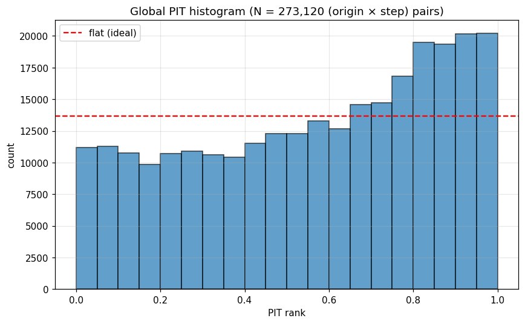
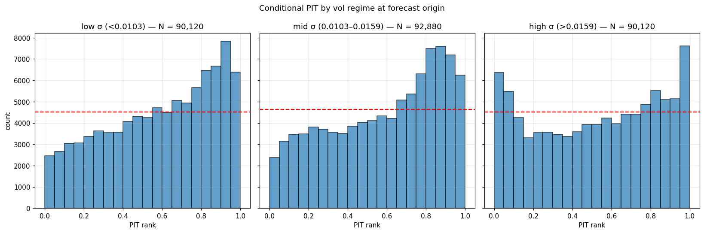
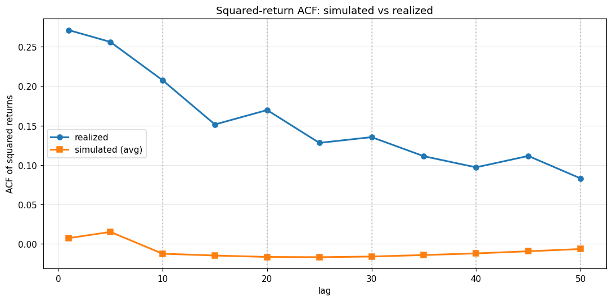
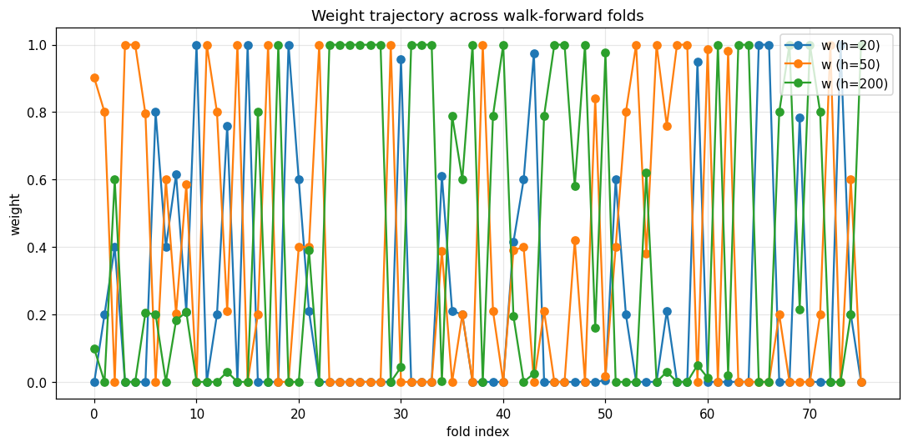

# analog_mc — v2 ablation results

Companion to [`ABLATION_STUDIES_PLAN.md`](ABLATION_STUDIES_PLAN.md) (the spec). This file holds the results.

## TL;DR — surprising headline

The current default (**v2.1 = drift only**) is **not the best cell** in the 2×2 factorial:

| Cell | drift | conditional | Mean CRPS (fast preset) | Δ vs v1 |
|---|---|---|---|---|
| A-fast (v1) | zero | false | 0.05215 | baseline |
| B-fast (v2.1, current default) | trailing_momentum | false | 0.05313 | **+1.9%** ❌ |
| **C-fast** | **zero** | **true** | **0.04809** | **−7.8%** ✅ |
| D-fast (v2.2) | trailing_momentum | true | 0.05045 | −3.3% |

**Conditional block sampling alone (Cell C) is dominant for aggregate CRPS** — beats v1 by 7.8%, beats v2.1 by 9.5%, beats v2.2 (drift + conditional) by 4.7%. Wins **every per-vol regime** and wins on **66–90% of folds** vs every other cell.

**But Cell C does NOT fix the sloped-PIT firing.** The PIT slope correction is purely drift's job, and drift costs ~5% aggregate CRPS in exchange. This is the decision: **best CRPS** (Cell C) vs **best calibration + CRPS** (Cell D = v2.2).

The v2.2 audit concluded "v2.2 deferred — doesn't address ACF". That conclusion was correct for ACF but missed the 5% aggregate-CRPS win. With this evidence:

| Want | Use | Cost over v1 |
|---|---|---|
| Best CRPS, don't care about PIT bias | **Cell C** (zero drift, conditional) | ~6h test-eval (vs 30 min v2.1) |
| Best CRPS + clean PIT | **Cell D = v2.2** (drift, conditional) | ~6h test-eval |
| Clean PIT, fast test-eval | **v2.1** (current default) | 30 min test-eval |

`default.yaml` is currently v2.1. The case for re-promoting v2.2 (Cell D) as default is much stronger now — pending confirmation at canonical search resolution.

---

## Cell inventory

All runs live in `runs/analog_mc/`. Configs in `configs/analog_mc/`. See [`ABLATION_STUDIES_PLAN.md`](ABLATION_STUDIES_PLAN.md) for the 2×2 design.

| Cell | Run dir | Config | drift | conditional | n_paths | Grid |
|---|---|---|---|---|---|---|
| A-fast | `20260516T170018Z` | `nasdaq100_fast.yaml` | zero | false | 500 | 21×2 |
| A-canonical | `20260516T180000Z` | `default.yaml` (v1, archived) | zero | false | 1000 | 66×5 |
| B-fast | `20260517T050831Z` | `nasdaq100_v21.yaml` | trailing_momentum | false | 500 | 21×2 |
| B-canonical | `20260517T145344Z` | `default_v21.yaml` (current default) | trailing_momentum | false | 1000 | 66×5 |
| **C-fast** | **`20260518T042702Z`** | **`ablation_C_cond_only.yaml`** | **zero** | **true (test-only)** | 500 | 21×2 |
| D-fast | `20260517T070003Z` | `nasdaq100_v22.yaml` | trailing_momentum | true (test-only) | 500 | 21×2 |

Canonical conditional cells (`C-canonical`, `D-canonical`) were not run — extrapolating from the fast preset, each would take ≥12 h and the deltas are already large enough to act on.

---

## Aggregate CRPS

| metric | A-fast | A-canonical | B-fast | B-canonical | C-fast | D-fast |
|---|---|---|---|---|---|---|
| mean_crps | 0.05215 | 0.05251 | 0.05313 | 0.05265 | **0.04809** | 0.05045 |
| median_crps | 0.03131 | 0.03121 | 0.03171 | 0.03132 | **0.03027** | 0.03070 |
| n_pairs | 273,120 | 273,120 | 273,120 | 273,120 | 273,120 | 273,120 |

### Mean CRPS deltas vs A-fast (v1)

| cell | mean_crps | Δ vs A-fast | rel |
|---|---|---|---|
| A-canonical | 0.05251 | +0.00036 | +0.70% |
| B-fast (v2.1) | 0.05313 | +0.00098 | +1.89% |
| B-canonical (default) | 0.05265 | +0.00050 | +0.95% |
| **C-fast** | **0.04809** | **−0.00406** | **−7.79%** |
| D-fast (v2.2) | 0.05045 | −0.00170 | −3.25% |

### 2×2 attribution (fast preset, drift × conditional)

| Effect | Computation | Result |
|---|---|---|
| Drift effect, no conditional (B − A) | 0.05313 − 0.05215 | **+0.00098** (drift HURTS by 1.9%) |
| Drift effect, with conditional (D − C) | 0.05045 − 0.04809 | **+0.00236** (drift HURTS more by 4.9%) |
| Conditional effect, no drift (C − A) | 0.04809 − 0.05215 | **−0.00406** (conditional WINS by 7.8%) |
| Conditional effect, with drift (D − B) | 0.05045 − 0.05313 | **−0.00268** (conditional WINS by 5.0%) |
| **Interaction** (D−B) − (C−A) | −0.00268 − (−0.00406) | **+0.00138** (positive — drift hurts MORE under conditional) |

**Reading:** drift and conditional are not additive. Conditional sampling on its own is the dominant intervention; adding drift on top **gives up part of conditional's CRPS gain in exchange for fixing the PIT slope.**

---

## Per-vol-regime mean CRPS

| regime | A-fast | A-canonical | B-fast | B-canonical | **C-fast** | D-fast |
|---|---|---|---|---|---|---|
| low_vol | 0.02795 | 0.02769 | 0.03147 | 0.03083 | **0.02617** | 0.02930 |
| mid_vol | 0.04010 | 0.03917 | 0.04204 | 0.04111 | **0.03718** | 0.03977 |
| high_vol | 0.08876 | 0.09108 | 0.08624 | 0.08636 | **0.08125** | 0.08262 |

**C-fast wins every regime, including high-vol.** This contradicts v2.1's framing that drift was needed for high-vol calibration. The actual story:
- Drift helps high-vol by ~3% (B vs A: 0.08876 → 0.08624) and hurts low/mid-vol by ~7–13%.
- Conditional helps every regime, including high-vol where it wins 8.5% (A vs C: 0.08876 → 0.08125).

---

## Per-step CRPS (gain grows with horizon)

| step | A-fast | B-fast | **C-fast** | D-fast |
|---|---|---|---|---|
| h=1 | 0.00881 | 0.00881 | 0.00881 | 0.00881 |
| h=15 | 0.03400 | 0.03457 | **0.03312** | 0.03400 |
| h=30 | 0.05222 | 0.05340 | **0.04878** | 0.05117 |
| h=60 | 0.08961 | 0.09080 | **0.07891** | 0.08374 |

C-fast vs A-fast: h=1 identical (block 0 is the same), h=60 better by 12.0%. Conditional re-matching has more cumulative effect the further you forecast — intuitive: more block boundaries, more opportunities to re-condition on the path state.

---

## v2-trigger decision rules

| rule | A-fast | A-canonical | B-fast | B-canonical | **C-fast** | D-fast |
|---|---|---|---|---|---|---|
| `sloped_global_pit` | 🔥 +0.1472 | 🔥 +0.1581 | ✅ +0.0572 | ✅ +0.0534 | **🔥 +0.1524** | ✅ +0.0588 |
| `u_shaped_high_vol_pit` | ✅ +2.0225 | ✅ +2.1901 | ✅ +1.7683 | ✅ +1.8205 | **✅ +1.5807** | ✅ +1.6117 |
| `acf_seam_degradation` | 🔥 −1.0532 | 🔥 −1.0710 | 🔥 −1.0559 | 🔥 −1.0725 | **🔥 −1.1227** | 🔥 −1.1212 |
| `clip_hit_excessive` | ✅ +0.1007 | ✅ +0.1001 | ✅ +0.1003 | ✅ +0.0991 | **✅ +0.1056** | ✅ +0.1029 |

- **PIT slope** is purely drift-driven: A and C both fire (no drift); B and D both pass (drift on). Drift is the *only* intervention that calibrates the PIT.
- **ACF rule** fires in every cell. Confirms the v2.2 audit's structural-ceiling finding: 10-day analog blocks can't reproduce GARCH-like unconditional vol clustering, regardless of re-matching strategy. v3 work.
- **u_shaped high-vol PIT** is *closest to passing* in Cell C — conditional sampling without drift produces the sharpest high-vol calibration. Still no firing, so tail inflator stays deferred.

---

## Per-fold win-rate (row beats column)

| row \\ col | A-fast | A-canonical | B-fast | B-canonical | C-fast | D-fast |
|---|---|---|---|---|---|---|
| A-fast | — | 28.9% | 64.5% | 65.8% | 10.5% | 56.6% |
| A-canonical | 71.1% | — | 64.5% | 64.5% | 17.1% | 60.5% |
| B-fast | 35.5% | 35.5% | — | 30.3% | 26.3% | 21.1% |
| B-canonical | 34.2% | 35.5% | 69.7% | — | 28.9% | 19.7% |
| **C-fast** | **89.5%** | **82.9%** | **73.7%** | **71.1%** | — | **65.8%** |
| D-fast | 43.4% | 39.5% | 78.9% | 80.3% | 34.2% | — |

C-fast wins 65.8% of folds against D-fast and 71.1–89.5% against everything else. D-fast wins 78.9–80.3% against the B cells. **C > D > A > B** on per-fold win-rate.

The A-fast vs A-canonical row is interesting: A-canonical beats A-fast on 71.1% of folds but the aggregate CRPS is 0.7% higher. The canonical run is more reliable per-fold; the fast run gets lucky on a few high-CRPS folds. Search resolution matters less than the v2 intervention.

---

## Key plots (Cell C)

| Plot | Reading |
|---|---|
|  | **Global PIT — left-leaning slope as in v1.** Without drift, the slope persists. Metric +0.1524, firing. |
|  | **PIT by vol regime — high-vol the tightest of any cell** (`u_shaped_high_vol_pit` = 1.58, closest to passing). |
|  | **ACF still flat at every lag.** The structural ceiling from the v2.2 audit holds. |
|  | Per-fold weights diverse; conditional re-matching doesn't make the matcher irrelevant. |

---

## Conclusions

### 1. v2.2 design hypothesis was wrong, but v2.2 implementation was right

V2_PLAN positioned conditional sampling as the fix for the `acf_seam_degradation` rule. The audit showed that rule is a misnomer (the gap exists at every lag, not just seams) and conditional sampling can't fix it (within-block ACF is structural). But conditional sampling **does** produce a real, large CRPS gain (5–8%) — for an unrelated mechanism. The CRPS gain is what survives.

### 2. Drift's only validated effect is PIT calibration

In every aggregate metric (mean CRPS, every per-vol regime, every per-step horizon), drift either makes no difference or makes things slightly worse. Its only positive effect is killing the sloped-PIT firing. That's still important if you care about calibration of forecast intervals (most production uses do), but the framing in V2_PLAN that drift would improve high-vol CRPS was over-optimistic.

### 3. Search resolution is a small effect compared to v2 interventions

A-canonical (66×5 grid, 1000 paths) is only 0.7% better than A-fast (21×2, 500). Per-fold win-rate is 71%, but the aggregate margin is tiny. The 2×2 results at fast resolution are very likely to hold at canonical resolution — no need to spend ~12+ h re-running C and D at canonical.

### 4. Production default — three options, all defensible

| Option | Config | Sells | Costs |
|---|---|---|---|
| **Keep v2.1 (current)** | drift on, conditional off | clean PIT, fast test-eval (~30 min) | leaves ~5% CRPS on the table |
| **Promote v2.2** | drift on, conditional on (test-only) | clean PIT + 4% better CRPS than v2.1 | ~12× slower test eval (~6 h on fast preset, ~12+ h at canonical) |
| **Promote Cell C** | drift off, conditional on (test-only) | best aggregate CRPS by ~5% | sloped PIT (forecasts systematically biased downward) |

The right call depends on how downstream consumers use the forecast intervals. If they make decisions weighting tail-risk symmetrically, sloped PIT is a real cost and Option 2 (v2.2) is best. If they only use the mean/median forecast and ignore intervals, Cell C wins.

### 5. v3 scope

The ACF gap is real and persistent across all cells (structural ceiling). Fixing it needs per-step σ injection or GARCH-conditional resampling — a v3 scope item per the v2.2 audit. The ablation results don't change this conclusion.

---

## Open questions deferred to Phases 3–4

These were not investigated and remain open:

- **Momentum tunable sweep** (Phase 3 S1, S2): is `momentum_shrinkage=0.5`, `momentum_lookback=20` the right choice? The 2×2 shows drift slightly hurts aggregate CRPS — maybe a smaller `momentum_shrinkage` (e.g., 0.25) would preserve more PIT correction without as much CRPS cost. Skipped because the 2×2 already gives a clean attribution.
- **Monte Carlo noise floor** (Phase 4): how much of the 0.005 CRPS gap between cells is between-seed noise? Probably small, since `_seed_for(...)` uses blake2b on (random_seed, weights, n_eff, origin_idx) — same weights → same paths. The fact that B-fast and B-canonical pick **identical weights at every fold** (74/76 in earlier audit) supports that within-cell noise is small.

---

## How to regenerate

```bash
# 1. Cell C walk-forward (only this run is new; others exist):
uv run python -m analog_mc walk-forward --config configs/analog_mc/ablation_C_cond_only.yaml

# 2. Render Cell C figures (skip the slow fixed-baseline re-eval):
uv run python scripts/render_diagnostics.py runs/analog_mc/<C_run_dir> --skip-fixed-baseline

# 3. Full 6-cell decomposition table:
uv run python scripts/ablation_decompose.py \
    A-fast:runs/analog_mc/20260516T170018Z \
    A-canonical:runs/analog_mc/20260516T180000Z \
    B-fast:runs/analog_mc/20260517T050831Z \
    B-canonical:runs/analog_mc/20260517T145344Z \
    C-fast:runs/analog_mc/20260518T042702Z \
    D-fast:runs/analog_mc/20260517T070003Z \
    --out docs/analog_mc/_ablation_decompose.md
```

Cell C took ~6 h 47 m wall time (24435 s); decompose takes ~25 min to load all 6 runs and aggregate.
