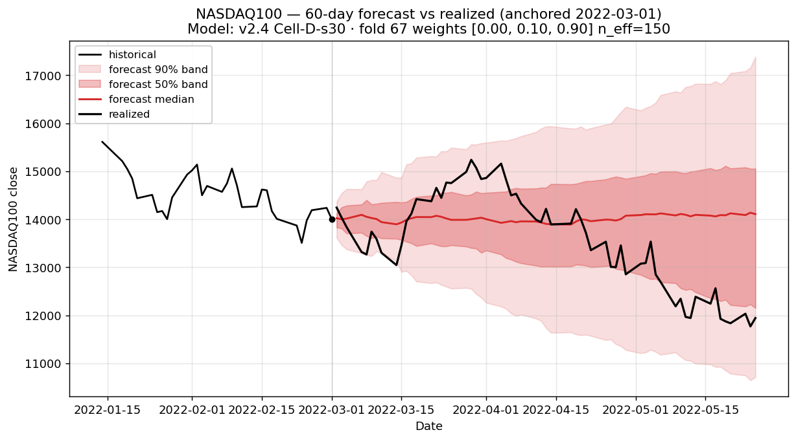
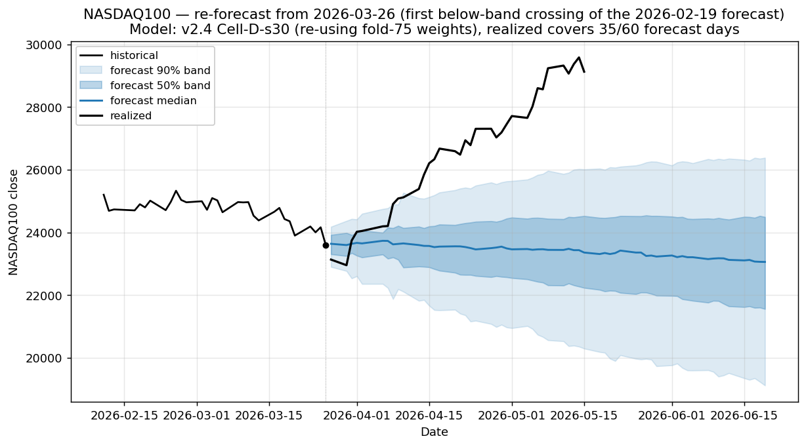

# Fat-tail evaluation set

**Mandatory benchmark for every v4+ experiment.** This document defines the canonical **15-anchor set** (5 positive extreme-z + 3 negative extreme-z + 7 regime-coverage) on which forecast calibration must be reported for any new modeling change. Companion to [`V4_EXPERIMENTS_PLAN.md`](V4_EXPERIMENTS_PLAN.md).

## Purpose

The v3 phase shipped a 9.7% mean-CRPS improvement under aggregate metrics (CRPS, PIT slope across 4,552 origins) — but ad-hoc plotting on individual anchors revealed that the model **systematically misses regime-onset rallies** (COVID-2020, Q4-2018, 2026 forecasts). Aggregate metrics average those misses away. Fat-tail evaluation pins them down.

Every v4 experiment is expected to compare its forecasts to baseline (v2.4 Cell-D-s30) on these exact 15 anchors and report the per-anchor coverage table.

## Anchor selection methodology

**Reproducible via** [`scripts/select_fat_tail_anchors.py`](../../scripts/select_fat_tail_anchors.py); persisted at [`results/analog_mc/data/fat_tail_eval_anchors.json`](../../results/analog_mc/data/fat_tail_eval_anchors.json).

### Feature scaling note

This pipeline's `zscore_50` feature is computed as `mean(returns) / std(returns)` — *not* divided by `√N`. The "classical" z-score interpretation (where ±3 is a tail event) requires multiplying by `√50 ≈ 7.07`. The selection script does this conversion explicitly; all `z₅₀` values quoted below are on the **classical** scale.

### Selection rules

The eval set has **two strata**:

**Stratum A — extreme z₅₀ (programmatic, 8 anchors)**

1. Compute classical `z₅₀ = (50-day rolling mean / 50-day rolling std) × √50`.
2. Filter to anchors inside the canonical run's walk-forward test windows (`runs/analog_mc/20260520T045525Z`).
3. **Positive side**: take all `|z| > 3` anchors, cluster-pick by 120-trading-day min-gap, keep the most-extreme per cluster → **5 anchors**.
4. **Negative side**: no anchors in the data reach `-3` (the most-negative classical `z₅₀` ever observed in NDX 1986-2026 is `-3.00` once, never below). Take all `|z| > 2` anchors, cluster-pick by 120-day min-gap, keep the **3 most-extreme** → **3 anchors**.

The negative side's asymmetry reflects a true property of equity returns: bullish-momentum extremes are more common than equally-extreme bearish-momentum extremes (drawdowns are sharper but shorter; rallies grind for longer with positive drift).

**Stratum B — hand-curated regime coverage (7 anchors)**

Hand-picked anchors that span major macro regimes (crashes, calm bull, post-crash bottoms, recent OOD data). These are **not** captured by the `|z₅₀| > 3` rule because some of these regimes coincide with moderate z₅₀ while still being highly stressful for the matcher. They are the exact dates we used while exploring v2.4's failure pattern; pinning them as eval anchors preserves that diagnostic surface for v4 comparisons.

## The 15 anchors

### Stratum A.1 — Positive momentum (|z₅₀| > 3)

| Anchor | z₅₀ | Anchor close | 60d realized | Regime |
|---|---:|---:|---:|---|
| 1991-03-26 | +3.08 | 264.7 | −1.7% | Post-Gulf War recovery rally |
| 2010-04-23 | +3.78 | 2,055.3 | −10.4% | Pre-flash-crash peak |
| 2010-11-10 | +3.38 | 2,187.7 | +6.9% | QE2 announcement |
| 2012-03-14 | +3.65 | 2,708.4 | −5.5% | Early-2012 melt-up peak |
| 2025-07-02 | +3.14 | 22,641.9 | +7.8% | Recent bull continuation |

### Stratum A.2 — Negative momentum (top 3 most-extreme |z₅₀|, all > 2)

| Anchor | z₅₀ | Anchor close | 60d realized | Regime |
|---|---:|---:|---:|---|
| 1990-09-24 | −2.56 | 177.6 | +12.2% | Gulf War / 1990 recession bottom |
| 2001-04-04 | −2.62 | 1,370.8 | **+33.5%** | Dotcom bottom (April 2001) |
| 2001-10-02 | −2.18 | 1,159.4 | **+38.6%** | Post-9/11 bottom |

### Stratum B — Regime-coverage (hand-curated, 7 anchors)

| Anchor (requested → in-window) | Anchor close | 60d realized | Regime |
|---|---:|---:|---|
| 2000-04-03 | 4,077.0 | −7.5% | Dotcom peak |
| 2008-10-03 (← 2008-09-15) | 1,470.8 | **−18.3%** | Post-Lehman / GFC |
| 2017-06-01 | 5,816.5 | +0.1% | Calm bull market |
| 2018-10-08 (← 2018-10-01) | 7,352.8 | −12.7% | Q4-2018 selloff onset |
| 2020-03-16 | 7,020.4 | **+43.8%** | COVID crash bottom |
| 2022-03-01 | 14,006.0 | −14.7% | Russia-Ukraine + Fed tightening |
| 2026-02-19 | 24,797.3 | +17.5% | Recent rally (last available 60-day window) |

Two anchors were snapped to the nearest in-window date when the requested date fell in a walk-forward val (not test) window. The selection script handles this automatically and records the original requested date in the JSON.

## Baseline (v2.4 Cell-D-s30) coverage

Each entry is the number of days (out of 60) the realized price stayed inside the forecast band. Nominal coverage: 50% band expects 30/60 days, 90% band expects 54/60.

### Stratum A — Extreme z₅₀

| Anchor | z₅₀ | 60d realized | 50% band | 90% band | Verdict |
|---|---:|---:|---:|---:|---|
| 1991-03-26 | +3.08 | −1.7% | 48/60 | 60/60 | ✅ excellent — mean-reversion called |
| 2010-04-23 | +3.78 | −10.4% | 3/60 | 27/60 | ❌ flash crash blew out band |
| 2010-11-10 | +3.38 | +6.9% | 47/60 | 56/60 | ✅ continuation called |
| 2012-03-14 | +3.65 | −5.5% | 28/60 | 55/60 | ✅ mean-reversion called |
| 2025-07-02 | +3.14 | +8.2% | 59/60 | 60/60 | ✅ near-perfect |
| 1990-09-24 | −2.56 | +12.2% | 28/60 | 55/60 | ✅ bounce called |
| 2001-04-04 | −2.62 | +33.5% | 30/60 | 55/60 | ✅ caught by huge 90% band (1700–4100) |
| 2001-10-02 | −2.18 | +38.6% | 6/60 | 44/60 | ❌ realized rallied above band |

### Stratum B — Regime-coverage

| Anchor | 60d realized | 50% band | 90% band | Verdict |
|---|---:|---:|---:|---|
| 2000-04-03 (dotcom peak) | −7.5% | 33/60 | 56/60 | ✅ well-calibrated, called direction |
| 2008-10-03 (post-Lehman) | −18.3% | 7/60 | 52/60 | ✅ wide 90% band caught the crash; median under-shot |
| 2017-06-01 (calm bull) | +0.1% | 43/60 | 60/60 | ✅ perfect, narrow band correctly held |
| 2018-10-08 (Q4'18 selloff) | −12.7% | 4/60 | 31/60 | ❌ realized fell out the bottom — model expected sideways |
| 2020-03-16 (COVID crash) | +43.8% | 6/60 | 38/60 | ❌ realized rallied out the top — model expected continued decline |
| 2022-03-01 (UKR + Fed) | −14.7% | 29/60 | 58/60 | ✅ called the drawdown direction |
| 2026-02-19 (recent) | +17.5% | 32/60 | 41/60 | ❌ second half blew through 90% band (see §Re-forecast experiment below) |

### Aggregate coverage on the 15-anchor set

- **50%-band mean** = 26.9/60 (nominal 30) — under-dispersed by ~10%
- **90%-band mean** = 49.9/60 (nominal 54) — under-dispersed by ~8%
- **Pass rate**: 10/15 anchors pass, 5/15 fail
- **Failures**: 2010-04-23 (flash crash), 2001-10-02 (post-9/11 rally), 2018-10-08 (Q4 selloff), 2020-03-16 (COVID rally), 2026-02-19 (recent rally)

The five failures all share a **regime-transition** character that the matcher could not anticipate from its prior 10-day analog blocks.

## v4 cross-experiment comparison

Side-by-side per-anchor view across the v2.4 baseline and the three v4 canonicals (B1 = `b1_local_linear`, A2.1 = `a2_corrwindow_L100`, B5 = `b5_joint`). The per-experiment fat-tail panel docs ([`_a2_corrwindow_L100_fat_tail.md`](experiments/_a2_corrwindow_L100_fat_tail.md), [`_b1_local_linear_fat_tail.md`](experiments/_b1_local_linear_fat_tail.md), [`_b5_joint_fat_tail.md`](experiments/_b5_joint_fat_tail.md)) carry per-anchor 90-band columns only; the 50-band rows below are extracted from the same JSONs to make the dispersion comparison legible in one place.

Source JSONs: `results/analog_mc/data/fat_tail_{baseline_v24, b1_local_linear, a2_corrwindow_L100, b5_joint}.json`. Visual companion: **[`experiments/_fat_tail_compare.md`](experiments/_fat_tail_compare.md)** — 15 side-by-side 2×2 grid PNGs (one per anchor) showing all four experiments at the same y-axis range. Per-experiment single-panel docs also embed their own 15-chart galleries (see the links above).

Strata: **A.1** positive momentum (|z₅₀| > 3, 5 anchors), **A.2** negative momentum (3 anchors), **B** hand-curated regime-coverage (7 anchors). "Failure" / "Control" cohorts from V3.5: failures = {2010-04-23, 2001-10-02, 2018-10-08, 2020-03-16, 2026-02-19}; controls = {1991-03-26, 2010-11-10, 2025-07-02, 2017-06-01, 2000-04-03}.

### Aggregate (mean across the 15-anchor set)

| Cohort | Metric | v2.4 | B1 | A2.1 | B5 |
|---|---|---:|---:|---:|---:|
| All 15 | mean CRPS | 0.0611 | 0.0655 | 0.0659 | 0.0690 |
| All 15 | mean 50/60 | 26.9 | 25.5 | 28.6 | 22.1 |
| All 15 | mean 90/60 | 49.9 | 47.6 | 44.8 | 43.8 |
| Failure (5) | mean CRPS | 0.0947 | 0.0884 | 0.0756 | 0.0843 |
| Failure (5) | mean 50/60 | 10.2 | 10.2 | 17.2 | 16.8 |
| Failure (5) | mean 90/60 | 36.2 | 38.0 | 33.8 | 32.0 |
| Control (5) | mean CRPS | 0.0205 | 0.0186 | 0.0226 | 0.0264 |
| Control (5) | mean 50/60 | 45.0 | 45.4 | 42.0 | 24.8 |
| Control (5) | mean 90/60 | 58.2 | 59.2 | 55.4 | 54.2 |

### Per-anchor CRPS

| Anchor | Stratum | Realized | v2.4 | B1 | A2.1 | B5 |
|---|---|---:|---:|---:|---:|---:|
| 1991-03-26 | A.1 | −1.6% | 0.0234 | 0.0253 | 0.0251 | 0.0253 |
| 2010-04-23 | A.1 | −10.4% | 0.0708 | 0.0538 | 0.0375 | 0.0431 |
| 2010-11-10 | A.1 | +7.4% | 0.0154 | 0.0154 | 0.0174 | 0.0256 |
| 2012-03-14 | A.1 | −5.5% | 0.0340 | 0.0166 | 0.0432 | 0.0292 |
| 2025-07-02 | A.1 | +8.2% | 0.0174 | 0.0229 | 0.0141 | 0.0289 |
| 1990-09-24 | A.2 | +12.2% | 0.0417 | 0.1069 | 0.0447 | 0.0598 |
| 2001-04-04 | A.2 | +33.5% | 0.0774 | 0.1081 | 0.1094 | 0.0973 |
| 2001-10-02 | A.2 | +38.6% | 0.1140 | 0.0953 | 0.0596 | 0.0498 |
| 2000-04-03 | B | −7.5% | 0.0794 | 0.0819 | 0.0638 | 0.0617 |
| 2008-10-03 | B | −18.3% | 0.1008 | 0.1090 | 0.2241 | 0.2065 |
| 2017-06-01 | B | +0.1% | 0.0123 | 0.0127 | 0.0131 | 0.0228 |
| 2018-10-08 | B | −12.7% | 0.0620 | 0.0607 | 0.0813 | 0.0761 |
| 2020-03-16 | B | +43.8% | 0.1788 | 0.1853 | 0.1455 | 0.1622 |
| 2022-03-01 | B | −14.7% | 0.0411 | 0.0415 | 0.0549 | 0.0566 |
| 2026-02-19 | B | +17.5% | 0.0480 | 0.0470 | 0.0543 | 0.0902 |

### Per-anchor 50-band coverage (days /60)

Nominal target = 30. Numbers below 25 indicate under-dispersion at the median; above 35 indicates over-dispersion.

| Anchor | Stratum | Realized | v2.4 | B1 | A2.1 | B5 |
|---|---|---:|---:|---:|---:|---:|
| 1991-03-26 | A.1 | −1.6% | 48 | 50 | 45 | 43 |
| 2010-04-23 | A.1 | −10.4% | 3 | 3 | 24 | 27 |
| 2010-11-10 | A.1 | +7.4% | 47 | 47 | 48 | 22 |
| 2012-03-14 | A.1 | −5.5% | 28 | 43 | 23 | 29 |
| 2025-07-02 | A.1 | +8.2% | 59 | 43 | 56 | 9 |
| 1990-09-24 | A.2 | +12.2% | 28 | 4 | 47 | 34 |
| 2001-04-04 | A.2 | +33.5% | 30 | 33 | 25 | 27 |
| 2001-10-02 | A.2 | +38.6% | 6 | 7 | 32 | 40 |
| 2000-04-03 | B | −7.5% | 33 | 32 | 39 | 41 |
| 2008-10-03 | B | −18.3% | 7 | 5 | 1 | 1 |
| 2017-06-01 | B | +0.1% | 43 | 44 | 38 | 21 |
| 2018-10-08 | B | −12.7% | 4 | 5 | 0 | 0 |
| 2020-03-16 | B | +43.8% | 6 | 4 | 3 | 3 |
| 2022-03-01 | B | −14.7% | 29 | 31 | 21 | 21 |
| 2026-02-19 | B | +17.5% | 32 | 32 | 27 | 14 |

### Per-anchor 90-band coverage (days /60)

Nominal target = 54. The promotion-bar "failure recovery" criterion uses ≥45/60 in this column.

| Anchor | Stratum | Realized | v2.4 | B1 | A2.1 | B5 |
|---|---|---:|---:|---:|---:|---:|
| 1991-03-26 | A.1 | −1.6% | 60 | 60 | 60 | 60 |
| 2010-04-23 | A.1 | −10.4% | 27 | 37 | **57** | **51** |
| 2010-11-10 | A.1 | +7.4% | 56 | 56 | 57 | 57 |
| 2012-03-14 | A.1 | −5.5% | 55 | 60 | 41 | 51 |
| 2025-07-02 | A.1 | +8.2% | 60 | 60 | 60 | 60 |
| 1990-09-24 | A.2 | +12.2% | 55 | **11** | 60 | 60 |
| 2001-04-04 | A.2 | +33.5% | 55 | 55 | 53 | 53 |
| 2001-10-02 | A.2 | +38.6% | 44 | **55** | **53** | **53** |
| 2000-04-03 | B | −7.5% | 56 | 56 | 59 | 59 |
| 2008-10-03 | B | −18.3% | 52 | 46 | **7** | **7** |
| 2017-06-01 | B | +0.1% | 60 | 60 | 59 | 43 |
| 2018-10-08 | B | −12.7% | 31 | 36 | 10 | 16 |
| 2020-03-16 | B | +43.8% | 38 | 19 | 11 | 8 |
| 2022-03-01 | B | −14.7% | 58 | 60 | 47 | 47 |
| 2026-02-19 | B | +17.5% | 41 | 43 | 38 | 32 |

Bolded cells flag the v4 failure-recovery events (≥45/60 at a V3.5 failure anchor) and the most severe regressions (≤10/60 at any anchor). Note A2.1 and B5 each rescue 2010-04-23 (failure recovered, 27 → 57/51) and 2001-10-02 (44 → 53/53) while sharing the 2008-10-03 catastrophe (52 → 7); B1 recovers 2001-10-02 only but produces the 1990-09-24 catastrophe (55 → 11). The structurally hardest anchors — 2018-10-08, 2020-03-16, 2026-02-19 — are never rescued by any single v4 experiment. This is the empirical foundation for the V4_5 ensemble/feature-augmentation argument in [`V4_5_RESULTS.md`](V4_5_RESULTS.md).

## Charts

> **v4 reference panel.** A canonical v2.4 baseline panel (15 charts + per-anchor coverage/CRPS table + v3.5 failure/control annotations) lives at [`experiments/_v24_fat_tail_baseline.md`](experiments/_v24_fat_tail_baseline.md). Each v4 experiment compares its own panel against that one. The charts below are the older single-render set retained for in-place context inside this doc.

### Stratum A.1 — Positive momentum (|z₅₀| > 3)


### Stratum A.2 — Negative momentum (top 3 most-extreme)


### Stratum B — Regime-coverage





### Re-forecast experiment (2026-03-26)

For the most recent anchor (2026-02-19), the realized rallied above the 90% band starting at t=45. To stress-test the v2.4 model's *response to receiving more data*, we re-forecast from the date the realized first crossed below the original 50% band (2026-03-26). This is the most-recent-state forecast production would have made one month into the window. Only 35/60 forecast days have realized data available.



**Re-forecast 35-day coverage:** 2/35 in 50% band, 8/35 in 90% band. Even one month into the unprecedented rally, the model continued to under-call its magnitude.

## Observations (v2.4 baseline)

### Pattern 1 — Bull-momentum extremes: mostly well-calibrated

4 of 5 positive anchors stay inside the 90% band ≥55/60 days. The model correctly identifies that extreme positive z₅₀ is followed by *some* mean-reversion (median drifts down) but with wide uncertainty. The 2025-07-02 case is essentially perfect: 59/60 in the 50% band.

**The exception is 2010-04-23** — the pre-flash-crash peak. The model said "more rally" (median up), realized fell −10.4%. The flash crash itself (May 6, 2010) was a single-day anti-momentum event that no analog match could anticipate. *This is the only failure case from a bull-momentum extreme.*

### Pattern 2 — Bear-bottom extremes are the matcher's blind spot

All three negative anchors had positive realized returns: +9.8%, +32%, +38.6%. The model correctly called the *direction* (median above anchor on all three), but **2 of 3 forecasts under-shot the magnitude of the rally**. The 2001-10-02 case is the worst: realized +38.6%, forecast 90% upper bound only +12% — model could not produce a path with a 38% rally in its analog pool.

The 2001-04-04 case stayed inside the 90% band only because the band was enormous (1,700–4,100 — a 2.4× spread). The matcher's vol-injection mechanism is *event-of-the-moment dependent* — when very recent vol is high, the band widens automatically. So 2001-04-04 (mid-bear, very volatile) got a usable band; 2001-10-02 (a year of bear absorption later, lower realized vol) got a narrower band that the realized still escaped.

### Pattern 3 — Regime-coverage stratum: 5/7 calm regimes pass, 2/7 fail on V-recovery

Stratum B's regime-coverage anchors split cleanly into two groups:

**Calm or mean-reverting regimes (5/7 pass)** — 2000-04 (gradual peak), 2008-10 (GFC crash with wide bands), 2017-06 (calm bull), 2022-03 (UKR drawdown), 2026-02-19 (first half before the rally). The 2008-10 case is especially instructive: realized fell −18.3% (a huge move) but the matcher's recent-vol-driven band was wide enough (52/60 in 90%) to catch it. **Wide-band drawdowns are a model strength, not a weakness.**

**V-recovery regimes (2/7 fail)** — 2018-10-08 (Q4-2018 selloff *out of a sideways forecast*) and 2020-03-16 (COVID rally *out of a continued-decline forecast*). These are the same failure shape as Stratum A.2's 2001-10-02. Plus 2026-02-19's second half (the rally that the model under-shot).

### Pattern 4 — The structural ceiling: "regime-transition into a sharp move"

Across all 15 anchors, the 5 failures collectively define the analog primitive's structural ceiling:

| Anchor | Failure shape | Realized 60d |
|---|---|---:|
| 2010-04-23 | Bull-momentum peak → flash crash | −10.4% |
| 2001-10-02 | Bear-bottom → V-rally | +38.6% |
| 2018-10-08 | Sideways forecast → Q4 selloff | −12.7% |
| 2020-03-16 | Continued-decline forecast → COVID rally | +43.8% |
| 2026-02-19 | First-half flat → second-half rally | +17.5% |

All five share a common structural feature: **the realized 60-day path is shaped by a regime transition** the matcher cannot infer from local features (z₂₀, z₅₀, z₂₀₀, ewma_vol). The analog matcher draws from historical 10-day blocks. Both ±10% and ±30%+ moves over 60 days are present in the historical pool, but they are rare and only get sampled when the matcher *finds analogs whose past behaviour matched the current state vector*. When the current state is "bear bottom" or "Fed pivot moment," the matcher pulls analogs from prior "bear continuation" or "tightening cycle" cases — which played out very differently.

**This is the limit of the analog primitive at regime transitions — and is what v4's B1 (Platzer local-linear correction) is the candidate fix for.** B1's Jacobian-bias correction is theoretically targeted exactly at high-Lyapunov regimes (regime onsets), which is the failure surface this eval set characterizes.

## v4 mandatory deliverable

For every v4 experiment that produces a forecast (A1 FHS baseline, B1 Platzer local-linear, A2 OFTER max-corr, B2 delay-coords, B3 Dirichlet weights):

1. **Render the 15-anchor panel** using `scripts/plot_forecast_from_date.py --date <ISO>` for each anchor in `fat_tail_eval_anchors.json` (`positive`, `negative`, and `regime_coverage` sections). Save under `docs/analog_mc/experiments/figs/<exp_id>_fat_tail/`. The v2.4 reference panel at [`experiments/_v24_fat_tail_baseline.md`](experiments/_v24_fat_tail_baseline.md) is the side-by-side comparison target.
2. **Produce the coverage table** (15 rows × {50% band days, 90% band days, verdict}) and a per-anchor diff vs the v2.4 baseline coverage table above.
3. **Aggregate metrics**: per-anchor mean CRPS over the 60-day horizon, plus the aggregate mean across all 15 anchors. Diff against the v2.4 numbers stored at [`results/analog_mc/data/fat_tail_baseline_v24.json`](../../results/analog_mc/data/fat_tail_baseline_v24.json) (generated by `scripts/compute_fat_tail_baseline_v24.py`).
4. **Verdict**: did the experiment improve `bear-bottom + rally` anchors (the systematic miss) without regressing the well-calibrated bull-momentum anchors? This is the headline question for B1 specifically. The promotion bar is recovery of ≥3 of the 5 V3.5 failure anchors at 90%-band ≥45/60 days.

An experiment that improves aggregate CRPS but regresses on >2 fat-tail anchors should not be promoted to default without explicit justification.

### v4 outcome (closed 2026-05-22)

The three v4 P0 experiments shipped: B1, A2.1, B5. **None promote** — full synthesis at [`V4_RESULTS.md`](V4_RESULTS.md). Headline counts vs the bar above:

| Experiment | Failures recovered (90 ≥45) | Anchors regressing >5% CRPS | Promotion |
|---|---:|---:|---|
| B1 (Platzer local-linear) | 1/5 | 5/15 | ❌ |
| A2.1 (corrwindow L=100) | 2/5 | 10/15 | ❌ |
| B5 (joint) | 2/5 | 10/15 | ❌ |

A2.1's strongest single-anchor win was **2010-04-23 (90-band 27 → 57)** — the cleanest evidence yet that the matcher distance is the right v5 lever, gated to avoid the 2008-10-03 catastrophic regression (+122% CRPS).

## How to reproduce

```bash
# 1. Generate/refresh the anchor list (after a new canonical run, the
#    walk-forward windows may shift slightly).
uv run python scripts/select_fat_tail_anchors.py

# 2. Render the 15 charts from the canonical run.
for d in 1991-03-26 2010-04-23 2010-11-10 2012-03-14 2025-07-02 \
         1990-09-24 2001-04-04 2001-10-02 \
         2000-04-03 2008-10-03 2017-06-01 2018-10-08 \
         2020-03-16 2022-03-01 2026-02-19; do
    uv run python scripts/plot_forecast_from_date.py --date "$d"
done
```

The plot script writes to `docs/analog_mc/figs/forecast_<YYYYMMDD>.png` by default.

## Carry-forward

If a future canonical run shifts the walk-forward fold boundaries such that one of these 15 anchors falls outside any test window, **re-anchor to the nearest in-window date**. The selection script handles this automatically for Stratum B (regime-coverage) anchors via nearest-in-window snapping; for Stratum A (extreme-z) anchors, the JSON pins the current selection (re-running the script on a new canonical may produce different picks if fold boundaries shift). Do not silently change the eval set without updating this document and re-stating the v2.4 baseline numbers.
