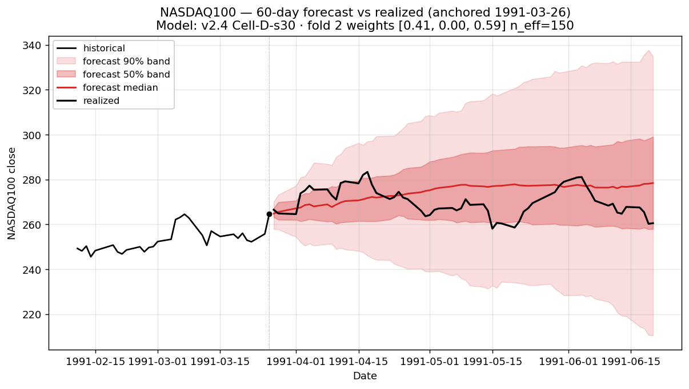
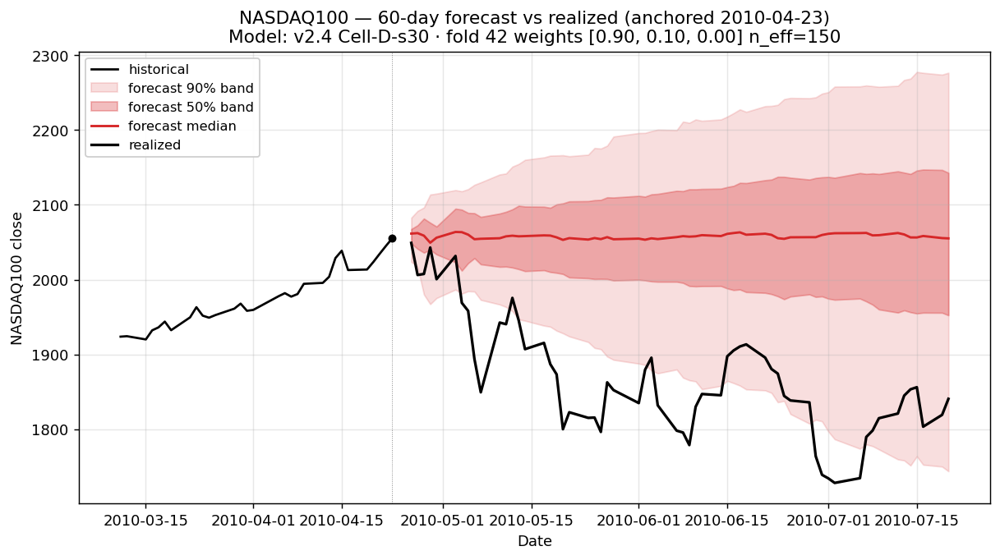
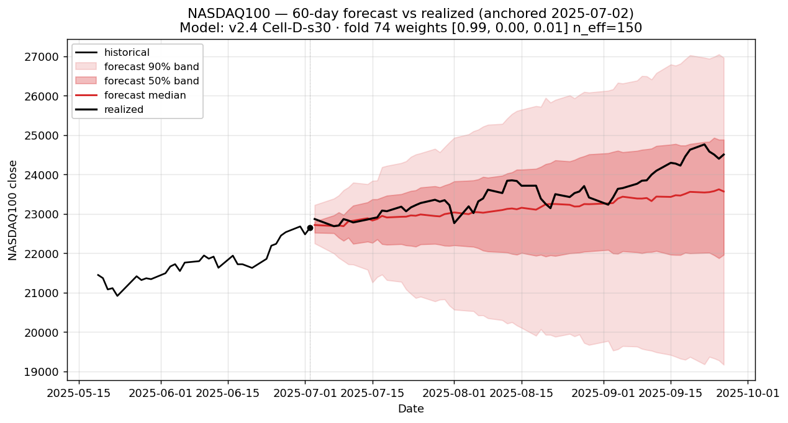
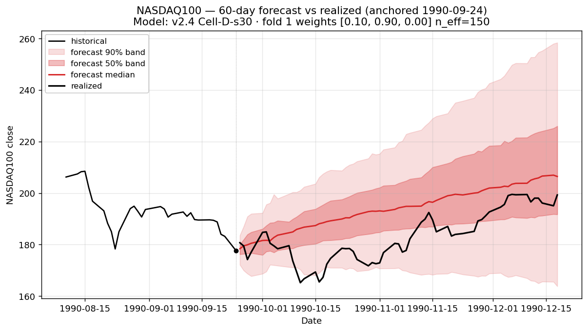
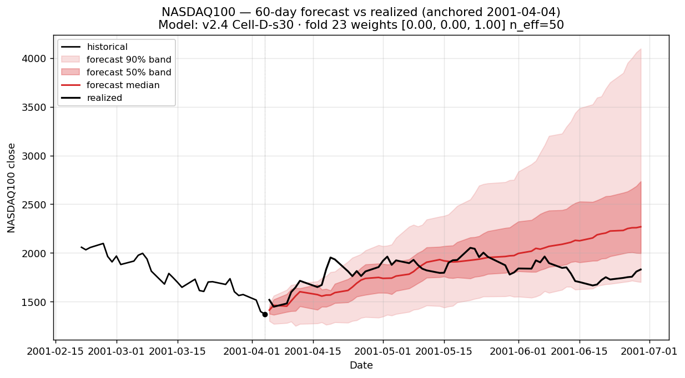

# Fat-tail evaluation set

**Mandatory benchmark for every v4+ experiment.** This document defines the canonical 8-anchor set on which forecast calibration must be reported for any new modeling change. Companion to [`V4_EXPERIMENTS_PLAN.md`](V4_EXPERIMENTS_PLAN.md).

## Purpose

The v3 phase shipped a 9.7% mean-CRPS improvement under aggregate metrics (CRPS, PIT slope across 4,552 origins) — but ad-hoc plotting on individual anchors revealed that the model **systematically misses regime-onset rallies** (COVID-2020, Q4-2018, 2026 forecasts). Aggregate metrics average those misses away. Fat-tail evaluation pins them down.

Every v4 experiment is expected to compare its forecasts to baseline (v2.4 Cell-D-s30) on these exact 8 anchors and report the per-anchor coverage table.

## Anchor selection methodology

**Reproducible via** [`scripts/select_fat_tail_anchors.py`](../../scripts/select_fat_tail_anchors.py); persisted at [`results/analog_mc/data/fat_tail_eval_anchors.json`](../../results/analog_mc/data/fat_tail_eval_anchors.json).

### Feature scaling note

This pipeline's `zscore_50` feature is computed as `mean(returns) / std(returns)` — *not* divided by `√N`. The "classical" z-score interpretation (where ±3 is a tail event) requires multiplying by `√50 ≈ 7.07`. The selection script does this conversion explicitly; all `z₅₀` values quoted below are on the **classical** scale.

### Selection rules

1. Compute classical `z₅₀ = (50-day rolling mean / 50-day rolling std) × √50`.
2. Filter to anchors inside the canonical run's walk-forward test windows (`runs/analog_mc/20260520T045525Z`).
3. **Positive side**: take all `|z| > 3` anchors, cluster-pick by 120-trading-day min-gap, keep the most-extreme per cluster → **5 anchors**.
4. **Negative side**: no anchors in the data reach `-3` (the most-negative classical `z₅₀` ever observed in NDX 1986-2026 is `-3.00` once, never below). Take all `|z| > 2` anchors, cluster-pick by 120-day min-gap, keep the **3 most-extreme** → **3 anchors**.

The negative side's asymmetry reflects a true property of equity returns: bullish-momentum extremes are more common than equally-extreme bearish-momentum extremes (drawdowns are sharper but shorter; rallies grind for longer with positive drift).

## The 8 anchors

### Positive momentum (|z₅₀| > 3)

| Anchor | z₅₀ | Anchor close | 60d realized | Regime |
|---|---:|---:|---:|---|
| 1991-03-26 | +3.08 | 264.7 | −1.7% | Post-Gulf War recovery rally |
| 2010-04-23 | +3.78 | 2,055.3 | −10.4% | Pre-flash-crash peak |
| 2010-11-10 | +3.38 | 2,187.7 | +6.9% | QE2 announcement |
| 2012-03-14 | +3.65 | 2,708.4 | −5.5% | Early-2012 melt-up peak |
| 2025-07-02 | +3.14 | 22,641.9 | +7.8% | Recent bull continuation |

### Negative momentum (top 3 most-extreme |z₅₀|, all > 2)

| Anchor | z₅₀ | Anchor close | 60d realized | Regime |
|---|---:|---:|---:|---|
| 1990-09-24 | −2.56 | 177.6 | +9.8% | Gulf War / 1990 recession bottom |
| 2001-04-04 | −2.62 | 1,370.8 | **+32.0%** | Dotcom bottom (April 2001) |
| 2001-10-02 | −2.18 | 1,159.4 | **+38.6%** | Post-9/11 bottom |

## Baseline (v2.4 Cell-D-s30) coverage

Each entry is the number of days (out of 60) the realized price stayed inside the forecast band.

| Anchor | z₅₀ | 60d realized | 50% band | 90% band | Verdict |
|---|---:|---:|---:|---:|---|
| 1991-03-26 | +3.08 | −1.7% | 48/60 | 60/60 | ✅ excellent — mean-reversion called |
| 2010-04-23 | +3.78 | −10.4% | 3/60 | 27/60 | ❌ flash crash blew out band |
| 2010-11-10 | +3.38 | +6.9% | 47/60 | 56/60 | ✅ continuation called |
| 2012-03-14 | +3.65 | −5.5% | 28/60 | 55/60 | ✅ mean-reversion called |
| 2025-07-02 | +3.14 | +8.2% | 59/60 | 60/60 | ✅ near-perfect |
| 1990-09-24 | −2.56 | +9.8% | 28/60 | 55/60 | ✅ bounce called |
| 2001-04-04 | −2.62 | +32.0% | 30/60 | 55/60 | ✅ caught by huge 90% band (1700–4100) |
| 2001-10-02 | −2.18 | +38.6% | 6/60 | 44/60 | ❌ realized rallied above band |

**Aggregate v2.4 coverage on this set:** 50%-band mean = 31.1/60 (vs theoretical 30 — close to nominal). 90%-band mean = 51.5/60 (vs theoretical 54 — slightly under-dispersed). 6/8 anchors pass, 2/8 fail.

## Charts

### Positive momentum (|z₅₀| > 3)








### Negative momentum (top 3 most-extreme)






## Observations (v2.4 baseline)

### Pattern 1 — Bull-momentum extremes: mostly well-calibrated

4 of 5 positive anchors stay inside the 90% band ≥55/60 days. The model correctly identifies that extreme positive z₅₀ is followed by *some* mean-reversion (median drifts down) but with wide uncertainty. The 2025-07-02 case is essentially perfect: 59/60 in the 50% band.

**The exception is 2010-04-23** — the pre-flash-crash peak. The model said "more rally" (median up), realized fell −10.4%. The flash crash itself (May 6, 2010) was a single-day anti-momentum event that no analog match could anticipate. *This is the only failure case from a bull-momentum extreme.*

### Pattern 2 — Bear-bottom extremes are the matcher's blind spot

All three negative anchors had positive realized returns: +9.8%, +32%, +38.6%. The model correctly called the *direction* (median above anchor on all three), but **2 of 3 forecasts under-shot the magnitude of the rally**. The 2001-10-02 case is the worst: realized +38.6%, forecast 90% upper bound only +12% — model could not produce a path with a 38% rally in its analog pool.

The 2001-04-04 case stayed inside the 90% band only because the band was enormous (1,700–4,100 — a 2.4× spread). The matcher's vol-injection mechanism is *event-of-the-moment dependent* — when very recent vol is high, the band widens automatically. So 2001-04-04 (mid-bear, very volatile) got a usable band; 2001-10-02 (a year of bear absorption later, lower realized vol) got a narrower band that the realized still escaped.

### Pattern 3 — "Bottom-of-bear + sharp rally" is the recurring miss

Pulling this together with the earlier regime-coverage panel (2000-04, 2008-10, 2017-06, 2018-10, 2020-03, 2022-03 anchored ad-hoc; not in the formal eval set), the model's failure pattern is consistent: **bottom-of-bear → V-recovery rallies**.

- 2001-10-02: +38.6% in 60 days, missed (above 90% band)
- 2020-03-16: +43.8% in 60 days, missed (8/60 in 90% band; the COVID rally)
- 2018-10-08: −12.7% in 60 days, the inverse case (Q4-2018 selloff *after* the model expected sideways) — same pattern, opposite sign
- 2026-02-19 / 2026-03-26: realized +17.5%, missed (the recent example)

These cases share a structural feature: the analog matcher draws from historical 10-day blocks. Rallies of +30%+ in 60 days are rare in the matcher's candidate pool, so they are sampled with low probability. **This is the limit of the analog primitive at fat-tail rallies — and is what v4's B1 (Platzer local-linear correction) is the candidate fix for.**

## v4 mandatory deliverable

For every v4 experiment that produces a forecast (A1 FHS baseline, B1 Platzer local-linear, A2 OFTER max-corr, B2 delay-coords, B3 Dirichlet weights):

1. **Render the 8-anchor panel** using `scripts/plot_forecast_from_date.py --date <ISO>` for each anchor in `fat_tail_eval_anchors.json`. Save under `docs/analog_mc/experiments/figs/<exp_id>_fat_tail/`.
2. **Produce the coverage table** (8 rows × {50% band days, 90% band days, verdict}) and a per-anchor diff vs the v2.4 baseline coverage table above.
3. **Aggregate metrics**: per-anchor mean CRPS over the 60-day horizon, plus the aggregate mean across all 8 anchors. Compare against the v2.4 numbers (to be computed once and stored at `results/analog_mc/data/fat_tail_baseline_v24.json`).
4. **Verdict**: did the experiment improve `bear-bottom + rally` anchors (the systematic miss) without regressing the well-calibrated bull-momentum anchors? This is the headline question for B1 specifically.

An experiment that improves aggregate CRPS but regresses on >2 fat-tail anchors should not be promoted to default without explicit justification.

## How to reproduce

```bash
# 1. Generate/refresh the anchor list (after a new canonical run, the
#    walk-forward windows may shift slightly).
uv run python scripts/select_fat_tail_anchors.py

# 2. Render the 8 charts from the canonical run.
for d in 1991-03-26 2010-04-23 2010-11-10 2012-03-14 2025-07-02 \
         1990-09-24 2001-04-04 2001-10-02; do
    uv run python scripts/plot_forecast_from_date.py --date "$d"
done
```

The plot script writes to `docs/analog_mc/figs/forecast_<YYYYMMDD>.png` by default.

## Carry-forward

If a future canonical run shifts the walk-forward fold boundaries such that one of these 8 anchors falls outside any test window, **re-anchor to the nearest in-window date** (the selection script will handle this automatically once it's extended; for now, the JSON pins the current anchors). Do not silently change the eval set without updating this document and re-stating the v2.4 baseline numbers.
