# analog_mc — Results Lookup

Quick-reference dashboard for every walk-forward run that has shaped a v1/v2 decision. Each section: headline numbers, decision-rule verdicts, key plots, and pointers to the persisted artifacts. Update this file when a new acceptance run lands.

| Status legend | meaning |
|---|---|
| ✅ PASS | acceptance criterion satisfied |
| ✗ FAIL | acceptance criterion violated |
| 🔥 FIRED | v2-trigger decision rule fired (action needed) |
| ✅ ok | v2-trigger decision rule did not fire |

---

## TL;DR — current canonical

**v2.1 canonical** (`runs/analog_mc/20260517T145344Z/`, `configs/analog_mc/default.yaml` with `drift_mode: trailing_momentum`) is the current default. The 2×2 `(drift, conditional)` ablation identified Cell D (drift + conditional sampling) as a strong contender, and the **canonical confirmation run (2026-05-19) now lands**: Cell D beats v2.1 by **−4.0%** mean CRPS while preserving the v2.1 PIT calibration. Promotion to default is the open decision.

> **🔬 Ablation update (2026-05-18 → 2026-05-19):** the 2×2 decomposition in [`ABLATION_STUDIES_REPORT.md`](ABLATION_STUDIES_REPORT.md) showed conditional sampling delivers a real, large CRPS gain — not by fixing the squared-return ACF gap (which remains structural), but as an independent mechanism. Drift's only validated effect is PIT calibration. The fast-preset Cell D win (−4.2% vs v2.1) is now **confirmed at canonical resolution (−4.0%)** — see "Cell D canonical confirmation" below.

| | v1 canonical (zero) | **v2.1 canonical (DEFAULT)** | **Cell D canonical (drift + conditional)** |
|---|---|---|---|
| Mean aggregate CRPS | 0.05246 | **0.05265** | **0.05056** (**−4.0%** vs v2.1) |
| High-vol CRPS | 0.0911 | 0.0864 (−5.2% vs v1) | **0.0831** (−3.9% vs v2.1, −8.8% vs v1) |
| `sloped_global_pit` | +0.158 🔥 | +0.053 ✅ | **+0.055 ✅** |
| `u_shaped_high_vol_pit` | +2.19 ✅ | +1.82 ✅ | **+1.66 ✅** (closest-to-firing of any canonical) |
| `acf_seam_degradation` | −1.071 🔥 | −1.073 🔥 | −1.121 🔥 (unchanged — structural ceiling) |
| Wall time | 3h 47m | 3h 43m | **7h 36m** (multiprocessing test-eval; see [`SPEEDUP_PLAN.md`](SPEEDUP_PLAN.md)) |
| Status | archived | **shipped as default** | **confirmation complete · promotion pending** |

---

## Run index

| Run | Config | Folds | Mean CRPS | Wall time | Purpose |
|---|---|---|---|---|---|
| `20260516T170018Z` | `nasdaq100_fast.yaml` | 76 | 0.0521 | ~50 min | v1 fast proxy — first end-to-end smoke |
| `20260516T180000Z` | `default.yaml` (zero drift) | 76 | 0.05246 | 3h 47m | v1 canonical baseline (archived) |
| `20260517T050831Z` | `nasdaq100_v21.yaml` | 76 | 0.05313 | ~32 min | v2.1 fast acceptance |
| **`20260517T145344Z`** | **`default_v21.yaml`** | **76** | **0.05265** | **3h 43m** | **v2.1 canonical → new default** |
| `20260517T070003Z` | `nasdaq100_v22.yaml` | 76 | 0.05045 | 6h 30m | v2.2 fast acceptance (failed on ACF target rule) |
| **`20260518T155800Z`** | **`default_v22.yaml`** | **76** | **0.05056** | **7h 36m** | **v2.2 / Cell D canonical confirmation** (multiprocessing test-eval) |

---

## v1 canonical baseline (`runs/analog_mc/20260516T180000Z/`)

**Config:** `configs/analog_mc/default.yaml` (the *original* zero-drift form) — 76 folds, 273,120 origin × step pairs, 1000 paths per forecast, 66-point weight grid × 5 n_eff values, Nelder-Mead local refine.

### Headline numbers

| | Value |
|---|---|
| Mean aggregate OOS CRPS | **0.05246** |
| Median aggregate OOS CRPS | 0.03121 |
| Per-step CRPS (h=1 / 15 / 30 / 60) | 0.0088 / 0.0340 / 0.0525 / 0.0905 |
| Fixed-weight (⅓,⅓,⅓, n_eff=30) baseline | 0.06182 (tuned beats by **+17.84%**) |
| Low-vol regime mean CRPS | 0.0277 |
| Mid-vol regime mean CRPS | 0.0392 |
| **High-vol regime mean CRPS** | **0.0911** ← drove v2 scope |

### v2-trigger decision rules

| Rule | Status | Metric | Threshold | Implication |
|---|---|---|---|---|
| `sloped_global_pit` | 🔥 FIRED | +0.158 | ±0.10 | → v2.1: trailing-momentum drift |
| `acf_seam_degradation` | 🔥 FIRED | −1.071 | −0.30 | → v2.2: conditional block sampling |
| `u_shaped_high_vol_pit` | ✅ ok | +2.190 | 2.50 | tail inflator stays deferred |
| `fixed_weight_close_to_tuned` | ✅ ok | +0.178 | 0.01 | per-fold search earns its keep |
| `clip_hit_excessive` | ✅ ok | +0.100 | 0.15 | vol clip bounds OK |

### Key plots

| Plot | Reading |
|---|---|
| 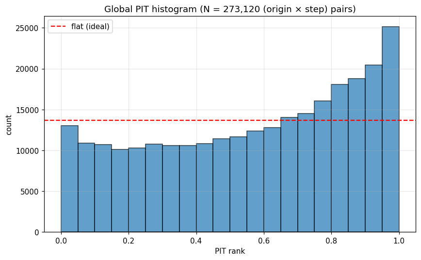 | **Global PIT histogram.** The left-leaning slope is `sloped_global_pit` firing — realized returns systematically exceed the forecast median. Drift estimator missing. |
| 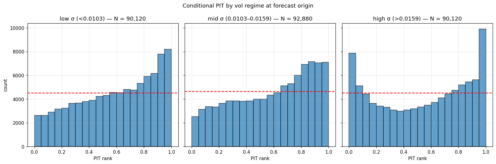 | **PIT by vol regime.** Low-vol is well-calibrated; high-vol shows the U-shape that almost (but not quite) trips `u_shaped_high_vol_pit`. |
| 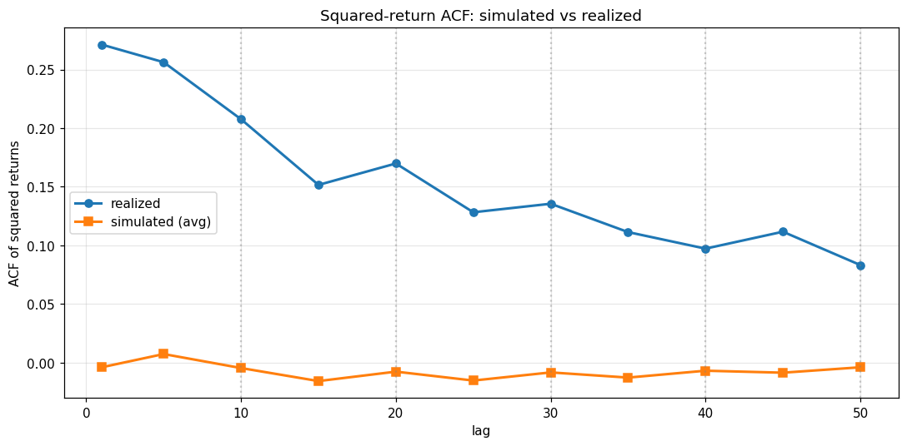 | **Squared-return ACF, simulated vs realized.** Simulated ACF is essentially flat at every lag while realized decays from +0.27 to +0.08. The "seam degradation" rule reads worst-case at seam lags (10/20/30/40/50), but the gap exists everywhere — see the v2.2 audit. |
| 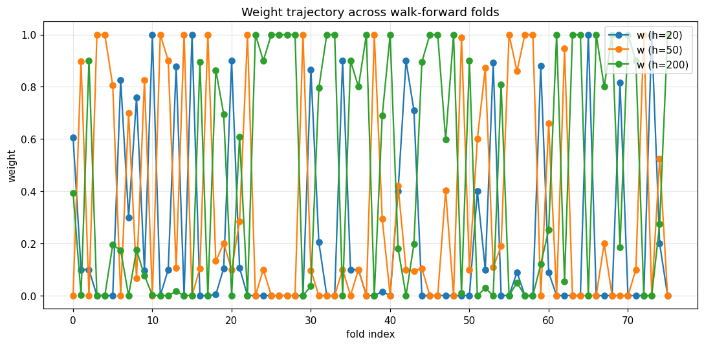 | **Per-fold optimal (w0, w1, w2)** over the 76 folds. Healthy: the three weights swap dominance over time. |
| 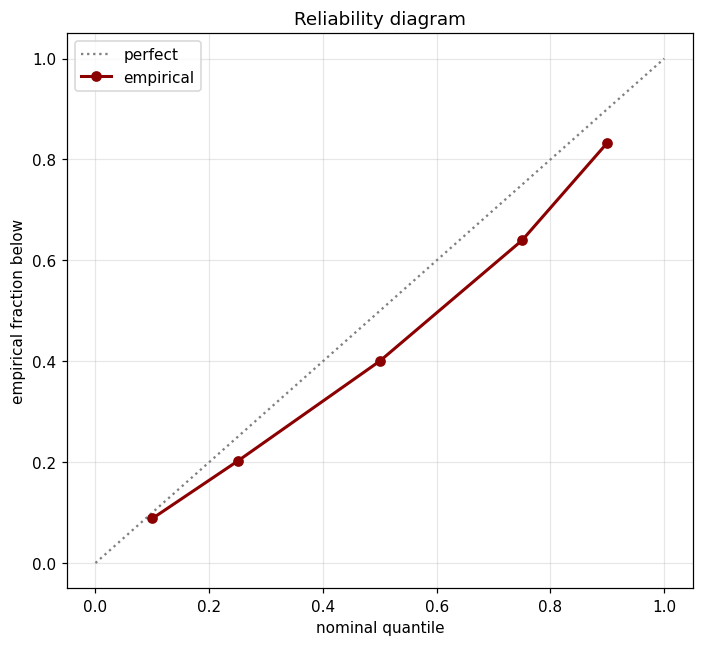 | **Reliability.** Predicted vs empirical exceedance for chosen quantiles. Mostly on the diagonal, with the left-tail divergence consistent with the PIT slope. |
| 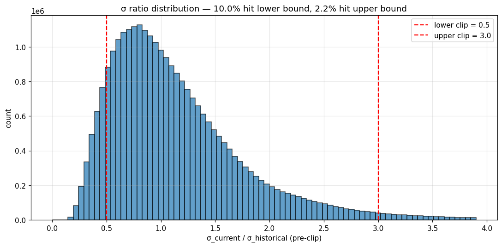 | **Vol-clip hit rates.** The 0.5/3.0 clip bounds are rarely binding — `clip_hit_excessive` doesn't fire. |

---

## v2.1 canonical — **current default** (`runs/analog_mc/20260517T145344Z/`)

**Config:** `configs/analog_mc/default_v21.yaml` (also reflected in the live `default.yaml`) — 76 folds, 273,120 origin × step pairs, 1000 paths per forecast, 66-point weight grid × 5 n_eff values, Nelder-Mead local refine. **Only difference from v1 canonical: `drift_mode: trailing_momentum`** with `momentum_lookback=20`, `momentum_shrinkage=0.5`.

### Headline numbers vs v1 canonical

| Metric | v1 canonical (zero) | **v2.1 canonical (trailing_momentum)** | Δ |
|---|---|---|---|
| Mean aggregate CRPS | 0.05246 | **0.05265** | +0.36% (within noise) |
| Median CRPS | 0.03121 | 0.03132 | +0.35% |
| Low-vol CRPS | 0.0277 | 0.0308 | +11.2% |
| Mid-vol CRPS | 0.0392 | 0.0411 | +4.9% |
| **High-vol CRPS** | **0.0911** | **0.0864** | **−5.2% ← the win** |
| h=1 / h=15 / h=30 / h=60 | 0.0088 / 0.0340 / 0.0525 / 0.0905 | 0.0088 / 0.0345 / 0.0529 / 0.0897 | similar |
| Fixed-baseline vs tuned | +17.84% | **+21.33%** | tuning more valuable under v2.1 |
| `sloped_global_pit` | +0.158 🔥 | **+0.053 ✅** | drift eliminated PIT slope |
| `u_shaped_high_vol_pit` | +2.190 ✅ | +1.821 ✅ | further from firing |
| `acf_seam_degradation` | −1.071 🔥 | −1.073 🔥 | unchanged (drift doesn't touch ACF, as expected) |
| `fixed_weight_close_to_tuned` | +0.178 ✅ | +0.213 ✅ | tuning earns more |
| `clip_hit_excessive` | +0.100 ✅ | +0.099 ✅ | flat |

### Acceptance criteria

| Criterion | Target | v2.1 canonical | Verdict |
|---|---|---|---|
| `sloped_global_pit` not firing | within ±0.10 | +0.053 | ✅ PASS |
| Mean CRPS within +5% of v1 canonical | ≤ 0.0551 | 0.05265 | ✅ PASS |
| High-vol CRPS not worse than v1 canonical | ≤ 0.0957 | 0.0864 | ✅ PASS (5.2% improvement) |

### Fast-preset agreement (robustness check)

The fast preset (`nasdaq100_v21.yaml`, 21-point grid × 2 n_eff, 500 paths) is a faithful proxy:

| | Fast | Canonical |
|---|---|---|
| Mean CRPS | 0.05313 | 0.05265 |
| High-vol CRPS | 0.0862 | 0.0864 |
| `sloped_global_pit` | +0.057 ✅ | +0.053 ✅ |
| All other rule verdicts | identical | identical |

### Key plots

| Plot | Reading |
|---|---|
| 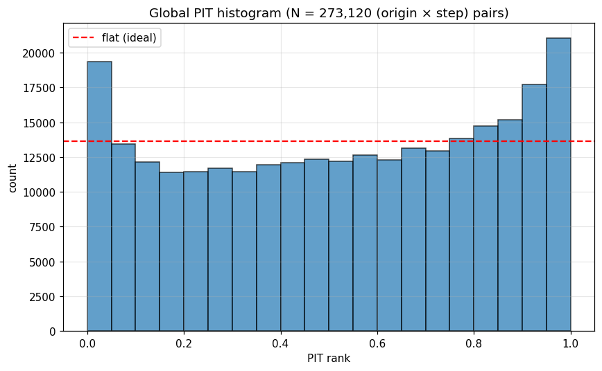 | **Global PIT — slope gone.** Histogram is much closer to uniform than v1 canonical. `sloped_global_pit` now +0.053 (well inside ±0.10). |
| 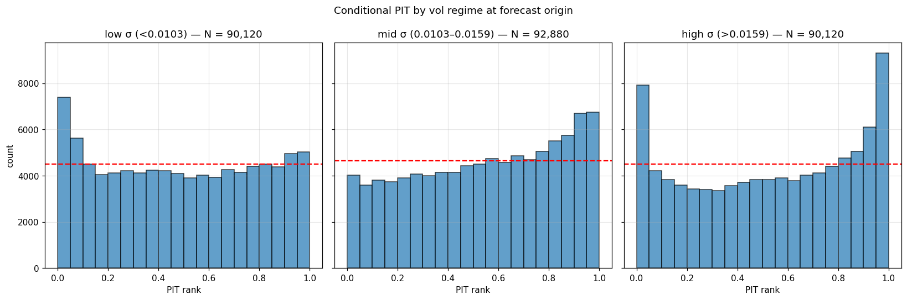 | **PIT by vol regime — high-vol calibration narrowed.** High-vol U-shape shallower than v1 canonical. |
|  | **ACF — unchanged from v1.** Drift correction doesn't affect squared-return autocorrelation. The remaining gap is the v2.2/v3 problem. |
| 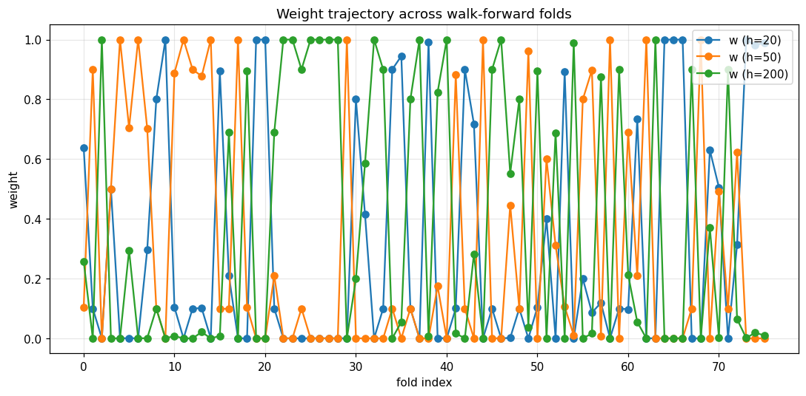 | **Per-fold weights** still diverse — drift didn't make the matcher irrelevant. |
|  | **Reliability** essentially on the diagonal. |

### Forecast distribution vs realized series

Comparison at three origins from fold 50, chosen at the 10/50/90th percentile of forecast-window vol. Same origins in both rows so the v1-vs-v2.1 difference is the drift, not the data.

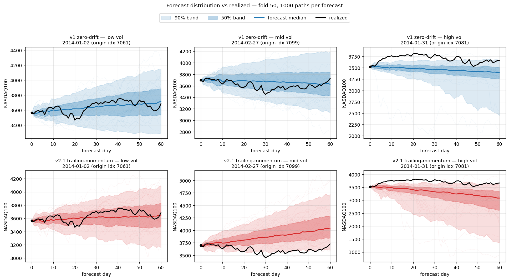

Black is realized, coloured line is the forecast median, dark band is 50% credible, light band is 90% credible, thin lines are 30 sample paths. v2.1's median tilts slightly toward recent trailing-mean returns — most visible in the high-vol panel.

Re-render with:
```bash
uv run python scripts/plot_forecast_vs_realized.py \
    --v1-run runs/analog_mc/20260516T180000Z \
    --v2-run runs/analog_mc/20260517T145344Z \
    --out docs/analog_mc/figs/forecast_vs_realized_v1_vs_v21.png \
    --fold-index 50
```

---

## v2.2 / Cell D — fast acceptance + canonical confirmation (`runs/analog_mc/20260517T070003Z/`, `runs/analog_mc/20260518T155800Z/`)

The fast-preset acceptance run found the ACF target rule still firing but a real CRPS gain, so v2.2 was originally deferred to v3 pending re-evaluation. The 2026-05-18 ablation reframed that gain as a separate mechanism (worth keeping regardless of the ACF outcome), and the **canonical confirmation run (2026-05-19, `runs/analog_mc/20260518T155800Z/`)** now validates the fast finding at full resolution. Both runs are documented below.

### Fast acceptance — `runs/analog_mc/20260517T070003Z/`

**Config:** `configs/analog_mc/nasdaq100_v22.yaml` — fast preset with `drift_mode: trailing_momentum` AND `conditional_block_sampling: true`. Used the test-only contingency (`conditional_block_sampling_in_search: false`) per V2_PLAN open-question-7 because conditional sampling at search-time was intractable (~19 days projected). v2.1 and v2.2 picked **identical (weights, n_eff) at all 76 folds** (deterministic blake2b seeding), so the comparison is a clean A/B isolated to test-time sampling.

#### Headline numbers vs v2.1

| Metric | v2.1 fast | v2.2 fast | Δ |
|---|---|---|---|
| Mean aggregate CRPS | 0.05313 | **0.05045** | **−5.0%** ← real gain |
| High-vol CRPS | 0.0862 | 0.0826 | −4.2% |
| `sloped_global_pit` | +0.057 ✅ | +0.059 ✅ | unchanged (drift handles it) |
| **`acf_seam_degradation`** | **−1.056 🔥** | **−1.121 🔥** | **slightly worse — target rule did NOT improve** |
| `u_shaped_high_vol_pit` | +1.768 | +1.612 | further from firing |
| Tuned vs fixed baseline | +20.28% | +21.21% | same magnitude |
| Per-fold weight agreement vs v2.1 | n/a | **76/76 identical** | clean A/B |

#### Acceptance criteria

| Criterion | Target | v2.2 result | Verdict |
|---|---|---|---|
| `acf_seam_degradation` not firing | metric ≥ −0.30 | **−1.121 🔥** | **✗ FAIL** |
| Mean CRPS not worse than v2.1 | ≤ 0.0558 | 0.05045 | ✅ PASS |
| High-vol CRPS not worse than v2.1 | ≤ 0.0862 | 0.0826 | ✅ PASS |

#### Audit conclusion — why v2.2 can't fix the target rule

Per-lag comparison after the run:

| Lag | Type | v2.1 ACF | v2.2 ACF | Δ |
|---|---|---|---|---|
| 1 | within-block | −0.003 | +0.006 | +0.009 |
| 5 | within-block | +0.007 | +0.015 | +0.008 |
| 10 | **seam** | −0.0002 | **−0.012** | **−0.012** |
| 15 | within-block | −0.016 | −0.014 | +0.002 |
| 20 | **seam** | −0.004 | **−0.016** | **−0.012** |
| 25 | within-block | −0.016 | −0.017 | −0.001 |
| 30 | **seam** | −0.006 | **−0.016** | **−0.010** |
| 40 | **seam** | −0.005 | **−0.012** | −0.007 |
| 50 | **seam** | −0.003 | −0.006 | −0.003 |

Both runs have simulated ACF essentially **flat at every lag**, far from the realized 0.27 → 0.08 curve. The "seam degradation" metric reads the worst seam lag, but the gap is the same magnitude at non-seam lags. v2.2 nudged seam lags more negative (chained similar-vol blocks smooth seam transitions, slightly lowering the squared-return cross-product); within-block lags are essentially unchanged.

**Structural root cause** — direct evidence from real returns:

| | Real data |
|---|---|
| Unconditional lag-1 ACF(r²) | **+0.271** (GARCH-driven, slowly-varying vol) |
| Within-10-day-window lag-1 ACF(r²) | **−0.125** (within-window structure after demeaning) |
| v2.2 simulated lag-1 ACF | −0.011 (closer to within-window) |

Any sampler that draws 10-day analog blocks intact (v1, v2.1, v2.2 all do) inherits the within-window structure and **cannot** reproduce the unconditional ACF. v2.2's per-block re-matching only changes what happens at seams; it cannot put GARCH dynamics inside a block. Fixing this needs per-step σ injection or GARCH-conditional resampling — **v3 scope**.

#### Implementation audit verdict

| Check | Result |
|---|---|
| Tail-buffer warm-start (`max_h − block_length` real + `block_length` sim = 200) | ✅ |
| Z-score window slicing matches `causal_zscore` convention | ✅ |
| `composite_distance_batched` per-row equivalence | ✅ unit-tested |
| `distances_to_probs_batched` (vectorized bisection) hits n_eff within 5% | ✅ unit-tested |
| Per-path categorical sampling (cumsum + uniform) | ✅ |
| `mu_origin` constant per forecast (C3) | ✅ |
| `drift_target` constant per forecast (C10) | ✅ |
| Drift added after ratio multiplier (C7) | ✅ |
| EWMA σ recursion (C4) | ✅ same as v1 |
| Candidate set unchanged across blocks (C6) | ✅ open-question-5 resolution documented |
| A/B fairness — same weights as v2.1 | ✅ 76/76 folds identical |

**No bugs found.** The implementation correctly does per-block per-path conditional re-matching as specified. The design hypothesis was wrong: the rule label `acf_seam_degradation` is misleading — the gap is global, not seam-specific.

#### Fast-preset key plots

| Plot | Reading |
|---|---|
| 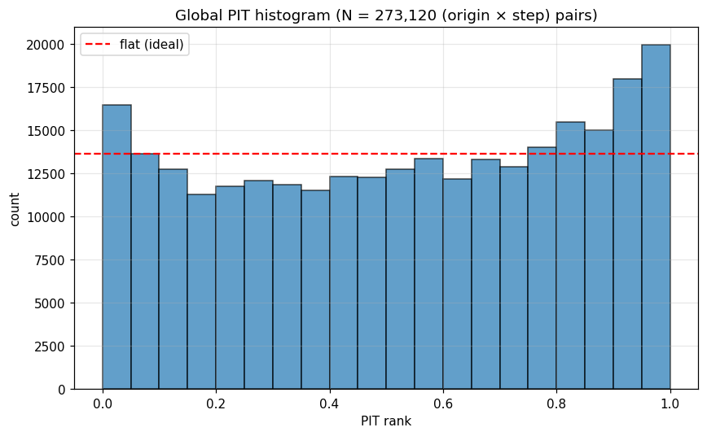 | PIT still uniform (drift correction held up). |
| 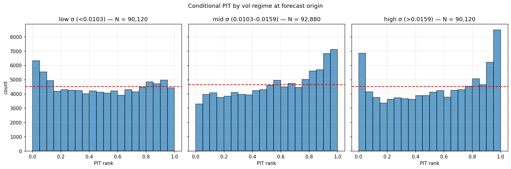 | Vol-regime PIT similar to v2.1; no degradation. |
|  | Simulated ACF still flat — visually identical to v1/v2.1. |

### Canonical confirmation — `runs/analog_mc/20260518T155800Z/` (Cell D canonical)

**Config:** `configs/analog_mc/default_v22.yaml` — canonical resolution (66×5 weight grid, 1000 paths, 76 folds, 273,120 origin × step pairs) with `drift_mode: trailing_momentum`, `conditional_block_sampling: true`, `conditional_block_sampling_in_search: false`. Same test-only contingency as v2.2 fast (search uses v1 sampling, test eval gets the conditional path).

**Run cost.** Without the conditional-sampling speedups, the canonical Cell D run was projected at ~15.5 h. After the in-place rewrite of `composite_distance_batched` + `distances_to_probs_batched` and the new `ProcessPoolExecutor` test-eval pool (`ANALOG_MC_TEST_WORKERS=6`, BLAS clamped to 1 thread per worker), actual wall time was **7h 36m**. The full diagnosis and implementation log live in [`SPEEDUP_PLAN.md`](SPEEDUP_PLAN.md); parallel test-eval is bit-identical to the serial path (per-origin seeds derive from `_seed_for(...)`, ordering-independent).

#### Headline numbers vs v1 and v2.1 canonical

| Metric | v1 canonical | v2.1 canonical (DEFAULT) | **Cell D canonical** | Δ vs v2.1 |
|---|---|---|---|---|
| Mean aggregate CRPS | 0.05246 | 0.05265 | **0.05056** | **−4.0%** |
| Median CRPS | 0.03121 | 0.03132 | **0.03067** | −2.1% |
| Low-vol CRPS | 0.0277 | 0.0308 | **0.0293** | −4.7% |
| Mid-vol CRPS | 0.0392 | 0.0411 | **0.0396** | −3.6% |
| **High-vol CRPS** | 0.0911 | 0.0864 | **0.0831** | **−3.9%** |
| h=1 / h=15 / h=30 / h=60 | 0.0088 / 0.0340 / 0.0525 / 0.0905 | 0.0088 / 0.0345 / 0.0529 / 0.0897 | 0.00876 / 0.03394 / 0.05105 / **0.08444** | h=60 −5.9% |
| `sloped_global_pit` | +0.158 🔥 | +0.053 ✅ | **+0.055 ✅** | drift correction held |
| `u_shaped_high_vol_pit` | +2.190 ✅ | +1.821 ✅ | **+1.662 ✅** | closer to firing — but still passes |
| `acf_seam_degradation` | −1.071 🔥 | −1.073 🔥 | −1.121 🔥 | structural ceiling, expected |
| `clip_hit_excessive` | +0.100 ✅ | +0.099 ✅ | +0.104 ✅ | flat |

#### Fast → canonical agreement

The canonical run lands almost exactly where the fast preset projected, validating that the 2×2 ablation's CRPS conclusions hold at full search resolution.

| | Cell D fast | **Cell D canonical** | drift |
|---|---|---|---|
| Mean CRPS | 0.05045 | **0.05056** | +0.2% |
| High-vol CRPS | 0.0826 | **0.0831** | +0.6% |
| `sloped_global_pit` | +0.059 ✅ | +0.055 ✅ | same |
| `acf_seam_degradation` | −1.121 🔥 | −1.121 🔥 | identical |

#### Acceptance criteria

| Criterion | Target | Cell D canonical result | Verdict |
|---|---|---|---|
| `sloped_global_pit` not firing | within ±0.10 | +0.055 | ✅ PASS |
| Mean CRPS not worse than v2.1 canonical | ≤ 0.0553 | **0.05056** | ✅ PASS (**−4.0%**) |
| High-vol CRPS not worse than v2.1 canonical | ≤ 0.0907 | **0.0831** | ✅ PASS (−3.9%) |
| `acf_seam_degradation` | metric ≥ −0.30 | −1.121 🔥 | ✗ FAIL (structural — v3 scope, unchanged from v1/v2.1) |

The ACF rule fires here too, exactly as at fast preset and exactly as in v1/v2.1 canonical. The 2×2 audit established this is a structural limit of intact-block sampling and is not what justifies (or doesn't justify) Cell D — the CRPS gain is the load-bearing finding.

#### Key plots

| Plot | Reading |
|---|---|
|  | **Global PIT — uniform, drift correction held.** Metric +0.055, well inside ±0.10 (slightly above v2.1's +0.053 but well below the firing threshold). |
| 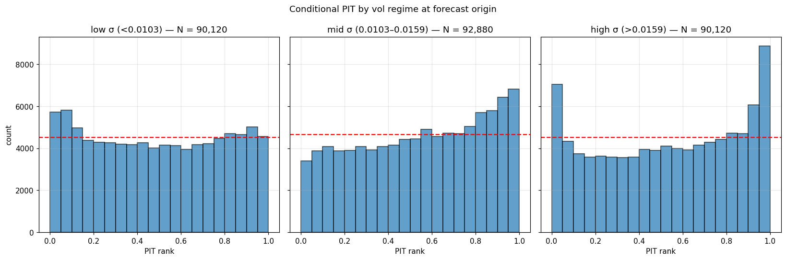 | **PIT by vol regime.** High-vol u-shape the tightest of any canonical run — `u_shaped_high_vol_pit` = +1.66 vs v2.1's +1.82, closer to passing the firing test (which requires ≥ +2.50). |
|  | **ACF still flat at every lag.** Structural ceiling holds. v3 work. |
|  | **Per-fold weights diverse** — conditional re-matching doesn't make the matcher irrelevant. |
| 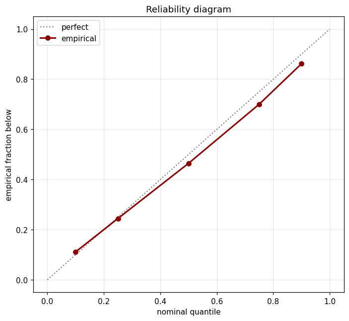 | Reliability essentially on the diagonal. |
| 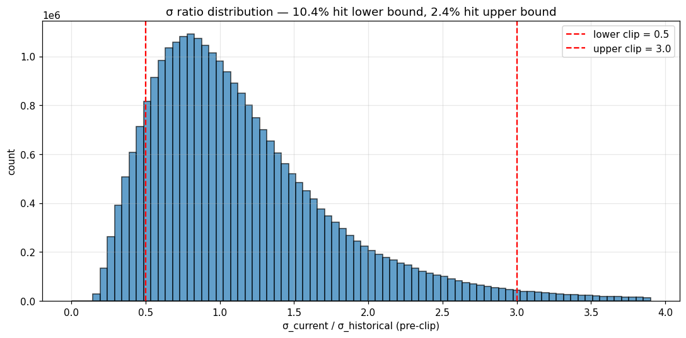 | Vol-clip bounds rarely binding. |

### What v2.2 ships and what it doesn't

- **Ships:** the implementation (`generate_paths_conditional`), tests (7), config flag (`conditional_block_sampling`), batched solver (`distances_to_probs_batched`), test-only contingency (`conditional_block_sampling_in_search`), fast preset (`nasdaq100_v22.yaml`), canonical preset (`default_v22.yaml`), and the conditional-sampling speedups in `distances.py` and the multiprocessing test-eval pool in `walk_forward.py` ([`SPEEDUP_PLAN.md`](SPEEDUP_PLAN.md)). All code remains in the repo.
- **Promotion to default — pending decision.** Cell D canonical beats v2.1 by 4.0% mean CRPS, 3.9% high-vol CRPS, with PIT calibration preserved (`sloped_global_pit` still passes at +0.055). The original deferral reasons no longer hold: (a) the target ACF rule was reframed by the 2×2 ablation as structural and orthogonal to the CRPS win; (b) test-eval cost dropped from ~12× v1 to ~2× v1 after the speedup work. The remaining trade-off is wall time (7h 36m vs v2.1's 3h 43m) and the increased code surface area (conditional sampler + multiprocessing pool). `default.yaml` still tracks v2.1 until the promotion call is made.

---

## How to regenerate

| Artifact | Command |
|---|---|
| Walk-forward run | `uv run python -m analog_mc walk-forward --config configs/analog_mc/<preset>.yaml` |
| Diagnostics + decision rules | `uv run python scripts/render_diagnostics.py runs/analog_mc/<timestamp>` |
| Forecast-vs-realized fans | `uv run python scripts/plot_forecast_vs_realized.py --v1-run <a> --v2-run <b> --out <png>` |

---

## Pointers

- Pipeline spec: [`IMPLEMENTATION_PLAN.md`](IMPLEMENTATION_PLAN.md)
- v2 spec + v3 carryover: [`V2_PLAN.md`](V2_PLAN.md)
- Algorithm math: [`ALGORITHM.MD`](ALGORITHM.MD)
- Decision rules code: `src/analog_mc/diagnostics.py::decision_rules`
- All persisted run artifacts: `runs/analog_mc/<timestamp>/` (per-fold `forecasts.npz`, `summary.json`, `search_grid.parquet`, plus `summary.parquet`, `meta.json`, `diagnostic_report.json`, `figs/`)
</content>
</invoke>