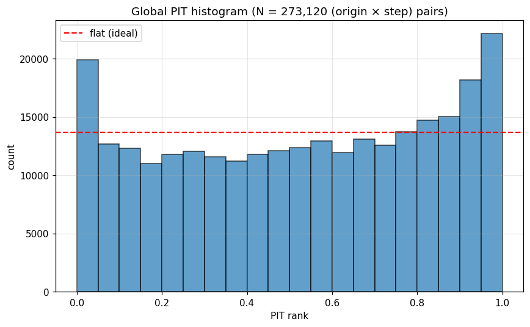
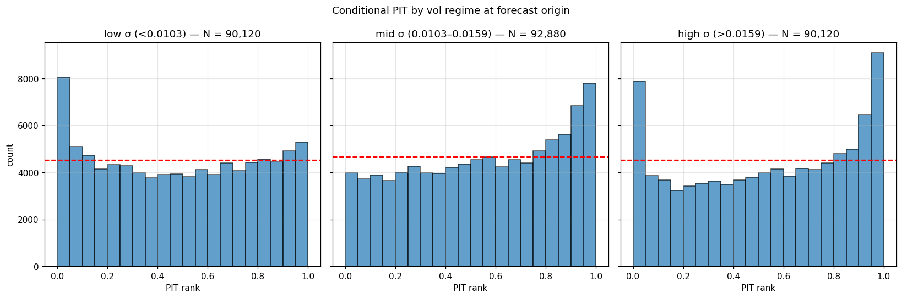
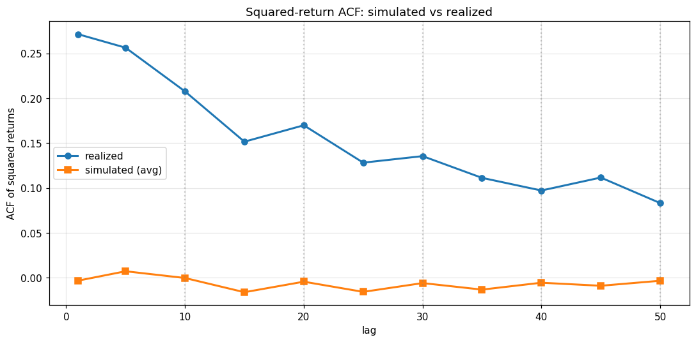
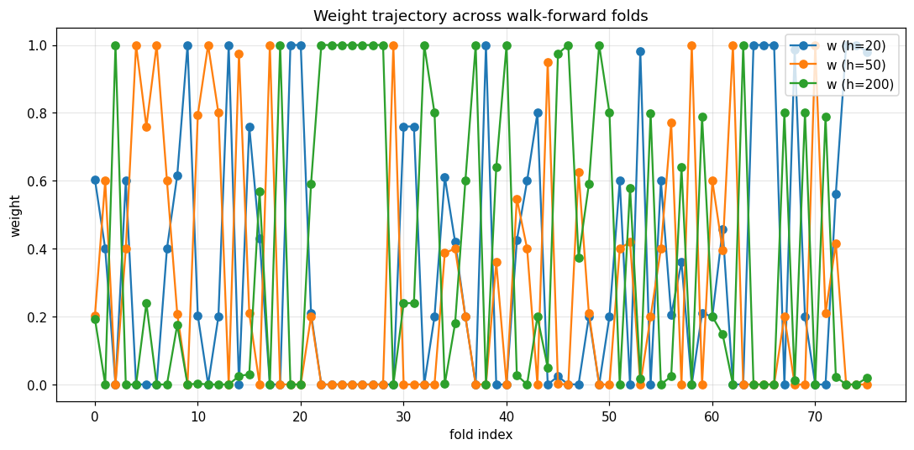
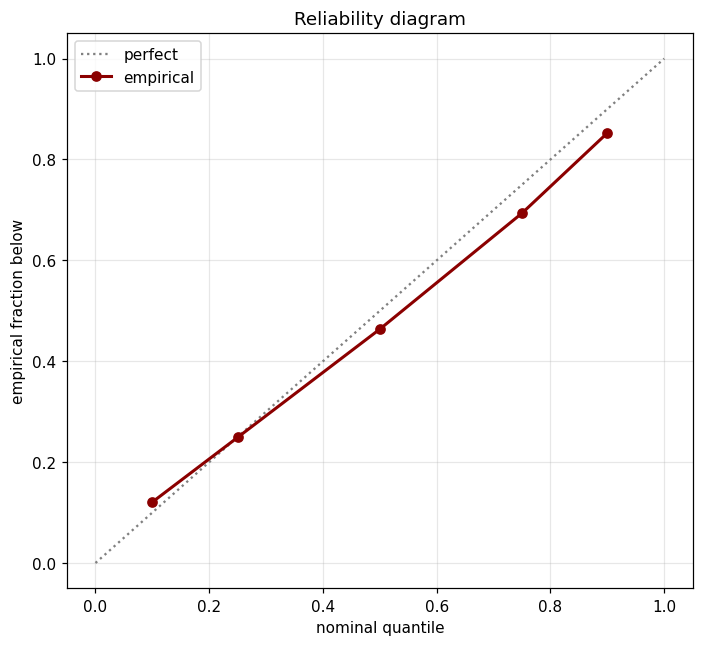

# analog_mc — Results Lookup

Quick-reference dashboard for every walk-forward run that has shaped a v1/v2 decision. Each section: headline numbers, decision-rule verdicts, key plots, and pointers to the persisted artifacts. Update this file when a new acceptance run lands.

| Status legend | meaning |
|---|---|
| ✅ PASS | acceptance criterion satisfied |
| ✗ FAIL | acceptance criterion violated |
| 🔥 FIRED | v2-trigger decision rule fired (action needed) |
| ✅ ok | v2-trigger decision rule did not fire |

---

## Run index

| Run | Config | Folds | Mean CRPS | Wall time | Purpose |
|---|---|---|---|---|---|
| `20260516T170018Z` | `nasdaq100_fast.yaml` | 76 | 0.0521 | ~50 min | v1 fast proxy — first end-to-end smoke |
| **`20260516T180000Z`** | `default.yaml` | 76 | **0.05246** | 3h 47m | **v1 canonical baseline** (drives v2 scope) |
| **`20260517T050831Z`** | `nasdaq100_v21.yaml` | 76 | **0.05313** | ~32 min | **v2.1 acceptance** (trailing-momentum drift) |
| _pending_ | `nasdaq100_v22.yaml` | — | — | — | v2.2 acceptance (conditional block sampling) |

---

## v1 canonical baseline (`runs/analog_mc/20260516T180000Z/`)

**Config:** `configs/analog_mc/default.yaml` — 76 folds, 273,120 origin × step pairs, 1000 paths per forecast, 66-point weight grid × 5 n_eff values, Nelder-Mead local refine.

### Headline numbers

| | Value |
|---|---|
| Mean aggregate OOS CRPS | **0.05246** |
| Median aggregate OOS CRPS | 0.03121 |
| Per-step CRPS (h=1 / 15 / 30 / 60) | 0.0088 / 0.0340 / 0.0525 / 0.0905 |
| Fixed-weight (⅓,⅓,⅓, n_eff=30) baseline | 0.06182 (tuned beats by **+17.84%**) |
| Low-vol regime mean CRPS | 0.0277 |
| Mid-vol regime mean CRPS | 0.0392 |
| **High-vol regime mean CRPS** | **0.0911** ← headline calibration concern |

### v2-trigger decision rules

| Rule | Status | Metric | Threshold | Implication |
|---|---|---|---|---|
| `sloped_global_pit` | 🔥 FIRED | +0.158 | ±0.10 | → v2.1: trailing-momentum drift |
| `acf_seam_degradation` | 🔥 FIRED | −1.071 | −0.30 | → v2.2: conditional block sampling |
| `u_shaped_high_vol_pit` | ✅ ok | +2.190 | 2.50 | tail inflator stays deferred |
| `fixed_weight_close_to_tuned` | ✅ ok | +0.178 | 0.01 | per-fold search earns its keep |
| `clip_hit_excessive` | ✅ ok | +0.100 | 0.15 | vol clip bounds OK |

### Key plots

| Plot | Reading |
|---|---|
|  | **Global PIT histogram.** The left-leaning slope is `sloped_global_pit` firing — realized returns systematically exceed the forecast median. Drift estimator missing. |
|  | **PIT by vol regime.** Low-vol is well-calibrated; high-vol shows the U-shape that almost (but not quite) trips `u_shaped_high_vol_pit`. |
|  | **Squared-return ACF, simulated vs realized.** Simulated ACF collapses at the seam lags (multiples of `block_length=10`) — the artifact `acf_seam_degradation` is built to detect. |
|  | **Per-fold optimal (w0, w1, w2)** over the 76 folds. Healthy: the three weights swap dominance over time, confirming per-fold tuning is doing real work (not collapsing to a single fixed mix). |
|  | **Reliability.** Predicted vs empirical exceedance for chosen quantiles. Mostly on the diagonal, with the left-tail divergence consistent with the PIT slope. |
|  | **Vol-clip hit rates.** The 0.5/3.0 clip bounds are rarely binding — `clip_hit_excessive` doesn't fire. |

---

## v2.1 acceptance (`runs/analog_mc/20260517T050831Z/`)

**Config:** `configs/analog_mc/nasdaq100_v21.yaml` — fast preset (21-point grid × 2 n_eff, 500 paths) with `drift_mode: trailing_momentum`, `momentum_lookback: 20`, `momentum_shrinkage: 0.5`. 76 folds, 273,120 origin × step pairs.

### Headline numbers vs v1 canonical

| Metric | v1 canonical (zero) | v2.1 (trailing_momentum) | Δ |
|---|---|---|---|
| Mean aggregate CRPS | 0.05246 | 0.05313 | +1.21% (within +5% budget) |
| Low-vol CRPS | 0.0277 | 0.0315 | **+13.7%** (drift hurts when no real momentum) |
| Mid-vol CRPS | 0.0392 | 0.0420 | +7.3% |
| **High-vol CRPS** | **0.0911** | **0.0862** | **−5.4% (the win)** |
| `sloped_global_pit` metric | +0.158 (fired) | **+0.0572 (ok)** | drift eliminated PIT slope |
| `u_shaped_high_vol_pit` metric | +2.190 | +1.768 | further from firing |
| `acf_seam_degradation` metric | −1.071 (fired) | −1.056 (fired) | unchanged, as expected — v2.2 trigger |
| Tuned vs fixed-⅓ baseline | +17.84% | +20.28% | tuning still earns its keep |

### Acceptance criteria

| Criterion | Target | v2.1 result | Verdict |
|---|---|---|---|
| `sloped_global_pit` not firing | metric within ±0.10 | +0.057 (ok) | ✅ PASS |
| Mean CRPS within budget | ≤ 0.0547 (+5% vs v1 fast 0.0521) | 0.0531 | ✅ PASS |
| ≥3 distinct (w0,w1,w2) triples | ≥3 across folds | many | ✅ PASS |

### Key plots

| Plot | Reading |
|---|---|
|  | **Global PIT — slope gone.** The histogram is much closer to uniform than the v1 canonical. `sloped_global_pit` now sits at +0.057, well inside ±0.10. |
|  | **PIT by vol regime — high-vol calibration narrowed.** High-vol U-shape is shallower than v1 canonical; metric +1.77 (vs +2.19). |
|  | **ACF — still collapses at seams** (block_length=10 lags). v2.1 doesn't touch the block-boundary independence; that's exactly v2.2's job. |
|  | **Weights still diverse.** Drift didn't make the matcher irrelevant; per-fold optima still swap. |
|  | **Reliability tightened slightly** vs v1. |

### Forecast distribution vs realized series

Comparison at three origins from fold 50, chosen at the 10/50/90th percentile of forecast-window vol. Same origins in both rows so the v1-vs-v2.1 difference is the drift, not the data.


Reading: black is realized, coloured line is the forecast median, dark band is 50% credible, light band is 90% credible, thin lines are 30 sample paths. The v2.1 row's median tilts slightly in the direction of recent trailing-mean returns — most visible in the high-vol panel where v1's flat median fan misses the realized drift downward and v2.1's tilted fan captures more of it.

Re-render with:
```bash
uv run python scripts/plot_forecast_vs_realized.py \
    --v1-run runs/analog_mc/20260516T180000Z \
    --v2-run runs/analog_mc/20260517T050831Z \
    --out docs/analog_mc/figs/forecast_vs_realized_v1_vs_v21.png \
    --fold-index 50
```

---

## v2.2 acceptance (pending)

Conditional block sampling on top of v2.1. Expected effect: `acf_seam_degradation` stops firing, mean CRPS not worse than v2.1, simulated ACF tracks realized at seam lags (within 30%). Will be filled in when `runs/analog_mc/<pending>` lands.

---

## How to regenerate

| Artifact | Command |
|---|---|
| Walk-forward run | `uv run python -m analog_mc walk-forward --config configs/analog_mc/<preset>.yaml` |
| Diagnostics + decision rules | `uv run python scripts/render_diagnostics.py runs/analog_mc/<timestamp>` |
| Forecast-vs-realized fans | `uv run python scripts/plot_forecast_vs_realized.py --v1-run <a> --v2-run <b> --out <png>` |

---

## Pointers

- Pipeline spec: [`IMPLEMENTATION_PLAN.md`](IMPLEMENTATION_PLAN.md)
- v2 spec: [`V2_PLAN.md`](V2_PLAN.md)
- Algorithm math: [`ALGORITHM.MD`](ALGORITHM.MD)
- Decision rules code: `src/analog_mc/diagnostics.py::decision_rules`
- All persisted run artifacts: `runs/analog_mc/<timestamp>/` (per-fold `forecasts.npz`, `summary.json`, `search_grid.parquet`, plus `summary.parquet`, `meta.json`, `diagnostic_report.json`, `figs/`)
