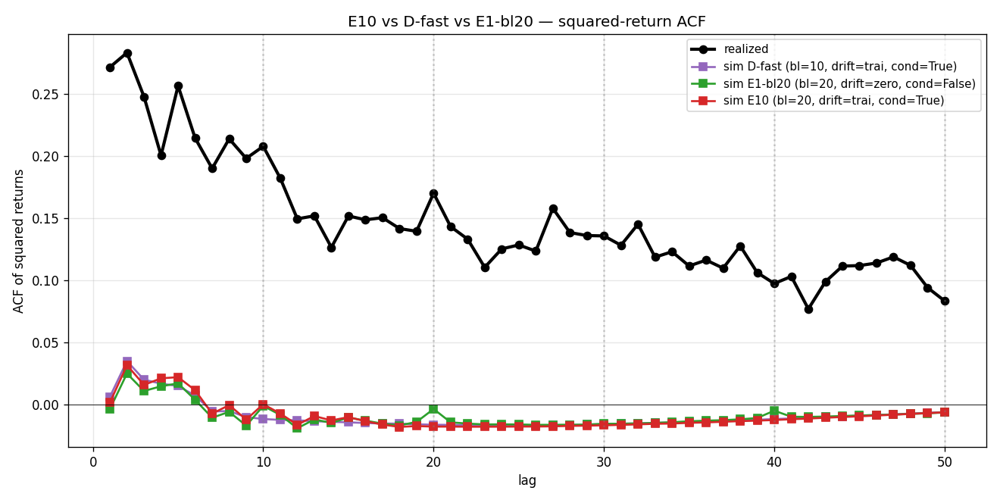

# E10 — Cell D × bl=20

V3 experiment 10 (post-E1 follow-up; see [`V3_PLAN.md`](V3_PLAN.md#e10-cell-d--bl20-post-e1-follow-up)). Tests whether E1's "longer blocks → lower CRPS" finding stacks with Cell D's drift + conditional-sampling mechanism.

## Setup

Single new run, fast preset, Cell D config with `block_length=20, n_blocks=3`. Config: `configs/analog_mc/ablation_E10_celld_bl20.yaml`. Run dir: `runs/analog_mc/20260519T083821Z`. Wall time **84 min** (76 folds, ~66 s/fold late as conditional test eval scales).

## Headline numbers — three-way comparison

| | D-fast (Cell D, bl=10) | E1-bl20 (zero drift, bl=20) | **E10 (Cell D, bl=20)** |
|---|---|---|---|
| Mean aggregate CRPS | 0.05041 | 0.05063 | **0.05055** |
| Δ vs D-fast | — | +0.4% | **+0.3% (flat)** |
| Low-vol CRPS | 0.0293 | 0.0271 | 0.0295 |
| Mid-vol CRPS | 0.0398 | 0.0386 | 0.0399 |
| High-vol CRPS | 0.0826 | 0.0865 | **0.0825** |
| `sloped_global_pit` | +0.059 ✅ | +0.141 🔥 | **+0.049 ✅** |
| `acf_seam_degradation` | −1.121 🔥 | −1.115 🔥 | **−1.129 🔥** |
| `u_shaped_high_vol_pit` | +1.612 ✅ | +1.973 ✅ | **+1.647 ✅** |
| `clip_hit_excessive` | +0.099 ✅ | +0.097 ✅ | +0.101 ✅ |

## Verdict

**bl=20 gain does NOT stack with Cell D.** E10's mean CRPS (0.05055) is statistically identical to D-fast (0.05041). The 0.4% gain that bl=20 produced under zero drift (E1-bl20 vs E1-bl10: 0.0506 vs 0.0521) disappears once drift + conditional sampling are active.

**Mechanism interpretation.** Both Cell D's conditional re-matching and bl=20's fewer-seams effect reduce the variance leakage at block transitions. They share that mechanism — combining them is non-additive because there's only one such variance leak to plug. Cell D (with bl=10) already extracts the available gain via conditional re-matching at every seam; making seams rarer (bl=20) doesn't help further.

**Promotion impact.** V3_PLAN's E10 decision matrix said: "If E10 ≈ D-fast: bl=20 gain and Cell D gain share a mechanism; promotion stays on vanilla Cell D." That's what landed. **E7 promotion target = vanilla Cell D (`default_v22.yaml`).**

## ACF curve

Three-way + realized:

All three simulated curves are essentially flat at every lag (consistent with E1's structural-ceiling finding). E10's lag-1 ACF is −0.005, no closer to the realized +0.27 than the other cells. Confirms that bl=20 was never an ACF lever — only a CRPS lever under zero drift.

## Per-vol-regime read

Cell D's high-vol calibration win (high-vol CRPS 0.0826 at bl=10 vs 0.0911 at v1) is preserved at bl=20 (0.0825). Low-vol CRPS regresses slightly (0.0295 vs E1-bl20's 0.0271), confirming Cell D's drift component imposes a small low-vol cost regardless of block length — same trade-off documented in V2_PLAN's v2.1 acceptance.

## Decision rules

- `sloped_global_pit` passes (+0.049, even tighter than D-fast). Drift correction held.
- `u_shaped_high_vol_pit` at +1.647 — marginally looser than D-fast's +1.612 but still well below the +2.50 firing threshold.
- `acf_seam_degradation` at −1.129 — slightly worse than D-fast (−1.121). Expected: this rule was structural, not block-dependent, per E1.
- `clip_hit_excessive` flat.

## Deliverables

- `configs/analog_mc/ablation_E10_celld_bl20.yaml`
- `runs/analog_mc/20260519T083821Z/`
- `scripts/_e10_aggregate.py`
- `docs/analog_mc/_e10_data.json`
- `docs/analog_mc/figs/e10_celld_bl20_acf.png`
- This page.
