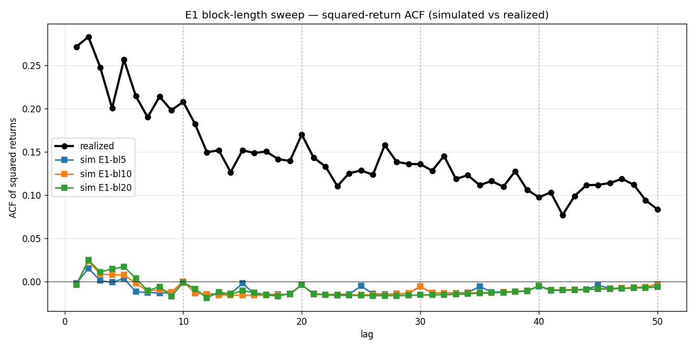

# E1 — Block-length sweep results

V3 experiment 1 (per [`V3_PLAN.md`](V3_PLAN.md#e1-block-length-sweep-v3c)). v3c carryover from V2 — decisive diagnostic for the `acf_seam_degradation` ceiling.

## Setup

| Cell | block_length | n_blocks | drift | conditional | preset | run dir |
|---|---|---|---|---|---|---|
| E1-bl5 | 5 | 12 | zero | false | fast (21×2, 500 paths, 76 folds) | `runs/analog_mc/20260519T060335Z` |
| E1-bl10 | 10 | 6 | zero | false | fast | `runs/analog_mc/20260519T064102Z` |
| E1-bl20 | 20 | 3 | zero | false | fast | `runs/analog_mc/20260519T071520Z` |

`forecast_horizon = 60` held constant. v1 baseline (zero drift, no conditional sampling) to isolate block geometry from drift / re-matching.

Configs: `configs/analog_mc/ablation_E1_bl{5,10,20}.yaml`. Wall time 32–37 min each, ~100 min total.

## Headline numbers

| Metric | E1-bl5 | **E1-bl10** | E1-bl20 |
|---|---|---|---|
| Mean aggregate CRPS | 0.05438 | **0.05215** | **0.05063** |
| Low-vol CRPS | 0.0296 | 0.0279 | **0.0271** |
| Mid-vol CRPS | 0.0417 | 0.0401 | **0.0386** |
| High-vol CRPS | 0.0923 | 0.0888 | **0.0865** |
| `sloped_global_pit` | +0.146 🔥 | +0.147 🔥 | +0.141 🔥 |
| `acf_seam_degradation` | −1.056 🔥 | −1.053 🔥 | −1.115 🔥 |
| `u_shaped_high_vol_pit` | +2.064 ✅ | +2.022 ✅ | +1.973 ✅ |
| `clip_hit_excessive` | +0.094 ✅ | +0.101 ✅ | +0.097 ✅ |

PIT slope and ACF rules fire in every cell — both are unaffected by block geometry here (PIT firing is expected for zero-drift, ACF firing is the question this experiment was designed to answer).

## Squared-return ACF — simulated vs realized

| lag | realized | sim E1-bl5 | sim E1-bl10 | sim E1-bl20 |
|---|---|---|---|---|
| 1 | +0.271 | −0.002 | −0.004 | −0.004 |
| 5 | +0.256 | +0.003 | +0.008 | +0.017 |
| 10 | +0.208 | +0.000 | −0.000 | −0.001 |
| 15 | +0.152 | −0.002 | −0.016 | −0.011 |
| 20 | +0.170 | −0.004 | −0.004 | −0.004 |
| 50 | +0.083 | −0.004 | −0.003 | −0.006 |

**Reading:** Simulated ACF is essentially flat at every lag for every block length. Shrinking blocks from 20 → 5 does NOT walk the simulated ACF toward the realized +0.27 → +0.08 curve. The expected mechanism (shorter blocks → less within-window structure inheritance) does not produce a recoverable ACF in this experiment.

## Interpretation against V3_PLAN's decision matrix

V3_PLAN.md set out three possible outcomes:

1. **Simulated ACF walks toward +0.27 as block_length → 1** → structural-ceiling story confirmed, v3a (per-step σ injection) is the minimal lift.
2. **Simulated ACF stays ≈ 0 for all block lengths** → residual gap is in σ-scaling, not block geometry. v3b (GARCH-conditional) jumps the queue; v3a unlikely to help on its own.
3. **Smaller blocks bring ACF closer but at large CRPS cost** → fundamental tension between calibration and sharpness; informs v4.

**Verdict: outcome 2.** Simulated ACF is flat for bl=5, bl=10, bl=20 alike. The block primitive — irrespective of length — destroys the GARCH-like vol clustering through demean-and-rescale. Per-block re-matching (v2.2) was already shown to leave seam ACF unchanged (RESULTS.md audit); now block-length variation is also shown to leave ACF unchanged. The lever isn't in block geometry.

Wrinkle: **CRPS improves monotonically with longer blocks** (bl=20 = 0.0506 vs bl=10 = 0.0521 vs bl=5 = 0.0544, −2.9% bl=20 vs bl=10). V3_PLAN treated block_length as a pure ACF-diagnostic dial; the CRPS direction is an unexpected finding and is preserved across all three vol regimes. Why this happens is not pinned by E1 — possible mechanisms: (a) longer blocks preserve more of the analog's joint return structure (autocovariance + cross-day dependencies) that the sampler matches on, (b) fewer seams mean fewer demean-and-rescale resets and less variance leakage, (c) just an artifact of n_blocks = 3 vs 6 vs 12 reducing the resampling noise. Worth tracking but not E1's job to resolve.

## Recommendation for V3 prioritization

Per V3_PLAN's gating rules:

1. **E9 (v3b — GARCH-conditional) jumps the queue ahead of E4 (v3a — per-step σ injection).** The ACF gap is in σ-scaling, not block geometry; per-step σ injection (v3a) operates inside a block but inherits the same demean-and-rescale step that flattens the ACF here, so it's unlikely to help on its own.
2. **E4 (v3a) is not falsified outright**, but its design hypothesis (within-block dynamics fixable by per-step ratios) needs revisiting. Recommend deferring E4 implementation until E9 lands or until a refined v3a sketch addresses what E1 showed.
3. **E7 (promote Cell D as default) stays gated on E3 + E2.** E1's CRPS direction (bl=20 wins) suggests a quick orthogonal experiment: re-run Cell D with bl=20 — possible additional ~3% gain over the current Cell D canonical 0.05056. Adding to the V3 plan as **E10 (bl=20 × Cell D)**.
4. **E1's ACF data closes carryover 1 from V2_PLAN.** The block primitive is fundamentally incapable of reproducing the GARCH ACF regardless of block length. Rename `acf_seam_degradation` → `acf_global_degradation` per V2 carryover 2.

## Deliverables

- `configs/analog_mc/ablation_E1_bl{5,10,20}.yaml`
- `runs/analog_mc/20260519T060335Z/` (bl=5)
- `runs/analog_mc/20260519T064102Z/` (bl=10)
- `runs/analog_mc/20260519T071520Z/` (bl=20)
- `scripts/_e1_aggregate.py` — ACF + per-regime CRPS aggregator
- `results/analog_mc/data/_e1_data.json` — machine-readable summary
- `docs/analog_mc/figs/e1_block_length_acf.png` — three simulated curves + realized
- This page.
