# a2_corrwindow_L100 — fat-tail panel

Run: `runs/analog_mc/20260521T061730Z` · 15 anchors × 60-day horizon.

## Aggregate

| Group | Baseline CRPS | Eval CRPS | Δ rel | Baseline 90/60 | Eval 90/60 | Δ 90 |
|---|---:|---:|---:|---:|---:|---:|
| All | 0.06111 | 0.06586 | +7.79% | 49.9 | 44.8 | -5.1 |
| Failure | 0.09471 | 0.07564 | -20.14% | 36.2 | 33.8 | -2.4 |
| Control | 0.02051 | 0.02256 | +9.98% | 58.2 | 55.4 | -2.8 |

## Per-anchor

| Anchor | Stratum | Realized | Baseline CRPS | Eval CRPS | Δ rel | Baseline 90/60 | Eval 90/60 | Δ 90 |
|---|---|---:|---:|---:|---:|---:|---:|---:|
| 1991-03-26 | positive | -1.6% | 0.02340 | 0.02507 | +7.14% | 60 | 60 | +0 |
| 2010-04-23 | positive | -10.4% | 0.07075 | 0.03752 | -46.97% | 27 | 57 | +30 |
| 2010-11-10 | positive | +7.4% | 0.01542 | 0.01737 | +12.66% | 56 | 57 | +1 |
| 2012-03-14 | positive | -5.5% | 0.03401 | 0.04318 | +26.95% | 55 | 41 | -14 |
| 2025-07-02 | positive | +8.2% | 0.01743 | 0.01411 | -19.04% | 60 | 60 | +0 |
| 1990-09-24 | negative | +12.2% | 0.04173 | 0.04472 | +7.15% | 55 | 60 | +5 |
| 2001-04-04 | negative | +33.5% | 0.07740 | 0.10939 | +41.33% | 55 | 53 | -2 |
| 2001-10-02 | negative | +38.6% | 0.11399 | 0.05955 | -47.76% | 44 | 53 | +9 |
| 2000-04-03 | regime_coverage | -7.5% | 0.07943 | 0.06384 | -19.62% | 56 | 59 | +3 |
| 2008-10-03 | regime_coverage | -18.3% | 0.10083 | 0.22408 | +122.22% | 52 | 7 | -45 |
| 2017-06-01 | regime_coverage | +0.1% | 0.01232 | 0.01308 | +6.18% | 60 | 59 | -1 |
| 2018-10-08 | regime_coverage | -12.7% | 0.06202 | 0.08133 | +31.15% | 31 | 10 | -21 |
| 2020-03-16 | regime_coverage | +43.8% | 0.17878 | 0.14548 | -18.62% | 38 | 11 | -27 |
| 2022-03-01 | regime_coverage | -14.7% | 0.04108 | 0.05494 | +33.73% | 58 | 47 | -11 |
| 2026-02-19 | regime_coverage | +17.5% | 0.04803 | 0.05432 | +13.11% | 41 | 38 | -3 |

## Headline questions

- **V3.5 failures recovered (90-band ≥45/60)**: **2/5** (promotion bar: ≥3).
- **Anchors regressing (CRPS up >5%)**: 10/15 (promotion bar: ≤2 without justification).
- **Failure mean CRPS Δ**: -20.14%.
- **Control mean CRPS Δ**: +9.98%.

## Charts

15 forecast panels rendered from `runs/analog_mc/20260521T061730Z`. Compare against the [v2.4 baseline panel](_v24_fat_tail_baseline.md#charts); a side-by-side 4-up grid per anchor lives at [`_fat_tail_compare.md`](_fat_tail_compare.md).

### Stratum A.1 — Positive momentum (|z₅₀| > 3)

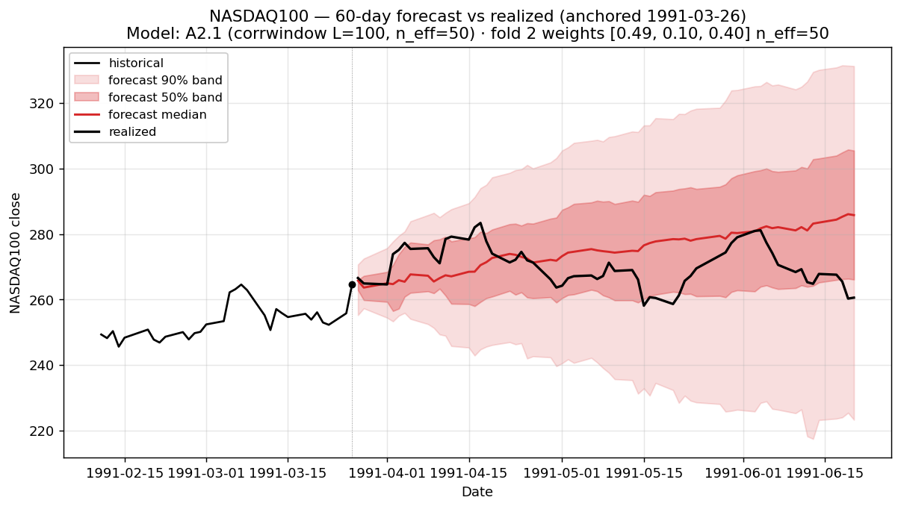
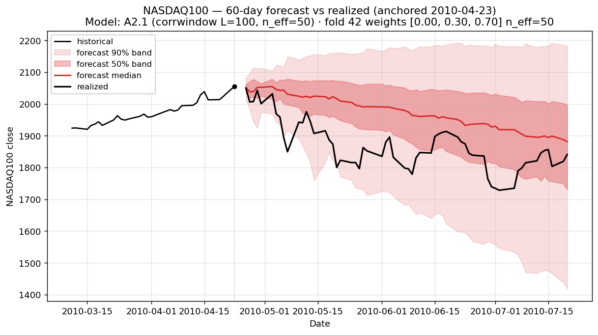
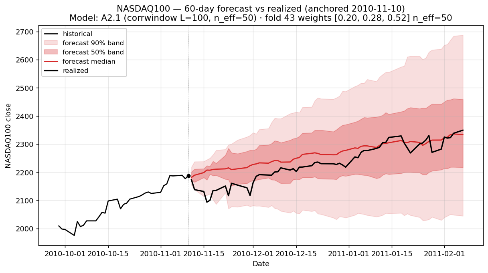
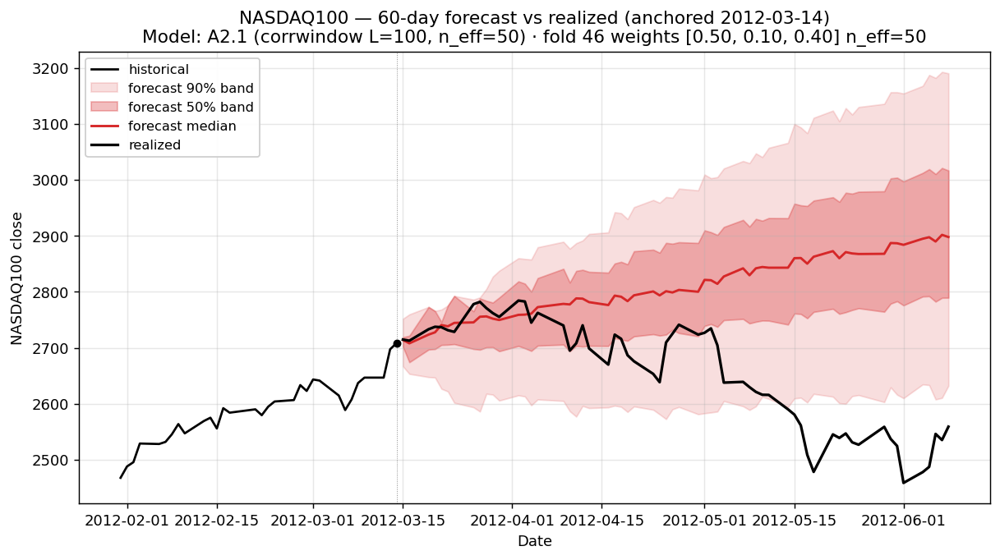
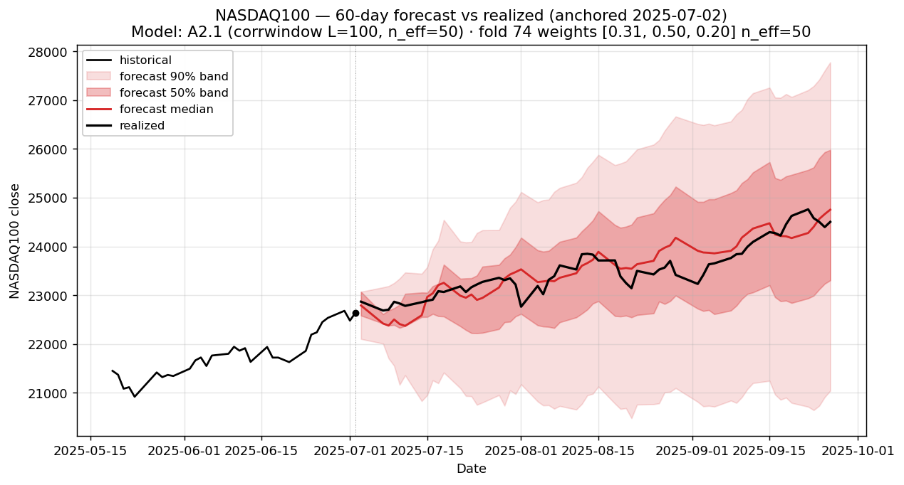

### Stratum A.2 — Negative momentum (top 3 most-extreme |z₅₀|)

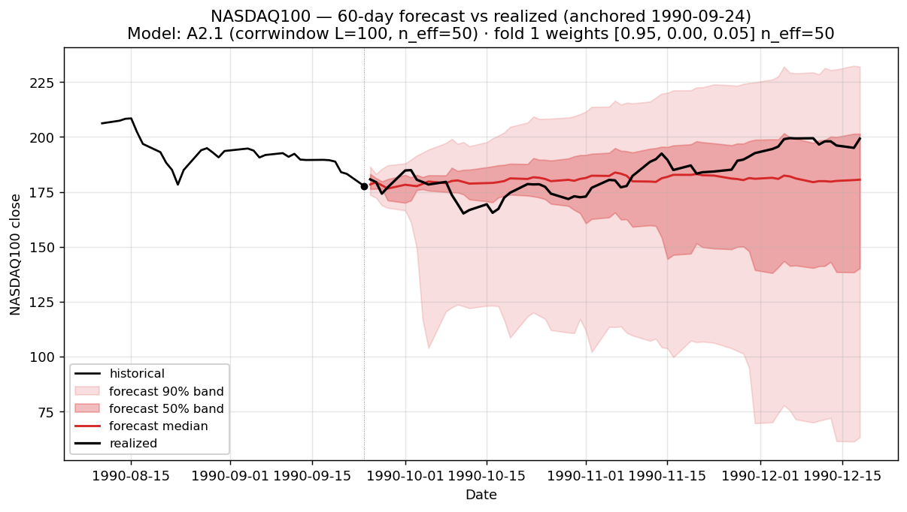
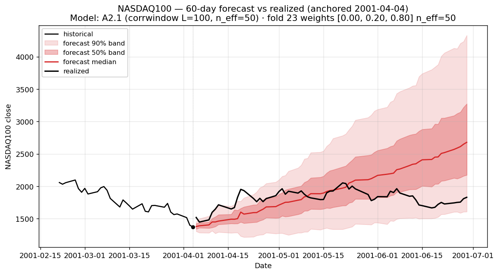
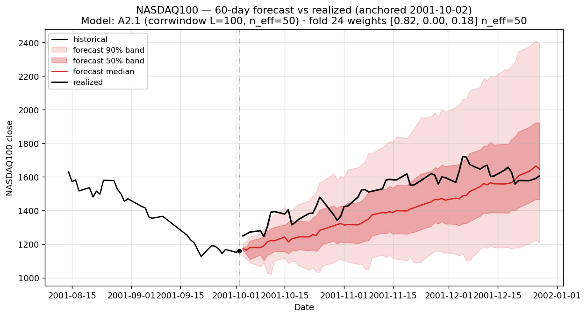

### Stratum B — Regime-coverage (hand-curated, 7 anchors)

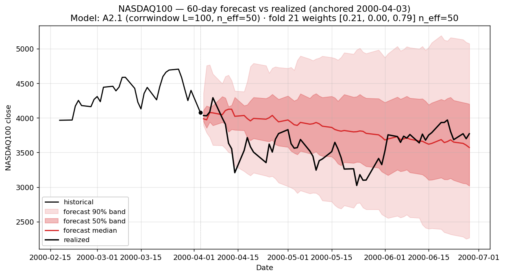
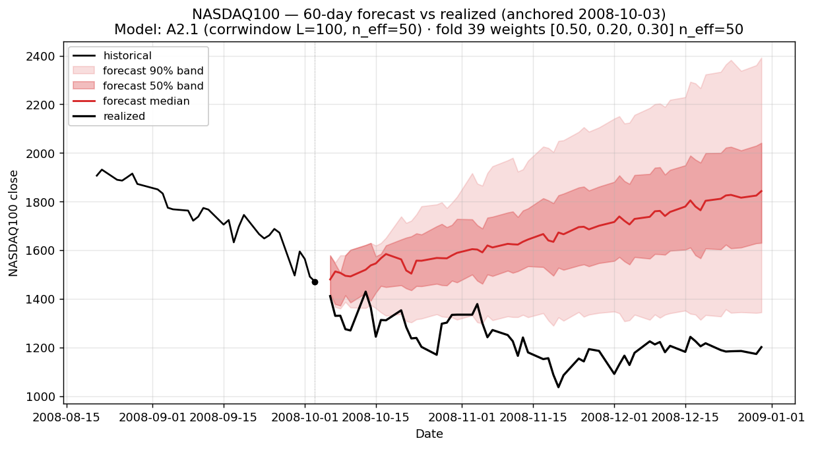
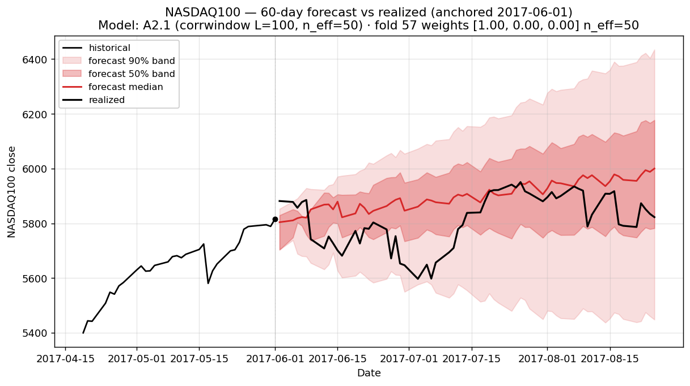
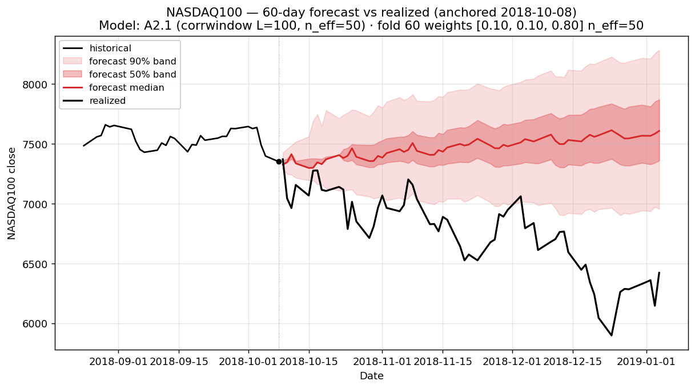
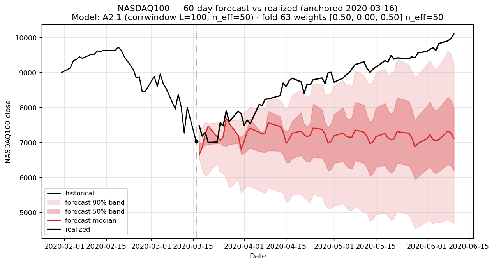
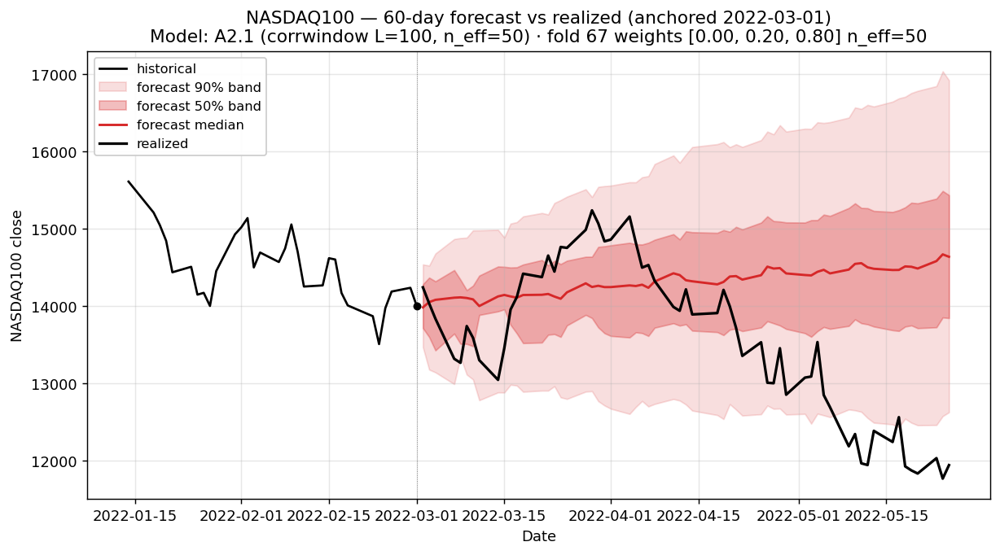
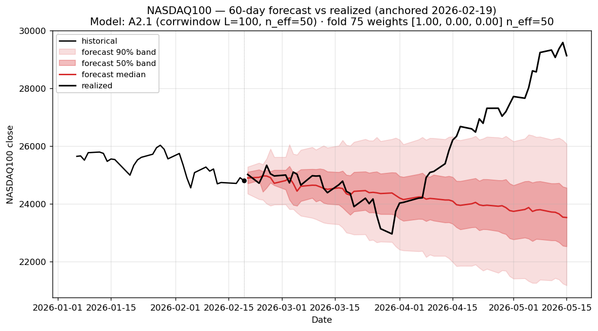

## Reproducing

```bash
uv run python scripts/analog_mc/render_fat_tail_panel.py \
    --run-dir runs/analog_mc/20260521T061730Z \
    --label "A2.1 (corrwindow L=100)" \
    --out-dir docs/analog_mc/experiments/figs/a2_corrwindow_L100_fat_tail \
    --prefix a2_corrwindow_L100
```
