# b1_local_linear — fat-tail panel

Run: `runs/analog_mc/20260520T155220Z` · 15 anchors × 60-day horizon.

## Aggregate

| Group | Baseline CRPS | Eval CRPS | Δ rel | Baseline 90/60 | Eval 90/60 | Δ 90 |
|---|---:|---:|---:|---:|---:|---:|
| All | 0.06111 | 0.06550 | +7.20% | 49.9 | 47.6 | -2.3 |
| Failure | 0.09471 | 0.08842 | -6.64% | 36.2 | 38.0 | +1.8 |
| Control | 0.02051 | 0.01860 | -9.33% | 58.2 | 59.2 | +1.0 |

## Per-anchor

| Anchor | Stratum | Realized | Baseline CRPS | Eval CRPS | Δ rel | Baseline 90/60 | Eval 90/60 | Δ 90 |
|---|---|---:|---:|---:|---:|---:|---:|---:|
| 1991-03-26 | positive | -1.6% | 0.02340 | 0.02530 | +8.12% | 60 | 60 | +0 |
| 2010-04-23 | positive | -10.4% | 0.07075 | 0.05382 | -23.94% | 27 | 37 | +10 |
| 2010-11-10 | positive | +7.4% | 0.01542 | 0.01539 | -0.21% | 56 | 56 | +0 |
| 2012-03-14 | positive | -5.5% | 0.03401 | 0.01663 | -51.10% | 55 | 60 | +5 |
| 2025-07-02 | positive | +8.2% | 0.01743 | 0.02295 | +31.67% | 60 | 60 | +0 |
| 1990-09-24 | negative | +12.2% | 0.04173 | 0.10688 | +156.11% | 55 | 11 | -44 |
| 2001-04-04 | negative | +33.5% | 0.07740 | 0.10815 | +39.72% | 55 | 55 | +0 |
| 2001-10-02 | negative | +38.6% | 0.11399 | 0.09527 | -16.42% | 44 | 55 | +11 |
| 2000-04-03 | regime_coverage | -7.5% | 0.07943 | 0.08192 | +3.14% | 56 | 56 | +0 |
| 2008-10-03 | regime_coverage | -18.3% | 0.10083 | 0.10898 | +8.08% | 52 | 46 | -6 |
| 2017-06-01 | regime_coverage | +0.1% | 0.01232 | 0.01274 | +3.43% | 60 | 60 | +0 |
| 2018-10-08 | regime_coverage | -12.7% | 0.06202 | 0.06075 | -2.05% | 31 | 36 | +5 |
| 2020-03-16 | regime_coverage | +43.8% | 0.17878 | 0.18526 | +3.63% | 38 | 19 | -19 |
| 2022-03-01 | regime_coverage | -14.7% | 0.04108 | 0.04152 | +1.07% | 58 | 60 | +2 |
| 2026-02-19 | regime_coverage | +17.5% | 0.04803 | 0.04702 | -2.09% | 41 | 43 | +2 |

## Headline questions

- **V3.5 failures recovered (90-band ≥45/60)**: **1/5** (promotion bar: ≥3).
- **Anchors regressing (CRPS up >5%)**: 5/15 (promotion bar: ≤2 without justification).
- **Failure mean CRPS Δ**: -6.64%.
- **Control mean CRPS Δ**: -9.33%.

## Charts

15 forecast panels rendered from `runs/analog_mc/20260520T155220Z`. Compare against the [v2.4 baseline panel](_v24_fat_tail_baseline.md#charts); a side-by-side 4-up grid per anchor lives at [`_fat_tail_compare.md`](_fat_tail_compare.md).

### Stratum A.1 — Positive momentum (|z₅₀| > 3)

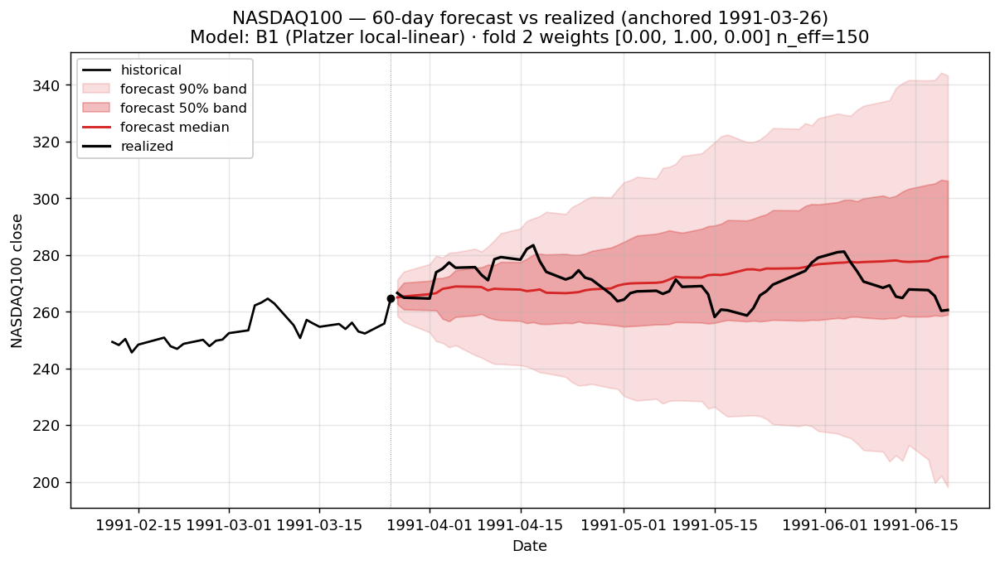
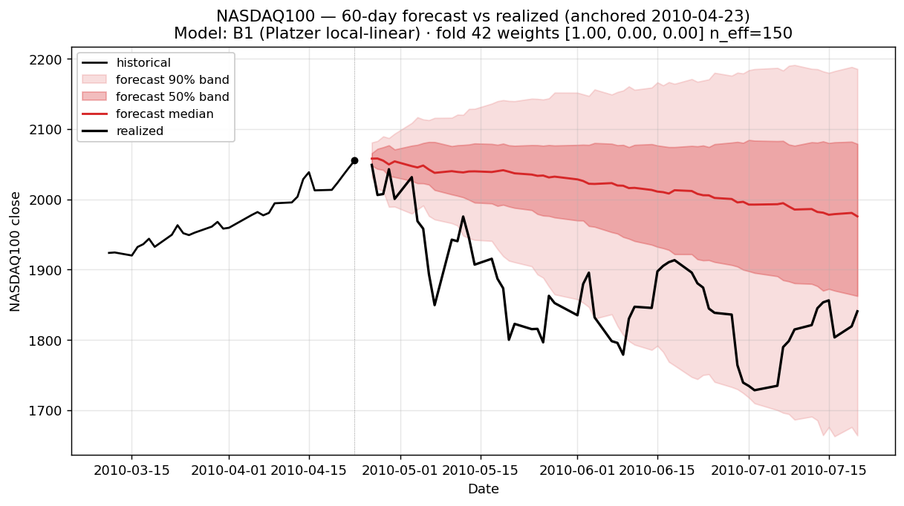
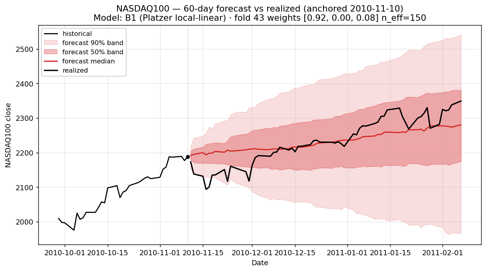
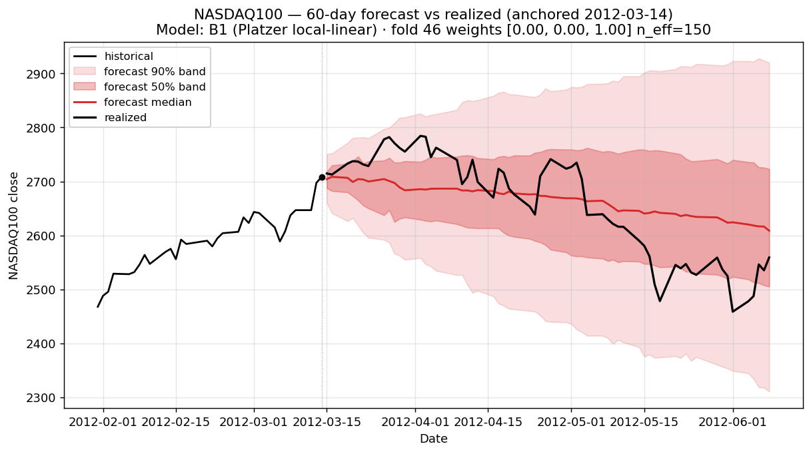
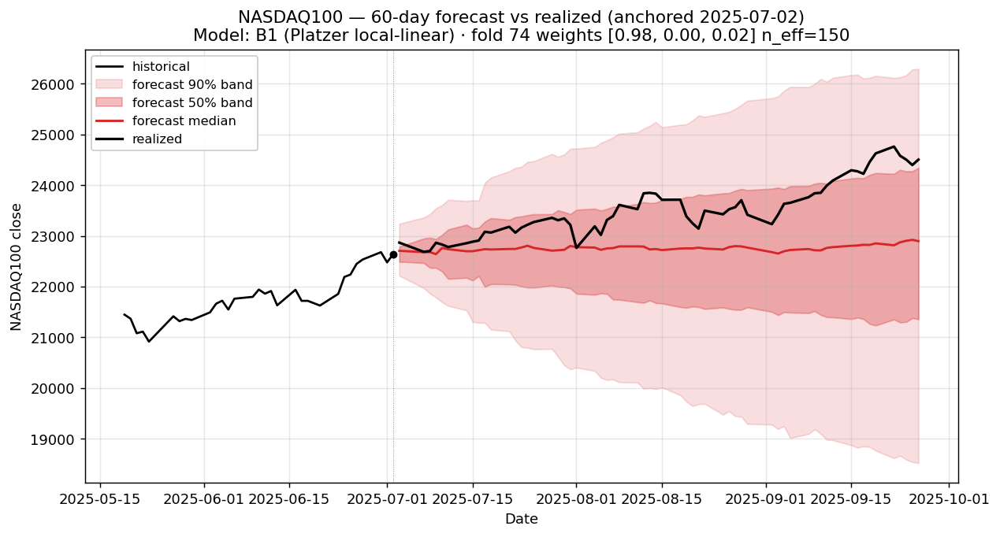

### Stratum A.2 — Negative momentum (top 3 most-extreme |z₅₀|)

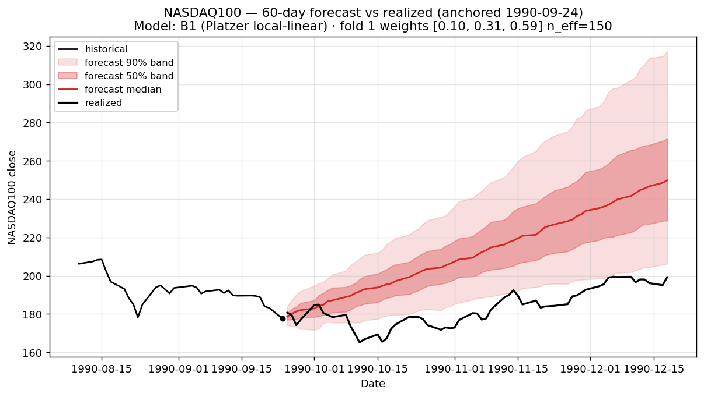
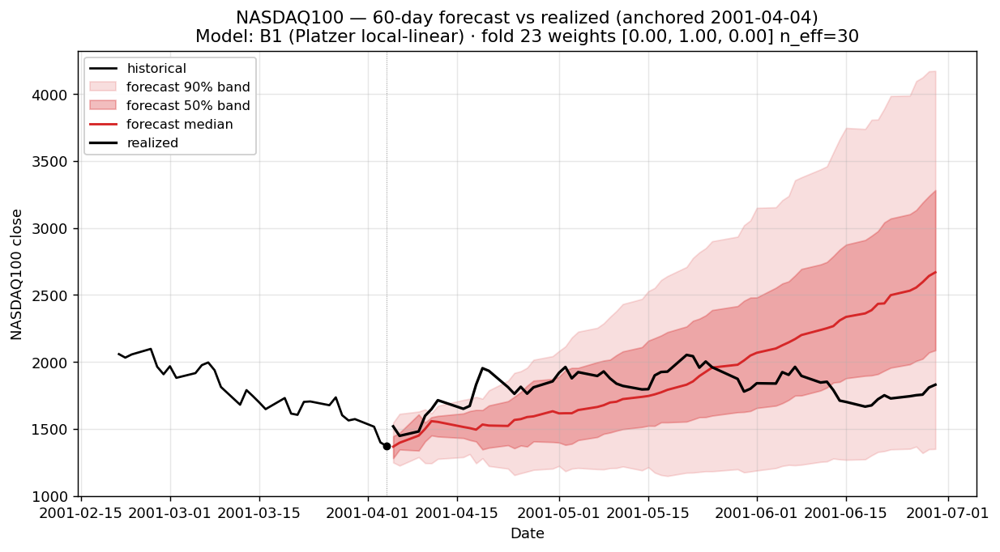
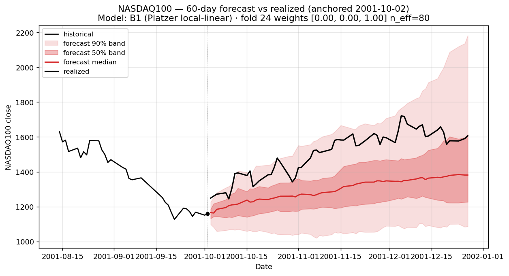

### Stratum B — Regime-coverage (hand-curated, 7 anchors)

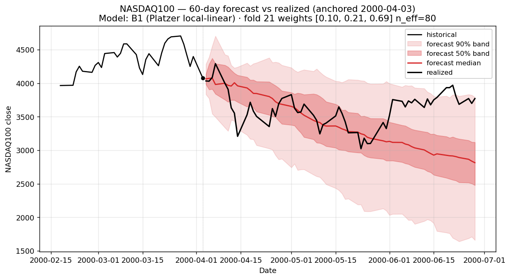
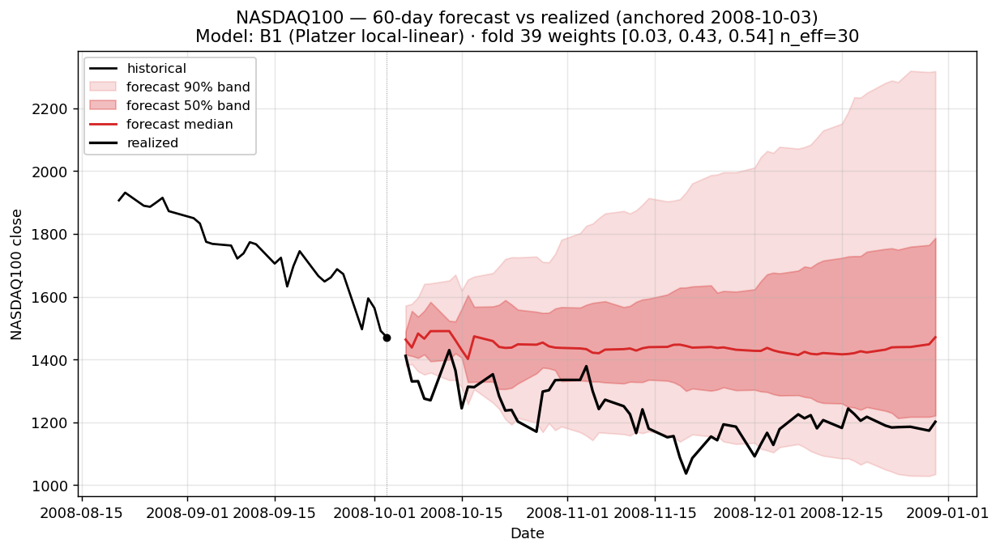
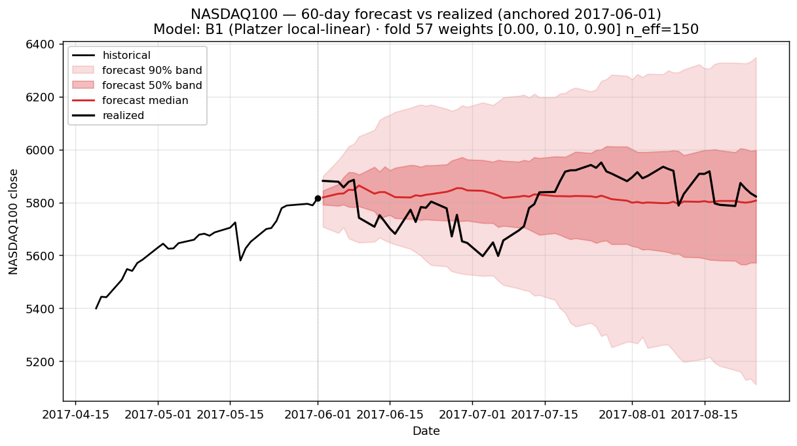
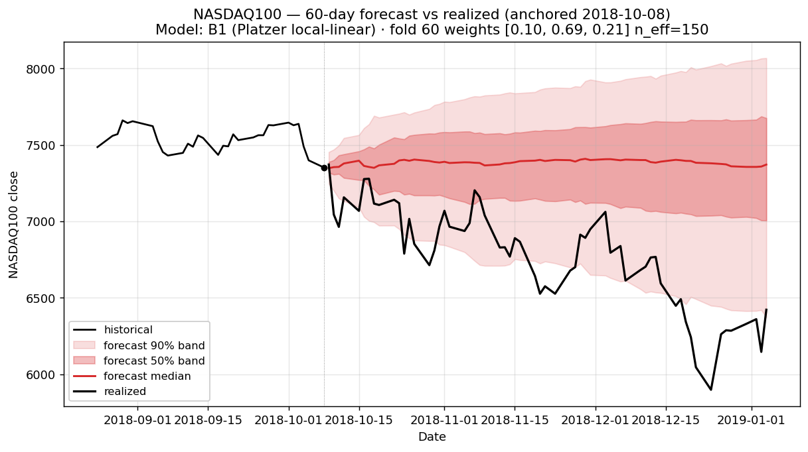
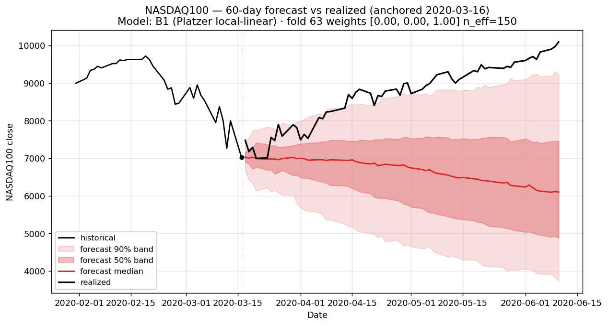
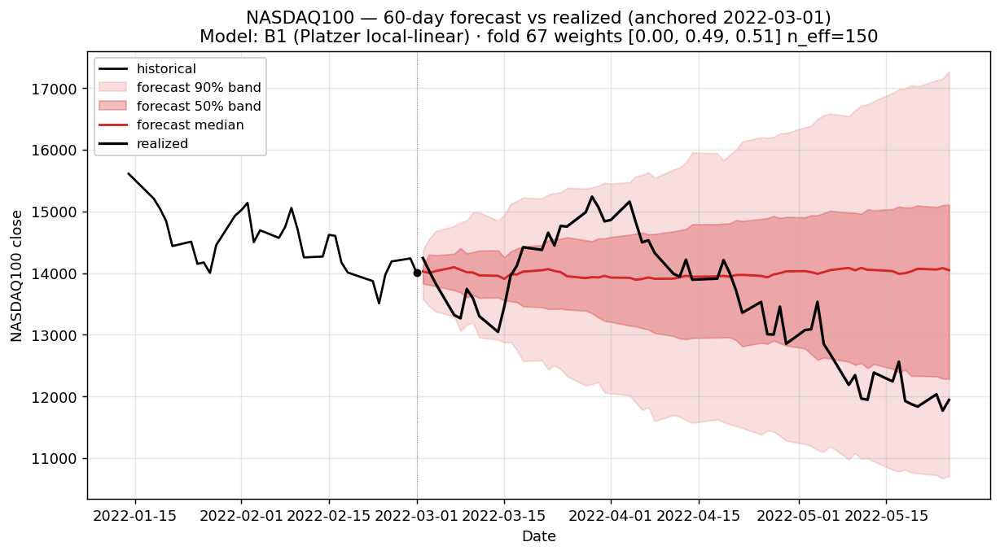
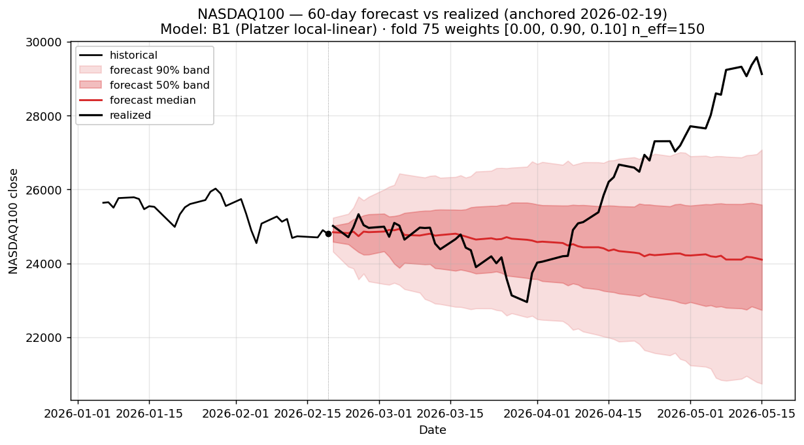

## Reproducing

```bash
uv run python scripts/analog_mc/render_fat_tail_panel.py \
    --run-dir runs/analog_mc/20260520T155220Z \
    --label "B1 (Platzer local-linear)" \
    --out-dir docs/analog_mc/experiments/figs/b1_local_linear_fat_tail \
    --prefix b1_local_linear
```
