# Fat-tail panel — side-by-side comparison (v2.4 / B1 / A2.1 / B5)

15 anchors × 4 experiments rendered as 2×2 grids per anchor. Each grid uses the same y-axis range across all four quadrants so dispersion is visually comparable. Per-quadrant subtitle shows the experiment label and `50/60` / `90/60` band coverage for that experiment at that anchor.

- **Quadrants (clockwise from top-left):** v2.4 baseline · B1 (Platzer local-linear) · B5 (joint A2.1+B1) · A2.1 (corrwindow L=100).
- **Source runs:** v2.4 `20260520T045525Z` · B1 `20260520T155220Z` · A2.1 `20260521T061730Z` · B5 `20260521T121025Z`.
- **Tabular companion:** [`../FAT_TAIL_EVAL.md` §"v4 cross-experiment comparison"](../FAT_TAIL_EVAL.md#v4-cross-experiment-comparison) carries the CRPS + 50-band + 90-band tables.
- **Per-experiment single-panel docs:** [`_v24_fat_tail_baseline.md`](_v24_fat_tail_baseline.md) · [`_b1_local_linear_fat_tail.md`](_b1_local_linear_fat_tail.md) · [`_a2_corrwindow_L100_fat_tail.md`](_a2_corrwindow_L100_fat_tail.md) · [`_b5_joint_fat_tail.md`](_b5_joint_fat_tail.md).

## Stratum A.1 — Positive momentum (|z₅₀| > 3)

### 1991-03-26 — Post-Gulf War recovery rally (realized −1.6%)

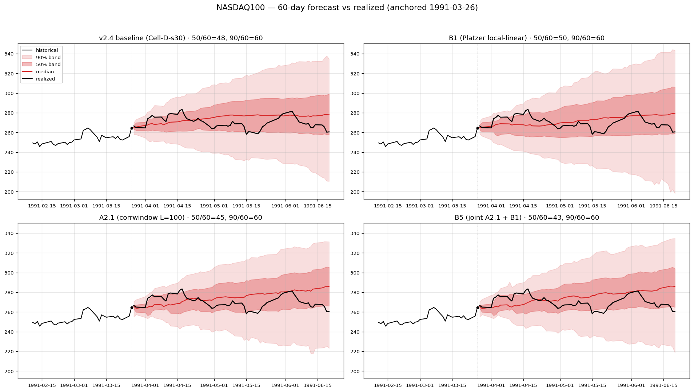

### 2010-04-23 — Pre-flash-crash peak (realized −10.4%) · v3.5 failure

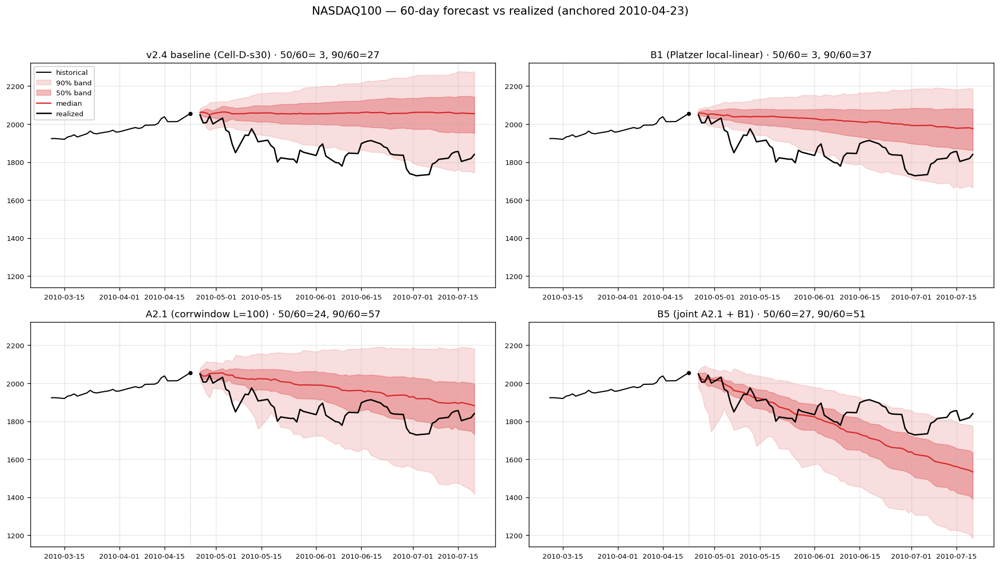

### 2010-11-10 — QE2 announcement (realized +7.4%)

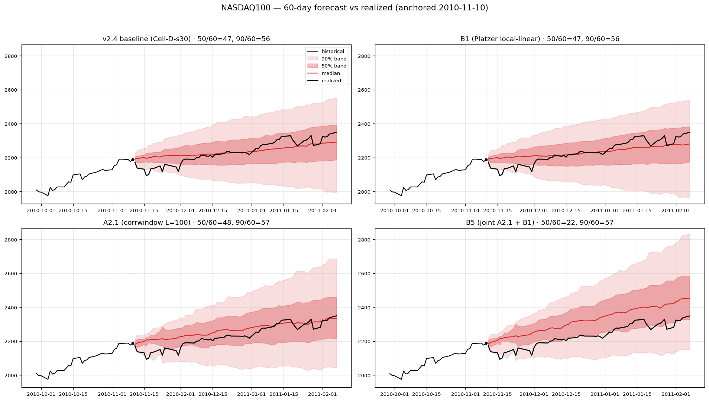

### 2012-03-14 — Early-2012 melt-up peak (realized −5.5%)

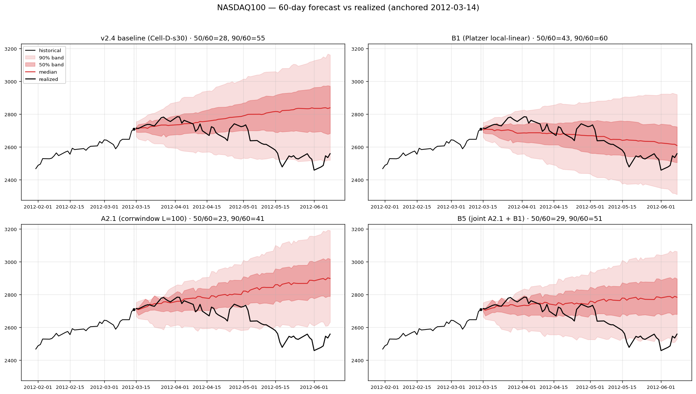

### 2025-07-02 — Recent bull continuation (realized +8.2%)

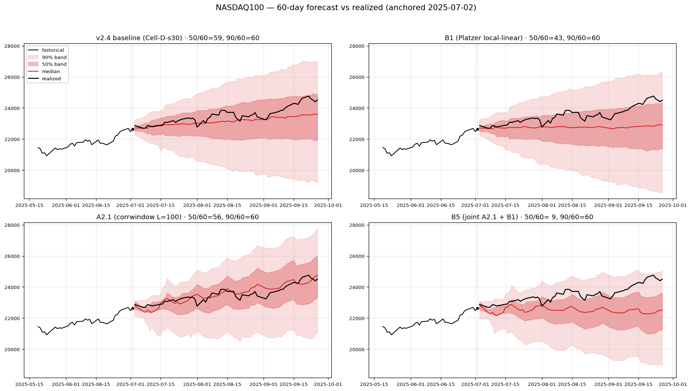

## Stratum A.2 — Negative momentum (top-3 most-extreme |z₅₀|)

### 1990-09-24 — Gulf War / 1990 recession bottom (realized +12.2%)

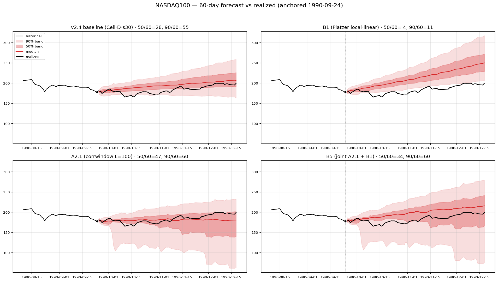

### 2001-04-04 — Dotcom bottom (realized +33.5%)

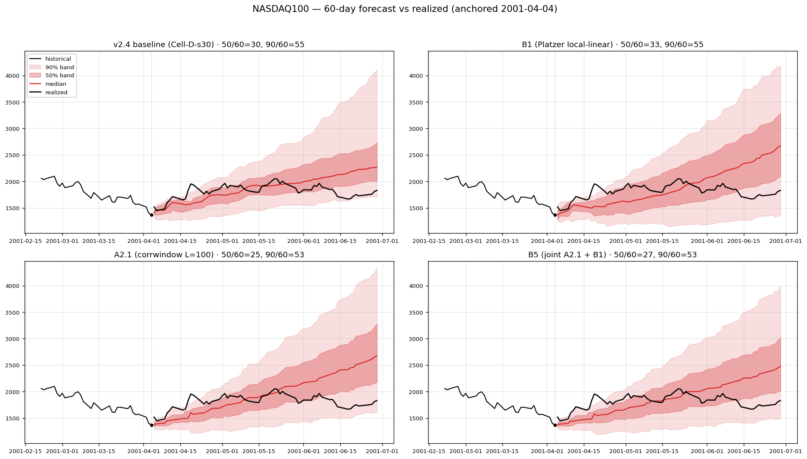

### 2001-10-02 — Post-9/11 bottom (realized +38.6%) · v3.5 failure

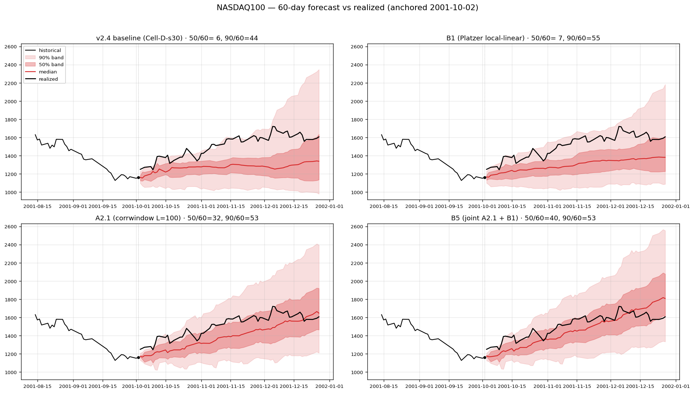

## Stratum B — Regime-coverage (7 anchors)

### 2000-04-03 — Dotcom peak (realized −7.5%)

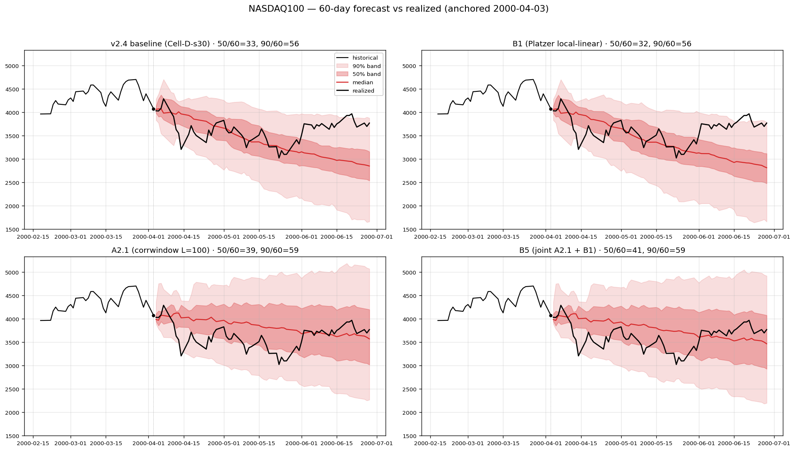

### 2008-10-03 — Post-Lehman / GFC (realized −18.3%)

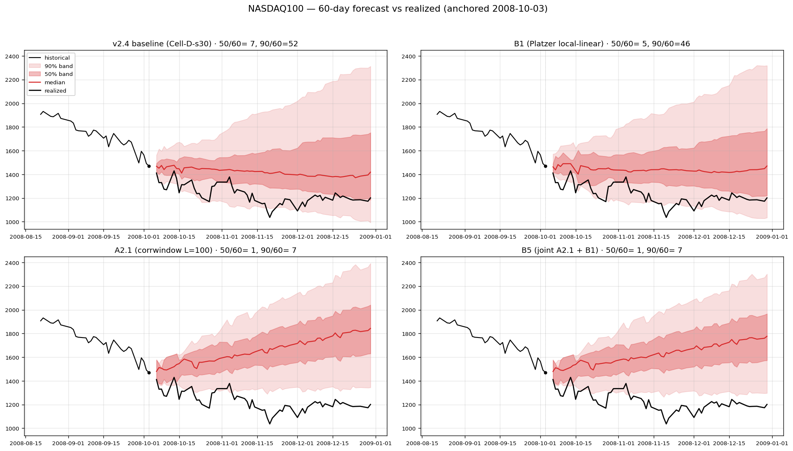

### 2017-06-01 — Calm bull market (realized +0.1%)

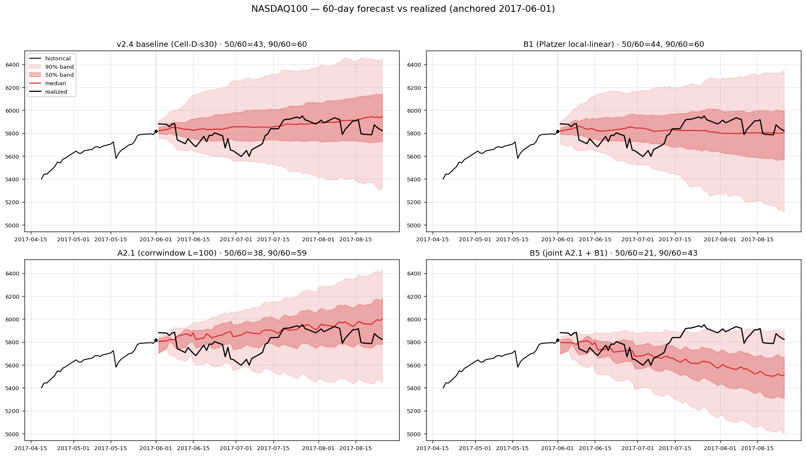

### 2018-10-08 — Q4-2018 selloff onset (realized −12.7%) · v3.5 failure

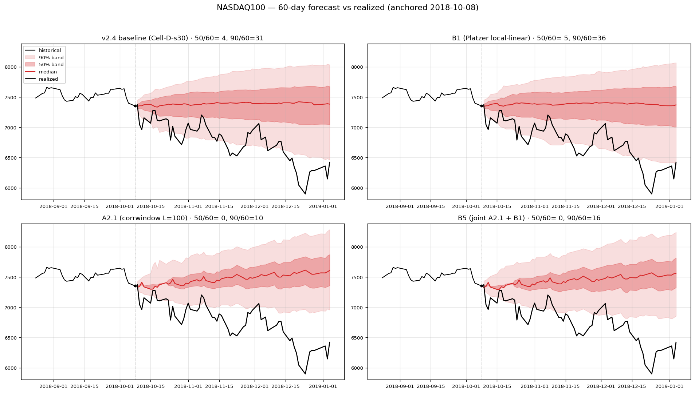

### 2020-03-16 — COVID crash bottom (realized +43.8%) · v3.5 failure

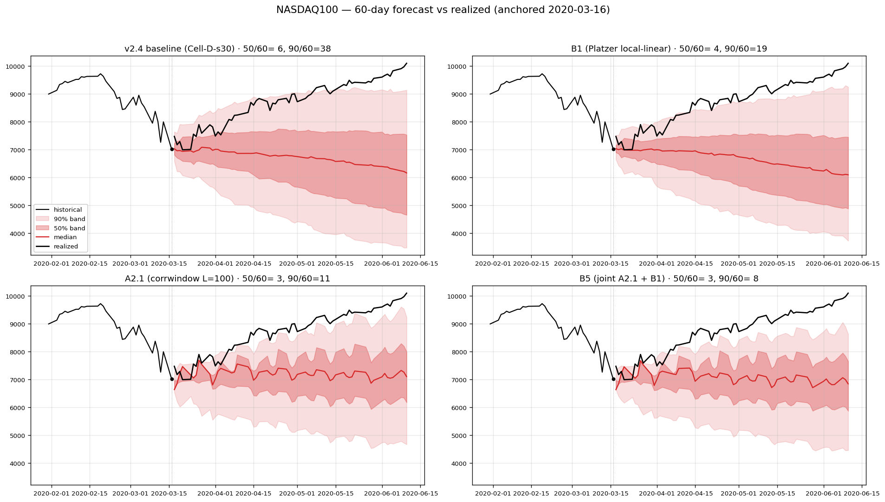

### 2022-03-01 — Russia-Ukraine + Fed tightening (realized −14.7%)

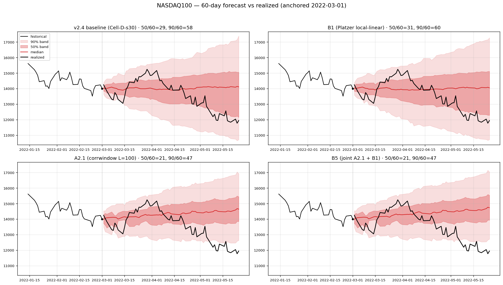

### 2026-02-19 — Recent rally (realized +17.5%) · v3.5 failure

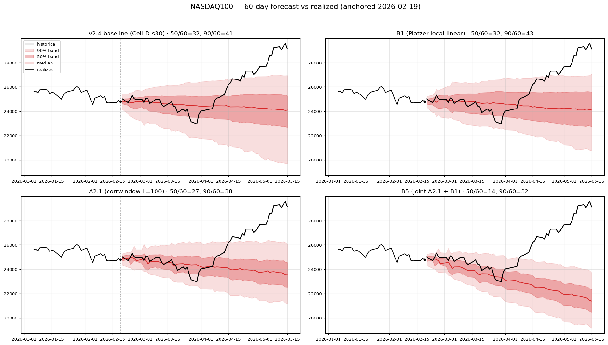

## Reproducing

```bash
uv run python scripts/render_fat_tail_panel_compare.py \
    --out-dir docs/analog_mc/experiments/figs/fat_tail_compare
```

Reads the four canonical run dirs hardcoded in `EXPERIMENTS` at the top of the script. Edit that list if a future canonical replaces one of the v4 runs. Each anchor is rendered independently — failures at one anchor do not block the rest.
