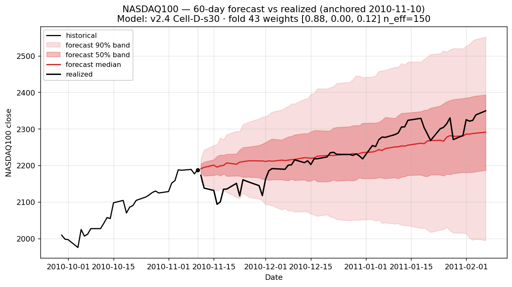
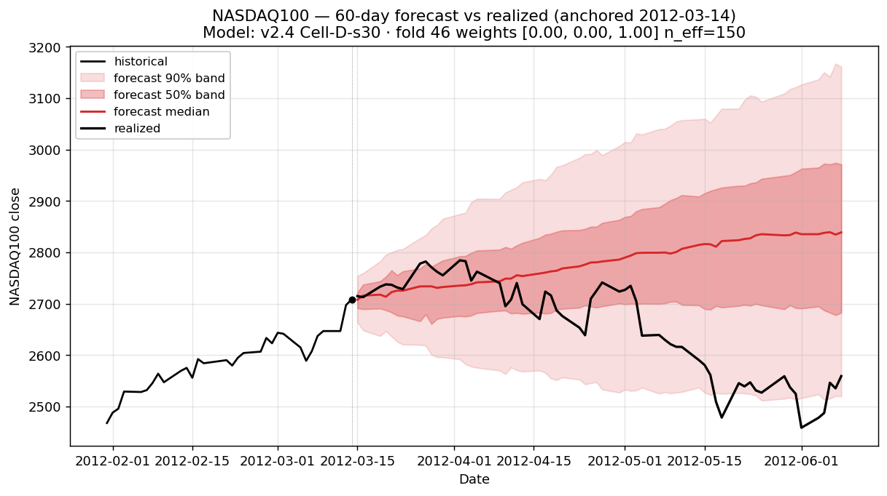
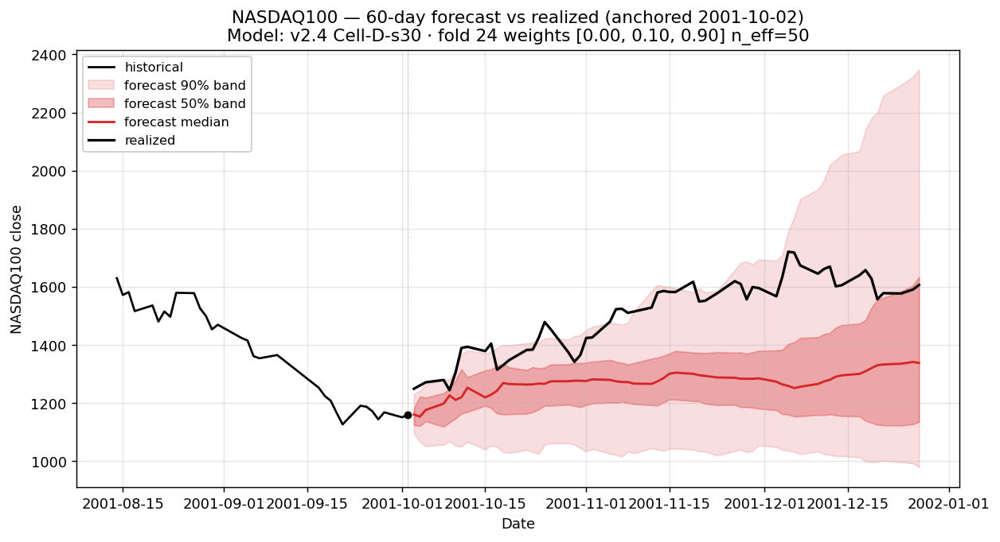
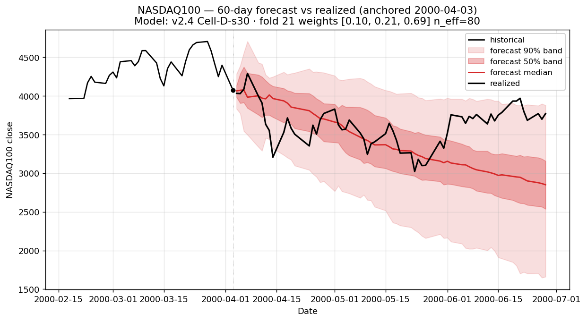
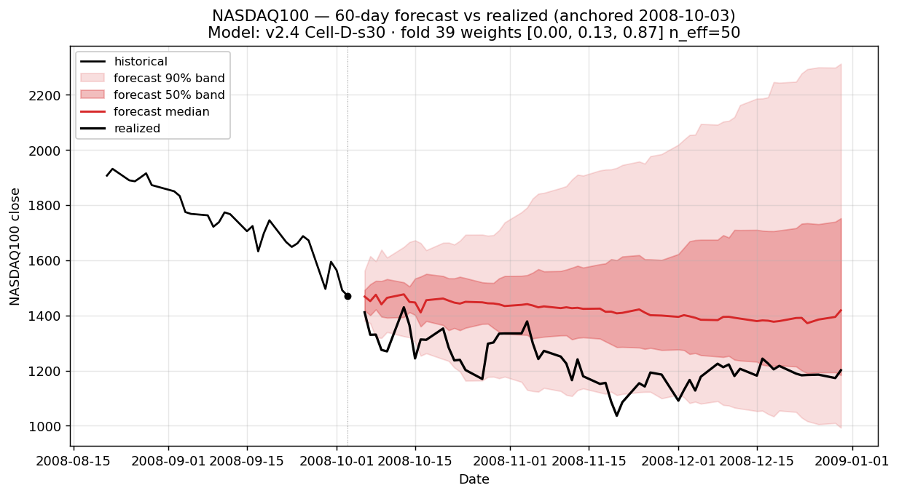
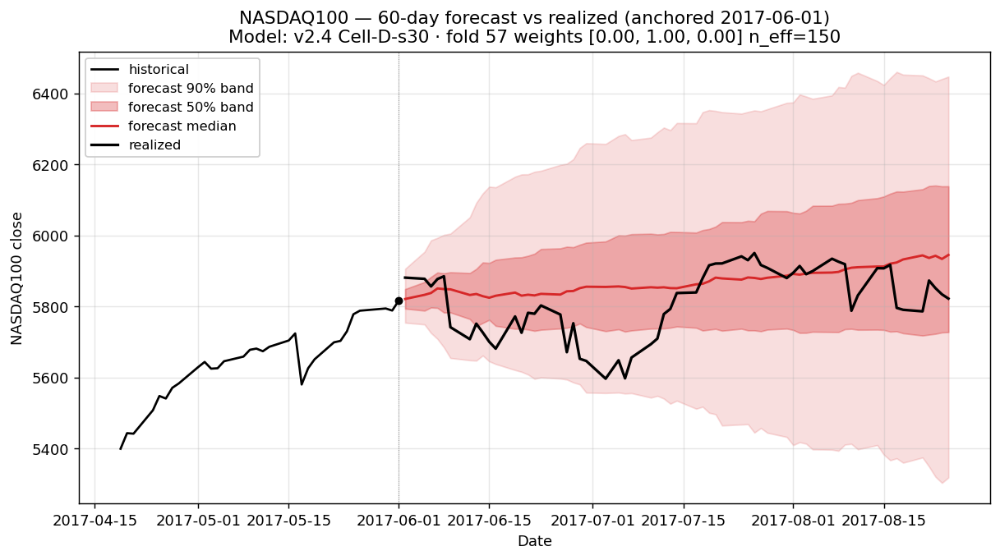
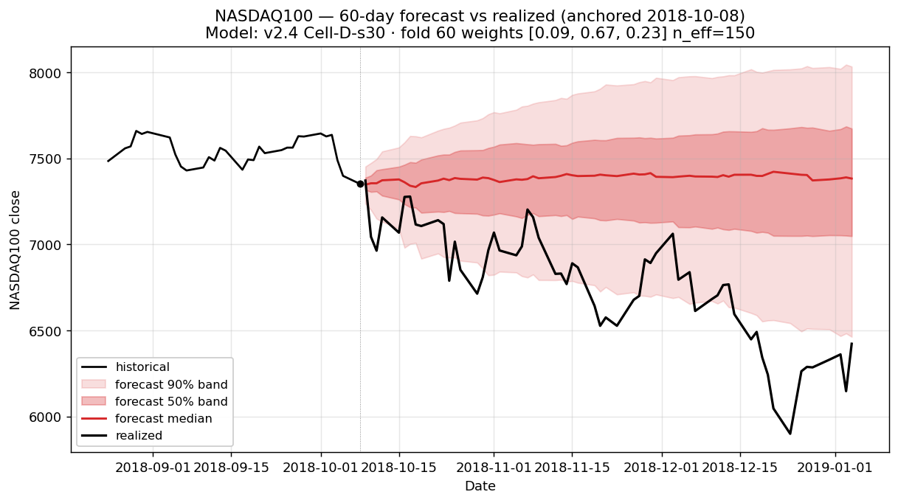
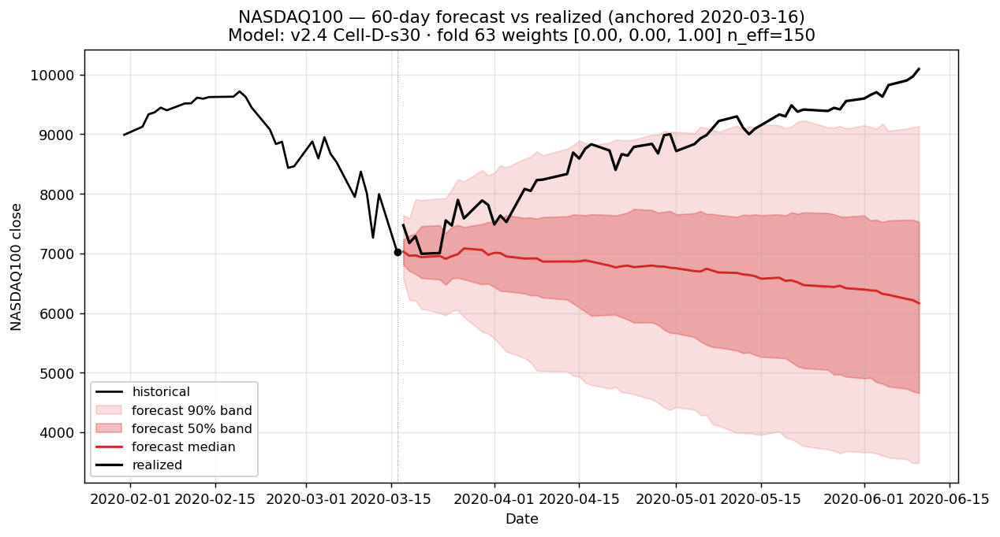
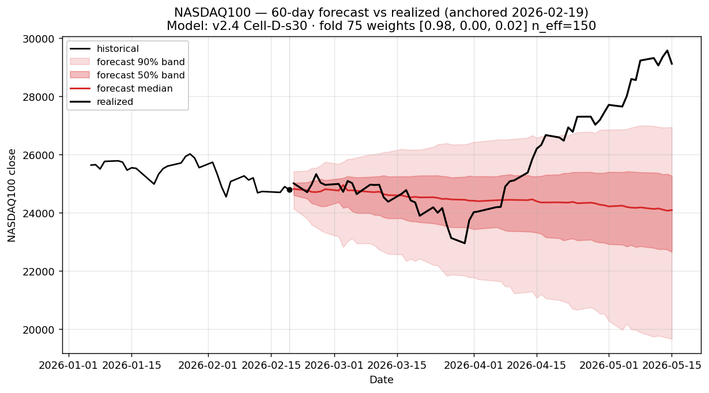

# v2.4 fat-tail baseline panel

Reference baseline that all v4 experiments diff their fat-tail panels against, per [`V4_EXPERIMENTS_PLAN.md` §"Mandatory fat-tail evaluation"](../V4_EXPERIMENTS_PLAN.md#mandatory-fat-tail-evaluation).

- **Model:** v2.4 Cell-D-s30 (`drift_mode=trailing_momentum`, `momentum_shrinkage=0.30`, `block_length=10`, `conditional_block_sampling=true`).
- **Canonical run:** `runs/analog_mc/20260520T045525Z` (76 folds, 1000 paths/origin, 66×5 weight grid).
- **Quantitative target:** [`results/analog_mc/data/fat_tail_baseline_v24.json`](../../../results/analog_mc/data/fat_tail_baseline_v24.json) — per-anchor 50/90 day-count coverage, per-step CRPS, mean CRPS, terminal-day 5/25/50/75/95 quantiles, cumulative-return quantile curves.
- **Anchor list:** 15 anchors pinned at [`fat_tail_eval_anchors.json`](../../../results/analog_mc/data/fat_tail_eval_anchors.json) — 5 positive-momentum (Stratum A.1), 3 negative-momentum (Stratum A.2), 7 hand-curated regime-coverage (Stratum B).
- **Failure/control split** is the v3.5 partition from [`V3_5_RESULTS.md`](../V3_5_RESULTS.md): the 5 failure anchors (90%-band <45/60 days) and 5 control anchors (passing strongly).

## Aggregate

| Group | n | Mean CRPS | Mean 50/60 days | Mean 90/60 days |
|---|---:|---:|---:|---:|
| **All 15 anchors** | 15 | **0.06111** | 26.9 | 49.9 |
| Failure anchors (v3.5 set) | 5 | 0.09471 | 10.2 | 36.2 |
| Control anchors (v3.5 set) | 5 | 0.02051 | 45.0 | 58.2 |

The failure/control split makes the headline obvious: v2.4 averages ~92% 90-band coverage on the controls and only ~60% on the failures, with mean CRPS 4.6× higher on failures than controls. **This is the gap v4 needs to close.**

## Per-anchor table

| Anchor | Stratum | Realized 60d | Mean CRPS | 50/60 | 90/60 | v3.5 group |
|---|---|---:|---:|---:|---:|---|
| 1991-03-26 | A.1 positive | −1.6% | 0.02340 | 48 | 60 | control |
| 2010-04-23 | A.1 positive | −10.4% | 0.07075 | 3 | 27 | **failure** |
| 2010-11-10 | A.1 positive | +7.4% | 0.01542 | 47 | 56 | control |
| 2012-03-14 | A.1 positive | −5.5% | 0.03401 | 28 | 55 | control |
| 2025-07-02 | A.1 positive | +8.2% | 0.01743 | 59 | 60 | control |
| 1990-09-24 | A.2 negative | +12.2% | 0.04173 | 28 | 55 | — |
| 2001-04-04 | A.2 negative | +33.5% | 0.07740 | 30 | 55 | — |
| 2001-10-02 | A.2 negative | +38.6% | 0.11399 | 6 | 44 | **failure** |
| 2000-04-03 | B regime | −7.5% | 0.07943 | 33 | 56 | — |
| 2008-10-03 | B regime | −18.3% | 0.10083 | 7 | 52 | — |
| 2017-06-01 | B regime | +0.1% | 0.01232 | 43 | 60 | control |
| 2018-10-08 | B regime | −12.7% | 0.06202 | 4 | 31 | **failure** |
| 2020-03-16 | B regime | +43.8% | 0.17878 | 6 | 38 | **failure** |
| 2022-03-01 | B regime | −14.7% | 0.04108 | 29 | 58 | — |
| 2026-02-19 | B regime | +17.5% | 0.04803 | 32 | 41 | **failure** |

## Charts

### Stratum A.1 — Positive momentum (|z₅₀| > 3)






### Stratum A.2 — Negative momentum (top 3 most-extreme |z₅₀|)




### Stratum B — Regime-coverage (hand-curated, 7 anchors)









## v4 comparators (closed 2026-05-22)

All three v4 P0 experiments shipped and produced their own panels against this baseline:

| Experiment | Failure mean CRPS Δ | Failures ≥45/60 | Panel | Narrative |
|---|---:|---:|---|---|
| [B1 Platzer local-linear](_b1_local_linear_fat_tail.md) | −6.6% ✅ | 1/5 | [figs/b1_local_linear_fat_tail/](figs/b1_local_linear_fat_tail/) | [`_b1_local_linear.md`](_b1_local_linear.md) |
| [A2.1 corrwindow L=100](_a2_corrwindow_L100_fat_tail.md) | **−20.1%** ✅✅ | 2/5 | [figs/a2_corrwindow_L100_fat_tail/](figs/a2_corrwindow_L100_fat_tail/) | [`_a2_corrwindow_L100.md`](_a2_corrwindow_L100.md) |
| [B5 joint](_b5_joint_fat_tail.md) | −11.0% ✅ | 2/5 | [figs/b5_joint_fat_tail/](figs/b5_joint_fat_tail/) | [`_b5_joint.md`](_b5_joint.md) |

None promote per the V4 bar (≥3 recovered, ≤2 regress); v2.4 (this baseline) remains canonical. Full synthesis at [`../V4_RESULTS.md`](../V4_RESULTS.md).

## How v4 experiments use this baseline

Each v4 experiment that produces a forecast must:

1. **Render its own 15-anchor panel** to `docs/analog_mc/experiments/figs/<exp_id>_fat_tail/` (same naming convention as above).
2. **Compute per-anchor CRPS diff vs v2.4** by reading [`fat_tail_baseline_v24.json`](../../../results/analog_mc/data/fat_tail_baseline_v24.json) and subtracting per-anchor mean CRPS.
3. **Compute per-anchor coverage diff** (50/60 and 90/60 day-count changes vs v2.4).
4. **Link this report** in their `_<exp_id>_<name>.md` deliverable so reviewers can visually compare side by side.

The promotion bar from [`V4_EXPERIMENTS_PLAN.md` §"Mandatory fat-tail evaluation"](../V4_EXPERIMENTS_PLAN.md#mandatory-fat-tail-evaluation) and [`V3_5_RESULTS.md`](../V3_5_RESULTS.md): an experiment that improves aggregate CRPS but regresses on >2 of the 15 anchors is not promotable without explicit justification. For end-of-v4, recovery of ≥3 of 5 failure anchors (90%-band ≥45/60 days) is the headline success criterion.

## Reproducing

```bash
# Quantitative baseline
uv run python scripts/analog_mc/compute_fat_tail_baseline_v24.py

# Visual panel (15 charts)
for d in 1991-03-26 2010-04-23 2010-11-10 2012-03-14 2025-07-02 \
         1990-09-24 2001-04-04 2001-10-02 \
         2000-04-03 2008-10-03 2017-06-01 2018-10-08 2020-03-16 2022-03-01 2026-02-19; do
  uv run python scripts/analog_mc/plot_forecast_from_date.py --date "$d" \
    --out "docs/analog_mc/experiments/figs/v24_fat_tail/v24_${d//-/}.png"
done
```

Both produce the artefacts in this directory; rerun after any future canonical re-run.
