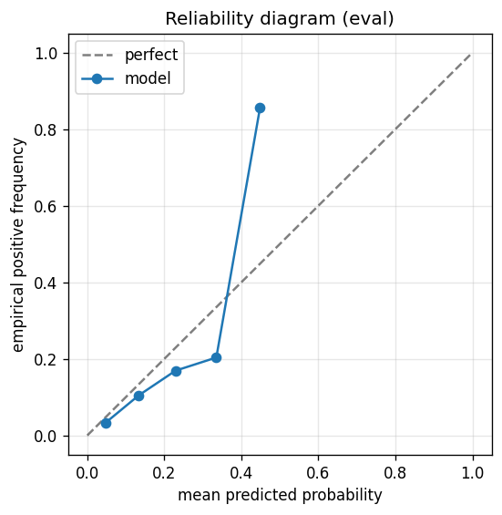

# nifty500 +30% / 50d / dd15% — H=50 broad-universe signal cell

> **Methodology note (2026-06-01)**: Numbers in this memo's body use the legacy "weighted R-precision" metric (per-day variable K = R(d), micro-aggregated). The project headline metric was renamed 2026-06-01 to **R-Precision@K** (per-day fixed K, macro-aggregated via `(1/Q)·Σ r_q/min(K,R_q)`). See the "R-Precision@K (current methodology)" section at the bottom of this memo for the cells in this memo recomputed under the new metric, plus `.claude/memories/project-r-precision-methodology.md` for the full definition + relationship.

**Cell**: nifty500 UP +30% within 50 trading days, max_drawdown 15%.
**Date**: 2026-05-29.
**Branch**: `gbdt-exp-nifty500-30-50-dd15`.
**Backend**: CatBoost (spec set no `backend.library`, so the default).
**Why this exists**: the broadest NSE cohort v1 supports (NIFTY 500, ~10× the NIFTY 50). The spec's thesis (`configs/gbdt/experiments/nifty500_up_30pct_50d_dd15pct.yaml` "Why interesting") is that a deeper cross-section sharpens the F14 cross-sectional rank/z features — "this stock is the 50th-percentile mover today" carries genuinely different information against 376 names than against 46. A medium-large move (+30%) over a medium horizon (50d) on the widest universe is a different region of the calibration surface than the documented H=25 corpus.

## How to read this

Tables show **raw metric values + a base-rate column**; lift (`metric / base_rate`) appears in prose only, per `CLAUDE.md` § Reporting conventions. The loop target is **val_brier** (lower better). Ranking quality is tracked via **test/eval AUC** and **weighted R-precision** (per-day variable-K, `sum(caught)/sum(R(d))`; the standard cross-cell metric — panel-invariant, see `[[project-r-precision-methodology]]`). Per-day P@k uses the mandatory `min(R(d), k)` denominator (achievable positives, not picks-made). Brier "improvement" is vs the per-segment base-rate-constant Brier.

## Setup + the fact that shaped everything

- **Panel**: 376 of 500 tickers kept (124 excluded as IPO-shallow / insufficient history — recent listings: PAYTM, ZOMATO/ETERNAL, LICI, JIOFIN, SWIGGY, NYKAA, …). Single fold, split 800/400/200/100 (train/val/eval/test) per ticker = 545,200 rows total (~1.0M in the raw pre-window panel). Sample-uniqueness weighting on (horizon_days=50 → overlap-inflation 99×).
- **Prevalence is non-stationary and declining**: train **0.180** → eval **0.064** → test **0.057**. The +30%/50d up-move got monotonically rarer over the sample window. As in the `_147` nifty50 cell, this is the single most important fact: it caps how good a *calibrated probability* can be on the held-out tail, while leaving *ranking* intact.

## Loop history

The default (algorithmic-fallback) FS+HP callback ran. It pruned the 279-feature pool to **39 features at iteration 0** and left HP at default (depth 6, lr 0.05, Bayesian bootstrap, Ordered boosting, l2 3.0, 1000 trees, early-stop 75). Best checkpoint = iteration 1; the loop hit a val_brier plateau and stopped at iteration 2.

| iter | n_features | train Brier | val Brier | gap | inner_stop |
|---|---:|---:|---:|---:|---|
| 0 | 279 | 0.1255 | 0.1098 | −0.0157 | — |
| 1 | 39 | 0.1168 | 0.1084 | −0.0084 | — |
| 2 | 39 | 0.1168 | 0.1084 | −0.0084 | plateau |

The train/val gap is **negative throughout** (val Brier *below* train Brier) → **no overfit**; the pruning didn't cost val_brier (iter-1 39-feature val 0.1084 ≤ iter-0 279-feature 0.1098). The 39 kept features are vol-estimator / regime / drawdown-runup families plus a handful of F16 outside-band z-score features (full list in `features.yaml`) — the same "volatility-level + market-regime" model shape seen in the nifty50 cell.

**Contrast with `_147` on FS behavior.** The nifty50 `_147` H=25 cell — also negative-gap / no-overfit — found the fallback's prune-on-sight *harmful* (its blind cut to 62→43 features raised val_brier to 0.1663 vs all-279's 0.1642; even a gentle targeted cut to 88 was ≈baseline, never better), and its kept-features answer was **all 279** (reusable lesson #1 there: "negative train/val gap → FS will hurt, not help"). Here the same fallback's aggressive 279→**39** cut was *neutral-to-slightly-helpful on val* (0.1098→0.1084), not harmful. So this cell is a counter-example to `_147`'s "FS is wrong for non-overfit cells" generalization: on the broad-universe H=50/+30% panel the 240 dropped features were redundant-or-dead rather than signal the model needed, and dropping them cost nothing. It does **not** overturn the `_147` lesson (different cell geometry; FS was *neutral-to-helpful* here, not a clear win), but it shows the prune-on-sight verdict is cell-specific — worth a controlled FS-on/FS-off check on this exact cell in the manual-tuning run (`#185`), since the val delta (−0.0014) is within the noise band and could be either real leanness or noise.

## Calibration

Native CatBoost probabilities were **miscalibrated** on val (Spiegelhalter |z| = 12.38, p ≈ 0) → the conditional-isotonic policy fit an **isotonic** layer. That isotonic map was fit on the val window (higher prevalence than test); see the caveat below for what that costs on the drifted test split.

## Headline metrics

| segment | base_rate | Brier | base-rate Brier | improvement | LogLoss | AUC |
|---|---:|---:|---:|---:|---:|---:|
| eval | 0.0638 | 0.0581 | 0.0597 | +0.0016 | 0.2219 | 0.7207 |
| test | 0.0566 | 0.0554 | 0.0534 | −0.0020 | 0.2169 | 0.7154 |

**AUC ~0.72 on both held-out segments** — strong discrimination, well outside the [0.45, 0.55] null band.

### Weighted R-precision (per-day variable-K — the cross-cell comparison metric)

| segment | base_rate (wtd) | R-prec (wtd) | base_rate (mean/day) | R-prec (mean/day) | days w/ pos |
|---|---:|---:|---:|---:|---:|
| eval | 0.0639 | 0.2786 | 0.0636 | 0.1526 | 202 / 299 |
| test | 0.0569 | 0.1805 | 0.0566 | 0.1478 | 51 / 104 |

Weighted R-precision was **4.36× base rate on eval** (0.2786 vs 0.0639) and **3.17× on test** (0.1805 vs 0.0569). Mean-per-day R-precision was 2.40× (eval) / 2.61× (test). Computed via `scripts/gbdt/compute_r_precision.py` over `predictions/{eval,test}.csv`.

### Per-day P@k (`min(R(d), k)` denominator)

| segment | k | base_rate | P@k | n_positives | n_denom |
|---|---:|---:|---:|---:|---:|
| eval | 1 | 0.0638 | 0.2426 | 49 | 202 |
| eval | 5 | 0.0638 | 0.1882 | 189 | 1004 |
| eval | 10 | 0.0638 | 0.1780 | 329 | 1848 |
| test | 1 | 0.0566 | 0.4314 | 22 | 51 |
| test | 5 | 0.0566 | 0.2360 | 59 | 250 |
| test | 10 | 0.0566 | 0.2203 | 104 | 472 |

The top of the ranking is sharp: test P@1 = 0.431 (~7.6× base rate), eval P@1 = 0.243 (~3.8×). Predictions separate cleanly (eval std 0.064, test std 0.072; neither flags low-separation).

## Mechanistic reading

1. **The signal is real and lives in ranking, not in the calibrated-probability level.** AUC ~0.72 and weighted R-prec 3–4× base rate are both strong; the prediction-extreme regime (top-1 / top-5 per day) is where the model earns its keep. The per-quarter P@5 breakdown (`metrics.json`) shows it is not one lucky quarter — eval 2025Q1 P@5 = 0.31, Q2 = 0.24, Q3 = 0.18 (a healthy gradient), with a single weak Q4 (0.07, ≈ base rate); test 2026Q1 P@5 = 0.24 carries the test window.
2. **Broadest-universe hypothesis looks validated (n=1).** The R-prec lift here (eval 4.36×, test 3.17×) sits materially above the nifty50 `_147` H=25 cell's ~2.0–2.2× and above the H=25 cross-market corpus (`_138`: nasdaq100 / sp500 / nifty50 / nifty100, lifts ~1.5–2×). This is consistent with the spec's thesis that the ~376-name cross-section gives the F14 rank/z features a richer distribution to rank against. **Caveat: this is one cell**, and the H=50/+30% cell differs from the H=25/+10% comparators on *both* horizon and threshold, so universe breadth is confounded with the cell geometry. It is a suggestive data point, not a controlled universe-size ablation.
3. **The honest limitation — test Brier underperforms the base-rate constant.** Despite AUC 0.715 and strong P@k, test Brier (0.0554) is **worse than the base-rate-constant baseline (0.0534) by −0.0020**. This is a **calibration-on-drifted-prevalence artifact**, not a discrimination failure: the isotonic map was fit on the val window, and prevalence falls from train 18.0% → eval 6.4% → test 5.7%, so the model systematically *over-predicts* on the rarer test window. Over-prediction inflates the squared error on the (mostly-negative) test rows even though the *order* of the predictions is preserved — which is exactly why ranking metrics (R-prec, P@k) stay strong while the Brier dips below the trivial constant. The downstream trading rule consumes ranking, so the cell is usable as a stock-picker; the limitation is calibrated-probability accuracy under prevalence drift. **Do not overclaim** a calibrated-probability win on test.

## Per-experiment verdict (user-facing — no automated PASS/FAIL)

**SIGNAL cell.** Under the compound rule (`CLAUDE.md` § "What not to do — gbdt"): AUC ~0.72 is well outside the [0.45, 0.55] null band, and weighted R-precision lift is 3.2–4.4× — far above the 1.2× null threshold and above the 1.5× "hidden top-tail" threshold. There is genuine, strong top-tail ranking signal here.

The broad-universe angle is the interesting part: this cell's R-prec lift exceeds both the nifty50 single-universe cell and the H=25 cross-market corpus, consistent with (but not proof of) the deeper-cross-section thesis — **n=1, and horizon/threshold are confounded with universe size**, so treat it as a hypothesis-supporting data point, not a settled result. The shippable caveat is calibration: native probabilities needed isotonic, and even isotonic underperforms the base-rate constant on the drifted test window (Brier −0.0020) because the isotonic map can't see the test-window prevalence collapse. **The model ranks well; its calibrated probability is reliable only where the deployment-window prevalence matches val.** Recency-weighted or regime-conditional calibration (parked in `V1.1_TBD.md`, also flagged by `_147`) is the lever, not FS/HP.

## Reproducibility

- Spec: `configs/gbdt/experiments/nifty500_up_30pct_50d_dd15pct.yaml` (random_seed 42).
- Artifact: `results/gbdt/experiments/nifty500_up_30pct_50d_dd15pct/` — `report.md`, `metrics.json`, `hp.yaml`, `features.yaml`, `iterations.jsonl`, `predictions/`, `figs/`, `spec.yaml`.
- `model.cbm` + `calibration.pkl` are **not committed** (binaries, reproducible from spec + seed + data; matches the #78 convention); `_feature_matrix_cache.parquet` / `.key.json` are gitignored.
- Weighted R-precision recomputed via `uv run python -m scripts.gbdt.compute_r_precision results/gbdt/experiments/nifty500_up_30pct_50d_dd15pct/predictions/{eval,test}.csv`.
- Machine-readable headline: `results/gbdt/data/_176_nifty500_up_30pct_50d_dd15pct_data.json`.

## R-Precision@K (current methodology — added 2026-06-01)

Per `.claude/memories/project-r-precision-methodology.md`, R-Precision@K is the post-2026-06-01 headline cross-cell metric for gbdt — defined as `R-Precision@K = (1/Q) · Σ_q r_q / min(K, R_q)` over the Q days where R_q > 0 (R_q = positives on day q; r_q = positives caught in top-K picks on day q; macro-averaged, equal weight per day; K fixed). Recomputed from each cell's `predictions/test.csv`:

| cell | rows | base | AUC | R-p@1 | R-p@3 | R-p@5 | R-p@10 | R-p@20 |
|---|---|---|---|---|---|---|---|---|
| nifty500_up_30pct_50d_dd15pct | 18800 | 5.7% | 0.715 | 0.431 | 0.242 | 0.231 | 0.213 | 0.199 |

Cross-links: `[[project-r-precision-methodology]]`, `docs/gbdt/_147_nifty50_h25_manual_fs_hp_loop.md` (nifty50 single-universe comparator), `docs/gbdt/_138_h25_cross_market_combined.md` (H=25 cross-market corpus).
