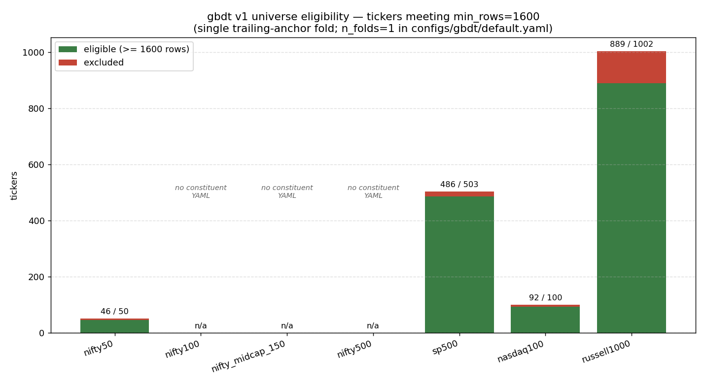

# v0 — Universe eligibility under `min_rows = 1600`

**Task:** for each universe registered in `configs/gbdt/default.yaml::universes`, count how many constituent tickers have at least `min_rows = 1600` rows of cached daily history — the gate the v1 runner applies via `split.min_rows_per_ticker` before carving its single trailing-anchor fold (`src/gbdt/train.py::carve_single_fold`; `n_folds: 1`).

**Why it matters.** Experiments 1–3 (nifty50 / nifty100 +10% sweeps) all surfaced the same friction: tickers silently dropped from the panel because the per-stock cache was shorter than the `1600 = train(800) + val(400) + eval(200) + test(100)` budget. The exclusion lists were *per-experiment, per-universe* — never aggregated into a single picture of which universes are participation-starved at the current threshold. This scan fills that gap.

**Method.** `scripts/gbdt/v0_universe_eligibility.py` reads the seven universes block from `configs/gbdt/default.yaml`, calls `gbdt.data.resolve_universe` to pull each universe's ticker list, then runs `gbdt.data.ensure_universe_cached(..., min_rows=1600, cache_only=True)` — the same call path the runner uses. Counts are kept-vs-excluded against the existing cache; constituent YAMLs that aren't yet on disk (i.e. universes registered in `default.yaml` but never seeded) are reported as `n/a`.



| universe | eligible | total | rate | notes |
|---|---:|---:|---:|---|
| nifty50 | 46 | 50 | 92% | 4 newer listings short of 1600 (consistent with JIOFIN-578 / MAXHEALTH-1322 noted in `default.yaml`) |
| nifty100 | n/a | n/a | n/a | constituent YAML not yet written |
| nifty_midcap_150 | n/a | n/a | n/a | constituent YAML not yet written |
| nifty500 | n/a | n/a | n/a | constituent YAML not yet written |
| sp500 | 486 | 503 | 97% | highest participation rate of all seeded universes |
| nasdaq100 | 92 | 100 | 92% | same 8% drop-rate as nifty50 |
| russell1000 | 889 | 1002 | 89% | ~113 small/mid-caps starved; largest absolute exclusion count |

## Observations

- **US universes hit 89–97% participation at 1600 rows.** The US cache extends back further (most tickers >= 4,000 rows), so `min_rows = 1600` is non-binding for the established names; the excluded tail is small-cap / recently-IPO'd constituents.
- **nifty50 loses 4 of 50 (8%).** Manageable for headline experiments, but in cells where event rates are already sparse (e.g. `up_50_h10`) each lost ticker cuts the per-cell positive count noticeably.
- **The three NSE Broad universes (nifty100, nifty_midcap_150, nifty500) are registered but unseeded.** Experiments 2 and 3 sidestepped this by using the inline `nifty100` block before its constituents were wired through `data_pipelines`. A standalone NSE Broad seed is required before this scan can give them a real participation number; the chart's "no constituent YAML" annotations track that gap.
- **russell1000 loses ~11% (113 tickers).** This is the universe where the threshold bites hardest in absolute terms, and where the bias is most directional — short-history names tend to be small-caps or recent IPOs, exactly the tail with the most explosive +X% breach behavior. Filtering them out at the row gate is the kind of survivorship cut that the headline metric can't tell you about.

## Implications for v1.x

- **Lowering `min_rows` to 1300 or 1400 is a candidate follow-up.** The trade-off is shorter per-ticker training segments vs. broader cross-sectional coverage — particularly for `russell1000`, where the dropped tail is structurally interesting. Plumb a `min_rows`-sweep spec into the experiment runner and re-run a representative cell (e.g. nasdaq100 `up_10_h20`) at 1300 / 1400 / 1500 / 1600 to see whether per-ticker training-segment shrinkage degrades headline Brier more than the broader panel improves it.
- **NSE Broad seed is a prerequisite for any nifty100 / midcap150 / nifty500 experiment.** Track in `docs/gbdt/V1.1_TBD.md` (or whichever the active follow-up parking lot is).
- **Re-run this scan after the NSE Broad seed lands.** The numbers above are a snapshot against the cache state at 2026-05-26; the `n/a` rows are the immediate items to fill in.

---

**Reproduce:**

```bash
uv run python -m scripts.gbdt.v0_universe_eligibility
```

Outputs:
- `results/gbdt/v0_investigations/universe_eligibility.png` — the chart above
- stdout — the kept/excluded/total table above
