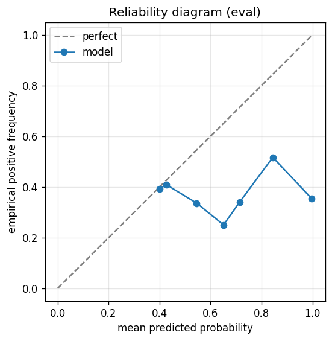

# gbdt experiment — nasdaq100_up_10pct_100d_dd5pct

## Spec

- universe: `nasdaq100`
- direction: `up`
- threshold_pct: `10`
- horizon_days: `100`
- max_drawdown: `0.05`

## Data

- tickers in universe: 100
- tickers used: 92
- tickers excluded: NASDAQ:ABNB, NASDAQ:APP, NASDAQ:ARM, NASDAQ:CEG, NASDAQ:DASH, NASDAQ:GEHC, NASDAQ:GFS, NASDAQ:PLTR
- train rows: 73600
- val rows: 36800
- eval rows: 18400
- test rows: 0
- positive prevalence (train): 0.418
- positive prevalence (eval): 0.398

## Iteration history

| iter | n_features | train Brier | val Brier | gap | rationale | inner_stop |
|---|---|---|---|---|---|---|
| 0 | 279 | 0.2282 | 0.2425 | 0.0143 | iteration 0 — full feature pool, default HPs :: algorithmic fallback: kept 37/27 |  |
| 1 | 37 | 0.2234 | 0.2432 | 0.0198 | iteration 1 from FS+HP callback :: algorithmic fallback: kept 29/37 features |  |
| 2 | 29 | 0.2263 | 0.2430 | 0.0167 | iteration 2 from FS+HP callback :: inner_stop=plateau | plateau |

## Final checkpoint

- best iteration: 0
- iterations run: 3
- inner stop signal: `plateau`

## Calibration

- method requested: `conditional_isotonic`
- decision: `isotonic`
- Spiegelhalter Z: 2.257
- Spiegelhalter p: 0.0240

## Headline metrics

| segment | Brier | base-rate Brier | improvement | LogLoss | AUC |
|---|---|---|---|---|---|
| eval | 0.2532 | 0.2396 | -0.0136 | 0.9126 | 0.4932 |

## Per-experiment verdict (algorithmic readout)

Calibration: required isotonic (|z|=2.26); shipped as `isotonic`. Brier vs base-rate: -0.0136 (worse than baseline).

> NOTE: this verdict is generated from the metrics by a simple rule (see ``report._algorithmic_verdict``); it is NOT an automated pass/fail gate. The user reads the artifact and decides whether the cell ships.
