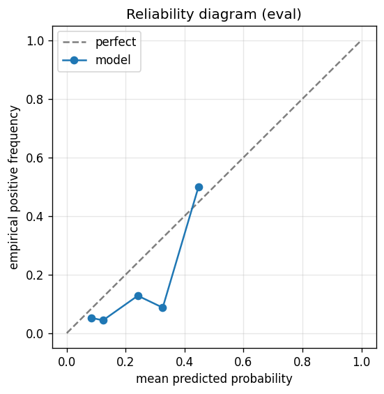

# gbdt experiment — nifty50_up_20pct_50d_dd10pct

## Spec

- universe: `nifty50`
- direction: `up`
- threshold_pct: `20`
- horizon_days: `50`
- max_drawdown: `0.1`

## Data

- tickers in universe: 50
- tickers used: 46
- tickers excluded: NSE:ETERNAL, NSE:JIOFIN, NSE:MAXHEALTH, NSE:SHRIRAMFIN
- train rows: 36800
- val rows: 18400
- eval rows: 9200
- test rows: 2300
- positive prevalence (train): 0.202
- positive prevalence (eval): 0.048

## Iteration history

| iter | n_features | train Brier | val Brier | gap | rationale | inner_stop |
|---|---|---|---|---|---|---|
| 0 | 279 | 0.1302 | 0.1156 | -0.0146 | iteration 0 — full feature pool, default HPs :: algorithmic fallback: kept 35/27 |  |
| 1 | 35 | 0.1289 | 0.1158 | -0.0131 | iteration 1 from FS+HP callback :: algorithmic fallback: kept 29/35 features |  |
| 2 | 29 | 0.1280 | 0.1158 | -0.0122 | iteration 2 from FS+HP callback :: inner_stop=plateau | plateau |

## Final checkpoint

- best iteration: 0
- iterations run: 3
- inner stop signal: `plateau`

## Calibration

- method requested: `conditional_isotonic`
- decision: `native`
- Spiegelhalter Z: 0.852
- Spiegelhalter p: 0.3942

## Headline metrics

| segment | Brier | base-rate Brier | improvement | LogLoss | AUC |
|---|---|---|---|---|---|
| eval | 0.0507 | 0.0454 | -0.0052 | 0.2214 | 0.5604 |
| test | 0.0291 | 0.0137 | -0.0154 | 0.1697 | 0.4352 |

## Per-experiment verdict (algorithmic readout)

Calibration: native-passable (|z|=0.85<2). Brier vs base-rate: -0.0052 (worse than baseline).

> NOTE: this verdict is generated from the metrics by a simple rule (see ``report._algorithmic_verdict``); it is NOT an automated pass/fail gate. The user reads the artifact and decides whether the cell ships.
