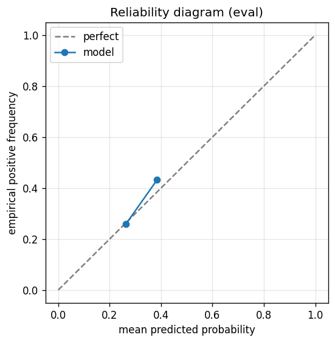

# gbdt experiment — nasdaq100_up_10pct_100d_dd5pct_aligned

## Warnings

- **hp_search**: HP search disabled in sweep mode (max_iter=3 < threshold=5); the FS+HP loop ran feature-selection only — see issue #32.

## Spec

- universe: `nasdaq100`
- direction: `up`
- threshold_pct: `10`
- horizon_days: `100`
- max_drawdown: `0.05`
- fs_hp_loop callback_mode: `default`

## Data

- tickers in universe: 100
- tickers used: 92
- tickers excluded: NASDAQ:ABNB, NASDAQ:APP, NASDAQ:ARM, NASDAQ:CEG, NASDAQ:DASH, NASDAQ:GEHC, NASDAQ:GFS, NASDAQ:PLTR
- train rows: 73309 (independent events ≈ 368.8; overlap-inflation 198.79×)
- val rows: 36800 (independent events ≈ 184.9; overlap-inflation 199.00×)
- eval rows: 18400 (independent events ≈ 92.5; overlap-inflation 199.00×)
- test rows: 18400 (independent events ≈ 92.5; overlap-inflation 199.00×)
- sample uniqueness weighting: `on` (horizon_days=100)
- positive prevalence (train): 0.467
- positive prevalence (eval): 0.431

## Segment windows

- split mode: `date_aligned`
- train_start anchor: `2019-01-01`
- train: `2019-01-02` → `2022-03-04`
- val: `2022-03-07` → `2023-10-06`
- eval: `2023-10-09` → `2024-07-25`
- test: `2024-07-26` → `2025-05-13`

## Iteration history

| iter | n_features | train Brier | val Brier | gap | rationale | inner_stop |
|---|---|---|---|---|---|---|
| 0 | 279 | 0.2477 | 0.2526 | 0.0049 | iteration 0 — full feature pool, default HPs :: algorithmic fallback: kept 10/27 |  |
| 1 | 10 | 0.2477 | 0.2527 | 0.0050 | iteration 1 from FS+HP callback :: algorithmic fallback: kept 10/10 features |  |
| 2 | 10 | 0.2477 | 0.2527 | 0.0050 | iteration 2 from FS+HP callback :: inner_stop=plateau | plateau |

## Final checkpoint

- best iteration: 0
- iterations run: 3
- inner stop signal: `plateau`
- fs_hp_loop callback_mode: `default`

## Calibration

- method requested: `conditional_isotonic`
- decision: `isotonic`
- Spiegelhalter Z: 39.635
- Spiegelhalter p: 0.0000

## Headline metrics

| segment | Brier | base-rate Brier | improvement | LogLoss | AUC |
|---|---|---|---|---|---|
| eval | 0.2472 | 0.2452 | -0.0021 | 0.6878 | 0.5018 |
| test | 0.2405 | 0.2396 | -0.0009 | 0.6743 | 0.4959 |

## Top-K precision (per-day + global)

Per-day: pick the top-K rows by ``p_calibrated`` each date, pool across days. ``P@k = sum_d(positives_in_top_k(d)) / sum_d(min(R(d), k))`` where ``R(d)`` is the count of positives on day ``d`` — the ``min(R(d), k)`` denominator is the achievable-positives count (mandatory; see ``.claude/memories/project-r-precision-methodology.md``). ``n_denom = sum_d(min(R(d), k))``; ``n_days_R<k`` = days with fewer than ``k`` positives. Global: top-K by score across the whole segment, denominator ``min(k, total_positives)``. ``base_rate`` = unweighted segment positive prevalence (compare P@k to base_rate directly; lift omitted from the table by project reporting convention).

### eval — n_rows=18400, base_rate=0.4305

Per-day:

| k | P@k | base_rate | n_picks | n_positives | n_denom | days_R<k / days_full_k / days_total |
|---|---|---|---|---|---|---|
| 1 | 0.4450 | 0.4305 | 200 | 89 | 200 | 0 / 200 / 200 |
| 5 | 0.3820 | 0.4305 | 1000 | 382 | 1000 | 0 / 200 / 200 |
| 10 | 0.4600 | 0.4305 | 2000 | 920 | 2000 | 0 / 200 / 200 |

Global (top-K across entire segment):

| k | P@k | base_rate | n_picks | n_positives | n_denom |
|---|---|---|---|---|---|
| 1 | 0.0000 | 0.4305 | 1 | 0 | 1 |
| 5 | 0.0000 | 0.4305 | 5 | 0 | 5 |
| 10 | 0.2000 | 0.4305 | 10 | 2 | 10 |

### test — n_rows=18400, base_rate=0.3982

Per-day:

| k | P@k | base_rate | n_picks | n_positives | n_denom | days_R<k / days_full_k / days_total |
|---|---|---|---|---|---|---|
| 1 | 0.4900 | 0.3982 | 200 | 98 | 200 | 0 / 200 / 200 |
| 5 | 0.3990 | 0.3982 | 1000 | 393 | 985 | 7 / 200 / 200 |
| 10 | 0.3703 | 0.3982 | 2000 | 712 | 1923 | 17 / 200 / 200 |

Global (top-K across entire segment):

| k | P@k | base_rate | n_picks | n_positives | n_denom |
|---|---|---|---|---|---|
| 1 | 1.0000 | 0.3982 | 1 | 1 | 1 |
| 5 | 0.2000 | 0.3982 | 5 | 1 | 5 |
| 10 | 0.5000 | 0.3982 | 10 | 5 | 10 |

## Per-ticker hit-rate when picked (k=5)

Aggregates per-day top-5 picks by ticker. Top 10 most-picked + bottom 5 most-anti-predictive (when picked at least once) shown; the full table is in ``metrics.json::segment_diagnostics.<seg>.per_ticker_hit_rate.rows``.

### eval

Top-10 by n_picks:

| ticker | n_picks | n_positives | hit_rate |
|---|---|---|---|
| NASDAQ:AAPL | 200 | 89 | 0.4450 |
| NASDAQ:ADBE | 200 | 34 | 0.1700 |
| NASDAQ:ADI | 200 | 97 | 0.4850 |
| NASDAQ:ADSK | 200 | 61 | 0.3050 |
| NASDAQ:ADP | 167 | 74 | 0.4431 |
| NASDAQ:AEP | 33 | 27 | 0.8182 |

Bottom-5 by hit_rate (n_picks ≥ 5):

| ticker | n_picks | n_positives | hit_rate |
|---|---|---|---|
| NASDAQ:ADBE | 200 | 34 | 0.1700 |
| NASDAQ:ADSK | 200 | 61 | 0.3050 |
| NASDAQ:ADP | 167 | 74 | 0.4431 |
| NASDAQ:AAPL | 200 | 89 | 0.4450 |
| NASDAQ:ADI | 200 | 97 | 0.4850 |

### test

Top-10 by n_picks:

| ticker | n_picks | n_positives | hit_rate |
|---|---|---|---|
| NASDAQ:AAPL | 200 | 98 | 0.4900 |
| NASDAQ:ADBE | 200 | 55 | 0.2750 |
| NASDAQ:ADI | 200 | 63 | 0.3150 |
| NASDAQ:ADP | 200 | 82 | 0.4100 |
| NASDAQ:ADSK | 200 | 95 | 0.4750 |

Bottom-5 by hit_rate (n_picks ≥ 5):

| ticker | n_picks | n_positives | hit_rate |
|---|---|---|---|
| NASDAQ:ADBE | 200 | 55 | 0.2750 |
| NASDAQ:ADI | 200 | 63 | 0.3150 |
| NASDAQ:ADP | 200 | 82 | 0.4100 |
| NASDAQ:ADSK | 200 | 95 | 0.4750 |
| NASDAQ:AAPL | 200 | 98 | 0.4900 |

## Per-quarter P@5 stability

P@5 grouped by calendar quarter. ``base_rate`` is the segment-wide positive prevalence (constant across rows); regime-dependent collapse shows as a quarter where ``P@5`` falls toward ``base_rate`` or below. ``lift`` omitted from the table by project reporting convention.

### eval

| quarter | n_picks | n_positives | P@5 | base_rate |
|---|---|---|---|---|
| 2023Q4 | 290 | 130 | 0.4483 | 0.4305 |
| 2024Q1 | 305 | 64 | 0.2098 | 0.4305 |
| 2024Q2 | 315 | 167 | 0.5302 | 0.4305 |
| 2024Q3 | 90 | 21 | 0.2333 | 0.4305 |

### test

| quarter | n_picks | n_positives | P@5 | base_rate |
|---|---|---|---|---|
| 2024Q3 | 230 | 139 | 0.6043 | 0.3982 |
| 2024Q4 | 320 | 116 | 0.3625 | 0.3982 |
| 2025Q1 | 300 | 36 | 0.1200 | 0.3982 |
| 2025Q2 | 150 | 102 | 0.6800 | 0.3982 |

## Prediction-range diagnostics

Distribution of ``p_calibrated`` per segment. ``flag_low_separation = true`` when ``std < low_separation_threshold`` — a sign the model's predictions cluster so tightly that ranking is noise.

| segment | n_rows | min | max | mean | std | flag_low_separation |
|---|---|---|---|---|---|---|
| eval | 18400 | 0.2628 | 0.3841 | 0.3835 | 0.0086 | `True` |
| test | 18400 | 0.2628 | 0.3841 | 0.3828 | 0.0127 | `True` |

## Per-experiment verdict (algorithmic readout)

Calibration: required isotonic (|z|=39.64); shipped as `isotonic`. Brier vs base-rate: -0.0021 (worse than baseline).

> NOTE: this verdict is generated from the metrics by a simple rule (see ``report._algorithmic_verdict``); it is NOT an automated pass/fail gate. The user reads the artifact and decides whether the cell ships.
