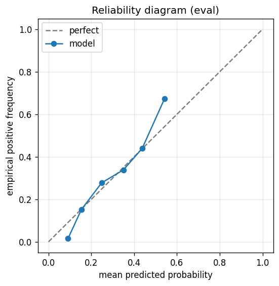

# gbdt experiment — nasdaq100_up_10pct_25d_dd5pct

## Spec

- universe: `nasdaq100`
- direction: `up`
- threshold_pct: `10`
- horizon_days: `25`
- max_drawdown: `0.05`

## Data

- tickers in universe: 100
- tickers used: 92
- tickers excluded: NASDAQ:ABNB, NASDAQ:APP, NASDAQ:ARM, NASDAQ:CEG, NASDAQ:DASH, NASDAQ:GEHC, NASDAQ:GFS, NASDAQ:PLTR
- train rows: 73600 (independent events ≈ 1502.0; overlap-inflation 49.00×)
- val rows: 36800 (independent events ≈ 751.0; overlap-inflation 49.00×)
- eval rows: 18400 (independent events ≈ 375.5; overlap-inflation 49.00×)
- test rows: 6900 (independent events ≈ 140.8; overlap-inflation 49.00×)
- sample uniqueness weighting: `on` (horizon_days=25)
- positive prevalence (train): 0.262
- positive prevalence (eval): 0.249

## Iteration history

| iter | n_features | train Brier | val Brier | gap | rationale | inner_stop |
|---|---|---|---|---|---|---|
| 0 | 279 | 0.1676 | 0.1660 | -0.0016 | iteration 0 — full feature pool, default HPs :: algorithmic fallback: kept 47/27 |  |
| 1 | 47 | 0.1659 | 0.1656 | -0.0002 | iteration 1 from FS+HP callback :: algorithmic fallback: kept 42/47 features |  |
| 2 | 42 | 0.1668 | 0.1657 | -0.0011 | iteration 2 from FS+HP callback :: inner_stop=plateau | plateau |

## Final checkpoint

- best iteration: 1
- iterations run: 3
- inner stop signal: `plateau`

## Calibration

- method requested: `conditional_isotonic`
- decision: `native`
- Spiegelhalter Z: 1.588
- Spiegelhalter p: 0.1122

## Headline metrics

| segment | Brier | base-rate Brier | improvement | LogLoss | AUC |
|---|---|---|---|---|---|
| eval | 0.1770 | 0.1872 | +0.0102 | 0.5333 | 0.6549 |
| test | 0.2037 | 0.1984 | -0.0053 | 0.6034 | 0.5111 |

## Per-experiment verdict (algorithmic readout)

Calibration: native-passable (|z|=1.59<2). Brier vs base-rate: +0.0102 (model beats baseline).

> NOTE: this verdict is generated from the metrics by a simple rule (see ``report._algorithmic_verdict``); it is NOT an automated pass/fail gate. The user reads the artifact and decides whether the cell ships.
