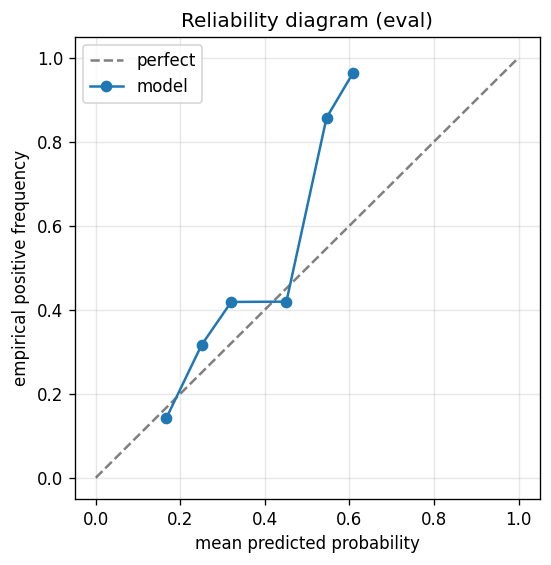

# gbdt experiment — nasdaq100_up_10pct_25d_dd5pct_aligned

## Warnings

- **hp_search**: HP search disabled in sweep mode (max_iter=3 < threshold=5); the FS+HP loop ran feature-selection only — see issue #32.

## Spec

- universe: `nasdaq100`
- direction: `up`
- threshold_pct: `10`
- horizon_days: `25`
- max_drawdown: `0.05`
- fs_hp_loop callback_mode: `default`

## Data

- tickers in universe: 100
- tickers used: 92
- tickers excluded: NASDAQ:ABNB, NASDAQ:APP, NASDAQ:ARM, NASDAQ:CEG, NASDAQ:DASH, NASDAQ:GEHC, NASDAQ:GFS, NASDAQ:PLTR
- train rows: 73600 (independent events ≈ 1502.0; overlap-inflation 49.00×)
- val rows: 36800 (independent events ≈ 751.0; overlap-inflation 49.00×)
- eval rows: 18400 (independent events ≈ 375.5; overlap-inflation 49.00×)
- test rows: 9113 (independent events ≈ 186.0; overlap-inflation 49.00×)
- sample uniqueness weighting: `on` (horizon_days=25)
- positive prevalence (train): 0.279
- positive prevalence (eval): 0.260

## Segment windows

- split mode: `date_aligned`
- train_start anchor: `2019-12-02`
- train: `2019-12-02` → `2023-02-03`
- val: `2023-02-06` → `2024-09-09`
- eval: `2024-09-10` → `2025-06-27`
- test: `2025-06-30` → `2025-11-18`

## Iteration history

| iter | n_features | train Brier | val Brier | gap | rationale | inner_stop |
|---|---|---|---|---|---|---|
| 0 | 279 | 0.1604 | 0.1658 | 0.0054 | iteration 0 — full feature pool, default HPs :: algorithmic fallback: kept 69/27 |  |
| 1 | 69 | 0.1722 | 0.1674 | -0.0048 | iteration 1 from FS+HP callback :: algorithmic fallback: kept 37/69 features |  |
| 2 | 37 | 0.1715 | 0.1672 | -0.0043 | iteration 2 from FS+HP callback :: inner_stop=cap | cap |

## Final checkpoint

- best iteration: 2
- iterations run: 3
- inner stop signal: `cap`
- fs_hp_loop callback_mode: `default`

## Calibration

- method requested: `conditional_isotonic`
- decision: `native`
- Spiegelhalter Z: -0.241
- Spiegelhalter p: 0.8095

## Headline metrics

| segment | Brier | base-rate Brier | improvement | LogLoss | AUC |
|---|---|---|---|---|---|
| eval | 0.1790 | 0.1922 | +0.0131 | 0.5380 | 0.6921 |
| test | 0.1674 | 0.1744 | +0.0070 | 0.5131 | 0.6489 |

## Top-K precision (per-day + global)

Per-day: pick the top-K rows by ``p_calibrated`` each date, pool across days. ``P@k = sum_d(positives_in_top_k(d)) / sum_d(min(R(d), k))`` where ``R(d)`` is the count of positives on day ``d`` — the ``min(R(d), k)`` denominator is the achievable-positives count (mandatory; see ``.claude/memories/project-r-precision-methodology.md``). ``n_denom = sum_d(min(R(d), k))``; ``n_days_R<k`` = days with fewer than ``k`` positives. Global: top-K by score across the whole segment, denominator ``min(k, total_positives)``. ``base_rate`` = unweighted segment positive prevalence (compare P@k to base_rate directly; lift omitted from the table by project reporting convention).

### eval — n_rows=18400, base_rate=0.2596

Per-day:

| k | P@k | base_rate | n_picks | n_positives | n_denom | days_R<k / days_full_k / days_total |
|---|---|---|---|---|---|---|
| 1 | 0.5377 | 0.2596 | 200 | 107 | 199 | 1 / 200 / 200 |
| 5 | 0.4802 | 0.2596 | 1000 | 460 | 958 | 15 / 200 / 200 |
| 10 | 0.4915 | 0.2596 | 2000 | 891 | 1813 | 39 / 200 / 200 |

Global (top-K across entire segment):

| k | P@k | base_rate | n_picks | n_positives | n_denom |
|---|---|---|---|---|---|
| 1 | 1.0000 | 0.2596 | 1 | 1 | 1 |
| 5 | 1.0000 | 0.2596 | 5 | 5 | 5 |
| 10 | 1.0000 | 0.2596 | 10 | 10 | 10 |

### test — n_rows=9113, base_rate=0.2251

Per-day:

| k | P@k | base_rate | n_picks | n_positives | n_denom | days_R<k / days_full_k / days_total |
|---|---|---|---|---|---|---|
| 1 | 0.1800 | 0.2251 | 100 | 18 | 100 | 0 / 100 / 100 |
| 5 | 0.3700 | 0.2251 | 500 | 185 | 500 | 0 / 100 / 100 |
| 10 | 0.3839 | 0.2251 | 1000 | 382 | 995 | 3 / 100 / 100 |

Global (top-K across entire segment):

| k | P@k | base_rate | n_picks | n_positives | n_denom |
|---|---|---|---|---|---|
| 1 | 0.0000 | 0.2251 | 1 | 0 | 1 |
| 5 | 0.0000 | 0.2251 | 5 | 0 | 5 |
| 10 | 0.0000 | 0.2251 | 10 | 0 | 10 |

## Per-ticker hit-rate when picked (k=5)

Aggregates per-day top-5 picks by ticker. Top 10 most-picked + bottom 5 most-anti-predictive (when picked at least once) shown; the full table is in ``metrics.json::segment_diagnostics.<seg>.per_ticker_hit_rate.rows``.

### eval

Top-10 by n_picks:

| ticker | n_picks | n_positives | hit_rate |
|---|---|---|---|
| NASDAQ:MSTR | 193 | 99 | 0.5130 |
| NASDAQ:ON | 103 | 15 | 0.1456 |
| NASDAQ:ZS | 91 | 45 | 0.4945 |
| NASDAQ:AVGO | 81 | 44 | 0.5432 |
| NASDAQ:TEAM | 69 | 39 | 0.5652 |
| NASDAQ:AMD | 60 | 14 | 0.2333 |
| NASDAQ:MDB | 59 | 29 | 0.4915 |
| NASDAQ:CRWD | 49 | 28 | 0.5714 |
| NASDAQ:KLAC | 46 | 2 | 0.0435 |
| NASDAQ:NVDA | 34 | 28 | 0.8235 |

Bottom-5 by hit_rate (n_picks ≥ 5):

| ticker | n_picks | n_positives | hit_rate |
|---|---|---|---|
| NASDAQ:TSLA | 30 | 0 | 0.0000 |
| NASDAQ:KLAC | 46 | 2 | 0.0435 |
| NASDAQ:ON | 103 | 15 | 0.1456 |
| NASDAQ:AMD | 60 | 14 | 0.2333 |
| NASDAQ:AMAT | 18 | 6 | 0.3333 |

### test

Top-10 by n_picks:

| ticker | n_picks | n_positives | hit_rate |
|---|---|---|---|
| NASDAQ:MSTR | 80 | 9 | 0.1125 |
| NASDAQ:AVGO | 54 | 34 | 0.6296 |
| NASDAQ:TSLA | 50 | 15 | 0.3000 |
| NASDAQ:MRVL | 47 | 9 | 0.1915 |
| NASDAQ:AMD | 42 | 28 | 0.6667 |
| NASDAQ:MDB | 41 | 23 | 0.5610 |
| NASDAQ:INTC | 29 | 14 | 0.4828 |
| NASDAQ:WBD | 25 | 17 | 0.6800 |
| NASDAQ:MU | 21 | 13 | 0.6190 |
| NASDAQ:CRWD | 20 | 1 | 0.0500 |

Bottom-5 by hit_rate (n_picks ≥ 5):

| ticker | n_picks | n_positives | hit_rate |
|---|---|---|---|
| NASDAQ:DXCM | 18 | 0 | 0.0000 |
| NASDAQ:AMAT | 15 | 0 | 0.0000 |
| NASDAQ:CRWD | 20 | 1 | 0.0500 |
| NASDAQ:MCHP | 11 | 1 | 0.0909 |
| NASDAQ:MSTR | 80 | 9 | 0.1125 |

## Per-quarter P@5 stability

P@5 grouped by calendar quarter. ``base_rate`` is the segment-wide positive prevalence (constant across rows); regime-dependent collapse shows as a quarter where ``P@5`` falls toward ``base_rate`` or below. ``lift`` omitted from the table by project reporting convention.

### eval

| quarter | n_picks | n_positives | P@5 | base_rate |
|---|---|---|---|---|
| 2024Q3 | 75 | 40 | 0.5333 | 0.2596 |
| 2024Q4 | 320 | 141 | 0.4406 | 0.2596 |
| 2025Q1 | 300 | 87 | 0.2900 | 0.2596 |
| 2025Q2 | 305 | 192 | 0.6295 | 0.2596 |

### test

| quarter | n_picks | n_positives | P@5 | base_rate |
|---|---|---|---|---|
| 2025Q2 | 5 | 1 | 0.2000 | 0.2251 |
| 2025Q3 | 320 | 129 | 0.4031 | 0.2251 |
| 2025Q4 | 175 | 55 | 0.3143 | 0.2251 |

## Prediction-range diagnostics

Distribution of ``p_calibrated`` per segment. ``flag_low_separation = true`` when ``std < low_separation_threshold`` — a sign the model's predictions cluster so tightly that ranking is noise.

| segment | n_rows | min | max | mean | std | flag_low_separation |
|---|---|---|---|---|---|---|
| eval | 18400 | 0.1005 | 0.6132 | 0.2273 | 0.0719 | `False` |
| test | 9113 | 0.1095 | 0.4268 | 0.2391 | 0.0636 | `False` |

## Per-experiment verdict (algorithmic readout)

Calibration: native-passable (|z|=0.24<2). Brier vs base-rate: +0.0131 (model beats baseline).

> NOTE: this verdict is generated from the metrics by a simple rule (see ``report._algorithmic_verdict``); it is NOT an automated pass/fail gate. The user reads the artifact and decides whether the cell ships.
