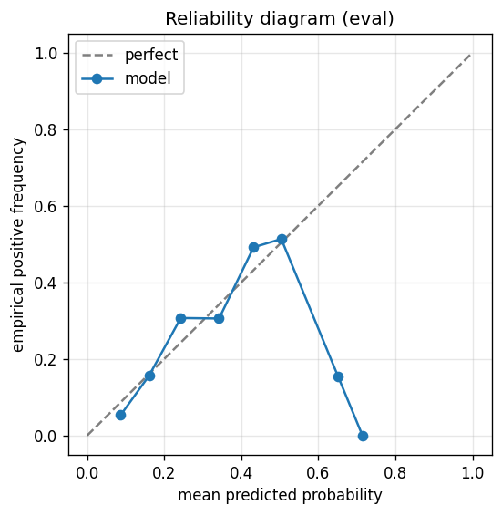

# gbdt experiment — nasdaq100_up_10pct_25d_dd5pct_b_acceptance

## Spec

- universe: `nasdaq100`
- direction: `up`
- threshold_pct: `10`
- horizon_days: `25`
- max_drawdown: `0.05`
- fs_hp_loop callback_mode: `default`

## Data

- tickers in universe: 100
- tickers used: 92
- tickers excluded: NASDAQ:ABNB, NASDAQ:APP, NASDAQ:ARM, NASDAQ:CEG, NASDAQ:DASH, NASDAQ:GEHC, NASDAQ:GFS, NASDAQ:PLTR
- train rows: 73600 (independent events ≈ 1502.0; overlap-inflation 49.00×)
- val rows: 36800 (independent events ≈ 751.0; overlap-inflation 49.00×)
- eval rows: 18400 (independent events ≈ 375.5; overlap-inflation 49.00×)
- test rows: 6900 (independent events ≈ 140.8; overlap-inflation 49.00×)
- sample uniqueness weighting: `on` (horizon_days=25)
- positive prevalence (train): 0.262
- positive prevalence (eval): 0.249

## Segment windows

- split mode: `trailing`
- train: `2019-11-07` → `2023-08-08`
- val: `2023-01-12` → `2025-03-13`
- eval: `2024-08-16` → `2025-12-29`
- test: `2025-06-05` → `2026-04-17`

## Iteration history

| iter | n_features | train Brier | val Brier | gap | rationale | inner_stop |
|---|---|---|---|---|---|---|
| 0 | 47 | 0.1804 | 0.1693 | -0.0111 | iteration 0 — full feature pool, default HPs :: algorithmic fallback: kept 28/47 |  |
| 1 | 28 | 0.1813 | 0.1738 | -0.0075 | iteration 1 from FS+HP callback :: inner_stop=degradation | degradation |

## Final checkpoint

- best iteration: 1
- iterations run: 2
- inner stop signal: `degradation`
- fs_hp_loop callback_mode: `default`

## Calibration

- method requested: `conditional_isotonic`
- decision: `isotonic`
- Spiegelhalter Z: -25.460
- Spiegelhalter p: 0.0000

## Headline metrics

| segment | Brier | base-rate Brier | improvement | LogLoss | AUC |
|---|---|---|---|---|---|
| eval | 0.1787 | 0.1872 | +0.0085 | 0.5363 | 0.6439 |
| test | 0.2082 | 0.1984 | -0.0098 | 0.6457 | 0.4838 |

## Top-K precision (per-day + global)

Per-day: pick the top-K rows by ``p_calibrated`` each date, pool across days. ``P@k = sum_d(positives_in_top_k(d)) / sum_d(min(R(d), k))`` where ``R(d)`` is the count of positives on day ``d`` — the ``min(R(d), k)`` denominator is the achievable-positives count (mandatory; see ``.claude/memories/project-r-precision-methodology.md``). ``n_denom = sum_d(min(R(d), k))``; ``n_days_R<k`` = days with fewer than ``k`` positives. Global: top-K by score across the whole segment, denominator ``min(k, total_positives)``. ``base_rate`` = unweighted segment positive prevalence (compare P@k to base_rate directly; lift omitted from the table by project reporting convention).

### eval — n_rows=18400, base_rate=0.2494

Per-day:

| k | P@k | base_rate | n_picks | n_positives | n_denom | days_R<k / days_full_k / days_total |
|---|---|---|---|---|---|---|
| 1 | 0.5446 | 0.2494 | 343 | 116 | 213 | 130 / 343 / 343 |
| 5 | 0.4792 | 0.2494 | 1144 | 472 | 985 | 152 / 200 / 343 |
| 10 | 0.4822 | 0.2494 | 2144 | 920 | 1908 | 162 / 200 / 343 |

Global (top-K across entire segment):

| k | P@k | base_rate | n_picks | n_positives | n_denom |
|---|---|---|---|---|---|
| 1 | 0.0000 | 0.2494 | 1 | 0 | 1 |
| 5 | 0.0000 | 0.2494 | 5 | 0 | 5 |
| 10 | 0.2000 | 0.2494 | 10 | 2 | 10 |

### test — n_rows=6900, base_rate=0.2729

Per-day:

| k | P@k | base_rate | n_picks | n_positives | n_denom | days_R<k / days_full_k / days_total |
|---|---|---|---|---|---|---|
| 1 | 0.5579 | 0.2729 | 105 | 53 | 95 | 10 / 105 / 105 |
| 5 | 0.4402 | 0.2729 | 405 | 173 | 393 | 31 / 75 / 105 |
| 10 | 0.3853 | 0.2729 | 780 | 289 | 750 | 36 / 75 / 105 |

Global (top-K across entire segment):

| k | P@k | base_rate | n_picks | n_positives | n_denom |
|---|---|---|---|---|---|
| 1 | 1.0000 | 0.2729 | 1 | 1 | 1 |
| 5 | 0.4000 | 0.2729 | 5 | 2 | 5 |
| 10 | 0.2000 | 0.2729 | 10 | 2 | 10 |

## Per-ticker hit-rate when picked (k=5)

Aggregates per-day top-5 picks by ticker. Top 10 most-picked + bottom 5 most-anti-predictive (when picked at least once) shown; the full table is in ``metrics.json::segment_diagnostics.<seg>.per_ticker_hit_rate.rows``.

### eval

Top-10 by n_picks:

| ticker | n_picks | n_positives | hit_rate |
|---|---|---|---|
| NASDAQ:INTC | 200 | 105 | 0.5250 |
| NASDAQ:ANSS | 143 | 14 | 0.0979 |
| NASDAQ:MSTR | 140 | 40 | 0.2857 |
| NASDAQ:AMD | 116 | 43 | 0.3707 |
| NASDAQ:AVGO | 111 | 68 | 0.6126 |
| NASDAQ:CRWD | 53 | 22 | 0.4151 |
| NASDAQ:MDB | 48 | 35 | 0.7292 |
| NASDAQ:TSLA | 42 | 14 | 0.3333 |
| NASDAQ:MRVL | 41 | 20 | 0.4878 |
| NASDAQ:DDOG | 37 | 13 | 0.3514 |

Bottom-5 by hit_rate (n_picks ≥ 5):

| ticker | n_picks | n_positives | hit_rate |
|---|---|---|---|
| NASDAQ:DXCM | 16 | 1 | 0.0625 |
| NASDAQ:LULU | 24 | 2 | 0.0833 |
| NASDAQ:ANSS | 143 | 14 | 0.0979 |
| NASDAQ:PDD | 13 | 3 | 0.2308 |
| NASDAQ:WBD | 8 | 2 | 0.2500 |

### test

Top-10 by n_picks:

| ticker | n_picks | n_positives | hit_rate |
|---|---|---|---|
| NASDAQ:INTC | 75 | 33 | 0.4400 |
| NASDAQ:AMD | 53 | 28 | 0.5283 |
| NASDAQ:LRCX | 46 | 19 | 0.4130 |
| NASDAQ:AMAT | 37 | 17 | 0.4595 |
| NASDAQ:MU | 35 | 14 | 0.4000 |
| NASDAQ:ANSS | 29 | 19 | 0.6552 |
| NASDAQ:MDB | 29 | 9 | 0.3103 |
| NASDAQ:AVGO | 22 | 0 | 0.0000 |
| NASDAQ:TSLA | 16 | 1 | 0.0625 |
| NASDAQ:DDOG | 12 | 7 | 0.5833 |

Bottom-5 by hit_rate (n_picks ≥ 5):

| ticker | n_picks | n_positives | hit_rate |
|---|---|---|---|
| NASDAQ:AVGO | 22 | 0 | 0.0000 |
| NASDAQ:TSLA | 16 | 1 | 0.0625 |
| NASDAQ:CRWD | 9 | 1 | 0.1111 |
| NASDAQ:MDB | 29 | 9 | 0.3103 |
| NASDAQ:MU | 35 | 14 | 0.4000 |

## Per-quarter P@5 stability

P@5 grouped by calendar quarter. ``base_rate`` is the segment-wide positive prevalence (constant across rows); regime-dependent collapse shows as a quarter where ``P@5`` falls toward ``base_rate`` or below. ``lift`` omitted from the table by project reporting convention.

### eval

| quarter | n_picks | n_positives | P@5 | base_rate |
|---|---|---|---|---|
| 2024Q3 | 31 | 0 | 0.0000 | 0.2494 |
| 2024Q4 | 64 | 14 | 0.2188 | 0.2494 |
| 2025Q1 | 109 | 8 | 0.0734 | 0.2494 |
| 2025Q2 | 310 | 184 | 0.5935 | 0.2494 |
| 2025Q3 | 320 | 136 | 0.4250 | 0.2494 |
| 2025Q4 | 310 | 130 | 0.4194 | 0.2494 |

### test

| quarter | n_picks | n_positives | P@5 | base_rate |
|---|---|---|---|---|
| 2025Q2 | 17 | 17 | 1.0000 | 0.2729 |
| 2025Q3 | 12 | 2 | 0.1667 | 0.2729 |
| 2025Q4 | 11 | 4 | 0.3636 | 0.2729 |
| 2026Q1 | 305 | 94 | 0.3082 | 0.2729 |
| 2026Q2 | 60 | 56 | 0.9333 | 0.2729 |

## Prediction-range diagnostics

Distribution of ``p_calibrated`` per segment. ``flag_low_separation = true`` when ``std < low_separation_threshold`` — a sign the model's predictions cluster so tightly that ranking is noise.

| segment | n_rows | min | max | mean | std | flag_low_separation |
|---|---|---|---|---|---|---|
| eval | 18400 | 0.0000 | 0.7143 | 0.2430 | 0.0947 | `False` |
| test | 6900 | 0.0820 | 1.0000 | 0.2638 | 0.0940 | `False` |

## Per-experiment verdict (algorithmic readout)

Calibration: required isotonic (|z|=25.46); shipped as `isotonic`. Brier vs base-rate: +0.0085 (model beats baseline).

> NOTE: this verdict is generated from the metrics by a simple rule (see ``report._algorithmic_verdict``); it is NOT an automated pass/fail gate. The user reads the artifact and decides whether the cell ships.
