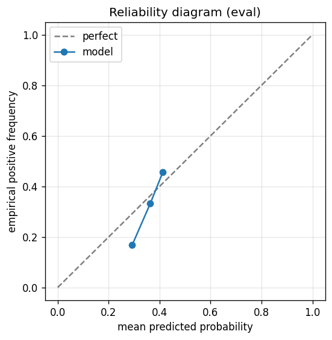

# gbdt experiment — nasdaq100_up_10pct_50d_dd5pct_agentloop_v1.3_revalidation_regen

## Spec

- universe: `nasdaq100`
- direction: `up`
- threshold_pct: `10`
- horizon_days: `50`
- max_drawdown: `0.05`
- fs_hp_loop callback_mode: `agent_file_protocol`

## Data

- tickers in universe: 100
- tickers used: 92
- tickers excluded: NASDAQ:ABNB, NASDAQ:APP, NASDAQ:ARM, NASDAQ:CEG, NASDAQ:DASH, NASDAQ:GEHC, NASDAQ:GFS, NASDAQ:PLTR
- train rows: 73600 (independent events ≈ 743.4; overlap-inflation 99.00×)
- val rows: 36800 (independent events ≈ 371.7; overlap-inflation 99.00×)
- eval rows: 18400 (independent events ≈ 185.9; overlap-inflation 99.00×)
- test rows: 4600 (independent events ≈ 46.5; overlap-inflation 99.00×)
- sample uniqueness weighting: `on` (horizon_days=50)
- positive prevalence (train): 0.387
- positive prevalence (eval): 0.339

## Segment windows

- split mode: `trailing`
- train: `2019-08-29` → `2023-05-24`
- val: `2022-11-01` → `2024-12-26`
- eval: `2024-06-06` → `2025-10-15`
- test: `2025-03-26` → `2025-12-26`

## Iteration history

| iter | n_features | train Brier | val Brier | gap | rationale | inner_stop |
|---|---|---|---|---|---|---|

## Final checkpoint

- best iteration: 3
- iterations run: 12
- inner stop signal: `agent_should_stop`
- fs_hp_loop callback_mode: `agent_file_protocol`
- tie-break path: `anti_auc_eval_rp1` — Anti-AUC fallback: tie set picked by eval R-Precision@1 (V1.3 Option A)

## Calibration

- method requested: `conditional_isotonic`
- decision: `native`
- Spiegelhalter Z: -0.730
- Spiegelhalter p: 0.4654

## Headline metrics

| segment | Brier | base-rate Brier | improvement | LogLoss | AUC |
|---|---|---|---|---|---|
| eval | 0.2202 | 0.2242 | +0.0040 | 0.6317 | 0.5962 |
| test | 0.2238 | 0.2238 | -0.0001 | 0.6398 | 0.5222 |

## Top-K precision (per-day + global)

Per-day: pick the top-K rows by ``p_calibrated`` each date, pool across days. ``P@k = sum_d(positives_in_top_k(d)) / sum_d(min(R(d), k))`` where ``R(d)`` is the count of positives on day ``d`` — the ``min(R(d), k)`` denominator is the achievable-positives count (mandatory; see ``.claude/memories/project-r-precision-methodology.md``). ``n_denom = sum_d(min(R(d), k))``; ``n_days_R<k`` = days with fewer than ``k`` positives. Global: top-K by score across the whole segment, denominator ``min(k, total_positives)``. ``base_rate`` = unweighted segment positive prevalence (compare P@k to base_rate directly; lift omitted from the table by project reporting convention).

### eval — n_rows=18400, base_rate=0.3394

Per-day:

| k | P@k | base_rate | n_picks | n_positives | n_denom | days_R<k / days_full_k / days_total |
|---|---|---|---|---|---|---|
| 1 | 0.6667 | 0.3394 | 341 | 166 | 249 | 92 / 341 / 341 |
| 5 | 0.4859 | 0.3394 | 1142 | 501 | 1031 | 150 / 200 / 341 |
| 10 | 0.4923 | 0.3394 | 2142 | 960 | 1950 | 162 / 200 / 341 |

Global (top-K across entire segment):

| k | P@k | base_rate | n_picks | n_positives | n_denom |
|---|---|---|---|---|---|
| 1 | 1.0000 | 0.3394 | 1 | 1 | 1 |
| 5 | 1.0000 | 0.3394 | 5 | 5 | 5 |
| 10 | 0.9000 | 0.3394 | 10 | 9 | 10 |

### test — n_rows=4600, base_rate=0.3380

Per-day:

| k | P@k | base_rate | n_picks | n_positives | n_denom | days_R<k / days_full_k / days_total |
|---|---|---|---|---|---|---|
| 1 | 0.8000 | 0.3380 | 101 | 72 | 90 | 11 / 101 / 101 |
| 5 | 0.5586 | 0.3380 | 301 | 162 | 290 | 51 / 50 / 101 |
| 10 | 0.3630 | 0.3380 | 551 | 196 | 540 | 51 / 50 / 101 |

Global (top-K across entire segment):

| k | P@k | base_rate | n_picks | n_positives | n_denom |
|---|---|---|---|---|---|
| 1 | 1.0000 | 0.3380 | 1 | 1 | 1 |
| 5 | 0.6000 | 0.3380 | 5 | 3 | 5 |
| 10 | 0.4000 | 0.3380 | 10 | 4 | 10 |

## R-Precision@K (canonical macro)

Per-day fixed K, **macro-averaged** across days with ``R_q > 0``: ``R-Precision@K = (1/Q) · Σ r_q / min(K, R_q)`` where ``R_q`` = positives that day, ``r_q`` = positives caught in top-K, sorted by ``(p_calibrated desc, ticker asc)`` stable mergesort. This is the cross-cell headline (matches ``results/gbdt/data/r_precision_at_k.csv``) — distinct from the Top-K block's ``per_day.p_at_k`` above, which is micro-aggregated (both forms are mathematically valid; macro is canonical for cross-cell comparison). See ``.claude/memories/project-r-precision-methodology.md``.

### eval — n_rows=18400, Q_days=249, base_rate=0.3394

| k | R-Precision@k | base_rate | Q_days |
|---|---|---|---|
| 1 | 0.6667 | 0.3394 | 249 |
| 3 | 0.5676 | 0.3394 | 249 |
| 5 | 0.5598 | 0.3394 | 249 |
| 10 | 0.5634 | 0.3394 | 249 |
| 20 | 0.5642 | 0.3394 | 249 |

### test — n_rows=4600, Q_days=90, base_rate=0.3380

| k | R-Precision@k | base_rate | Q_days |
|---|---|---|---|
| 1 | 0.8000 | 0.3380 | 90 |
| 3 | 0.7556 | 0.3380 | 90 |
| 5 | 0.7156 | 0.3380 | 90 |
| 10 | 0.6178 | 0.3380 | 90 |
| 20 | 0.6634 | 0.3380 | 90 |

## Per-ticker hit-rate when picked (k=5)

Aggregates per-day top-5 picks by ticker. Top 10 most-picked + bottom 5 most-anti-predictive (when picked at least once) shown; the full table is in ``metrics.json::segment_diagnostics.<seg>.per_ticker_hit_rate.rows``.

### eval

Top-10 by n_picks:

| ticker | n_picks | n_positives | hit_rate |
|---|---|---|---|
| NASDAQ:AMAT | 190 | 85 | 0.4474 |
| NASDAQ:ADI | 166 | 79 | 0.4759 |
| NASDAQ:ANSS | 141 | 48 | 0.3404 |
| NASDAQ:AAPL | 134 | 94 | 0.7015 |
| NASDAQ:AMD | 134 | 68 | 0.5075 |
| NASDAQ:ADBE | 98 | 20 | 0.2041 |
| NASDAQ:ASML | 91 | 28 | 0.3077 |
| NASDAQ:ADSK | 64 | 44 | 0.6875 |
| NASDAQ:AMZN | 52 | 15 | 0.2885 |
| NASDAQ:AVGO | 47 | 3 | 0.0638 |

Bottom-5 by hit_rate (n_picks ≥ 5):

| ticker | n_picks | n_positives | hit_rate |
|---|---|---|---|
| NASDAQ:AVGO | 47 | 3 | 0.0638 |
| NASDAQ:ADBE | 98 | 20 | 0.2041 |
| NASDAQ:AMZN | 52 | 15 | 0.2885 |
| NASDAQ:ASML | 91 | 28 | 0.3077 |
| NASDAQ:ANSS | 141 | 48 | 0.3404 |

### test

Top-10 by n_picks:

| ticker | n_picks | n_positives | hit_rate |
|---|---|---|---|
| NASDAQ:ADI | 50 | 39 | 0.7800 |
| NASDAQ:AMAT | 50 | 34 | 0.6800 |
| NASDAQ:AMD | 50 | 13 | 0.2600 |
| NASDAQ:ANSS | 50 | 39 | 0.7800 |
| NASDAQ:AMZN | 49 | 17 | 0.3469 |
| NASDAQ:ASML | 29 | 15 | 0.5172 |
| NASDAQ:AAPL | 21 | 4 | 0.1905 |
| NASDAQ:ADBE | 1 | 0 | 0.0000 |
| NASDAQ:AZN | 1 | 1 | 1.0000 |

Bottom-5 by hit_rate (n_picks ≥ 5):

| ticker | n_picks | n_positives | hit_rate |
|---|---|---|---|
| NASDAQ:AAPL | 21 | 4 | 0.1905 |
| NASDAQ:AMD | 50 | 13 | 0.2600 |
| NASDAQ:AMZN | 49 | 17 | 0.3469 |
| NASDAQ:ASML | 29 | 15 | 0.5172 |
| NASDAQ:AMAT | 50 | 34 | 0.6800 |

## Per-quarter P@5 stability

P@5 grouped by calendar quarter. ``base_rate`` is the segment-wide positive prevalence (constant across rows); regime-dependent collapse shows as a quarter where ``P@5`` falls toward ``base_rate`` or below. ``lift`` omitted from the table by project reporting convention.

### eval

| quarter | n_picks | n_positives | P@5 | base_rate |
|---|---|---|---|---|
| 2024Q2 | 16 | 0 | 0.0000 | 0.3394 |
| 2024Q3 | 64 | 26 | 0.4062 | 0.3394 |
| 2024Q4 | 77 | 30 | 0.3896 | 0.3394 |
| 2025Q1 | 300 | 44 | 0.1467 | 0.3394 |
| 2025Q2 | 310 | 177 | 0.5710 | 0.3394 |
| 2025Q3 | 320 | 182 | 0.5687 | 0.3394 |
| 2025Q4 | 55 | 42 | 0.7636 | 0.3394 |

### test

| quarter | n_picks | n_positives | P@5 | base_rate |
|---|---|---|---|---|
| 2025Q1 | 4 | 0 | 0.0000 | 0.3380 |
| 2025Q2 | 46 | 39 | 0.8478 | 0.3380 |
| 2025Q4 | 251 | 123 | 0.4900 | 0.3380 |

## Prediction-range diagnostics

Distribution of ``p_calibrated`` per segment. ``flag_low_separation = true`` when ``std < low_separation_threshold`` — a sign the model's predictions cluster so tightly that ranking is noise.

| segment | n_rows | min | max | mean | std | flag_low_separation |
|---|---|---|---|---|---|---|
| eval | 18400 | 0.2875 | 0.4242 | 0.3656 | 0.0383 | `True` |
| test | 4600 | 0.2875 | 0.3852 | 0.3614 | 0.0321 | `True` |

## Per-experiment verdict (algorithmic readout)

Calibration: native-passable (|z|=0.73<2). Brier vs base-rate: +0.0040 (model beats baseline).

> NOTE: this verdict is generated from the metrics by a simple rule (see ``report._algorithmic_verdict``); it is NOT an automated pass/fail gate. The user reads the artifact and decides whether the cell ships.
