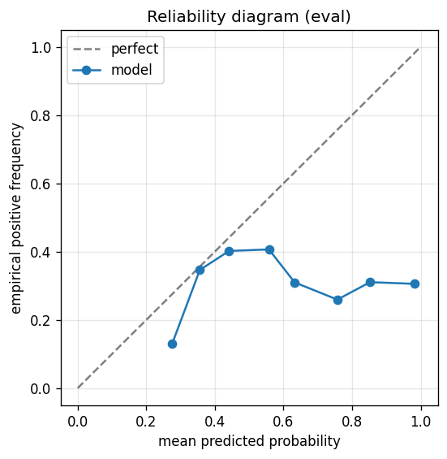

# gbdt experiment — nasdaq100_up_10pct_50d_dd5pct_b_acceptance

## Spec

- universe: `nasdaq100`
- direction: `up`
- threshold_pct: `10`
- horizon_days: `50`
- max_drawdown: `0.05`
- fs_hp_loop callback_mode: `default`

## Data

- tickers in universe: 100
- tickers used: 92
- tickers excluded: NASDAQ:ABNB, NASDAQ:APP, NASDAQ:ARM, NASDAQ:CEG, NASDAQ:DASH, NASDAQ:GEHC, NASDAQ:GFS, NASDAQ:PLTR
- train rows: 73600 (independent events ≈ 743.4; overlap-inflation 99.00×)
- val rows: 36800 (independent events ≈ 371.7; overlap-inflation 99.00×)
- eval rows: 18400 (independent events ≈ 185.9; overlap-inflation 99.00×)
- test rows: 4600 (independent events ≈ 46.5; overlap-inflation 99.00×)
- sample uniqueness weighting: `on` (horizon_days=50)
- positive prevalence (train): 0.366
- positive prevalence (eval): 0.354

## Segment windows

- split mode: `trailing`
- train: `2019-11-07` → `2023-08-08`
- val: `2023-01-12` → `2025-03-13`
- eval: `2024-08-16` → `2025-12-29`
- test: `2025-06-05` → `2026-03-12`

## Iteration history

| iter | n_features | train Brier | val Brier | gap | rationale | inner_stop |
|---|---|---|---|---|---|---|
| 0 | 190 | 0.2402 | 0.2407 | 0.0004 | iteration 0 — full feature pool, default HPs :: algorithmic fallback: kept 34/19 |  |
| 1 | 34 | 0.2402 | 0.2409 | 0.0007 | iteration 1 from FS+HP callback :: algorithmic fallback: kept 27/34 features |  |
| 2 | 27 | 0.2403 | 0.2401 | -0.0002 | iteration 2 from FS+HP callback :: algorithmic fallback: kept 26/27 features |  |
| 3 | 26 | 0.2405 | 0.2417 | 0.0012 | iteration 3 from FS+HP callback :: algorithmic fallback: kept 24/26 features |  |
| 4 | 24 | 0.2400 | 0.2405 | 0.0005 | iteration 4 from FS+HP callback :: algorithmic fallback: kept 23/24 features |  |
| 5 | 23 | 0.2405 | 0.2408 | 0.0003 | iteration 5 from FS+HP callback :: algorithmic fallback: kept 22/23 features |  |
| 6 | 22 | 0.2403 | 0.2407 | 0.0004 | iteration 6 from FS+HP callback :: algorithmic fallback: kept 22/22 features |  |
| 7 | 22 | 0.2403 | 0.2407 | 0.0004 | iteration 7 from FS+HP callback :: inner_stop=cap | cap |

## Final checkpoint

- best iteration: 2
- iterations run: 8
- inner stop signal: `cap`
- fs_hp_loop callback_mode: `default`

## Calibration

- method requested: `conditional_isotonic`
- decision: `isotonic`
- Spiegelhalter Z: -25.554
- Spiegelhalter p: 0.0000

## Headline metrics

| segment | Brier | base-rate Brier | improvement | LogLoss | AUC |
|---|---|---|---|---|---|
| eval | 0.2345 | 0.2286 | -0.0059 | 0.7460 | 0.5693 |
| test | 0.2065 | 0.1949 | -0.0116 | 0.6048 | 0.4451 |

## Top-K precision (per-day + global)

Per-day: pick the top-K rows by ``p_calibrated`` each date, pool across days. ``P@k = sum_d(positives_in_top_k(d)) / sum_d(min(R(d), k))`` where ``R(d)`` is the count of positives on day ``d`` — the ``min(R(d), k)`` denominator is the achievable-positives count (mandatory; see ``.claude/memories/project-r-precision-methodology.md``). ``n_denom = sum_d(min(R(d), k))``; ``n_days_R<k`` = days with fewer than ``k`` positives. Global: top-K by score across the whole segment, denominator ``min(k, total_positives)``. ``base_rate`` = unweighted segment positive prevalence (compare P@k to base_rate directly; lift omitted from the table by project reporting convention).

### eval — n_rows=18400, base_rate=0.3538

Per-day:

| k | P@k | base_rate | n_picks | n_positives | n_denom | days_R<k / days_full_k / days_total |
|---|---|---|---|---|---|---|
| 1 | 0.6598 | 0.3538 | 343 | 161 | 244 | 99 / 343 / 343 |
| 5 | 0.4801 | 0.3538 | 1144 | 495 | 1031 | 149 / 200 / 343 |
| 10 | 0.4708 | 0.3538 | 2144 | 936 | 1988 | 154 / 200 / 343 |

Global (top-K across entire segment):

| k | P@k | base_rate | n_picks | n_positives | n_denom |
|---|---|---|---|---|---|
| 1 | 1.0000 | 0.3538 | 1 | 1 | 1 |
| 5 | 1.0000 | 0.3538 | 5 | 5 | 5 |
| 10 | 1.0000 | 0.3538 | 10 | 10 | 10 |

### test — n_rows=4600, base_rate=0.2652

Per-day:

| k | P@k | base_rate | n_picks | n_positives | n_denom | days_R<k / days_full_k / days_total |
|---|---|---|---|---|---|---|
| 1 | 0.4571 | 0.2652 | 80 | 32 | 70 | 10 / 80 / 80 |
| 5 | 0.4015 | 0.2652 | 280 | 108 | 269 | 31 / 50 / 80 |
| 10 | 0.3536 | 0.2652 | 530 | 180 | 509 | 33 / 50 / 80 |

Global (top-K across entire segment):

| k | P@k | base_rate | n_picks | n_positives | n_denom |
|---|---|---|---|---|---|
| 1 | 0.0000 | 0.2652 | 1 | 0 | 1 |
| 5 | 0.0000 | 0.2652 | 5 | 0 | 5 |
| 10 | 0.0000 | 0.2652 | 10 | 0 | 10 |

## Per-ticker hit-rate when picked (k=5)

Aggregates per-day top-5 picks by ticker. Top 10 most-picked + bottom 5 most-anti-predictive (when picked at least once) shown; the full table is in ``metrics.json::segment_diagnostics.<seg>.per_ticker_hit_rate.rows``.

### eval

Top-10 by n_picks:

| ticker | n_picks | n_positives | hit_rate |
|---|---|---|---|
| NASDAQ:ANSS | 143 | 44 | 0.3077 |
| NASDAQ:AMAT | 124 | 86 | 0.6935 |
| NASDAQ:ADI | 119 | 76 | 0.6387 |
| NASDAQ:AMD | 116 | 58 | 0.5000 |
| NASDAQ:AVGO | 109 | 75 | 0.6881 |
| NASDAQ:ADBE | 86 | 20 | 0.2326 |
| NASDAQ:AAPL | 68 | 31 | 0.4559 |
| NASDAQ:ADSK | 51 | 21 | 0.4118 |
| NASDAQ:MSTR | 45 | 7 | 0.1556 |
| NASDAQ:BKR | 36 | 15 | 0.4167 |

Bottom-5 by hit_rate (n_picks ≥ 5):

| ticker | n_picks | n_positives | hit_rate |
|---|---|---|---|
| NASDAQ:CDW | 18 | 0 | 0.0000 |
| NASDAQ:PDD | 10 | 0 | 0.0000 |
| NASDAQ:INTC | 7 | 0 | 0.0000 |
| NASDAQ:MELI | 5 | 0 | 0.0000 |
| NASDAQ:CDNS | 31 | 1 | 0.0323 |

### test

Top-10 by n_picks:

| ticker | n_picks | n_positives | hit_rate |
|---|---|---|---|
| NASDAQ:ADI | 50 | 32 | 0.6400 |
| NASDAQ:AMAT | 50 | 22 | 0.4400 |
| NASDAQ:ADBE | 45 | 4 | 0.0889 |
| NASDAQ:AMD | 43 | 18 | 0.4186 |
| NASDAQ:ADSK | 36 | 9 | 0.2500 |
| NASDAQ:ANSS | 29 | 19 | 0.6552 |
| NASDAQ:AAPL | 16 | 3 | 0.1875 |
| NASDAQ:AMZN | 5 | 0 | 0.0000 |
| NASDAQ:ASML | 5 | 0 | 0.0000 |
| NASDAQ:AZN | 1 | 1 | 1.0000 |

Bottom-5 by hit_rate (n_picks ≥ 5):

| ticker | n_picks | n_positives | hit_rate |
|---|---|---|---|
| NASDAQ:AMZN | 5 | 0 | 0.0000 |
| NASDAQ:ASML | 5 | 0 | 0.0000 |
| NASDAQ:ADBE | 45 | 4 | 0.0889 |
| NASDAQ:AAPL | 16 | 3 | 0.1875 |
| NASDAQ:ADSK | 36 | 9 | 0.2500 |

## Per-quarter P@5 stability

P@5 grouped by calendar quarter. ``base_rate`` is the segment-wide positive prevalence (constant across rows); regime-dependent collapse shows as a quarter where ``P@5`` falls toward ``base_rate`` or below. ``lift`` omitted from the table by project reporting convention.

### eval

| quarter | n_picks | n_positives | P@5 | base_rate |
|---|---|---|---|---|
| 2024Q3 | 31 | 22 | 0.7097 | 0.3538 |
| 2024Q4 | 64 | 22 | 0.3438 | 0.3538 |
| 2025Q1 | 109 | 2 | 0.0183 | 0.3538 |
| 2025Q2 | 310 | 174 | 0.5613 | 0.3538 |
| 2025Q3 | 320 | 140 | 0.4375 | 0.3538 |
| 2025Q4 | 310 | 135 | 0.4355 | 0.3538 |

### test

| quarter | n_picks | n_positives | P@5 | base_rate |
|---|---|---|---|---|
| 2025Q2 | 17 | 17 | 1.0000 | 0.2652 |
| 2025Q3 | 12 | 2 | 0.1667 | 0.2652 |
| 2025Q4 | 11 | 5 | 0.4545 | 0.2652 |
| 2026Q1 | 240 | 84 | 0.3500 | 0.2652 |

## Prediction-range diagnostics

Distribution of ``p_calibrated`` per segment. ``flag_low_separation = true`` when ``std < low_separation_threshold`` — a sign the model's predictions cluster so tightly that ranking is noise.

| segment | n_rows | min | max | mean | std | flag_low_separation |
|---|---|---|---|---|---|---|
| eval | 18400 | 0.2652 | 1.0000 | 0.3895 | 0.0919 | `False` |
| test | 4600 | 0.2652 | 0.3700 | 0.3558 | 0.0223 | `True` |

## Per-experiment verdict (algorithmic readout)

Calibration: required isotonic (|z|=25.55); shipped as `isotonic`. Brier vs base-rate: -0.0059 (worse than baseline).

> NOTE: this verdict is generated from the metrics by a simple rule (see ``report._algorithmic_verdict``); it is NOT an automated pass/fail gate. The user reads the artifact and decides whether the cell ships.
