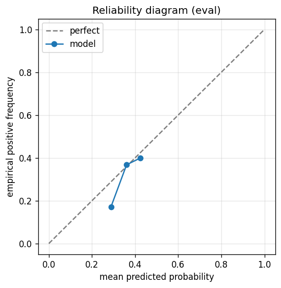

# gbdt experiment — nasdaq100_up_10pct_50d_dd5pct_b_acceptance_agent

## Spec

- universe: `nasdaq100`
- direction: `up`
- threshold_pct: `10`
- horizon_days: `50`
- max_drawdown: `0.05`
- fs_hp_loop callback_mode: `agent_file_protocol`

## Data

- tickers in universe: 100
- tickers used: 92
- tickers excluded: NASDAQ:ABNB, NASDAQ:APP, NASDAQ:ARM, NASDAQ:CEG, NASDAQ:DASH, NASDAQ:GEHC, NASDAQ:GFS, NASDAQ:PLTR
- train rows: 73600 (independent events ≈ 743.4; overlap-inflation 99.00×)
- val rows: 36800 (independent events ≈ 371.7; overlap-inflation 99.00×)
- eval rows: 18400 (independent events ≈ 185.9; overlap-inflation 99.00×)
- test rows: 4600 (independent events ≈ 46.5; overlap-inflation 99.00×)
- sample uniqueness weighting: `on` (horizon_days=50)
- positive prevalence (train): 0.366
- positive prevalence (eval): 0.354

## Segment windows

- split mode: `trailing`
- train: `2019-11-07` → `2023-08-08`
- val: `2023-01-12` → `2025-03-13`
- eval: `2024-08-16` → `2025-12-29`
- test: `2025-06-05` → `2026-03-12`

## Iteration history

| iter | n_features | train Brier | val Brier | gap | rationale | inner_stop |
|---|---|---|---|---|---|---|

## Final checkpoint

- best iteration: 0
- iterations run: 0
- inner stop signal: `agent_should_stop`
- fs_hp_loop callback_mode: `agent_file_protocol`

## Calibration

- method requested: `conditional_isotonic`
- decision: `native`
- Spiegelhalter Z: -1.064
- Spiegelhalter p: 0.2874

## Headline metrics

| segment | Brier | base-rate Brier | improvement | LogLoss | AUC |
|---|---|---|---|---|---|
| eval | 0.2263 | 0.2286 | +0.0023 | 0.6446 | 0.5613 |
| test | 0.2064 | 0.1949 | -0.0115 | 0.6044 | 0.4714 |

## Top-K precision (per-day + global)

Per-day: pick the top-K rows by ``p_calibrated`` each date, pool across days. ``P@k = sum_d(positives_in_top_k(d)) / sum_d(min(R(d), k))`` where ``R(d)`` is the count of positives on day ``d`` — the ``min(R(d), k)`` denominator is the achievable-positives count (mandatory; see ``.claude/memories/project-r-precision-methodology.md``). ``n_denom = sum_d(min(R(d), k))``; ``n_days_R<k`` = days with fewer than ``k`` positives. Global: top-K by score across the whole segment, denominator ``min(k, total_positives)``. ``base_rate`` = unweighted segment positive prevalence (compare P@k to base_rate directly; lift omitted from the table by project reporting convention).

### eval — n_rows=18400, base_rate=0.3538

Per-day:

| k | P@k | base_rate | n_picks | n_positives | n_denom | days_R<k / days_full_k / days_total |
|---|---|---|---|---|---|---|
| 1 | 0.7705 | 0.3538 | 343 | 188 | 244 | 99 / 343 / 343 |
| 5 | 0.5383 | 0.3538 | 1144 | 555 | 1031 | 149 / 200 / 343 |
| 10 | 0.4854 | 0.3538 | 2144 | 965 | 1988 | 154 / 200 / 343 |

Global (top-K across entire segment):

| k | P@k | base_rate | n_picks | n_positives | n_denom |
|---|---|---|---|---|---|
| 1 | 0.0000 | 0.3538 | 1 | 0 | 1 |
| 5 | 0.6000 | 0.3538 | 5 | 3 | 5 |
| 10 | 0.8000 | 0.3538 | 10 | 8 | 10 |

### test — n_rows=4600, base_rate=0.2652

Per-day:

| k | P@k | base_rate | n_picks | n_positives | n_denom | days_R<k / days_full_k / days_total |
|---|---|---|---|---|---|---|
| 1 | 0.8000 | 0.2652 | 80 | 56 | 70 | 10 / 80 / 80 |
| 5 | 0.4647 | 0.2652 | 280 | 125 | 269 | 31 / 50 / 80 |
| 10 | 0.3458 | 0.2652 | 530 | 176 | 509 | 33 / 50 / 80 |

Global (top-K across entire segment):

| k | P@k | base_rate | n_picks | n_positives | n_denom |
|---|---|---|---|---|---|
| 1 | 1.0000 | 0.2652 | 1 | 1 | 1 |
| 5 | 1.0000 | 0.2652 | 5 | 5 | 5 |
| 10 | 1.0000 | 0.2652 | 10 | 10 | 10 |

## Per-ticker hit-rate when picked (k=5)

Aggregates per-day top-5 picks by ticker. Top 10 most-picked + bottom 5 most-anti-predictive (when picked at least once) shown; the full table is in ``metrics.json::segment_diagnostics.<seg>.per_ticker_hit_rate.rows``.

### eval

Top-10 by n_picks:

| ticker | n_picks | n_positives | hit_rate |
|---|---|---|---|
| NASDAQ:AMAT | 168 | 100 | 0.5952 |
| NASDAQ:ANSS | 150 | 51 | 0.3400 |
| NASDAQ:ADI | 133 | 77 | 0.5789 |
| NASDAQ:AMD | 122 | 67 | 0.5492 |
| NASDAQ:ADBE | 102 | 12 | 0.1176 |
| NASDAQ:AAPL | 98 | 69 | 0.7041 |
| NASDAQ:AMZN | 86 | 33 | 0.3837 |
| NASDAQ:ASML | 83 | 45 | 0.5422 |
| NASDAQ:ADSK | 56 | 35 | 0.6250 |
| NASDAQ:AVGO | 41 | 25 | 0.6098 |

Bottom-5 by hit_rate (n_picks ≥ 5):

| ticker | n_picks | n_positives | hit_rate |
|---|---|---|---|
| NASDAQ:TXN | 12 | 0 | 0.0000 |
| NASDAQ:PEP | 9 | 0 | 0.0000 |
| NASDAQ:ADBE | 102 | 12 | 0.1176 |
| NASDAQ:GOOGL | 14 | 2 | 0.1429 |
| NASDAQ:CTAS | 10 | 2 | 0.2000 |

### test

Top-10 by n_picks:

| ticker | n_picks | n_positives | hit_rate |
|---|---|---|---|
| NASDAQ:AMAT | 50 | 22 | 0.4400 |
| NASDAQ:AMD | 50 | 23 | 0.4600 |
| NASDAQ:AMZN | 35 | 14 | 0.4000 |
| NASDAQ:ANSS | 29 | 19 | 0.6552 |
| NASDAQ:ADI | 28 | 28 | 1.0000 |
| NASDAQ:ADSK | 28 | 5 | 0.1786 |
| NASDAQ:AVGO | 28 | 3 | 0.1071 |
| NASDAQ:ASML | 15 | 10 | 0.6667 |
| NASDAQ:CTSH | 6 | 0 | 0.0000 |
| NASDAQ:CDNS | 5 | 0 | 0.0000 |

Bottom-5 by hit_rate (n_picks ≥ 5):

| ticker | n_picks | n_positives | hit_rate |
|---|---|---|---|
| NASDAQ:CTSH | 6 | 0 | 0.0000 |
| NASDAQ:CDNS | 5 | 0 | 0.0000 |
| NASDAQ:AVGO | 28 | 3 | 0.1071 |
| NASDAQ:ADSK | 28 | 5 | 0.1786 |
| NASDAQ:AMZN | 35 | 14 | 0.4000 |

## Per-quarter P@5 stability

P@5 grouped by calendar quarter. ``base_rate`` is the segment-wide positive prevalence (constant across rows); regime-dependent collapse shows as a quarter where ``P@5`` falls toward ``base_rate`` or below. ``lift`` omitted from the table by project reporting convention.

### eval

| quarter | n_picks | n_positives | P@5 | base_rate |
|---|---|---|---|---|
| 2024Q3 | 31 | 22 | 0.7097 | 0.3538 |
| 2024Q4 | 64 | 22 | 0.3438 | 0.3538 |
| 2025Q1 | 109 | 0 | 0.0000 | 0.3538 |
| 2025Q2 | 310 | 169 | 0.5452 | 0.3538 |
| 2025Q3 | 320 | 173 | 0.5406 | 0.3538 |
| 2025Q4 | 310 | 169 | 0.5452 | 0.3538 |

### test

| quarter | n_picks | n_positives | P@5 | base_rate |
|---|---|---|---|---|
| 2025Q2 | 17 | 17 | 1.0000 | 0.2652 |
| 2025Q3 | 12 | 2 | 0.1667 | 0.2652 |
| 2025Q4 | 11 | 7 | 0.6364 | 0.2652 |
| 2026Q1 | 240 | 99 | 0.4125 | 0.2652 |

## Prediction-range diagnostics

Distribution of ``p_calibrated`` per segment. ``flag_low_separation = true`` when ``std < low_separation_threshold`` — a sign the model's predictions cluster so tightly that ranking is noise.

| segment | n_rows | min | max | mean | std | flag_low_separation |
|---|---|---|---|---|---|---|
| eval | 18400 | 0.2735 | 0.4241 | 0.3622 | 0.0394 | `True` |
| test | 4600 | 0.2866 | 0.3844 | 0.3572 | 0.0287 | `True` |

## Per-experiment verdict (algorithmic readout)

Calibration: native-passable (|z|=1.06<2). Brier vs base-rate: +0.0023 (model beats baseline).

> NOTE: this verdict is generated from the metrics by a simple rule (see ``report._algorithmic_verdict``); it is NOT an automated pass/fail gate. The user reads the artifact and decides whether the cell ships.
