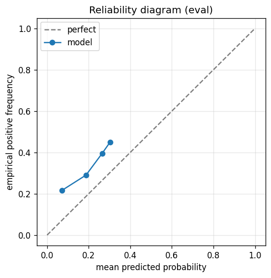

# gbdt experiment — nasdaq100_up_20pct_100d_dd10pct_aligned

## Warnings

- **hp_search**: HP search disabled in sweep mode (max_iter=3 < threshold=5); the FS+HP loop ran feature-selection only — see issue #32.

## Spec

- universe: `nasdaq100`
- direction: `up`
- threshold_pct: `20`
- horizon_days: `100`
- max_drawdown: `0.1`
- fs_hp_loop callback_mode: `default`

## Data

- tickers in universe: 100
- tickers used: 92
- tickers excluded: NASDAQ:ABNB, NASDAQ:APP, NASDAQ:ARM, NASDAQ:CEG, NASDAQ:DASH, NASDAQ:GEHC, NASDAQ:GFS, NASDAQ:PLTR
- train rows: 73309 (independent events ≈ 368.8; overlap-inflation 198.79×)
- val rows: 36800 (independent events ≈ 184.9; overlap-inflation 199.00×)
- eval rows: 18400 (independent events ≈ 92.5; overlap-inflation 199.00×)
- test rows: 18400 (independent events ≈ 92.5; overlap-inflation 199.00×)
- sample uniqueness weighting: `on` (horizon_days=100)
- positive prevalence (train): 0.344
- positive prevalence (eval): 0.319

## Segment windows

- split mode: `date_aligned`
- train_start anchor: `2019-01-01`
- train: `2019-01-02` → `2022-03-04`
- val: `2022-03-07` → `2023-10-06`
- eval: `2023-10-09` → `2024-07-25`
- test: `2024-07-26` → `2025-05-13`

## Iteration history

| iter | n_features | train Brier | val Brier | gap | rationale | inner_stop |
|---|---|---|---|---|---|---|
| 0 | 279 | 0.1856 | 0.2341 | 0.0485 | iteration 0 — full feature pool, default HPs :: algorithmic fallback: kept 40/27 |  |
| 1 | 40 | 0.1813 | 0.2387 | 0.0574 | iteration 1 from FS+HP callback :: inner_stop=degradation | degradation |

## Final checkpoint

- best iteration: 0
- iterations run: 2
- inner stop signal: `degradation`
- fs_hp_loop callback_mode: `default`

## Calibration

- method requested: `conditional_isotonic`
- decision: `isotonic`
- Spiegelhalter Z: 4.775
- Spiegelhalter p: 0.0000

## Headline metrics

| segment | Brier | base-rate Brier | improvement | LogLoss | AUC |
|---|---|---|---|---|---|
| eval | 0.2262 | 0.2173 | -0.0088 | 0.7400 | 0.6271 |
| test | 0.1808 | 0.1928 | +0.0120 | 0.5849 | 0.6660 |

## Top-K precision (per-day + global)

Per-day: pick the top-K rows by ``p_calibrated`` each date, pool across days. ``P@k = sum_d(positives_in_top_k(d)) / sum_d(min(R(d), k))`` where ``R(d)`` is the count of positives on day ``d`` — the ``min(R(d), k)`` denominator is the achievable-positives count (mandatory; see ``.claude/memories/project-r-precision-methodology.md``). ``n_denom = sum_d(min(R(d), k))``; ``n_days_R<k`` = days with fewer than ``k`` positives. Global: top-K by score across the whole segment, denominator ``min(k, total_positives)``. ``base_rate`` = unweighted segment positive prevalence (compare P@k to base_rate directly; lift omitted from the table by project reporting convention).

### eval — n_rows=18400, base_rate=0.3193

Per-day:

| k | P@k | base_rate | n_picks | n_positives | n_denom | days_R<k / days_full_k / days_total |
|---|---|---|---|---|---|---|
| 1 | 0.4300 | 0.3193 | 200 | 86 | 200 | 0 / 200 / 200 |
| 5 | 0.4730 | 0.3193 | 1000 | 473 | 1000 | 0 / 200 / 200 |
| 10 | 0.4465 | 0.3193 | 2000 | 893 | 2000 | 0 / 200 / 200 |

Global (top-K across entire segment):

| k | P@k | base_rate | n_picks | n_positives | n_denom |
|---|---|---|---|---|---|
| 1 | 0.0000 | 0.3193 | 1 | 0 | 1 |
| 5 | 0.0000 | 0.3193 | 5 | 0 | 5 |
| 10 | 0.0000 | 0.3193 | 10 | 0 | 10 |

### test — n_rows=18400, base_rate=0.2608

Per-day:

| k | P@k | base_rate | n_picks | n_positives | n_denom | days_R<k / days_full_k / days_total |
|---|---|---|---|---|---|---|
| 1 | 0.1450 | 0.2608 | 200 | 29 | 200 | 0 / 200 / 200 |
| 5 | 0.2600 | 0.2608 | 1000 | 254 | 977 | 13 / 200 / 200 |
| 10 | 0.4026 | 0.2608 | 2000 | 742 | 1843 | 40 / 200 / 200 |

Global (top-K across entire segment):

| k | P@k | base_rate | n_picks | n_positives | n_denom |
|---|---|---|---|---|---|
| 1 | 1.0000 | 0.2608 | 1 | 1 | 1 |
| 5 | 1.0000 | 0.2608 | 5 | 5 | 5 |
| 10 | 1.0000 | 0.2608 | 10 | 10 | 10 |

## Per-ticker hit-rate when picked (k=5)

Aggregates per-day top-5 picks by ticker. Top 10 most-picked + bottom 5 most-anti-predictive (when picked at least once) shown; the full table is in ``metrics.json::segment_diagnostics.<seg>.per_ticker_hit_rate.rows``.

### eval

Top-10 by n_picks:

| ticker | n_picks | n_positives | hit_rate |
|---|---|---|---|
| NASDAQ:AMD | 195 | 92 | 0.4718 |
| NASDAQ:AMAT | 139 | 93 | 0.6691 |
| NASDAQ:AVGO | 118 | 86 | 0.7288 |
| NASDAQ:ADBE | 89 | 18 | 0.2022 |
| NASDAQ:DDOG | 83 | 0 | 0.0000 |
| NASDAQ:ASML | 79 | 35 | 0.4430 |
| NASDAQ:DXCM | 61 | 8 | 0.1311 |
| NASDAQ:CRWD | 58 | 37 | 0.6379 |
| NASDAQ:AMZN | 52 | 52 | 1.0000 |
| NASDAQ:FTNT | 52 | 4 | 0.0769 |

Bottom-5 by hit_rate (n_picks ≥ 5):

| ticker | n_picks | n_positives | hit_rate |
|---|---|---|---|
| NASDAQ:DDOG | 83 | 0 | 0.0000 |
| NASDAQ:INTC | 10 | 0 | 0.0000 |
| NASDAQ:ADI | 5 | 0 | 0.0000 |
| NASDAQ:FTNT | 52 | 4 | 0.0769 |
| NASDAQ:MDB | 8 | 1 | 0.1250 |

### test

Top-10 by n_picks:

| ticker | n_picks | n_positives | hit_rate |
|---|---|---|---|
| NASDAQ:AMD | 188 | 34 | 0.1809 |
| NASDAQ:AMAT | 172 | 15 | 0.0872 |
| NASDAQ:ADI | 119 | 0 | 0.0000 |
| NASDAQ:ASML | 113 | 10 | 0.0885 |
| NASDAQ:AVGO | 97 | 32 | 0.3299 |
| NASDAQ:ADBE | 60 | 3 | 0.0500 |
| NASDAQ:CDNS | 44 | 22 | 0.5000 |
| NASDAQ:ADSK | 42 | 34 | 0.8095 |
| NASDAQ:CRWD | 28 | 10 | 0.3571 |
| NASDAQ:INTC | 22 | 16 | 0.7273 |

Bottom-5 by hit_rate (n_picks ≥ 5):

| ticker | n_picks | n_positives | hit_rate |
|---|---|---|---|
| NASDAQ:ADI | 119 | 0 | 0.0000 |
| NASDAQ:ADBE | 60 | 3 | 0.0500 |
| NASDAQ:AMAT | 172 | 15 | 0.0872 |
| NASDAQ:ASML | 113 | 10 | 0.0885 |
| NASDAQ:KLAC | 6 | 1 | 0.1667 |

## Per-quarter P@5 stability

P@5 grouped by calendar quarter. ``base_rate`` is the segment-wide positive prevalence (constant across rows); regime-dependent collapse shows as a quarter where ``P@5`` falls toward ``base_rate`` or below. ``lift`` omitted from the table by project reporting convention.

### eval

| quarter | n_picks | n_positives | P@5 | base_rate |
|---|---|---|---|---|
| 2023Q4 | 290 | 233 | 0.8034 | 0.3193 |
| 2024Q1 | 305 | 124 | 0.4066 | 0.3193 |
| 2024Q2 | 315 | 112 | 0.3556 | 0.3193 |
| 2024Q3 | 90 | 4 | 0.0444 | 0.3193 |

### test

| quarter | n_picks | n_positives | P@5 | base_rate |
|---|---|---|---|---|
| 2024Q3 | 230 | 68 | 0.2957 | 0.2608 |
| 2024Q4 | 320 | 43 | 0.1344 | 0.2608 |
| 2025Q1 | 300 | 15 | 0.0500 | 0.2608 |
| 2025Q2 | 150 | 128 | 0.8533 | 0.2608 |

## Prediction-range diagnostics

Distribution of ``p_calibrated`` per segment. ``flag_low_separation = true`` when ``std < low_separation_threshold`` — a sign the model's predictions cluster so tightly that ranking is noise.

| segment | n_rows | min | max | mean | std | flag_low_separation |
|---|---|---|---|---|---|---|
| eval | 18400 | 0.0000 | 0.3021 | 0.1835 | 0.1015 | `False` |
| test | 18400 | 0.0000 | 0.8009 | 0.2229 | 0.1061 | `False` |

## Per-experiment verdict (algorithmic readout)

Calibration: required isotonic (|z|=4.77); shipped as `isotonic`. Brier vs base-rate: -0.0088 (worse than baseline).

> NOTE: this verdict is generated from the metrics by a simple rule (see ``report._algorithmic_verdict``); it is NOT an automated pass/fail gate. The user reads the artifact and decides whether the cell ships.
