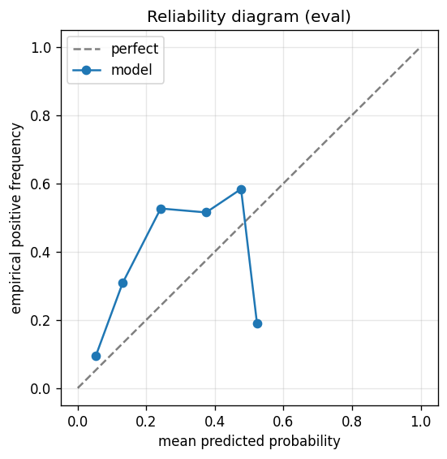

# gbdt experiment — nasdaq100_up_40pct_200d_dd20pct_aligned

## Warnings

- **hp_search**: HP search disabled in sweep mode (max_iter=3 < threshold=5); the FS+HP loop ran feature-selection only — see issue #32.

## Spec

- universe: `nasdaq100`
- direction: `up`
- threshold_pct: `40`
- horizon_days: `200`
- max_drawdown: `0.2`
- fs_hp_loop callback_mode: `default`

## Data

- tickers in universe: 100
- tickers used: 89
- tickers excluded: NASDAQ:ABNB, NASDAQ:APP, NASDAQ:ARM, NASDAQ:CEG, NASDAQ:CRWD, NASDAQ:DASH, NASDAQ:DDOG, NASDAQ:GEHC, NASDAQ:GFS, NASDAQ:PDD, NASDAQ:PLTR
- train rows: 71149 (independent events ≈ 178.6; overlap-inflation 398.36×)
- val rows: 35600 (independent events ≈ 89.2; overlap-inflation 399.00×)
- eval rows: 17800 (independent events ≈ 44.6; overlap-inflation 399.00×)
- test rows: 26700 (independent events ≈ 66.9; overlap-inflation 399.00×)
- sample uniqueness weighting: `on` (horizon_days=200)
- positive prevalence (train): 0.285
- positive prevalence (eval): 0.326

## Segment windows

- split mode: `date_aligned`
- train_start anchor: `2018-01-01`
- train: `2018-01-02` → `2021-03-08`
- val: `2021-03-09` → `2022-10-06`
- eval: `2022-10-07` → `2023-07-26`
- test: `2023-07-27` → `2024-10-03`

## Iteration history

| iter | n_features | train Brier | val Brier | gap | rationale | inner_stop |
|---|---|---|---|---|---|---|
| 0 | 279 | 0.1416 | 0.1629 | 0.0213 | iteration 0 — full feature pool, default HPs :: algorithmic fallback: kept 49/27 |  |
| 1 | 49 | 0.1422 | 0.1643 | 0.0221 | iteration 1 from FS+HP callback :: algorithmic fallback: kept 41/49 features; l2 |  |
| 2 | 41 | 0.1410 | 0.1601 | 0.0191 | iteration 2 from FS+HP callback :: inner_stop=plateau | plateau |

## Final checkpoint

- best iteration: 2
- iterations run: 3
- inner stop signal: `plateau`
- fs_hp_loop callback_mode: `default`

## Calibration

- method requested: `conditional_isotonic`
- decision: `isotonic`
- Spiegelhalter Z: -27.656
- Spiegelhalter p: 0.0000

## Headline metrics

| segment | Brier | base-rate Brier | improvement | LogLoss | AUC |
|---|---|---|---|---|---|
| eval | 0.2185 | 0.2197 | +0.0012 | 0.6319 | 0.7591 |
| test | 0.1678 | 0.1681 | +0.0004 | 0.5576 | 0.7358 |

## Top-K precision (per-day + global)

Per-day: pick the top-K rows by ``p_calibrated`` each date, pool across days. ``P@k = sum_d(positives_in_top_k(d)) / sum_d(min(R(d), k))`` where ``R(d)`` is the count of positives on day ``d`` — the ``min(R(d), k)`` denominator is the achievable-positives count (mandatory; see ``.claude/memories/project-r-precision-methodology.md``). ``n_denom = sum_d(min(R(d), k))``; ``n_days_R<k`` = days with fewer than ``k`` positives. Global: top-K by score across the whole segment, denominator ``min(k, total_positives)``. ``base_rate`` = unweighted segment positive prevalence (compare P@k to base_rate directly; lift omitted from the table by project reporting convention).

### eval — n_rows=17800, base_rate=0.3261

Per-day:

| k | P@k | base_rate | n_picks | n_positives | n_denom | days_R<k / days_full_k / days_total |
|---|---|---|---|---|---|---|
| 1 | 0.4650 | 0.3261 | 200 | 93 | 200 | 0 / 200 / 200 |
| 5 | 0.5080 | 0.3261 | 1000 | 508 | 1000 | 0 / 200 / 200 |
| 10 | 0.5765 | 0.3261 | 2000 | 1153 | 2000 | 0 / 200 / 200 |

Global (top-K across entire segment):

| k | P@k | base_rate | n_picks | n_positives | n_denom |
|---|---|---|---|---|---|
| 1 | 0.0000 | 0.3261 | 1 | 0 | 1 |
| 5 | 0.0000 | 0.3261 | 5 | 0 | 5 |
| 10 | 0.3000 | 0.3261 | 10 | 3 | 10 |

### test — n_rows=26700, base_rate=0.2139

Per-day:

| k | P@k | base_rate | n_picks | n_positives | n_denom | days_R<k / days_full_k / days_total |
|---|---|---|---|---|---|---|
| 1 | 0.3700 | 0.2139 | 300 | 111 | 300 | 0 / 300 / 300 |
| 5 | 0.4080 | 0.2139 | 1500 | 612 | 1500 | 0 / 300 / 300 |
| 10 | 0.4178 | 0.2139 | 3000 | 1253 | 2999 | 1 / 300 / 300 |

Global (top-K across entire segment):

| k | P@k | base_rate | n_picks | n_positives | n_denom |
|---|---|---|---|---|---|
| 1 | 0.0000 | 0.2139 | 1 | 0 | 1 |
| 5 | 0.0000 | 0.2139 | 5 | 0 | 5 |
| 10 | 0.0000 | 0.2139 | 10 | 0 | 10 |

## Per-ticker hit-rate when picked (k=5)

Aggregates per-day top-5 picks by ticker. Top 10 most-picked + bottom 5 most-anti-predictive (when picked at least once) shown; the full table is in ``metrics.json::segment_diagnostics.<seg>.per_ticker_hit_rate.rows``.

### eval

Top-10 by n_picks:

| ticker | n_picks | n_positives | hit_rate |
|---|---|---|---|
| NASDAQ:ADSK | 136 | 3 | 0.0221 |
| NASDAQ:AMD | 127 | 108 | 0.8504 |
| NASDAQ:ADBE | 115 | 113 | 0.9826 |
| NASDAQ:AMAT | 85 | 39 | 0.4588 |
| NASDAQ:MSTR | 81 | 27 | 0.3333 |
| NASDAQ:AAPL | 73 | 32 | 0.4384 |
| NASDAQ:MDB | 63 | 24 | 0.3810 |
| NASDAQ:CHTR | 59 | 3 | 0.0508 |
| NASDAQ:AMZN | 54 | 52 | 0.9630 |
| NASDAQ:FTNT | 42 | 0 | 0.0000 |

Bottom-5 by hit_rate (n_picks ≥ 5):

| ticker | n_picks | n_positives | hit_rate |
|---|---|---|---|
| NASDAQ:FTNT | 42 | 0 | 0.0000 |
| NASDAQ:MRVL | 15 | 0 | 0.0000 |
| NASDAQ:TTD | 7 | 0 | 0.0000 |
| NASDAQ:ADSK | 136 | 3 | 0.0221 |
| NASDAQ:CHTR | 59 | 3 | 0.0508 |

### test

Top-10 by n_picks:

| ticker | n_picks | n_positives | hit_rate |
|---|---|---|---|
| NASDAQ:MDB | 268 | 62 | 0.2313 |
| NASDAQ:AMD | 236 | 95 | 0.4025 |
| NASDAQ:MSTR | 203 | 106 | 0.5222 |
| NASDAQ:MRVL | 184 | 121 | 0.6576 |
| NASDAQ:FTNT | 124 | 41 | 0.3306 |
| NASDAQ:TEAM | 79 | 21 | 0.2658 |
| NASDAQ:TSLA | 59 | 12 | 0.2034 |
| NASDAQ:DXCM | 57 | 13 | 0.2281 |
| NASDAQ:AVGO | 38 | 38 | 1.0000 |
| NASDAQ:ON | 37 | 0 | 0.0000 |

Bottom-5 by hit_rate (n_picks ≥ 5):

| ticker | n_picks | n_positives | hit_rate |
|---|---|---|---|
| NASDAQ:ON | 37 | 0 | 0.0000 |
| NASDAQ:AMAT | 15 | 0 | 0.0000 |
| NASDAQ:MU | 12 | 0 | 0.0000 |
| NASDAQ:IDXX | 32 | 5 | 0.1562 |
| NASDAQ:INTC | 31 | 5 | 0.1613 |

## Per-quarter P@5 stability

P@5 grouped by calendar quarter. ``base_rate`` is the segment-wide positive prevalence (constant across rows); regime-dependent collapse shows as a quarter where ``P@5`` falls toward ``base_rate`` or below. ``lift`` omitted from the table by project reporting convention.

### eval

| quarter | n_picks | n_positives | P@5 | base_rate |
|---|---|---|---|---|
| 2022Q4 | 295 | 148 | 0.5017 | 0.3261 |
| 2023Q1 | 310 | 172 | 0.5548 | 0.3261 |
| 2023Q2 | 310 | 139 | 0.4484 | 0.3261 |
| 2023Q3 | 85 | 49 | 0.5765 | 0.3261 |

### test

| quarter | n_picks | n_positives | P@5 | base_rate |
|---|---|---|---|---|
| 2023Q3 | 230 | 134 | 0.5826 | 0.2139 |
| 2023Q4 | 315 | 176 | 0.5587 | 0.2139 |
| 2024Q1 | 305 | 88 | 0.2885 | 0.2139 |
| 2024Q2 | 315 | 118 | 0.3746 | 0.2139 |
| 2024Q3 | 320 | 95 | 0.2969 | 0.2139 |
| 2024Q4 | 15 | 1 | 0.0667 | 0.2139 |

## Prediction-range diagnostics

Distribution of ``p_calibrated`` per segment. ``flag_low_separation = true`` when ``std < low_separation_threshold`` — a sign the model's predictions cluster so tightly that ranking is noise.

| segment | n_rows | min | max | mean | std | flag_low_separation |
|---|---|---|---|---|---|---|
| eval | 17800 | 0.0000 | 0.5225 | 0.1547 | 0.0960 | `False` |
| test | 26700 | 0.0000 | 0.3750 | 0.0879 | 0.0803 | `False` |

## Per-experiment verdict (algorithmic readout)

Calibration: required isotonic (|z|=27.66); shipped as `isotonic`. Brier vs base-rate: +0.0012 (model beats baseline).

> NOTE: this verdict is generated from the metrics by a simple rule (see ``report._algorithmic_verdict``); it is NOT an automated pass/fail gate. The user reads the artifact and decides whether the cell ships.
