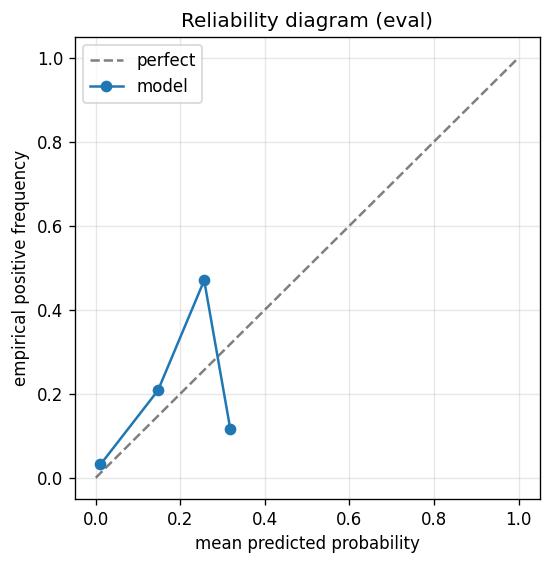

# gbdt experiment — nasdaq100_up_40pct_50d_dd20pct_agentloop_mix_mcw3

## Warnings

- **hp_search**: HP search disabled in sweep mode (max_iter=4 < threshold=5); the FS+HP loop ran feature-selection only — see issue #32.

## Spec

- universe: `nasdaq100`
- direction: `up`
- threshold_pct: `40`
- horizon_days: `50`
- max_drawdown: `0.2`
- fs_hp_loop callback_mode: `agent_file_protocol`

## Data

- tickers in universe: 100
- tickers used: 92
- tickers excluded: NASDAQ:ABNB, NASDAQ:APP, NASDAQ:ARM, NASDAQ:CEG, NASDAQ:DASH, NASDAQ:GEHC, NASDAQ:GFS, NASDAQ:PLTR
- train rows: 73600 (independent events ≈ 743.4; overlap-inflation 99.00×)
- val rows: 36800 (independent events ≈ 371.7; overlap-inflation 99.00×)
- eval rows: 18400 (independent events ≈ 185.9; overlap-inflation 99.00×)
- test rows: 4600 (independent events ≈ 46.5; overlap-inflation 99.00×)
- sample uniqueness weighting: `on` (horizon_days=50)
- positive prevalence (train): 0.040
- positive prevalence (eval): 0.060

## Iteration history

| iter | n_features | train Brier | val Brier | gap | rationale | inner_stop |
|---|---|---|---|---|---|---|

## Final checkpoint

- best iteration: 1
- iterations run: 0
- inner stop signal: `agent_should_stop`
- fs_hp_loop callback_mode: `agent_file_protocol`

## Calibration

- method requested: `conditional_isotonic`
- decision: `isotonic`
- Spiegelhalter Z: 4.192
- Spiegelhalter p: 0.0000

## Headline metrics

| segment | Brier | base-rate Brier | improvement | LogLoss | AUC |
|---|---|---|---|---|---|
| eval | 0.0514 | 0.0563 | +0.0048 | 0.1927 | 0.8404 |
| test | 0.0498 | 0.0524 | +0.0026 | 0.2088 | 0.7431 |

## Top-K precision (per-day + global)

Per-day: pick the top-K rows by ``p_calibrated`` each date, pool across days. ``P@k = sum_d(positives_in_top_k(d)) / sum_d(min(R(d), k))`` where ``R(d)`` is the count of positives on day ``d`` — the ``min(R(d), k)`` denominator is the achievable-positives count (mandatory; see ``.claude/memories/project-r-precision-methodology.md``). ``n_denom = sum_d(min(R(d), k))``; ``n_days_R<k`` = days with fewer than ``k`` positives. Global: top-K by score across the whole segment, denominator ``min(k, total_positives)``. ``base_rate`` = unweighted segment positive prevalence (compare P@k to base_rate directly; lift omitted from the table by project reporting convention).

### eval — n_rows=18400, base_rate=0.0598

Per-day:

| k | P@k | base_rate | n_picks | n_positives | n_denom | days_R<k / days_full_k / days_total |
|---|---|---|---|---|---|---|
| 1 | 0.2513 | 0.0598 | 343 | 50 | 199 | 144 / 343 / 343 |
| 5 | 0.3794 | 0.0598 | 1144 | 280 | 738 | 247 / 200 / 343 |
| 10 | 0.4990 | 0.0598 | 2144 | 503 | 1008 | 314 / 200 / 343 |

Global (top-K across entire segment):

| k | P@k | base_rate | n_picks | n_positives | n_denom |
|---|---|---|---|---|---|
| 1 | 1.0000 | 0.0598 | 1 | 1 | 1 |
| 5 | 1.0000 | 0.0598 | 5 | 5 | 5 |
| 10 | 0.5000 | 0.0598 | 10 | 5 | 10 |

### test — n_rows=4600, base_rate=0.0554

Per-day:

| k | P@k | base_rate | n_picks | n_positives | n_denom | days_R<k / days_full_k / days_total |
|---|---|---|---|---|---|---|
| 1 | 0.3725 | 0.0554 | 80 | 19 | 51 | 29 / 80 / 80 |
| 5 | 0.5806 | 0.0554 | 280 | 90 | 155 | 63 / 50 / 80 |
| 10 | 0.5467 | 0.0554 | 530 | 117 | 214 | 70 / 50 / 80 |

Global (top-K across entire segment):

| k | P@k | base_rate | n_picks | n_positives | n_denom |
|---|---|---|---|---|---|
| 1 | 0.0000 | 0.0554 | 1 | 0 | 1 |
| 5 | 0.0000 | 0.0554 | 5 | 0 | 5 |
| 10 | 0.0000 | 0.0554 | 10 | 0 | 10 |

## Per-ticker hit-rate when picked (k=5)

Aggregates per-day top-5 picks by ticker. Top 10 most-picked + bottom 5 most-anti-predictive (when picked at least once) shown; the full table is in ``metrics.json::segment_diagnostics.<seg>.per_ticker_hit_rate.rows``.

### eval

Top-10 by n_picks:

| ticker | n_picks | n_positives | hit_rate |
|---|---|---|---|
| NASDAQ:MSTR | 187 | 11 | 0.0588 |
| NASDAQ:MRVL | 176 | 21 | 0.1193 |
| NASDAQ:MU | 146 | 115 | 0.7877 |
| NASDAQ:ANSS | 143 | 0 | 0.0000 |
| NASDAQ:INTC | 104 | 26 | 0.2500 |
| NASDAQ:MDB | 96 | 50 | 0.5208 |
| NASDAQ:TSLA | 89 | 5 | 0.0562 |
| NASDAQ:AVGO | 65 | 27 | 0.4154 |
| NASDAQ:MCHP | 59 | 15 | 0.2542 |
| NASDAQ:TTD | 36 | 0 | 0.0000 |

Bottom-5 by hit_rate (n_picks ≥ 5):

| ticker | n_picks | n_positives | hit_rate |
|---|---|---|---|
| NASDAQ:ANSS | 143 | 0 | 0.0000 |
| NASDAQ:TTD | 36 | 0 | 0.0000 |
| NASDAQ:DXCM | 9 | 0 | 0.0000 |
| NASDAQ:CRWD | 6 | 0 | 0.0000 |
| NASDAQ:CHTR | 5 | 0 | 0.0000 |

### test

Top-10 by n_picks:

| ticker | n_picks | n_positives | hit_rate |
|---|---|---|---|
| NASDAQ:MSTR | 47 | 17 | 0.3617 |
| NASDAQ:MU | 43 | 10 | 0.2326 |
| NASDAQ:INTC | 34 | 24 | 0.7059 |
| NASDAQ:MRVL | 32 | 14 | 0.4375 |
| NASDAQ:ANSS | 29 | 0 | 0.0000 |
| NASDAQ:AMD | 24 | 21 | 0.8750 |
| NASDAQ:TTD | 20 | 0 | 0.0000 |
| NASDAQ:WBD | 15 | 0 | 0.0000 |
| NASDAQ:AMAT | 14 | 0 | 0.0000 |
| NASDAQ:LRCX | 6 | 3 | 0.5000 |

Bottom-5 by hit_rate (n_picks ≥ 5):

| ticker | n_picks | n_positives | hit_rate |
|---|---|---|---|
| NASDAQ:ANSS | 29 | 0 | 0.0000 |
| NASDAQ:TTD | 20 | 0 | 0.0000 |
| NASDAQ:WBD | 15 | 0 | 0.0000 |
| NASDAQ:AMAT | 14 | 0 | 0.0000 |
| NASDAQ:TSLA | 6 | 0 | 0.0000 |

## Per-quarter P@5 stability

P@5 grouped by calendar quarter. ``base_rate`` is the segment-wide positive prevalence (constant across rows); regime-dependent collapse shows as a quarter where ``P@5`` falls toward ``base_rate`` or below. ``lift`` omitted from the table by project reporting convention.

### eval

| quarter | n_picks | n_positives | P@5 | base_rate |
|---|---|---|---|---|
| 2024Q3 | 31 | 0 | 0.0000 | 0.0598 |
| 2024Q4 | 64 | 0 | 0.0000 | 0.0598 |
| 2025Q1 | 109 | 8 | 0.0734 | 0.0598 |
| 2025Q2 | 310 | 69 | 0.2226 | 0.0598 |
| 2025Q3 | 320 | 138 | 0.4313 | 0.0598 |
| 2025Q4 | 310 | 65 | 0.2097 | 0.0598 |

### test

| quarter | n_picks | n_positives | P@5 | base_rate |
|---|---|---|---|---|
| 2025Q2 | 17 | 0 | 0.0000 | 0.0554 |
| 2025Q3 | 12 | 0 | 0.0000 | 0.0554 |
| 2025Q4 | 11 | 3 | 0.2727 | 0.0554 |
| 2026Q1 | 240 | 87 | 0.3625 | 0.0554 |

## Prediction-range diagnostics

Distribution of ``p_calibrated`` per segment. ``flag_low_separation = true`` when ``std < low_separation_threshold`` — a sign the model's predictions cluster so tightly that ranking is noise.

| segment | n_rows | min | max | mean | std | flag_low_separation |
|---|---|---|---|---|---|---|
| eval | 18400 | 0.0004 | 0.3180 | 0.0342 | 0.0618 | `False` |
| test | 4600 | 0.0004 | 0.3180 | 0.0355 | 0.0597 | `False` |

## Per-experiment verdict (algorithmic readout)

Calibration: required isotonic (|z|=4.19); shipped as `isotonic`. Brier vs base-rate: +0.0048 (model beats baseline).

> NOTE: this verdict is generated from the metrics by a simple rule (see ``report._algorithmic_verdict``); it is NOT an automated pass/fail gate. The user reads the artifact and decides whether the cell ships.
