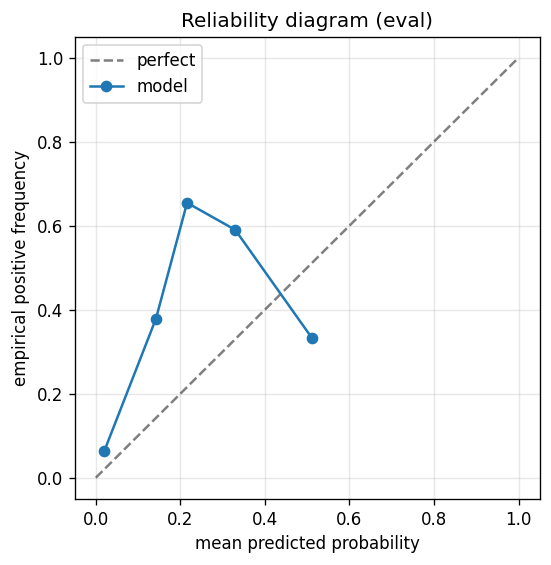

# gbdt experiment — nasdaq100_up_50pct_200d_dd25pct_aligned

## Warnings

- **hp_search**: HP search disabled in sweep mode (max_iter=3 < threshold=5); the FS+HP loop ran feature-selection only — see issue #32.

## Spec

- universe: `nasdaq100`
- direction: `up`
- threshold_pct: `50`
- horizon_days: `200`
- max_drawdown: `0.25`
- fs_hp_loop callback_mode: `default`

## Data

- tickers in universe: 100
- tickers used: 89
- tickers excluded: NASDAQ:ABNB, NASDAQ:APP, NASDAQ:ARM, NASDAQ:CEG, NASDAQ:CRWD, NASDAQ:DASH, NASDAQ:DDOG, NASDAQ:GEHC, NASDAQ:GFS, NASDAQ:PDD, NASDAQ:PLTR
- train rows: 71149 (independent events ≈ 178.6; overlap-inflation 398.36×)
- val rows: 35600 (independent events ≈ 89.2; overlap-inflation 399.00×)
- eval rows: 17800 (independent events ≈ 44.6; overlap-inflation 399.00×)
- test rows: 26700 (independent events ≈ 66.9; overlap-inflation 399.00×)
- sample uniqueness weighting: `on` (horizon_days=200)
- positive prevalence (train): 0.214
- positive prevalence (eval): 0.223

## Segment windows

- split mode: `date_aligned`
- train_start anchor: `2018-01-01`
- train: `2018-01-02` → `2021-03-08`
- val: `2021-03-09` → `2022-10-06`
- eval: `2022-10-07` → `2023-07-26`
- test: `2023-07-27` → `2024-10-03`

## Iteration history

| iter | n_features | train Brier | val Brier | gap | rationale | inner_stop |
|---|---|---|---|---|---|---|
| 0 | 279 | 0.1063 | 0.1215 | 0.0152 | iteration 0 — full feature pool, default HPs :: algorithmic fallback: kept 53/27 |  |
| 1 | 53 | 0.1046 | 0.1196 | 0.0151 | iteration 1 from FS+HP callback :: algorithmic fallback: kept 44/53 features |  |
| 2 | 44 | 0.1077 | 0.1230 | 0.0153 | iteration 2 from FS+HP callback :: inner_stop=degradation | degradation |

## Final checkpoint

- best iteration: 1
- iterations run: 3
- inner stop signal: `degradation`
- fs_hp_loop callback_mode: `default`

## Calibration

- method requested: `conditional_isotonic`
- decision: `isotonic`
- Spiegelhalter Z: -29.962
- Spiegelhalter p: 0.0000

## Headline metrics

| segment | Brier | base-rate Brier | improvement | LogLoss | AUC |
|---|---|---|---|---|---|
| eval | 0.1692 | 0.1734 | +0.0042 | 0.5230 | 0.8200 |
| test | 0.1213 | 0.1249 | +0.0037 | 0.4123 | 0.7922 |

## Top-K precision (per-day + global)

Per-day: pick the top-K rows by ``p_calibrated`` each date, pool across days. ``P@k = sum_d(positives_in_top_k(d)) / sum_d(min(R(d), k))`` where ``R(d)`` is the count of positives on day ``d`` — the ``min(R(d), k)`` denominator is the achievable-positives count (mandatory; see ``.claude/memories/project-r-precision-methodology.md``). ``n_denom = sum_d(min(R(d), k))``; ``n_days_R<k`` = days with fewer than ``k`` positives. Global: top-K by score across the whole segment, denominator ``min(k, total_positives)``. ``base_rate`` = unweighted segment positive prevalence (compare P@k to base_rate directly; lift omitted from the table by project reporting convention).

### eval — n_rows=17800, base_rate=0.2233

Per-day:

| k | P@k | base_rate | n_picks | n_positives | n_denom | days_R<k / days_full_k / days_total |
|---|---|---|---|---|---|---|
| 1 | 0.7500 | 0.2233 | 200 | 150 | 200 | 0 / 200 / 200 |
| 5 | 0.6510 | 0.2233 | 1000 | 651 | 1000 | 0 / 200 / 200 |
| 10 | 0.5722 | 0.2233 | 2000 | 1141 | 1994 | 4 / 200 / 200 |

Global (top-K across entire segment):

| k | P@k | base_rate | n_picks | n_positives | n_denom |
|---|---|---|---|---|---|
| 1 | 0.0000 | 0.2233 | 1 | 0 | 1 |
| 5 | 0.8000 | 0.2233 | 5 | 4 | 5 |
| 10 | 0.6000 | 0.2233 | 10 | 6 | 10 |

### test — n_rows=26700, base_rate=0.1464

Per-day:

| k | P@k | base_rate | n_picks | n_positives | n_denom | days_R<k / days_full_k / days_total |
|---|---|---|---|---|---|---|
| 1 | 0.6033 | 0.1464 | 300 | 181 | 300 | 0 / 300 / 300 |
| 5 | 0.4260 | 0.1464 | 1500 | 639 | 1500 | 0 / 300 / 300 |
| 10 | 0.4210 | 0.1464 | 3000 | 1212 | 2879 | 55 / 300 / 300 |

Global (top-K across entire segment):

| k | P@k | base_rate | n_picks | n_positives | n_denom |
|---|---|---|---|---|---|
| 1 | 1.0000 | 0.1464 | 1 | 1 | 1 |
| 5 | 1.0000 | 0.1464 | 5 | 5 | 5 |
| 10 | 1.0000 | 0.1464 | 10 | 10 | 10 |

## Per-ticker hit-rate when picked (k=5)

Aggregates per-day top-5 picks by ticker. Top 10 most-picked + bottom 5 most-anti-predictive (when picked at least once) shown; the full table is in ``metrics.json::segment_diagnostics.<seg>.per_ticker_hit_rate.rows``.

### eval

Top-10 by n_picks:

| ticker | n_picks | n_positives | hit_rate |
|---|---|---|---|
| NASDAQ:MSTR | 187 | 124 | 0.6631 |
| NASDAQ:TEAM | 179 | 103 | 0.5754 |
| NASDAQ:MDB | 161 | 146 | 0.9068 |
| NASDAQ:TSLA | 126 | 68 | 0.5397 |
| NASDAQ:MELI | 65 | 48 | 0.7385 |
| NASDAQ:TTD | 64 | 24 | 0.3750 |
| NASDAQ:MRVL | 61 | 41 | 0.6721 |
| NASDAQ:WBD | 49 | 15 | 0.3061 |
| NASDAQ:ZS | 35 | 20 | 0.5714 |
| NASDAQ:AMD | 32 | 32 | 1.0000 |

Bottom-5 by hit_rate (n_picks ≥ 5):

| ticker | n_picks | n_positives | hit_rate |
|---|---|---|---|
| NASDAQ:DXCM | 7 | 0 | 0.0000 |
| NASDAQ:WBD | 49 | 15 | 0.3061 |
| NASDAQ:TTD | 64 | 24 | 0.3750 |
| NASDAQ:TSLA | 126 | 68 | 0.5397 |
| NASDAQ:ZS | 35 | 20 | 0.5714 |

### test

Top-10 by n_picks:

| ticker | n_picks | n_positives | hit_rate |
|---|---|---|---|
| NASDAQ:MSTR | 300 | 230 | 0.7667 |
| NASDAQ:MDB | 296 | 28 | 0.0946 |
| NASDAQ:TEAM | 247 | 74 | 0.2996 |
| NASDAQ:TSLA | 195 | 85 | 0.4359 |
| NASDAQ:WBD | 110 | 45 | 0.4091 |
| NASDAQ:TTD | 109 | 52 | 0.4771 |
| NASDAQ:AMD | 94 | 35 | 0.3723 |
| NASDAQ:ZS | 59 | 26 | 0.4407 |
| NASDAQ:MRVL | 57 | 56 | 0.9825 |
| NASDAQ:DXCM | 15 | 0 | 0.0000 |

Bottom-5 by hit_rate (n_picks ≥ 5):

| ticker | n_picks | n_positives | hit_rate |
|---|---|---|---|
| NASDAQ:DXCM | 15 | 0 | 0.0000 |
| NASDAQ:INTC | 10 | 0 | 0.0000 |
| NASDAQ:MDB | 296 | 28 | 0.0946 |
| NASDAQ:TEAM | 247 | 74 | 0.2996 |
| NASDAQ:AMD | 94 | 35 | 0.3723 |

## Per-quarter P@5 stability

P@5 grouped by calendar quarter. ``base_rate`` is the segment-wide positive prevalence (constant across rows); regime-dependent collapse shows as a quarter where ``P@5`` falls toward ``base_rate`` or below. ``lift`` omitted from the table by project reporting convention.

### eval

| quarter | n_picks | n_positives | P@5 | base_rate |
|---|---|---|---|---|
| 2022Q4 | 295 | 199 | 0.6746 | 0.2233 |
| 2023Q1 | 310 | 222 | 0.7161 | 0.2233 |
| 2023Q2 | 310 | 215 | 0.6935 | 0.2233 |
| 2023Q3 | 85 | 15 | 0.1765 | 0.2233 |

### test

| quarter | n_picks | n_positives | P@5 | base_rate |
|---|---|---|---|---|
| 2023Q3 | 230 | 70 | 0.3043 | 0.1464 |
| 2023Q4 | 315 | 109 | 0.3460 | 0.1464 |
| 2024Q1 | 305 | 104 | 0.3410 | 0.1464 |
| 2024Q2 | 315 | 196 | 0.6222 | 0.1464 |
| 2024Q3 | 320 | 154 | 0.4813 | 0.1464 |
| 2024Q4 | 15 | 6 | 0.4000 | 0.1464 |

## Prediction-range diagnostics

Distribution of ``p_calibrated`` per segment. ``flag_low_separation = true`` when ``std < low_separation_threshold`` — a sign the model's predictions cluster so tightly that ranking is noise.

| segment | n_rows | min | max | mean | std | flag_low_separation |
|---|---|---|---|---|---|---|
| eval | 17800 | 0.0000 | 0.5106 | 0.0829 | 0.0800 | `False` |
| test | 26700 | 0.0000 | 0.3333 | 0.0515 | 0.0566 | `False` |

## Per-experiment verdict (algorithmic readout)

Calibration: required isotonic (|z|=29.96); shipped as `isotonic`. Brier vs base-rate: +0.0042 (model beats baseline).

> NOTE: this verdict is generated from the metrics by a simple rule (see ``report._algorithmic_verdict``); it is NOT an automated pass/fail gate. The user reads the artifact and decides whether the cell ships.
