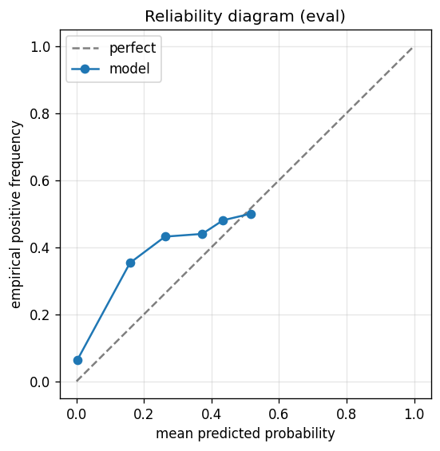

# gbdt experiment — nifty500_up_10pct_50d_dd5pct_aligned

## Warnings

- **hp_search**: HP search disabled in sweep mode (max_iter=3 < threshold=5); the FS+HP loop ran feature-selection only — see issue #32.

## Spec

- universe: `nifty500`
- direction: `up`
- threshold_pct: `10`
- horizon_days: `50`
- max_drawdown: `0.05`
- fs_hp_loop callback_mode: `default`

## Data

- tickers in universe: 500
- tickers used: 376
- tickers excluded: NSE:AADHARHFC, NSE:ABDL, NSE:ABLBL, NSE:ABSLAMC, NSE:ACMESOLAR, NSE:ACUTAAS, NSE:AEGISVOPAK, NSE:AFCONS, NSE:AIIL, NSE:ANANDRATHI, NSE:ANGELONE, NSE:ANTHEM, NSE:ANURAS, NSE:APTUS, NSE:ATHERENERG, NSE:AWL, NSE:BAJAJHFL, NSE:BELRISE, NSE:BHARTIHEXA, NSE:BIKAJI, NSE:BLUEJET, NSE:CAMS, NSE:CANHLIFE, NSE:CARTRADE, NSE:CHOICEIN, NSE:CLEAN, NSE:COHANCE, NSE:CONCORDBIO, NSE:CPPLUS, NSE:CRAFTSMAN, NSE:DATAPATTNS, NSE:DELHIVERY, NSE:DEVYANI, NSE:DOMS, NSE:EMCURE, NSE:EMMVEE, NSE:ENRIN, NSE:ETERNAL, NSE:FIRSTCRY, NSE:FIVESTAR, NSE:GLAND, NSE:GODIGIT, NSE:GROWW, NSE:HDBFS, NSE:HEXT, NSE:HOMEFIRST, NSE:HONASA, NSE:HYUNDAI, NSE:ICICIAMC, NSE:IGIL, NSE:IKS, NSE:INDGN, NSE:ITCHOTELS, NSE:JAINREC, NSE:JIOFIN, NSE:JSWCEMENT, NSE:JSWINFRA, NSE:JUBLINGREA, NSE:JYOTICNC, NSE:KALYANKJIL, NSE:KAYNES, NSE:KFINTECH, NSE:KIMS, NSE:LATENTVIEW, NSE:LENSKART, NSE:LGEINDIA, NSE:LICI, NSE:LLOYDSME, NSE:LODHA, NSE:MANKIND, NSE:MAPMYINDIA, NSE:MAXHEALTH, NSE:MAZDOCK, NSE:MEDANTA, NSE:MEESHO, NSE:MSUMI, NSE:NETWEB, NSE:NIVABUPA, NSE:NSLNISP, NSE:NTPCGREEN, NSE:NUVAMA, NSE:NUVOCO, NSE:NYKAA, NSE:OLAELEC, NSE:ONESOURCE, NSE:PARADEEP, NSE:PAYTM, NSE:PINELABS, NSE:PIRAMALFIN, NSE:POLICYBZR, NSE:POWERINDIA, NSE:PPLPHARMA, NSE:PREMIERENE, NSE:PTCIL, NSE:PWL, NSE:RAILTEL, NSE:RAINBOW, NSE:RRKABEL, NSE:SAGILITY, NSE:SAILIFE, NSE:SAPPHIRE, NSE:SBFC, NSE:SBICARD, NSE:SHRIRAMFIN, NSE:SHYAMMETL, NSE:SIGNATURE, NSE:SONACOMS, NSE:STARHEALTH, NSE:SUMICHEM, NSE:SWIGGY, NSE:SYRMA, NSE:TATACAP, NSE:TATATECH, NSE:TBOTEK, NSE:TEGA, NSE:TENNIND, NSE:THELEELA, NSE:TMCV, NSE:TRAVELFOOD, NSE:URBANCO, NSE:UTIAMC, NSE:VIJAYA, NSE:VMM, NSE:WAAREEENER
- train rows: 300996 (independent events ≈ 3042.4; overlap-inflation 98.93×)
- val rows: 150755 (independent events ≈ 1522.8; overlap-inflation 99.00×)
- eval rows: 75907 (independent events ≈ 766.7; overlap-inflation 99.00×)
- test rows: 37600 (independent events ≈ 379.8; overlap-inflation 99.00×)
- sample uniqueness weighting: `on` (horizon_days=50)
- positive prevalence (train): 0.413
- positive prevalence (eval): 0.464

## Segment windows

- split mode: `date_aligned`
- train_start anchor: `2019-01-01`
- train: `2019-01-01` → `2022-03-29`
- val: `2022-03-30` → `2023-11-09`
- eval: `2023-11-10` → `2024-09-03`
- test: `2024-09-04` → `2025-01-27`

## Iteration history

| iter | n_features | train Brier | val Brier | gap | rationale | inner_stop |
|---|---|---|---|---|---|---|
| 0 | 279 | 0.1487 | 0.2892 | 0.1405 | iteration 0 — full feature pool, default HPs :: algorithmic fallback: kept 201/2 |  |
| 1 | 201 | 0.1476 | 0.2890 | 0.1414 | iteration 1 from FS+HP callback :: algorithmic fallback: kept 197/201 features;  |  |
| 2 | 197 | 0.1476 | 0.2891 | 0.1414 | iteration 2 from FS+HP callback :: inner_stop=plateau | plateau |

## Final checkpoint

- best iteration: 0
- iterations run: 3
- inner stop signal: `plateau`
- fs_hp_loop callback_mode: `default`

## Calibration

- method requested: `conditional_isotonic`
- decision: `isotonic`
- Spiegelhalter Z: 228.578
- Spiegelhalter p: 0.0000

## Headline metrics

| segment | Brier | base-rate Brier | improvement | LogLoss | AUC |
|---|---|---|---|---|---|
| eval | 0.2567 | 0.2487 | -0.0080 | 0.7094 | 0.5215 |
| test | 0.2151 | 0.1594 | -0.0557 | 0.6229 | 0.5354 |

## Top-K precision (per-day + global)

Per-day: pick the top-K rows by ``p_calibrated`` each date, pool across days. ``P@k = sum_d(positives_in_top_k(d)) / sum_d(min(R(d), k))`` where ``R(d)`` is the count of positives on day ``d`` — the ``min(R(d), k)`` denominator is the achievable-positives count (mandatory; see ``.claude/memories/project-r-precision-methodology.md``). ``n_denom = sum_d(min(R(d), k))``; ``n_days_R<k`` = days with fewer than ``k`` positives. Global: top-K by score across the whole segment, denominator ``min(k, total_positives)``. ``base_rate`` = unweighted segment positive prevalence (compare P@k to base_rate directly; lift omitted from the table by project reporting convention).

### eval — n_rows=75907, base_rate=0.4639

Per-day:

| k | P@k | base_rate | n_picks | n_positives | n_denom | days_R<k / days_full_k / days_total |
|---|---|---|---|---|---|---|
| 1 | 0.5050 | 0.4639 | 202 | 102 | 202 | 0 / 202 / 202 |
| 5 | 0.4406 | 0.4639 | 1010 | 445 | 1010 | 0 / 202 / 202 |
| 10 | 0.4619 | 0.4639 | 2020 | 933 | 2020 | 0 / 202 / 202 |

Global (top-K across entire segment):

| k | P@k | base_rate | n_picks | n_positives | n_denom |
|---|---|---|---|---|---|
| 1 | 0.0000 | 0.4639 | 1 | 0 | 1 |
| 5 | 0.8000 | 0.4639 | 5 | 4 | 5 |
| 10 | 0.6000 | 0.4639 | 10 | 6 | 10 |

### test — n_rows=37600, base_rate=0.1990

Per-day:

| k | P@k | base_rate | n_picks | n_positives | n_denom | days_R<k / days_full_k / days_total |
|---|---|---|---|---|---|---|
| 1 | 0.3200 | 0.1990 | 100 | 32 | 100 | 0 / 100 / 100 |
| 5 | 0.2660 | 0.1990 | 500 | 133 | 500 | 0 / 100 / 100 |
| 10 | 0.2420 | 0.1990 | 1000 | 242 | 1000 | 0 / 100 / 100 |

Global (top-K across entire segment):

| k | P@k | base_rate | n_picks | n_positives | n_denom |
|---|---|---|---|---|---|
| 1 | 0.0000 | 0.1990 | 1 | 0 | 1 |
| 5 | 0.2000 | 0.1990 | 5 | 1 | 5 |
| 10 | 0.1000 | 0.1990 | 10 | 1 | 10 |

## Per-ticker hit-rate when picked (k=5)

Aggregates per-day top-5 picks by ticker. Top 10 most-picked + bottom 5 most-anti-predictive (when picked at least once) shown; the full table is in ``metrics.json::segment_diagnostics.<seg>.per_ticker_hit_rate.rows``.

### eval

Top-10 by n_picks:

| ticker | n_picks | n_positives | hit_rate |
|---|---|---|---|
| NSE:ACE | 69 | 31 | 0.4493 |
| NSE:ABB | 56 | 23 | 0.4107 |
| NSE:360ONE | 53 | 30 | 0.5660 |
| NSE:ADANIENSOL | 49 | 18 | 0.3673 |
| NSE:3MINDIA | 42 | 15 | 0.3571 |
| NSE:APARINDS | 35 | 27 | 0.7714 |
| NSE:ADANIPORTS | 34 | 18 | 0.5294 |
| NSE:ABREL | 32 | 15 | 0.4688 |
| NSE:AAVAS | 30 | 7 | 0.2333 |
| NSE:ADANIPOWER | 28 | 20 | 0.7143 |

Bottom-5 by hit_rate (n_picks ≥ 5):

| ticker | n_picks | n_positives | hit_rate |
|---|---|---|---|
| NSE:CREDITACC | 15 | 0 | 0.0000 |
| NSE:BHEL | 13 | 0 | 0.0000 |
| NSE:INDIACEM | 13 | 0 | 0.0000 |
| NSE:BSE | 7 | 0 | 0.0000 |
| NSE:GRAVITA | 7 | 0 | 0.0000 |

### test

Top-10 by n_picks:

| ticker | n_picks | n_positives | hit_rate |
|---|---|---|---|
| NSE:GALLANTT | 24 | 10 | 0.4167 |
| NSE:MMTC | 22 | 0 | 0.0000 |
| NSE:CEMPRO | 19 | 2 | 0.1053 |
| NSE:GVT&D | 19 | 9 | 0.4737 |
| NSE:360ONE | 17 | 11 | 0.6471 |
| NSE:TARIL | 16 | 16 | 1.0000 |
| NSE:ADANIGREEN | 15 | 0 | 0.0000 |
| NSE:GODREJIND | 13 | 2 | 0.1538 |
| NSE:NEULANDLAB | 13 | 6 | 0.4615 |
| NSE:AMBER | 12 | 4 | 0.3333 |

Bottom-5 by hit_rate (n_picks ≥ 5):

| ticker | n_picks | n_positives | hit_rate |
|---|---|---|---|
| NSE:MMTC | 22 | 0 | 0.0000 |
| NSE:ADANIGREEN | 15 | 0 | 0.0000 |
| NSE:JUBLPHARMA | 10 | 0 | 0.0000 |
| NSE:EXIDEIND | 9 | 0 | 0.0000 |
| NSE:NCC | 9 | 0 | 0.0000 |

## Per-quarter P@5 stability

P@5 grouped by calendar quarter. ``base_rate`` is the segment-wide positive prevalence (constant across rows); regime-dependent collapse shows as a quarter where ``P@5`` falls toward ``base_rate`` or below. ``lift`` omitted from the table by project reporting convention.

### eval

| quarter | n_picks | n_positives | P@5 | base_rate |
|---|---|---|---|---|
| 2023Q4 | 170 | 113 | 0.6647 | 0.4639 |
| 2024Q1 | 310 | 119 | 0.3839 | 0.4639 |
| 2024Q2 | 305 | 144 | 0.4721 | 0.4639 |
| 2024Q3 | 225 | 69 | 0.3067 | 0.4639 |

### test

| quarter | n_picks | n_positives | P@5 | base_rate |
|---|---|---|---|---|
| 2024Q3 | 95 | 21 | 0.2211 | 0.1990 |
| 2024Q4 | 310 | 99 | 0.3194 | 0.1990 |
| 2025Q1 | 95 | 13 | 0.1368 | 0.1990 |

## Prediction-range diagnostics

Distribution of ``p_calibrated`` per segment. ``flag_low_separation = true`` when ``std < low_separation_threshold`` — a sign the model's predictions cluster so tightly that ranking is noise.

| segment | n_rows | min | max | mean | std | flag_low_separation |
|---|---|---|---|---|---|---|
| eval | 75907 | 0.0000 | 0.5241 | 0.3871 | 0.0748 | `False` |
| test | 37600 | 0.2515 | 0.7241 | 0.4359 | 0.0132 | `True` |

## Per-experiment verdict (algorithmic readout)

Calibration: required isotonic (|z|=228.58); shipped as `isotonic`. Brier vs base-rate: -0.0080 (worse than baseline).

> NOTE: this verdict is generated from the metrics by a simple rule (see ``report._algorithmic_verdict``); it is NOT an automated pass/fail gate. The user reads the artifact and decides whether the cell ships.
