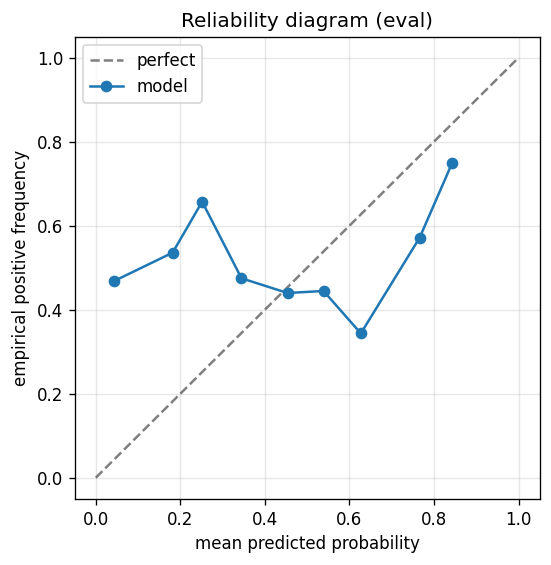

# gbdt experiment — nifty500_up_30pct_200d_dd15pct_aligned

## Warnings

- **hp_search**: HP search disabled in sweep mode (max_iter=3 < threshold=5); the FS+HP loop ran feature-selection only — see issue #32.

## Spec

- universe: `nifty500`
- direction: `up`
- threshold_pct: `30`
- horizon_days: `200`
- max_drawdown: `0.15`
- fs_hp_loop callback_mode: `default`

## Data

- tickers in universe: 500
- tickers used: 357
- tickers excluded: NSE:360ONE, NSE:AADHARHFC, NSE:AAVAS, NSE:ABDL, NSE:ABLBL, NSE:ABSLAMC, NSE:ACMESOLAR, NSE:ACUTAAS, NSE:ADANIGREEN, NSE:AEGISVOPAK, NSE:AFCONS, NSE:AFFLE, NSE:AIIL, NSE:ANANDRATHI, NSE:ANGELONE, NSE:ANTHEM, NSE:ANURAS, NSE:APTUS, NSE:ATGL, NSE:ATHERENERG, NSE:AWL, NSE:BAJAJHFL, NSE:BELRISE, NSE:BHARTIHEXA, NSE:BIKAJI, NSE:BLUEJET, NSE:CAMS, NSE:CANHLIFE, NSE:CARTRADE, NSE:CHALET, NSE:CHOICEIN, NSE:CLEAN, NSE:COHANCE, NSE:CONCORDBIO, NSE:CPPLUS, NSE:CRAFTSMAN, NSE:CREDITACC, NSE:DALBHARAT, NSE:DATAPATTNS, NSE:DELHIVERY, NSE:DEVYANI, NSE:DOMS, NSE:EMCURE, NSE:EMMVEE, NSE:ENRIN, NSE:ETERNAL, NSE:FIRSTCRY, NSE:FIVESTAR, NSE:FLUOROCHEM, NSE:FORCEMOT, NSE:GLAND, NSE:GODIGIT, NSE:GROWW, NSE:GRSE, NSE:HDBFS, NSE:HDFCAMC, NSE:HEXT, NSE:HOMEFIRST, NSE:HONASA, NSE:HYUNDAI, NSE:ICICIAMC, NSE:IGIL, NSE:IKS, NSE:INDGN, NSE:INDIAMART, NSE:IRCON, NSE:IRCTC, NSE:ITCHOTELS, NSE:JAINREC, NSE:JIOFIN, NSE:JSWCEMENT, NSE:JSWINFRA, NSE:JUBLINGREA, NSE:JYOTICNC, NSE:KALYANKJIL, NSE:KAYNES, NSE:KFINTECH, NSE:KIMS, NSE:KPITTECH, NSE:LATENTVIEW, NSE:LENSKART, NSE:LGEINDIA, NSE:LICI, NSE:LLOYDSME, NSE:LODHA, NSE:MANKIND, NSE:MAPMYINDIA, NSE:MAXHEALTH, NSE:MAZDOCK, NSE:MEDANTA, NSE:MEESHO, NSE:MSUMI, NSE:NETWEB, NSE:NIVABUPA, NSE:NSLNISP, NSE:NTPCGREEN, NSE:NUVAMA, NSE:NUVOCO, NSE:NYKAA, NSE:OLAELEC, NSE:ONESOURCE, NSE:PARADEEP, NSE:PAYTM, NSE:PINELABS, NSE:PIRAMALFIN, NSE:POLICYBZR, NSE:POLYCAB, NSE:POWERINDIA, NSE:PPLPHARMA, NSE:PREMIERENE, NSE:PTCIL, NSE:PWL, NSE:RAILTEL, NSE:RAINBOW, NSE:RITES, NSE:RRKABEL, NSE:RVNL, NSE:SAGILITY, NSE:SAILIFE, NSE:SAPPHIRE, NSE:SBFC, NSE:SBICARD, NSE:SHRIRAMFIN, NSE:SHYAMMETL, NSE:SIGNATURE, NSE:SONACOMS, NSE:STARHEALTH, NSE:SUMICHEM, NSE:SWIGGY, NSE:SYRMA, NSE:TATACAP, NSE:TATATECH, NSE:TBOTEK, NSE:TEGA, NSE:TENNIND, NSE:THELEELA, NSE:TMCV, NSE:TRAVELFOOD, NSE:URBANCO, NSE:UTIAMC, NSE:VIJAYA, NSE:VMM, NSE:WAAREEENER
- train rows: 286254 (independent events ≈ 719.8; overlap-inflation 397.66×)
- val rows: 143505 (independent events ≈ 359.7; overlap-inflation 399.00×)
- eval rows: 71387 (independent events ≈ 178.9; overlap-inflation 399.00×)
- test rows: 107804 (independent events ≈ 270.2; overlap-inflation 399.00×)
- sample uniqueness weighting: `on` (horizon_days=200)
- positive prevalence (train): 0.368
- positive prevalence (eval): 0.630

## Segment windows

- split mode: `date_aligned`
- train_start anchor: `2018-01-01`
- train: `2018-01-01` → `2021-03-30`
- val: `2021-03-31` → `2022-11-14`
- eval: `2022-11-15` → `2023-09-01`
- test: `2023-09-04` → `2024-11-21`

## Iteration history

| iter | n_features | train Brier | val Brier | gap | rationale | inner_stop |
|---|---|---|---|---|---|---|
| 0 | 279 | 0.1076 | 0.2310 | 0.1234 | iteration 0 — full feature pool, default HPs :: algorithmic fallback: kept 133/2 |  |
| 1 | 133 | 0.1069 | 0.2379 | 0.1310 | iteration 1 from FS+HP callback :: inner_stop=degradation | degradation |

## Final checkpoint

- best iteration: 0
- iterations run: 2
- inner stop signal: `degradation`
- fs_hp_loop callback_mode: `default`

## Calibration

- method requested: `conditional_isotonic`
- decision: `isotonic`
- Spiegelhalter Z: 102.301
- Spiegelhalter p: 0.0000

## Headline metrics

| segment | Brier | base-rate Brier | improvement | LogLoss | AUC |
|---|---|---|---|---|---|
| eval | 0.3735 | 0.2332 | -0.1403 | 0.9910 | 0.4535 |
| test | 0.2849 | 0.2469 | -0.0380 | 0.7920 | 0.4152 |

## Top-K precision (per-day + global)

Per-day: pick the top-K rows by ``p_calibrated`` each date, pool across days. ``P@k = sum_d(positives_in_top_k(d)) / sum_d(min(R(d), k))`` where ``R(d)`` is the count of positives on day ``d`` — the ``min(R(d), k)`` denominator is the achievable-positives count (mandatory; see ``.claude/memories/project-r-precision-methodology.md``). ``n_denom = sum_d(min(R(d), k))``; ``n_days_R<k`` = days with fewer than ``k`` positives. Global: top-K by score across the whole segment, denominator ``min(k, total_positives)``. ``base_rate`` = unweighted segment positive prevalence (compare P@k to base_rate directly; lift omitted from the table by project reporting convention).

### eval — n_rows=71387, base_rate=0.6295

Per-day:

| k | P@k | base_rate | n_picks | n_positives | n_denom | days_R<k / days_full_k / days_total |
|---|---|---|---|---|---|---|
| 1 | 0.7200 | 0.6295 | 200 | 144 | 200 | 0 / 200 / 200 |
| 5 | 0.6430 | 0.6295 | 1000 | 643 | 1000 | 0 / 200 / 200 |
| 10 | 0.6115 | 0.6295 | 2000 | 1223 | 2000 | 0 / 200 / 200 |

Global (top-K across entire segment):

| k | P@k | base_rate | n_picks | n_positives | n_denom |
|---|---|---|---|---|---|
| 1 | 1.0000 | 0.6295 | 1 | 1 | 1 |
| 5 | 1.0000 | 0.6295 | 5 | 5 | 5 |
| 10 | 0.8000 | 0.6295 | 10 | 8 | 10 |

### test — n_rows=107804, base_rate=0.4440

Per-day:

| k | P@k | base_rate | n_picks | n_positives | n_denom | days_R<k / days_full_k / days_total |
|---|---|---|---|---|---|---|
| 1 | 0.4702 | 0.4440 | 302 | 142 | 302 | 0 / 302 / 302 |
| 5 | 0.4391 | 0.4440 | 1510 | 663 | 1510 | 0 / 302 / 302 |
| 10 | 0.4228 | 0.4440 | 3020 | 1277 | 3020 | 0 / 302 / 302 |

Global (top-K across entire segment):

| k | P@k | base_rate | n_picks | n_positives | n_denom |
|---|---|---|---|---|---|
| 1 | 0.0000 | 0.4440 | 1 | 0 | 1 |
| 5 | 0.0000 | 0.4440 | 5 | 0 | 5 |
| 10 | 0.0000 | 0.4440 | 10 | 0 | 10 |

## Per-ticker hit-rate when picked (k=5)

Aggregates per-day top-5 picks by ticker. Top 10 most-picked + bottom 5 most-anti-predictive (when picked at least once) shown; the full table is in ``metrics.json::segment_diagnostics.<seg>.per_ticker_hit_rate.rows``.

### eval

Top-10 by n_picks:

| ticker | n_picks | n_positives | hit_rate |
|---|---|---|---|
| NSE:CHOLAHLDNG | 76 | 56 | 0.7368 |
| NSE:SUPREMEIND | 58 | 55 | 0.9483 |
| NSE:BLS | 47 | 26 | 0.5532 |
| NSE:KIRLOSENG | 42 | 42 | 1.0000 |
| NSE:ERIS | 31 | 27 | 0.8710 |
| NSE:BLUESTARCO | 29 | 0 | 0.0000 |
| NSE:SPLPETRO | 28 | 28 | 1.0000 |
| NSE:ABCAPITAL | 27 | 2 | 0.0741 |
| NSE:KEI | 27 | 27 | 1.0000 |
| NSE:CANBK | 24 | 24 | 1.0000 |

Bottom-5 by hit_rate (n_picks ≥ 5):

| ticker | n_picks | n_positives | hit_rate |
|---|---|---|---|
| NSE:BLUESTARCO | 29 | 0 | 0.0000 |
| NSE:DRREDDY | 24 | 0 | 0.0000 |
| NSE:JSWDULUX | 16 | 0 | 0.0000 |
| NSE:GABRIEL | 15 | 0 | 0.0000 |
| NSE:COCHINSHIP | 12 | 0 | 0.0000 |

### test

Top-10 by n_picks:

| ticker | n_picks | n_positives | hit_rate |
|---|---|---|---|
| NSE:EMAMILTD | 73 | 3 | 0.0411 |
| NSE:MOTILALOFS | 66 | 60 | 0.9091 |
| NSE:BRIGADE | 57 | 42 | 0.7368 |
| NSE:AJANTPHARM | 55 | 51 | 0.9273 |
| NSE:BDL | 50 | 6 | 0.1200 |
| NSE:GAIL | 48 | 0 | 0.0000 |
| NSE:ERIS | 45 | 26 | 0.5778 |
| NSE:BHEL | 43 | 0 | 0.0000 |
| NSE:JBCHEPHARM | 39 | 1 | 0.0256 |
| NSE:IRFC | 35 | 26 | 0.7429 |

Bottom-5 by hit_rate (n_picks ≥ 5):

| ticker | n_picks | n_positives | hit_rate |
|---|---|---|---|
| NSE:GAIL | 48 | 0 | 0.0000 |
| NSE:BHEL | 43 | 0 | 0.0000 |
| NSE:BSOFT | 33 | 0 | 0.0000 |
| NSE:BIOCON | 21 | 0 | 0.0000 |
| NSE:INDIACEM | 21 | 0 | 0.0000 |

## Per-quarter P@5 stability

P@5 grouped by calendar quarter. ``base_rate`` is the segment-wide positive prevalence (constant across rows); regime-dependent collapse shows as a quarter where ``P@5`` falls toward ``base_rate`` or below. ``lift`` omitted from the table by project reporting convention.

### eval

| quarter | n_picks | n_positives | P@5 | base_rate |
|---|---|---|---|---|
| 2022Q4 | 170 | 85 | 0.5000 | 0.6295 |
| 2023Q1 | 310 | 227 | 0.7323 | 0.6295 |
| 2023Q2 | 300 | 232 | 0.7733 | 0.6295 |
| 2023Q3 | 220 | 99 | 0.4500 | 0.6295 |

### test

| quarter | n_picks | n_positives | P@5 | base_rate |
|---|---|---|---|---|
| 2023Q3 | 95 | 50 | 0.5263 | 0.4440 |
| 2023Q4 | 305 | 243 | 0.7967 | 0.4440 |
| 2024Q1 | 310 | 178 | 0.5742 | 0.4440 |
| 2024Q2 | 305 | 126 | 0.4131 | 0.4440 |
| 2024Q3 | 320 | 16 | 0.0500 | 0.4440 |
| 2024Q4 | 175 | 50 | 0.2857 | 0.4440 |

## Prediction-range diagnostics

Distribution of ``p_calibrated`` per segment. ``flag_low_separation = true`` when ``std < low_separation_threshold`` — a sign the model's predictions cluster so tightly that ranking is noise.

| segment | n_rows | min | max | mean | std | flag_low_separation |
|---|---|---|---|---|---|---|
| eval | 71387 | 0.0000 | 0.8560 | 0.2717 | 0.0682 | `False` |
| test | 107804 | 0.0000 | 0.6096 | 0.2725 | 0.0527 | `False` |

## Per-experiment verdict (algorithmic readout)

Calibration: required isotonic (|z|=102.30); shipped as `isotonic`. Brier vs base-rate: -0.1403 (worse than baseline).

> NOTE: this verdict is generated from the metrics by a simple rule (see ``report._algorithmic_verdict``); it is NOT an automated pass/fail gate. The user reads the artifact and decides whether the cell ships.
