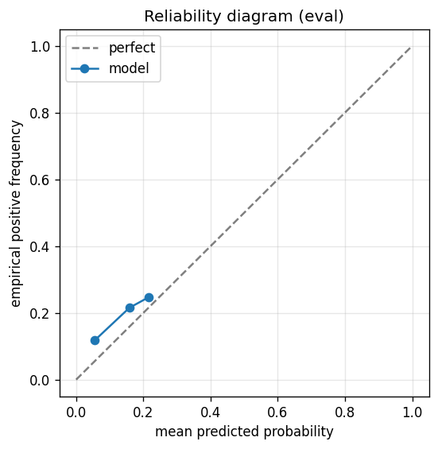

# gbdt experiment — nifty500_up_30pct_50d_dd15pct_aligned

## Warnings

- **hp_search**: HP search disabled in sweep mode (max_iter=3 < threshold=5); the FS+HP loop ran feature-selection only — see issue #32.

## Spec

- universe: `nifty500`
- direction: `up`
- threshold_pct: `30`
- horizon_days: `50`
- max_drawdown: `0.15`
- fs_hp_loop callback_mode: `default`

## Data

- tickers in universe: 500
- tickers used: 376
- tickers excluded: NSE:AADHARHFC, NSE:ABDL, NSE:ABLBL, NSE:ABSLAMC, NSE:ACMESOLAR, NSE:ACUTAAS, NSE:AEGISVOPAK, NSE:AFCONS, NSE:AIIL, NSE:ANANDRATHI, NSE:ANGELONE, NSE:ANTHEM, NSE:ANURAS, NSE:APTUS, NSE:ATHERENERG, NSE:AWL, NSE:BAJAJHFL, NSE:BELRISE, NSE:BHARTIHEXA, NSE:BIKAJI, NSE:BLUEJET, NSE:CAMS, NSE:CANHLIFE, NSE:CARTRADE, NSE:CHOICEIN, NSE:CLEAN, NSE:COHANCE, NSE:CONCORDBIO, NSE:CPPLUS, NSE:CRAFTSMAN, NSE:DATAPATTNS, NSE:DELHIVERY, NSE:DEVYANI, NSE:DOMS, NSE:EMCURE, NSE:EMMVEE, NSE:ENRIN, NSE:ETERNAL, NSE:FIRSTCRY, NSE:FIVESTAR, NSE:GLAND, NSE:GODIGIT, NSE:GROWW, NSE:HDBFS, NSE:HEXT, NSE:HOMEFIRST, NSE:HONASA, NSE:HYUNDAI, NSE:ICICIAMC, NSE:IGIL, NSE:IKS, NSE:INDGN, NSE:ITCHOTELS, NSE:JAINREC, NSE:JIOFIN, NSE:JSWCEMENT, NSE:JSWINFRA, NSE:JUBLINGREA, NSE:JYOTICNC, NSE:KALYANKJIL, NSE:KAYNES, NSE:KFINTECH, NSE:KIMS, NSE:LATENTVIEW, NSE:LENSKART, NSE:LGEINDIA, NSE:LICI, NSE:LLOYDSME, NSE:LODHA, NSE:MANKIND, NSE:MAPMYINDIA, NSE:MAXHEALTH, NSE:MAZDOCK, NSE:MEDANTA, NSE:MEESHO, NSE:MSUMI, NSE:NETWEB, NSE:NIVABUPA, NSE:NSLNISP, NSE:NTPCGREEN, NSE:NUVAMA, NSE:NUVOCO, NSE:NYKAA, NSE:OLAELEC, NSE:ONESOURCE, NSE:PARADEEP, NSE:PAYTM, NSE:PINELABS, NSE:PIRAMALFIN, NSE:POLICYBZR, NSE:POWERINDIA, NSE:PPLPHARMA, NSE:PREMIERENE, NSE:PTCIL, NSE:PWL, NSE:RAILTEL, NSE:RAINBOW, NSE:RRKABEL, NSE:SAGILITY, NSE:SAILIFE, NSE:SAPPHIRE, NSE:SBFC, NSE:SBICARD, NSE:SHRIRAMFIN, NSE:SHYAMMETL, NSE:SIGNATURE, NSE:SONACOMS, NSE:STARHEALTH, NSE:SUMICHEM, NSE:SWIGGY, NSE:SYRMA, NSE:TATACAP, NSE:TATATECH, NSE:TBOTEK, NSE:TEGA, NSE:TENNIND, NSE:THELEELA, NSE:TMCV, NSE:TRAVELFOOD, NSE:URBANCO, NSE:UTIAMC, NSE:VIJAYA, NSE:VMM, NSE:WAAREEENER
- train rows: 300996 (independent events ≈ 3042.4; overlap-inflation 98.93×)
- val rows: 150755 (independent events ≈ 1522.8; overlap-inflation 99.00×)
- eval rows: 75907 (independent events ≈ 766.7; overlap-inflation 99.00×)
- test rows: 37600 (independent events ≈ 379.8; overlap-inflation 99.00×)
- sample uniqueness weighting: `on` (horizon_days=50)
- positive prevalence (train): 0.175
- positive prevalence (eval): 0.178

## Segment windows

- split mode: `date_aligned`
- train_start anchor: `2019-01-01`
- train: `2019-01-01` → `2022-03-29`
- val: `2022-03-30` → `2023-11-09`
- eval: `2023-11-10` → `2024-09-03`
- test: `2024-09-04` → `2025-01-27`

## Iteration history

| iter | n_features | train Brier | val Brier | gap | rationale | inner_stop |
|---|---|---|---|---|---|---|
| 0 | 279 | 0.0707 | 0.1235 | 0.0528 | iteration 0 — full feature pool, default HPs :: algorithmic fallback: kept 172/2 |  |
| 1 | 172 | 0.0704 | 0.1231 | 0.0527 | iteration 1 from FS+HP callback :: algorithmic fallback: kept 157/172 features;  |  |
| 2 | 157 | 0.0702 | 0.1232 | 0.0530 | iteration 2 from FS+HP callback :: inner_stop=plateau | plateau |

## Final checkpoint

- best iteration: 1
- iterations run: 3
- inner stop signal: `plateau`
- fs_hp_loop callback_mode: `default`

## Calibration

- method requested: `conditional_isotonic`
- decision: `isotonic`
- Spiegelhalter Z: 134.126
- Spiegelhalter p: 0.0000

## Headline metrics

| segment | Brier | base-rate Brier | improvement | LogLoss | AUC |
|---|---|---|---|---|---|
| eval | 0.1454 | 0.1461 | +0.0008 | 0.4725 | 0.6178 |
| test | 0.0457 | 0.0286 | -0.0171 | 0.2113 | 0.7396 |

## Top-K precision (per-day + global)

Per-day: pick the top-K rows by ``p_calibrated`` each date, pool across days. ``P@k = sum_d(positives_in_top_k(d)) / sum_d(min(R(d), k))`` where ``R(d)`` is the count of positives on day ``d`` — the ``min(R(d), k)`` denominator is the achievable-positives count (mandatory; see ``.claude/memories/project-r-precision-methodology.md``). ``n_denom = sum_d(min(R(d), k))``; ``n_days_R<k`` = days with fewer than ``k`` positives. Global: top-K by score across the whole segment, denominator ``min(k, total_positives)``. ``base_rate`` = unweighted segment positive prevalence (compare P@k to base_rate directly; lift omitted from the table by project reporting convention).

### eval — n_rows=75907, base_rate=0.1777

Per-day:

| k | P@k | base_rate | n_picks | n_positives | n_denom | days_R<k / days_full_k / days_total |
|---|---|---|---|---|---|---|
| 1 | 0.3168 | 0.1777 | 202 | 64 | 202 | 0 / 202 / 202 |
| 5 | 0.2376 | 0.1777 | 1010 | 240 | 1010 | 0 / 202 / 202 |
| 10 | 0.2361 | 0.1777 | 2020 | 477 | 2020 | 0 / 202 / 202 |

Global (top-K across entire segment):

| k | P@k | base_rate | n_picks | n_positives | n_denom |
|---|---|---|---|---|---|
| 1 | 1.0000 | 0.1777 | 1 | 1 | 1 |
| 5 | 0.8000 | 0.1777 | 5 | 4 | 5 |
| 10 | 0.8000 | 0.1777 | 10 | 8 | 10 |

### test — n_rows=37600, base_rate=0.0295

Per-day:

| k | P@k | base_rate | n_picks | n_positives | n_denom | days_R<k / days_full_k / days_total |
|---|---|---|---|---|---|---|
| 1 | 0.0800 | 0.0295 | 100 | 8 | 100 | 0 / 100 / 100 |
| 5 | 0.1180 | 0.0295 | 500 | 53 | 449 | 20 / 100 / 100 |
| 10 | 0.1114 | 0.0295 | 1000 | 88 | 790 | 40 / 100 / 100 |

Global (top-K across entire segment):

| k | P@k | base_rate | n_picks | n_positives | n_denom |
|---|---|---|---|---|---|
| 1 | 0.0000 | 0.0295 | 1 | 0 | 1 |
| 5 | 0.0000 | 0.0295 | 5 | 0 | 5 |
| 10 | 0.0000 | 0.0295 | 10 | 0 | 10 |

## Per-ticker hit-rate when picked (k=5)

Aggregates per-day top-5 picks by ticker. Top 10 most-picked + bottom 5 most-anti-predictive (when picked at least once) shown; the full table is in ``metrics.json::segment_diagnostics.<seg>.per_ticker_hit_rate.rows``.

### eval

Top-10 by n_picks:

| ticker | n_picks | n_positives | hit_rate |
|---|---|---|---|
| NSE:ADANIENSOL | 84 | 1 | 0.0119 |
| NSE:ADANIGREEN | 72 | 12 | 0.1667 |
| NSE:ACE | 66 | 17 | 0.2576 |
| NSE:ADANIPOWER | 58 | 1 | 0.0172 |
| NSE:ANANTRAJ | 44 | 4 | 0.0909 |
| NSE:APARINDS | 44 | 5 | 0.1136 |
| NSE:PRESTIGE | 44 | 15 | 0.3409 |
| NSE:GALLANTT | 32 | 6 | 0.1875 |
| NSE:INOXWIND | 29 | 8 | 0.2759 |
| NSE:IDEA | 28 | 5 | 0.1786 |

Bottom-5 by hit_rate (n_picks ≥ 5):

| ticker | n_picks | n_positives | hit_rate |
|---|---|---|---|
| NSE:SOBHA | 13 | 0 | 0.0000 |
| NSE:HINDCOPPER | 12 | 0 | 0.0000 |
| NSE:GRSE | 11 | 0 | 0.0000 |
| NSE:DEEPAKFERT | 9 | 0 | 0.0000 |
| NSE:CESC | 8 | 0 | 0.0000 |

### test

Top-10 by n_picks:

| ticker | n_picks | n_positives | hit_rate |
|---|---|---|---|
| NSE:GRSE | 57 | 0 | 0.0000 |
| NSE:GALLANTT | 51 | 5 | 0.0980 |
| NSE:COCHINSHIP | 38 | 2 | 0.0526 |
| NSE:TARIL | 37 | 8 | 0.2162 |
| NSE:HEG | 29 | 3 | 0.1034 |
| NSE:JPPOWER | 27 | 11 | 0.4074 |
| NSE:360ONE | 20 | 0 | 0.0000 |
| NSE:GODFRYPHLP | 20 | 15 | 0.7500 |
| NSE:CAPLIPOINT | 15 | 0 | 0.0000 |
| NSE:SCHNEIDER | 15 | 0 | 0.0000 |

Bottom-5 by hit_rate (n_picks ≥ 5):

| ticker | n_picks | n_positives | hit_rate |
|---|---|---|---|
| NSE:GRSE | 57 | 0 | 0.0000 |
| NSE:360ONE | 20 | 0 | 0.0000 |
| NSE:CAPLIPOINT | 15 | 0 | 0.0000 |
| NSE:SCHNEIDER | 15 | 0 | 0.0000 |
| NSE:DEEPAKFERT | 11 | 0 | 0.0000 |

## Per-quarter P@5 stability

P@5 grouped by calendar quarter. ``base_rate`` is the segment-wide positive prevalence (constant across rows); regime-dependent collapse shows as a quarter where ``P@5`` falls toward ``base_rate`` or below. ``lift`` omitted from the table by project reporting convention.

### eval

| quarter | n_picks | n_positives | P@5 | base_rate |
|---|---|---|---|---|
| 2023Q4 | 170 | 73 | 0.4294 | 0.1777 |
| 2024Q1 | 310 | 63 | 0.2032 | 0.1777 |
| 2024Q2 | 305 | 89 | 0.2918 | 0.1777 |
| 2024Q3 | 225 | 15 | 0.0667 | 0.1777 |

### test

| quarter | n_picks | n_positives | P@5 | base_rate |
|---|---|---|---|---|
| 2024Q3 | 95 | 14 | 0.1474 | 0.0295 |
| 2024Q4 | 310 | 20 | 0.0645 | 0.0295 |
| 2025Q1 | 95 | 19 | 0.2000 | 0.0295 |

## Prediction-range diagnostics

Distribution of ``p_calibrated`` per segment. ``flag_low_separation = true`` when ``std < low_separation_threshold`` — a sign the model's predictions cluster so tightly that ranking is noise.

| segment | n_rows | min | max | mean | std | flag_low_separation |
|---|---|---|---|---|---|---|
| eval | 75907 | 0.0000 | 0.2952 | 0.1248 | 0.0715 | `False` |
| test | 37600 | 0.0389 | 0.4476 | 0.1531 | 0.0676 | `False` |

## Per-experiment verdict (algorithmic readout)

Calibration: required isotonic (|z|=134.13); shipped as `isotonic`. Brier vs base-rate: +0.0008 (model beats baseline).

> NOTE: this verdict is generated from the metrics by a simple rule (see ``report._algorithmic_verdict``); it is NOT an automated pass/fail gate. The user reads the artifact and decides whether the cell ships.
