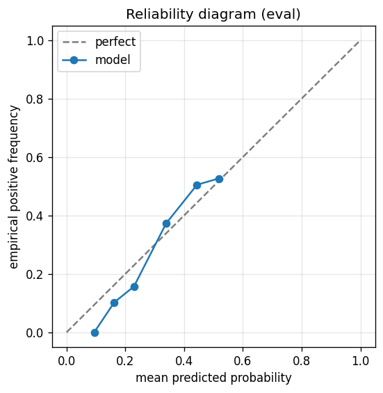

# gbdt experiment — nifty50_up_10pct_20d_pilot

## Spec

- universe: `nifty50`
- direction: `up`
- threshold_pct: `10`
- horizon_days: `20`

## Data

- tickers in universe: 50
- tickers used: 46
- tickers excluded: NSE:ETERNAL, NSE:JIOFIN, NSE:MAXHEALTH, NSE:SHRIRAMFIN
- train rows: 36800
- val rows: 18400
- eval rows: 9200
- test rows: 3680
- positive prevalence (train): 0.294
- positive prevalence (eval): 0.134

## Iteration history

| iter | n_features | train Brier | val Brier | gap | rationale | inner_stop |
|---|---|---|---|---|---|---|
| 0 | 279 | 0.1793 | 0.1604 | -0.0189 | iteration 0 — full feature pool, default HPs :: algorithmic fallback: kept 42/27 |  |
| 1 | 42 | 0.1779 | 0.1605 | -0.0174 | iteration 1 from FS+HP callback :: algorithmic fallback: kept 37/42 features |  |
| 2 | 37 | 0.1793 | 0.1595 | -0.0198 | iteration 2 from FS+HP callback :: inner_stop=plateau | plateau |

## Final checkpoint

- best iteration: 2
- iterations run: 3
- inner stop signal: `plateau`

## Calibration

- method requested: `conditional_isotonic`
- decision: `native`
- Spiegelhalter Z: 0.034
- Spiegelhalter p: 0.9732

## Headline metrics

| segment | Brier | base-rate Brier | improvement | LogLoss | AUC |
|---|---|---|---|---|---|
| eval | 0.1141 | 0.1161 | +0.0020 | 0.3888 | 0.6391 |
| test | 0.1476 | 0.1656 | +0.0180 | 0.4652 | 0.7353 |

## Per-experiment verdict (algorithmic readout)

Calibration: native-passable (|z|=0.03<2). Brier vs base-rate: +0.0020 (model beats baseline).

> NOTE: this verdict is generated from the metrics by a simple rule (see ``report._algorithmic_verdict``); it is NOT an automated pass/fail gate. The user reads the artifact and decides whether the cell ships.
