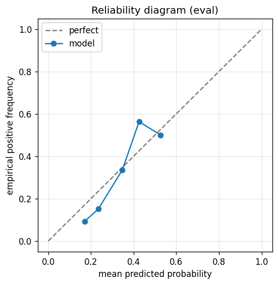

# gbdt experiment — nifty50_up_10pct_25d_dd5pct_catboost_phase8

## Warnings

- **hp_search**: HP search disabled in sweep mode (max_iter=1 < threshold=5); the FS+HP loop ran feature-selection only — see issue #32.

## Spec

- universe: `nifty50`
- direction: `up`
- threshold_pct: `10`
- horizon_days: `25`
- max_drawdown: `0.05`
- fs_hp_loop callback_mode: `default`

## Data

- tickers in universe: 50
- tickers used: 46
- tickers excluded: NSE:ETERNAL, NSE:JIOFIN, NSE:MAXHEALTH, NSE:SHRIRAMFIN
- train rows: 36800 (independent events ≈ 751.0; overlap-inflation 49.00×)
- val rows: 18400 (independent events ≈ 375.5; overlap-inflation 49.00×)
- eval rows: 9200 (independent events ≈ 187.8; overlap-inflation 49.00×)
- test rows: 3450 (independent events ≈ 70.4; overlap-inflation 49.00×)
- sample uniqueness weighting: `on` (horizon_days=25)
- positive prevalence (train): 0.280
- positive prevalence (eval): 0.132

## Iteration history

| iter | n_features | train Brier | val Brier | gap | rationale | inner_stop |
|---|---|---|---|---|---|---|
| 0 | 279 | 0.1711 | 0.1642 | -0.0069 | iteration 0 — full feature pool, default HPs :: inner_stop=cap | cap |

## Final checkpoint

- best iteration: 0
- iterations run: 1
- inner stop signal: `cap`
- fs_hp_loop callback_mode: `default`

## Calibration

- method requested: `conditional_isotonic`
- decision: `native`
- Spiegelhalter Z: -0.173
- Spiegelhalter p: 0.8623

## Headline metrics

| segment | Brier | base-rate Brier | improvement | LogLoss | AUC |
|---|---|---|---|---|---|
| eval | 0.1136 | 0.1146 | +0.0010 | 0.3893 | 0.6586 |
| test | 0.1382 | 0.1470 | +0.0089 | 0.4455 | 0.7291 |

## Top-K precision (per-day + global)

Per-day: pick the top-K rows by ``p_calibrated`` each date, pool across days. ``P@k = sum_d(positives_in_top_k(d)) / sum_d(min(R(d), k))`` where ``R(d)`` is the count of positives on day ``d`` — the ``min(R(d), k)`` denominator is the achievable-positives count (mandatory; see ``.claude/memories/project-r-precision-methodology.md``). ``n_denom = sum_d(min(R(d), k))``; ``n_days_R<k`` = days with fewer than ``k`` positives. Global: top-K by score across the whole segment, denominator ``min(k, total_positives)``. ``base_rate`` = unweighted segment positive prevalence (compare P@k to base_rate directly; lift omitted from the table by project reporting convention).

### eval — n_rows=9200, base_rate=0.1321

Per-day:

| k | P@k | base_rate | n_picks | n_positives | n_denom | days_R<k / days_full_k / days_total |
|---|---|---|---|---|---|---|
| 1 | 0.2796 | 0.1321 | 299 | 59 | 211 | 88 / 299 / 299 |
| 5 | 0.2356 | 0.1321 | 1102 | 176 | 747 | 211 / 200 / 299 |
| 10 | 0.2988 | 0.1321 | 2102 | 300 | 1004 | 266 / 200 / 299 |

Global (top-K across entire segment):

| k | P@k | base_rate | n_picks | n_positives | n_denom |
|---|---|---|---|---|---|
| 1 | 0.0000 | 0.1321 | 1 | 0 | 1 |
| 5 | 0.0000 | 0.1321 | 5 | 0 | 5 |
| 10 | 0.4000 | 0.1321 | 10 | 4 | 10 |

### test — n_rows=3450, base_rate=0.1791

Per-day:

| k | P@k | base_rate | n_picks | n_positives | n_denom | days_R<k / days_full_k / days_total |
|---|---|---|---|---|---|---|
| 1 | 0.1714 | 0.1791 | 153 | 12 | 70 | 83 / 153 / 153 |
| 5 | 0.2741 | 0.1791 | 455 | 74 | 270 | 109 / 75 / 153 |
| 10 | 0.4047 | 0.1791 | 830 | 174 | 430 | 126 / 75 / 153 |

Global (top-K across entire segment):

| k | P@k | base_rate | n_picks | n_positives | n_denom |
|---|---|---|---|---|---|
| 1 | 1.0000 | 0.1791 | 1 | 1 | 1 |
| 5 | 1.0000 | 0.1791 | 5 | 5 | 5 |
| 10 | 0.9000 | 0.1791 | 10 | 9 | 10 |

## Per-ticker hit-rate when picked (k=5)

Aggregates per-day top-5 picks by ticker. Top 10 most-picked + bottom 5 most-anti-predictive (when picked at least once) shown; the full table is in ``metrics.json::segment_diagnostics.<seg>.per_ticker_hit_rate.rows``.

### eval

Top-10 by n_picks:

| ticker | n_picks | n_positives | hit_rate |
|---|---|---|---|
| NSE:ADANIPORTS | 155 | 26 | 0.1677 |
| NSE:ADANIENT | 153 | 27 | 0.1765 |
| NSE:TRENT | 146 | 33 | 0.2260 |
| NSE:BEL | 134 | 35 | 0.2612 |
| NSE:NTPC | 100 | 17 | 0.1700 |
| NSE:WIPRO | 91 | 0 | 0.0000 |
| NSE:ONGC | 81 | 0 | 0.0000 |
| NSE:TMPV | 53 | 1 | 0.0189 |
| NSE:POWERGRID | 35 | 16 | 0.4571 |
| NSE:HDFCBANK | 34 | 0 | 0.0000 |

Bottom-5 by hit_rate (n_picks ≥ 5):

| ticker | n_picks | n_positives | hit_rate |
|---|---|---|---|
| NSE:WIPRO | 91 | 0 | 0.0000 |
| NSE:ONGC | 81 | 0 | 0.0000 |
| NSE:HDFCBANK | 34 | 0 | 0.0000 |
| NSE:COALINDIA | 29 | 0 | 0.0000 |
| NSE:BAJFINANCE | 10 | 0 | 0.0000 |

### test

Top-10 by n_picks:

| ticker | n_picks | n_positives | hit_rate |
|---|---|---|---|
| NSE:NTPC | 75 | 0 | 0.0000 |
| NSE:BEL | 52 | 9 | 0.1731 |
| NSE:TRENT | 51 | 16 | 0.3137 |
| NSE:ADANIENT | 48 | 13 | 0.2708 |
| NSE:WIPRO | 41 | 0 | 0.0000 |
| NSE:NESTLEIND | 32 | 0 | 0.0000 |
| NSE:TMPV | 25 | 6 | 0.2400 |
| NSE:ADANIPORTS | 22 | 8 | 0.3636 |
| NSE:HDFCBANK | 18 | 0 | 0.0000 |
| NSE:EICHERMOT | 17 | 3 | 0.1765 |

Bottom-5 by hit_rate (n_picks ≥ 5):

| ticker | n_picks | n_positives | hit_rate |
|---|---|---|---|
| NSE:NTPC | 75 | 0 | 0.0000 |
| NSE:WIPRO | 41 | 0 | 0.0000 |
| NSE:NESTLEIND | 32 | 0 | 0.0000 |
| NSE:HDFCBANK | 18 | 0 | 0.0000 |
| NSE:INDIGO | 6 | 0 | 0.0000 |

## Per-quarter P@5 stability

P@5 grouped by calendar quarter. ``base_rate`` is the segment-wide positive prevalence (constant across rows); regime-dependent collapse shows as a quarter where ``lift`` falls toward 1.0 or below.

### eval

| quarter | n_picks | n_positives | P@5 | base_rate | lift |
|---|---|---|---|---|---|
| 2024Q4 | 51 | 0 | 0.0000 | 0.1321 | 0.000 |
| 2025Q1 | 127 | 48 | 0.3780 | 0.1321 | 2.862 |
| 2025Q2 | 305 | 82 | 0.2689 | 0.1321 | 2.036 |
| 2025Q3 | 320 | 38 | 0.1187 | 0.1321 | 0.899 |
| 2025Q4 | 299 | 8 | 0.0268 | 0.1321 | 0.203 |

### test

| quarter | n_picks | n_positives | P@5 | base_rate | lift |
|---|---|---|---|---|---|
| 2025Q3 | 38 | 0 | 0.0000 | 0.1791 | 0.000 |
| 2025Q4 | 53 | 2 | 0.0377 | 0.1791 | 0.211 |
| 2026Q1 | 305 | 49 | 0.1607 | 0.1791 | 0.897 |
| 2026Q2 | 59 | 23 | 0.3898 | 0.1791 | 2.176 |

## Prediction-range diagnostics

Distribution of ``p_calibrated`` per segment. ``flag_low_separation = true`` when ``std < low_separation_threshold`` — a sign the model's predictions cluster so tightly that ranking is noise.

| segment | n_rows | min | max | mean | std | flag_low_separation |
|---|---|---|---|---|---|---|
| eval | 9200 | 0.1144 | 0.5815 | 0.2049 | 0.0593 | `False` |
| test | 3450 | 0.1179 | 0.5734 | 0.2576 | 0.0979 | `False` |

## Per-experiment verdict (algorithmic readout)

Calibration: native-passable (|z|=0.17<2). Brier vs base-rate: +0.0010 (model beats baseline).

> NOTE: this verdict is generated from the metrics by a simple rule (see ``report._algorithmic_verdict``); it is NOT an automated pass/fail gate. The user reads the artifact and decides whether the cell ships.
