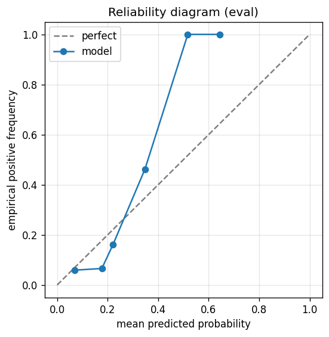

# gbdt experiment — nifty50_up_10pct_25d_dd5pct_xgb_acceptance

## Spec

- universe: `nifty50`
- direction: `up`
- threshold_pct: `10`
- horizon_days: `25`
- max_drawdown: `0.05`
- fs_hp_loop callback_mode: `agent_file_protocol`

## Data

- tickers in universe: 50
- tickers used: 46
- tickers excluded: NSE:ETERNAL, NSE:JIOFIN, NSE:MAXHEALTH, NSE:SHRIRAMFIN
- train rows: 36800 (independent events ≈ 751.0; overlap-inflation 49.00×)
- val rows: 18400 (independent events ≈ 375.5; overlap-inflation 49.00×)
- eval rows: 9200 (independent events ≈ 187.8; overlap-inflation 49.00×)
- test rows: 3450 (independent events ≈ 70.4; overlap-inflation 49.00×)
- sample uniqueness weighting: `on` (horizon_days=25)
- positive prevalence (train): 0.280
- positive prevalence (eval): 0.133

## Iteration history

| iter | n_features | train Brier | val Brier | gap | rationale | inner_stop |
|---|---|---|---|---|---|---|

## Final checkpoint

- best iteration: 1
- iterations run: 0
- inner stop signal: `agent_should_stop`
- fs_hp_loop callback_mode: `agent_file_protocol`

## Calibration

- method requested: `conditional_isotonic`
- decision: `isotonic`
- Spiegelhalter Z: -3.893
- Spiegelhalter p: 0.0001

## Headline metrics

| segment | Brier | base-rate Brier | improvement | LogLoss | AUC |
|---|---|---|---|---|---|
| eval | 0.1145 | 0.1149 | +0.0005 | 0.4037 | 0.6576 |
| test | 0.1408 | 0.1470 | +0.0063 | 0.4536 | 0.6561 |

## Top-K precision (per-day + global)

Per-day: pick the top-K rows by ``p_calibrated`` each date, pool across days. ``P@k = sum_d(positives_in_top_k(d)) / sum_d(min(R(d), k))`` where ``R(d)`` is the count of positives on day ``d`` — the ``min(R(d), k)`` denominator is the achievable-positives count (mandatory; see ``.claude/memories/project-r-precision-methodology.md``). ``n_denom = sum_d(min(R(d), k))``; ``n_days_R<k`` = days with fewer than ``k`` positives. Global: top-K by score across the whole segment, denominator ``min(k, total_positives)``. ``base_rate`` = unweighted segment positive prevalence (compare P@k to base_rate directly; lift omitted from the table by project reporting convention).

### eval — n_rows=9200, base_rate=0.1325

Per-day:

| k | P@k | base_rate | n_picks | n_positives | n_denom | days_R<k / days_full_k / days_total |
|---|---|---|---|---|---|---|
| 1 | 0.2133 | 0.1325 | 297 | 45 | 211 | 86 / 297 / 297 |
| 5 | 0.2584 | 0.1325 | 1098 | 193 | 747 | 209 / 200 / 297 |
| 10 | 0.3247 | 0.1325 | 2098 | 326 | 1004 | 264 / 200 / 297 |

Global (top-K across entire segment):

| k | P@k | base_rate | n_picks | n_positives | n_denom |
|---|---|---|---|---|---|
| 1 | 1.0000 | 0.1325 | 1 | 1 | 1 |
| 5 | 1.0000 | 0.1325 | 5 | 5 | 5 |
| 10 | 0.8000 | 0.1325 | 10 | 8 | 10 |

### test — n_rows=3450, base_rate=0.1791

Per-day:

| k | P@k | base_rate | n_picks | n_positives | n_denom | days_R<k / days_full_k / days_total |
|---|---|---|---|---|---|---|
| 1 | 0.2571 | 0.1791 | 151 | 18 | 70 | 81 / 151 / 151 |
| 5 | 0.3815 | 0.1791 | 451 | 103 | 270 | 107 / 75 / 151 |
| 10 | 0.3930 | 0.1791 | 826 | 169 | 430 | 124 / 75 / 151 |

Global (top-K across entire segment):

| k | P@k | base_rate | n_picks | n_positives | n_denom |
|---|---|---|---|---|---|
| 1 | 1.0000 | 0.1791 | 1 | 1 | 1 |
| 5 | 0.8000 | 0.1791 | 5 | 4 | 5 |
| 10 | 0.6000 | 0.1791 | 10 | 6 | 10 |

## Per-ticker hit-rate when picked (k=5)

Aggregates per-day top-5 picks by ticker. Top 10 most-picked + bottom 5 most-anti-predictive (when picked at least once) shown; the full table is in ``metrics.json::segment_diagnostics.<seg>.per_ticker_hit_rate.rows``.

### eval

Top-10 by n_picks:

| ticker | n_picks | n_positives | hit_rate |
|---|---|---|---|
| NSE:ADANIENT | 193 | 33 | 0.1710 |
| NSE:ADANIPORTS | 192 | 21 | 0.1094 |
| NSE:BEL | 146 | 35 | 0.2397 |
| NSE:NTPC | 101 | 17 | 0.1683 |
| NSE:BAJFINANCE | 99 | 10 | 0.1010 |
| NSE:COALINDIA | 76 | 1 | 0.0132 |
| NSE:BAJAJ-AUTO | 69 | 17 | 0.2464 |
| NSE:ASIANPAINT | 40 | 10 | 0.2500 |
| NSE:APOLLOHOSP | 38 | 15 | 0.3947 |
| NSE:WIPRO | 31 | 0 | 0.0000 |

Bottom-5 by hit_rate (n_picks ≥ 5):

| ticker | n_picks | n_positives | hit_rate |
|---|---|---|---|
| NSE:WIPRO | 31 | 0 | 0.0000 |
| NSE:TRENT | 6 | 0 | 0.0000 |
| NSE:HDFCBANK | 5 | 0 | 0.0000 |
| NSE:COALINDIA | 76 | 1 | 0.0132 |
| NSE:BAJAJFINSV | 22 | 1 | 0.0455 |

### test

Top-10 by n_picks:

| ticker | n_picks | n_positives | hit_rate |
|---|---|---|---|
| NSE:NTPC | 75 | 0 | 0.0000 |
| NSE:ADANIENT | 74 | 21 | 0.2838 |
| NSE:ADANIPORTS | 64 | 21 | 0.3281 |
| NSE:ASIANPAINT | 41 | 13 | 0.3171 |
| NSE:BAJFINANCE | 34 | 7 | 0.2059 |
| NSE:APOLLOHOSP | 32 | 7 | 0.2188 |
| NSE:BAJAJ-AUTO | 23 | 3 | 0.1304 |
| NSE:BEL | 23 | 10 | 0.4348 |
| NSE:AXISBANK | 20 | 6 | 0.3000 |
| NSE:HDFCBANK | 12 | 0 | 0.0000 |

Bottom-5 by hit_rate (n_picks ≥ 5):

| ticker | n_picks | n_positives | hit_rate |
|---|---|---|---|
| NSE:NTPC | 75 | 0 | 0.0000 |
| NSE:HDFCBANK | 12 | 0 | 0.0000 |
| NSE:NESTLEIND | 5 | 0 | 0.0000 |
| NSE:INDIGO | 11 | 1 | 0.0909 |
| NSE:BAJAJ-AUTO | 23 | 3 | 0.1304 |

## Per-quarter P@5 stability

P@5 grouped by calendar quarter. ``base_rate`` is the segment-wide positive prevalence (constant across rows); regime-dependent collapse shows as a quarter where ``lift`` falls toward 1.0 or below.

### eval

| quarter | n_picks | n_positives | P@5 | base_rate | lift |
|---|---|---|---|---|---|
| 2024Q4 | 51 | 0 | 0.0000 | 0.1325 | 0.000 |
| 2025Q1 | 127 | 42 | 0.3307 | 0.1325 | 2.496 |
| 2025Q2 | 305 | 77 | 0.2525 | 0.1325 | 1.905 |
| 2025Q3 | 320 | 65 | 0.2031 | 0.1325 | 1.533 |
| 2025Q4 | 295 | 9 | 0.0305 | 0.1325 | 0.230 |

### test

| quarter | n_picks | n_positives | P@5 | base_rate | lift |
|---|---|---|---|---|---|
| 2025Q3 | 38 | 0 | 0.0000 | 0.1791 | 0.000 |
| 2025Q4 | 53 | 3 | 0.0566 | 0.1791 | 0.316 |
| 2026Q1 | 305 | 68 | 0.2230 | 0.1791 | 1.245 |
| 2026Q2 | 55 | 32 | 0.5818 | 0.1791 | 3.248 |

## Prediction-range diagnostics

Distribution of ``p_calibrated`` per segment. ``flag_low_separation = true`` when ``std < low_separation_threshold`` — a sign the model's predictions cluster so tightly that ranking is noise.

| segment | n_rows | min | max | mean | std | flag_low_separation |
|---|---|---|---|---|---|---|
| eval | 9200 | 0.0000 | 0.6440 | 0.1817 | 0.0700 | `False` |
| test | 3450 | 0.0906 | 0.6222 | 0.2259 | 0.0590 | `False` |

## Per-experiment verdict (algorithmic readout)

Calibration: required isotonic (|z|=3.89); shipped as `isotonic`. Brier vs base-rate: +0.0005 (model beats baseline).

> NOTE: this verdict is generated from the metrics by a simple rule (see ``report._algorithmic_verdict``); it is NOT an automated pass/fail gate. The user reads the artifact and decides whether the cell ships.
