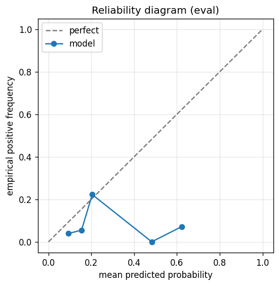

# gbdt experiment — nifty50_up_20pct_50d_dd10pct_post_fix

## Spec

- universe: `nifty50`
- direction: `up`
- threshold_pct: `20`
- horizon_days: `50`
- max_drawdown: `0.1`
- fs_hp_loop callback_mode: `default`

## Data

- tickers in universe: 50
- tickers used: 46
- tickers excluded: NSE:ETERNAL, NSE:JIOFIN, NSE:MAXHEALTH, NSE:SHRIRAMFIN
- train rows: 36800 (independent events ≈ 371.7; overlap-inflation 99.00×)
- val rows: 18400 (independent events ≈ 185.9; overlap-inflation 99.00×)
- eval rows: 9200 (independent events ≈ 92.9; overlap-inflation 99.00×)
- test rows: 2300 (independent events ≈ 23.2; overlap-inflation 99.00×)
- sample uniqueness weighting: `on` (horizon_days=50)
- positive prevalence (train): 0.202
- positive prevalence (eval): 0.047

## Iteration history

| iter | n_features | train Brier | val Brier | gap | rationale | inner_stop |
|---|---|---|---|---|---|---|
| 0 | 279 | 0.1256 | 0.1166 | -0.0090 | iteration 0 — full feature pool, default HPs :: algorithmic fallback: kept 40/27 |  |
| 1 | 40 | 0.1269 | 0.1150 | -0.0119 | iteration 1 from FS+HP callback :: algorithmic fallback: kept 32/40 features |  |
| 2 | 32 | 0.1238 | 0.1156 | -0.0082 | iteration 2 from FS+HP callback :: inner_stop=plateau | plateau |

## Final checkpoint

- best iteration: 1
- iterations run: 3
- inner stop signal: `plateau`
- fs_hp_loop callback_mode: `default`

## Calibration

- method requested: `conditional_isotonic`
- decision: `isotonic`
- Spiegelhalter Z: -4.815
- Spiegelhalter p: 0.0000

## Headline metrics

| segment | Brier | base-rate Brier | improvement | LogLoss | AUC |
|---|---|---|---|---|---|
| eval | 0.0517 | 0.0450 | -0.0067 | 0.2230 | 0.5902 |
| test | 0.0310 | 0.0137 | -0.0173 | 0.1753 | 0.5548 |

## Top-K precision (per-day + global)

Per-day: pick the top-K rows by ``p_calibrated`` each date, pool across days. ``P@k = sum_d(positives_in_top_k(d)) / sum_d(min(R(d), k))`` where ``R(d)`` is the count of positives on day ``d`` — the ``min(R(d), k)`` denominator is the achievable-positives count (mandatory; see ``.claude/memories/project-r-precision-methodology.md``). ``n_denom = sum_d(min(R(d), k))``; ``n_days_R<k`` = days with fewer than ``k`` positives. Global: top-K by score across the whole segment, denominator ``min(k, total_positives)``. ``base_rate`` = unweighted segment positive prevalence (compare P@k to base_rate directly; lift omitted from the table by project reporting convention).

### eval — n_rows=9200, base_rate=0.0473

Per-day:

| k | P@k | base_rate | n_picks | n_positives | n_denom | days_R<k / days_full_k / days_total |
|---|---|---|---|---|---|---|
| 1 | 0.0974 | 0.0473 | 299 | 15 | 154 | 145 / 299 / 299 |
| 5 | 0.2481 | 0.0473 | 1102 | 97 | 391 | 283 / 200 / 299 |
| 10 | 0.3466 | 0.0473 | 2102 | 148 | 427 | 295 / 200 / 299 |

Global (top-K across entire segment):

| k | P@k | base_rate | n_picks | n_positives | n_denom |
|---|---|---|---|---|---|
| 1 | 0.0000 | 0.0473 | 1 | 0 | 1 |
| 5 | 0.4000 | 0.0473 | 5 | 2 | 5 |
| 10 | 0.2000 | 0.0473 | 10 | 2 | 10 |

### test — n_rows=2300, base_rate=0.0139

Per-day:

| k | P@k | base_rate | n_picks | n_positives | n_denom | days_R<k / days_full_k / days_total |
|---|---|---|---|---|---|---|
| 1 | 0.1000 | 0.0139 | 103 | 2 | 20 | 83 / 103 / 103 |
| 5 | 0.2500 | 0.0139 | 305 | 8 | 32 | 103 / 50 / 103 |
| 10 | 0.2812 | 0.0139 | 555 | 9 | 32 | 103 / 50 / 103 |

Global (top-K across entire segment):

| k | P@k | base_rate | n_picks | n_positives | n_denom |
|---|---|---|---|---|---|
| 1 | 0.0000 | 0.0139 | 1 | 0 | 1 |
| 5 | 0.4000 | 0.0139 | 5 | 2 | 5 |
| 10 | 0.2000 | 0.0139 | 10 | 2 | 10 |

## Per-ticker hit-rate when picked (k=5)

Aggregates per-day top-5 picks by ticker. Top 10 most-picked + bottom 5 most-anti-predictive (when picked at least once) shown; the full table is in ``metrics.json::segment_diagnostics.<seg>.per_ticker_hit_rate.rows``.

### eval

Top-10 by n_picks:

| ticker | n_picks | n_positives | hit_rate |
|---|---|---|---|
| NSE:ADANIENT | 165 | 1 | 0.0061 |
| NSE:TRENT | 149 | 7 | 0.0470 |
| NSE:INDIGO | 142 | 1 | 0.0070 |
| NSE:ADANIPORTS | 131 | 28 | 0.2137 |
| NSE:NTPC | 97 | 4 | 0.0412 |
| NSE:HINDALCO | 85 | 26 | 0.3059 |
| NSE:BEL | 74 | 13 | 0.1757 |
| NSE:BAJAJFINSV | 39 | 0 | 0.0000 |
| NSE:HCLTECH | 38 | 3 | 0.0789 |
| NSE:M&M | 36 | 1 | 0.0278 |

Bottom-5 by hit_rate (n_picks ≥ 5):

| ticker | n_picks | n_positives | hit_rate |
|---|---|---|---|
| NSE:BAJAJFINSV | 39 | 0 | 0.0000 |
| NSE:TMPV | 31 | 0 | 0.0000 |
| NSE:JSWSTEEL | 15 | 0 | 0.0000 |
| NSE:ASIANPAINT | 9 | 0 | 0.0000 |
| NSE:INFY | 8 | 0 | 0.0000 |

### test

Top-10 by n_picks:

| ticker | n_picks | n_positives | hit_rate |
|---|---|---|---|
| NSE:NTPC | 50 | 0 | 0.0000 |
| NSE:ADANIENT | 37 | 1 | 0.0270 |
| NSE:HINDALCO | 33 | 1 | 0.0303 |
| NSE:ADANIPORTS | 26 | 3 | 0.1154 |
| NSE:INDIGO | 25 | 0 | 0.0000 |
| NSE:ONGC | 20 | 0 | 0.0000 |
| NSE:ASIANPAINT | 15 | 1 | 0.0667 |
| NSE:BAJFINANCE | 14 | 0 | 0.0000 |
| NSE:JSWSTEEL | 12 | 0 | 0.0000 |
| NSE:TRENT | 11 | 0 | 0.0000 |

Bottom-5 by hit_rate (n_picks ≥ 5):

| ticker | n_picks | n_positives | hit_rate |
|---|---|---|---|
| NSE:NTPC | 50 | 0 | 0.0000 |
| NSE:INDIGO | 25 | 0 | 0.0000 |
| NSE:ONGC | 20 | 0 | 0.0000 |
| NSE:BAJFINANCE | 14 | 0 | 0.0000 |
| NSE:JSWSTEEL | 12 | 0 | 0.0000 |

## Per-quarter P@5 stability

P@5 grouped by calendar quarter. ``base_rate`` is the segment-wide positive prevalence (constant across rows); regime-dependent collapse shows as a quarter where ``lift`` falls toward 1.0 or below.

### eval

| quarter | n_picks | n_positives | P@5 | base_rate | lift |
|---|---|---|---|---|---|
| 2024Q4 | 51 | 0 | 0.0000 | 0.0473 | 0.000 |
| 2025Q1 | 127 | 34 | 0.2677 | 0.0473 | 5.662 |
| 2025Q2 | 305 | 22 | 0.0721 | 0.0473 | 1.526 |
| 2025Q3 | 320 | 5 | 0.0156 | 0.0473 | 0.330 |
| 2025Q4 | 299 | 36 | 0.1204 | 0.0473 | 2.546 |

### test

| quarter | n_picks | n_positives | P@5 | base_rate | lift |
|---|---|---|---|---|---|
| 2025Q3 | 38 | 0 | 0.0000 | 0.0139 | 0.000 |
| 2025Q4 | 28 | 1 | 0.0357 | 0.0139 | 2.567 |
| 2026Q1 | 239 | 7 | 0.0293 | 0.0139 | 2.105 |

## Prediction-range diagnostics

Distribution of ``p_calibrated`` per segment. ``flag_low_separation = true`` when ``std < low_separation_threshold`` — a sign the model's predictions cluster so tightly that ranking is noise.

| segment | n_rows | min | max | mean | std | flag_low_separation |
|---|---|---|---|---|---|---|
| eval | 9200 | 0.0000 | 0.6222 | 0.1229 | 0.0459 | `True` |
| test | 2300 | 0.0000 | 0.6222 | 0.1382 | 0.0487 | `True` |

## Per-experiment verdict (algorithmic readout)

Calibration: required isotonic (|z|=4.81); shipped as `isotonic`. Brier vs base-rate: -0.0067 (worse than baseline).

> NOTE: this verdict is generated from the metrics by a simple rule (see ``report._algorithmic_verdict``); it is NOT an automated pass/fail gate. The user reads the artifact and decides whether the cell ships.
