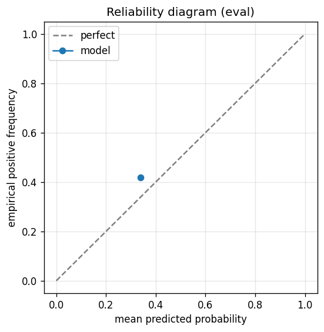

# gbdt experiment — russell1000_up_10pct_200d_dd5pct_aligned

## Warnings

- **hp_search**: HP search disabled in sweep mode (max_iter=3 < threshold=5); the FS+HP loop ran feature-selection only — see issue #32.

## Spec

- universe: `russell1000`
- direction: `up`
- threshold_pct: `10`
- horizon_days: `200`
- max_drawdown: `0.05`
- fs_hp_loop callback_mode: `default`

## Data

- tickers in universe: 1002
- tickers used: 858
- tickers excluded: NASDAQ:ABNB, NASDAQ:APP, NASDAQ:CEG, NASDAQ:CRWD, NASDAQ:DASH, NASDAQ:DDOG, NASDAQ:GEHC, NASDAQ:GFS, NASDAQ:PLTR, NYSE:ACI, NYSE:AFRM, NYSE:ALAB, NYSE:ALGM, NYSE:AMTM, NYSE:APG, NYSE:AS, NYSE:ASTS, NYSE:AUR, NYSE:AVTR, NYSE:BAM, NYSE:BEPC, NYSE:BILL, NYSE:BIRK, NYSE:BJ, NYSE:BLSH, NYSE:BRBR, NYSE:BROS, NYSE:BSY, NYSE:CAI, NYSE:CARR, NYSE:CART, NYSE:CAVA, NYSE:CBC, NYSE:CCC, NYSE:CERT, NYSE:CHWY, NYSE:CLVT, NYSE:CNM, NYSE:CNXC, NYSE:COIN, NYSE:CPNG, NYSE:CR, NYSE:CRCL, NYSE:CTVA, NYSE:DJT, NYSE:DKNG, NYSE:DOCS, NYSE:DOW, NYSE:DT, NYSE:DTM, NYSE:DUOL, NYSE:DV, NYSE:ECG, NYSE:ELAN, NYSE:ESAB, NYSE:ESTC, NYSE:EXE, NYSE:FIGR, NYSE:FOUR, NYSE:FOX, NYSE:FOXA, NYSE:FRMI, NYSE:GEV, NYSE:GLIBA, NYSE:GLIBK, NYSE:GTLB, NYSE:GTM, NYSE:GXO, NYSE:HAYW, NYSE:HOOD, NYSE:INGM, NYSE:IOT, NYSE:KD, NYSE:KRMN, NYSE:KVUE, NYSE:LCID, NYSE:LINE, NYSE:LLYVA, NYSE:LLYVK, NYSE:LOAR, NYSE:LYFT, NYSE:MDLN, NYSE:MP, NYSE:MRNA, NYSE:MRP, NYSE:NCNO, NYSE:NET, NYSE:NIQ, NYSE:NU, NYSE:NVST, NYSE:OGN, NYSE:ONON, NYSE:ONTO, NYSE:OTIS, NYSE:OWL, NYSE:PATH, NYSE:PCOR, NYSE:PINS, NYSE:PSN, NYSE:Q, NYSE:QS, NYSE:RAL, NYSE:RBLX, NYSE:RBRK, NYSE:RDDT, NYSE:REYN, NYSE:RIVN, NYSE:RKLB, NYSE:RKT, NYSE:ROIV, NYSE:RPRX, NYSE:RVMD, NYSE:RYAN, NYSE:S, NYSE:SAIL, NYSE:SARO, NYSE:SFD, NYSE:SHC, NYSE:SN, NYSE:SNDK, NYSE:SNOW, NYSE:SOFI, NYSE:SOLS, NYSE:SOLV, NYSE:TEM, NYSE:TIGO, NYSE:TLN, NYSE:TOST, NYSE:TPG, NYSE:TW, NYSE:U, NYSE:UBER, NYSE:UHAL-B, NYSE:UWMC, NYSE:VGNT, NYSE:VIK, NYSE:VLTO, NYSE:VNT, NYSE:VRT, NYSE:VSNT, NYSE:WFRD, NYSE:XP, NYSE:YETI, NYSE:ZM
- train rows: 685740 (independent events ≈ 1721.4; overlap-inflation 398.37×)
- val rows: 343200 (independent events ≈ 860.2; overlap-inflation 399.00×)
- eval rows: 171600 (independent events ≈ 430.1; overlap-inflation 399.00×)
- test rows: 257400 (independent events ≈ 645.1; overlap-inflation 399.00×)
- sample uniqueness weighting: `on` (horizon_days=200)
- positive prevalence (train): 0.427
- positive prevalence (eval): 0.418

## Segment windows

- split mode: `date_aligned`
- train_start anchor: `2018-01-01`
- train: `2018-01-02` → `2021-03-08`
- val: `2021-03-09` → `2022-10-06`
- eval: `2022-10-07` → `2023-07-26`
- test: `2023-07-27` → `2024-10-03`

## Iteration history

| iter | n_features | train Brier | val Brier | gap | rationale | inner_stop |
|---|---|---|---|---|---|---|
| 0 | 279 | 0.2472 | 0.2511 | 0.0039 | iteration 0 — full feature pool, default HPs :: algorithmic fallback: kept 10/27 |  |
| 1 | 10 | 0.2472 | 0.2511 | 0.0039 | iteration 1 from FS+HP callback :: algorithmic fallback: kept 10/10 features |  |
| 2 | 10 | 0.2472 | 0.2511 | 0.0039 | iteration 2 from FS+HP callback :: inner_stop=plateau | plateau |

## Final checkpoint

- best iteration: 0
- iterations run: 3
- inner stop signal: `plateau`
- fs_hp_loop callback_mode: `default`

## Calibration

- method requested: `conditional_isotonic`
- decision: `isotonic`
- Spiegelhalter Z: 126.542
- Spiegelhalter p: 0.0000

## Headline metrics

| segment | Brier | base-rate Brier | improvement | LogLoss | AUC |
|---|---|---|---|---|---|
| eval | 0.2493 | 0.2432 | -0.0061 | 0.6928 | 0.5000 |
| test | 0.2626 | 0.2483 | -0.0143 | 0.7203 | 0.5000 |

## Top-K precision (per-day + global)

Per-day: pick the top-K rows by ``p_calibrated`` each date, pool across days. ``P@k = sum_d(positives_in_top_k(d)) / sum_d(min(R(d), k))`` where ``R(d)`` is the count of positives on day ``d`` — the ``min(R(d), k)`` denominator is the achievable-positives count (mandatory; see ``.claude/memories/project-r-precision-methodology.md``). ``n_denom = sum_d(min(R(d), k))``; ``n_days_R<k`` = days with fewer than ``k`` positives. Global: top-K by score across the whole segment, denominator ``min(k, total_positives)``. ``base_rate`` = unweighted segment positive prevalence (compare P@k to base_rate directly; lift omitted from the table by project reporting convention).

### eval — n_rows=171600, base_rate=0.4176

Per-day:

| k | P@k | base_rate | n_picks | n_positives | n_denom | days_R<k / days_full_k / days_total |
|---|---|---|---|---|---|---|
| 1 | 0.5400 | 0.4176 | 200 | 108 | 200 | 0 / 200 / 200 |
| 5 | 0.5400 | 0.4176 | 1000 | 540 | 1000 | 0 / 200 / 200 |
| 10 | 0.4805 | 0.4176 | 2000 | 961 | 2000 | 0 / 200 / 200 |

Global (top-K across entire segment):

| k | P@k | base_rate | n_picks | n_positives | n_denom |
|---|---|---|---|---|---|
| 1 | 1.0000 | 0.4176 | 1 | 1 | 1 |
| 5 | 0.8000 | 0.4176 | 5 | 4 | 5 |
| 10 | 0.5000 | 0.4176 | 10 | 5 | 10 |

### test — n_rows=257400, base_rate=0.4590

Per-day:

| k | P@k | base_rate | n_picks | n_positives | n_denom | days_R<k / days_full_k / days_total |
|---|---|---|---|---|---|---|
| 1 | 0.4900 | 0.4590 | 300 | 147 | 300 | 0 / 300 / 300 |
| 5 | 0.4180 | 0.4590 | 1500 | 627 | 1500 | 0 / 300 / 300 |
| 10 | 0.4500 | 0.4590 | 3000 | 1350 | 3000 | 0 / 300 / 300 |

Global (top-K across entire segment):

| k | P@k | base_rate | n_picks | n_positives | n_denom |
|---|---|---|---|---|---|
| 1 | 0.0000 | 0.4590 | 1 | 0 | 1 |
| 5 | 0.0000 | 0.4590 | 5 | 0 | 5 |
| 10 | 0.0000 | 0.4590 | 10 | 0 | 10 |

## Per-ticker hit-rate when picked (k=5)

Aggregates per-day top-5 picks by ticker. Top 10 most-picked + bottom 5 most-anti-predictive (when picked at least once) shown; the full table is in ``metrics.json::segment_diagnostics.<seg>.per_ticker_hit_rate.rows``.

### eval

Top-10 by n_picks:

| ticker | n_picks | n_positives | hit_rate |
|---|---|---|---|
| NASDAQ:AAPL | 200 | 108 | 0.5400 |
| NASDAQ:ADBE | 200 | 124 | 0.6200 |
| NASDAQ:ADI | 200 | 93 | 0.4650 |
| NASDAQ:ADP | 200 | 111 | 0.5550 |
| NASDAQ:ADSK | 200 | 104 | 0.5200 |

Bottom-5 by hit_rate (n_picks ≥ 5):

| ticker | n_picks | n_positives | hit_rate |
|---|---|---|---|
| NASDAQ:ADI | 200 | 93 | 0.4650 |
| NASDAQ:ADSK | 200 | 104 | 0.5200 |
| NASDAQ:AAPL | 200 | 108 | 0.5400 |
| NASDAQ:ADP | 200 | 111 | 0.5550 |
| NASDAQ:ADBE | 200 | 124 | 0.6200 |

### test

Top-10 by n_picks:

| ticker | n_picks | n_positives | hit_rate |
|---|---|---|---|
| NASDAQ:AAPL | 300 | 147 | 0.4900 |
| NASDAQ:ADBE | 300 | 70 | 0.2333 |
| NASDAQ:ADI | 300 | 108 | 0.3600 |
| NASDAQ:ADP | 300 | 180 | 0.6000 |
| NASDAQ:ADSK | 300 | 122 | 0.4067 |

Bottom-5 by hit_rate (n_picks ≥ 5):

| ticker | n_picks | n_positives | hit_rate |
|---|---|---|---|
| NASDAQ:ADBE | 300 | 70 | 0.2333 |
| NASDAQ:ADI | 300 | 108 | 0.3600 |
| NASDAQ:ADSK | 300 | 122 | 0.4067 |
| NASDAQ:AAPL | 300 | 147 | 0.4900 |
| NASDAQ:ADP | 300 | 180 | 0.6000 |

## Per-quarter P@5 stability

P@5 grouped by calendar quarter. ``base_rate`` is the segment-wide positive prevalence (constant across rows); regime-dependent collapse shows as a quarter where ``P@5`` falls toward ``base_rate`` or below. ``lift`` omitted from the table by project reporting convention.

### eval

| quarter | n_picks | n_positives | P@5 | base_rate |
|---|---|---|---|---|
| 2022Q4 | 295 | 149 | 0.5051 | 0.4176 |
| 2023Q1 | 310 | 154 | 0.4968 | 0.4176 |
| 2023Q2 | 310 | 208 | 0.6710 | 0.4176 |
| 2023Q3 | 85 | 29 | 0.3412 | 0.4176 |

### test

| quarter | n_picks | n_positives | P@5 | base_rate |
|---|---|---|---|---|
| 2023Q3 | 230 | 51 | 0.2217 | 0.4590 |
| 2023Q4 | 315 | 153 | 0.4857 | 0.4590 |
| 2024Q1 | 305 | 96 | 0.3148 | 0.4590 |
| 2024Q2 | 315 | 157 | 0.4984 | 0.4590 |
| 2024Q3 | 320 | 161 | 0.5031 | 0.4590 |
| 2024Q4 | 15 | 9 | 0.6000 | 0.4590 |

## Prediction-range diagnostics

Distribution of ``p_calibrated`` per segment. ``flag_low_separation = true`` when ``std < low_separation_threshold`` — a sign the model's predictions cluster so tightly that ranking is noise.

| segment | n_rows | min | max | mean | std | flag_low_separation |
|---|---|---|---|---|---|---|
| eval | 171600 | 0.3392 | 0.3392 | 0.3392 | 0.0000 | `True` |
| test | 257400 | 0.3392 | 0.3392 | 0.3392 | 0.0000 | `True` |

## Per-experiment verdict (algorithmic readout)

Calibration: required isotonic (|z|=126.54); shipped as `isotonic`. Brier vs base-rate: -0.0061 (worse than baseline).

> NOTE: this verdict is generated from the metrics by a simple rule (see ``report._algorithmic_verdict``); it is NOT an automated pass/fail gate. The user reads the artifact and decides whether the cell ships.
