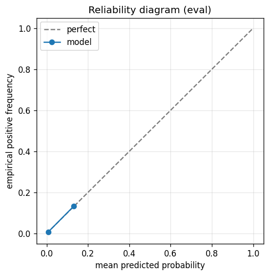

# gbdt experiment — russell1000_up_40pct_25d_dd20pct_b_acceptance

## Spec

- universe: `russell1000`
- direction: `up`
- threshold_pct: `40`
- horizon_days: `25`
- max_drawdown: `0.2`
- fs_hp_loop callback_mode: `default`

## Data

- tickers in universe: 1002
- tickers used: 889
- tickers excluded: NASDAQ:ABNB, NASDAQ:APP, NASDAQ:CEG, NASDAQ:DASH, NASDAQ:GEHC, NASDAQ:GFS, NASDAQ:PLTR, NYSE:ACI, NYSE:AFRM, NYSE:ALAB, NYSE:ALGM, NYSE:AMTM, NYSE:APG, NYSE:AS, NYSE:AUR, NYSE:BAM, NYSE:BEPC, NYSE:BIRK, NYSE:BLSH, NYSE:BROS, NYSE:BSY, NYSE:CAI, NYSE:CARR, NYSE:CART, NYSE:CAVA, NYSE:CBC, NYSE:CCC, NYSE:CERT, NYSE:CNM, NYSE:CNXC, NYSE:COIN, NYSE:CPNG, NYSE:CR, NYSE:CRCL, NYSE:DJT, NYSE:DOCS, NYSE:DTM, NYSE:DUOL, NYSE:DV, NYSE:ECG, NYSE:ESAB, NYSE:EXE, NYSE:FIGR, NYSE:FOUR, NYSE:FRMI, NYSE:GEV, NYSE:GLIBA, NYSE:GLIBK, NYSE:GTLB, NYSE:GTM, NYSE:GXO, NYSE:HAYW, NYSE:HOOD, NYSE:INGM, NYSE:IOT, NYSE:KD, NYSE:KRMN, NYSE:KVUE, NYSE:LCID, NYSE:LINE, NYSE:LLYVA, NYSE:LLYVK, NYSE:LOAR, NYSE:MDLN, NYSE:MP, NYSE:MRP, NYSE:NCNO, NYSE:NIQ, NYSE:NU, NYSE:OGN, NYSE:ONON, NYSE:OTIS, NYSE:OWL, NYSE:PATH, NYSE:PCOR, NYSE:Q, NYSE:QS, NYSE:RAL, NYSE:RBLX, NYSE:RBRK, NYSE:RDDT, NYSE:REYN, NYSE:RIVN, NYSE:RKLB, NYSE:RKT, NYSE:ROIV, NYSE:RPRX, NYSE:RVMD, NYSE:RYAN, NYSE:S, NYSE:SAIL, NYSE:SARO, NYSE:SFD, NYSE:SHC, NYSE:SN, NYSE:SNDK, NYSE:SNOW, NYSE:SOFI, NYSE:SOLS, NYSE:SOLV, NYSE:TEM, NYSE:TLN, NYSE:TOST, NYSE:TPG, NYSE:U, NYSE:UHAL-B, NYSE:UWMC, NYSE:VGNT, NYSE:VIK, NYSE:VLTO, NYSE:VNT, NYSE:VSNT, NYSE:WFRD
- train rows: 711200 (independent events ≈ 14514.3; overlap-inflation 49.00×)
- val rows: 355600 (independent events ≈ 7257.1; overlap-inflation 49.00×)
- eval rows: 177800 (independent events ≈ 3628.6; overlap-inflation 49.00×)
- test rows: 66675 (independent events ≈ 1360.7; overlap-inflation 49.00×)
- sample uniqueness weighting: `on` (horizon_days=25)
- positive prevalence (train): 0.010
- positive prevalence (eval): 0.009

## Segment windows

- split mode: `trailing`
- train: `2020-05-12` → `2023-08-08`
- val: `2023-07-18` → `2025-03-13`
- eval: `2025-02-20` → `2025-12-29`
- test: `2025-12-05` → `2026-04-17`

## Iteration history

| iter | n_features | train Brier | val Brier | gap | rationale | inner_stop |
|---|---|---|---|---|---|---|
| 0 | 26 | 0.0093 | 0.0056 | -0.0037 | iteration 0 — full feature pool, default HPs :: algorithmic fallback: kept 13/26 |  |
| 1 | 13 | 0.0092 | 0.0056 | -0.0036 | iteration 1 from FS+HP callback :: algorithmic fallback: kept 13/13 features |  |
| 2 | 13 | 0.0092 | 0.0056 | -0.0036 | iteration 2 from FS+HP callback :: inner_stop=plateau | plateau |

## Final checkpoint

- best iteration: 0
- iterations run: 3
- inner stop signal: `plateau`
- fs_hp_loop callback_mode: `default`

## Calibration

- method requested: `conditional_isotonic`
- decision: `isotonic`
- Spiegelhalter Z: -14.399
- Spiegelhalter p: 0.0000

## Headline metrics

| segment | Brier | base-rate Brier | improvement | LogLoss | AUC |
|---|---|---|---|---|---|
| eval | 0.0086 | 0.0092 | +0.0005 | 0.0399 | 0.8953 |
| test | 0.0168 | 0.0175 | +0.0007 | 0.0772 | 0.8320 |

## Top-K precision (per-day + global)

Per-day: pick the top-K rows by ``p_calibrated`` each date, pool across days. ``P@k = sum_d(positives_in_top_k(d)) / sum_d(min(R(d), k))`` where ``R(d)`` is the count of positives on day ``d`` — the ``min(R(d), k)`` denominator is the achievable-positives count (mandatory; see ``.claude/memories/project-r-precision-methodology.md``). ``n_denom = sum_d(min(R(d), k))``; ``n_days_R<k`` = days with fewer than ``k`` positives. Global: top-K by score across the whole segment, denominator ``min(k, total_positives)``. ``base_rate`` = unweighted segment positive prevalence (compare P@k to base_rate directly; lift omitted from the table by project reporting convention).

### eval — n_rows=177800, base_rate=0.0093

Per-day:

| k | P@k | base_rate | n_picks | n_positives | n_denom | days_R<k / days_full_k / days_total |
|---|---|---|---|---|---|---|
| 1 | 0.3150 | 0.0093 | 216 | 63 | 200 | 16 / 216 / 216 |
| 5 | 0.1690 | 0.0093 | 1017 | 142 | 840 | 92 / 200 / 216 |
| 10 | 0.2318 | 0.0093 | 2017 | 277 | 1195 | 166 / 200 / 216 |

Global (top-K across entire segment):

| k | P@k | base_rate | n_picks | n_positives | n_denom |
|---|---|---|---|---|---|
| 1 | 0.0000 | 0.0093 | 1 | 0 | 1 |
| 5 | 0.0000 | 0.0093 | 5 | 0 | 5 |
| 10 | 0.0000 | 0.0093 | 10 | 0 | 10 |

### test — n_rows=66675, base_rate=0.0179

Per-day:

| k | P@k | base_rate | n_picks | n_positives | n_denom | days_R<k / days_full_k / days_total |
|---|---|---|---|---|---|---|
| 1 | 0.0533 | 0.0179 | 91 | 4 | 75 | 16 / 91 / 91 |
| 5 | 0.1694 | 0.0179 | 391 | 63 | 372 | 19 / 75 / 91 |
| 10 | 0.1914 | 0.0179 | 766 | 129 | 674 | 38 / 75 / 91 |

Global (top-K across entire segment):

| k | P@k | base_rate | n_picks | n_positives | n_denom |
|---|---|---|---|---|---|
| 1 | 1.0000 | 0.0179 | 1 | 1 | 1 |
| 5 | 0.6000 | 0.0179 | 5 | 3 | 5 |
| 10 | 0.4000 | 0.0179 | 10 | 4 | 10 |

## Per-ticker hit-rate when picked (k=5)

Aggregates per-day top-5 picks by ticker. Top 10 most-picked + bottom 5 most-anti-predictive (when picked at least once) shown; the full table is in ``metrics.json::segment_diagnostics.<seg>.per_ticker_hit_rate.rows``.

### eval

Top-10 by n_picks:

| ticker | n_picks | n_positives | hit_rate |
|---|---|---|---|
| NYSE:ASTS | 200 | 79 | 0.3950 |
| NYSE:SMMT | 178 | 17 | 0.0955 |
| NASDAQ:MSTR | 177 | 7 | 0.0395 |
| NYSE:SMCI | 132 | 19 | 0.1439 |
| NYSE:FTAI | 105 | 3 | 0.0286 |
| NYSE:SRPT | 74 | 1 | 0.0135 |
| NYSE:CLF | 44 | 3 | 0.0682 |
| NYSE:QXO | 39 | 11 | 0.2821 |
| NYSE:AL | 16 | 0 | 0.0000 |
| NYSE:CAR | 12 | 0 | 0.0000 |

Bottom-5 by hit_rate (n_picks ≥ 5):

| ticker | n_picks | n_positives | hit_rate |
|---|---|---|---|
| NYSE:AL | 16 | 0 | 0.0000 |
| NYSE:CAR | 12 | 0 | 0.0000 |
| NYSE:GME | 9 | 0 | 0.0000 |
| NYSE:LITE | 7 | 0 | 0.0000 |
| NYSE:MRNA | 6 | 0 | 0.0000 |

### test

Top-10 by n_picks:

| ticker | n_picks | n_positives | hit_rate |
|---|---|---|---|
| NYSE:ASTS | 75 | 4 | 0.0533 |
| NYSE:SRPT | 74 | 11 | 0.1486 |
| NYSE:LITE | 70 | 31 | 0.4429 |
| NYSE:SMMT | 45 | 0 | 0.0000 |
| NYSE:COHR | 32 | 13 | 0.4062 |
| NYSE:VKTX | 23 | 0 | 0.0000 |
| NYSE:INSP | 22 | 0 | 0.0000 |
| NYSE:AL | 16 | 0 | 0.0000 |
| NYSE:CORT | 14 | 0 | 0.0000 |
| NYSE:CLF | 8 | 0 | 0.0000 |

Bottom-5 by hit_rate (n_picks ≥ 5):

| ticker | n_picks | n_positives | hit_rate |
|---|---|---|---|
| NYSE:SMMT | 45 | 0 | 0.0000 |
| NYSE:VKTX | 23 | 0 | 0.0000 |
| NYSE:INSP | 22 | 0 | 0.0000 |
| NYSE:AL | 16 | 0 | 0.0000 |
| NYSE:CORT | 14 | 0 | 0.0000 |

## Per-quarter P@5 stability

P@5 grouped by calendar quarter. ``base_rate`` is the segment-wide positive prevalence (constant across rows); regime-dependent collapse shows as a quarter where ``P@5`` falls toward ``base_rate`` or below. ``lift`` omitted from the table by project reporting convention.

### eval

| quarter | n_picks | n_positives | P@5 | base_rate |
|---|---|---|---|---|
| 2025Q1 | 77 | 3 | 0.0390 | 0.0093 |
| 2025Q2 | 310 | 84 | 0.2710 | 0.0093 |
| 2025Q3 | 320 | 25 | 0.0781 | 0.0093 |
| 2025Q4 | 310 | 30 | 0.0968 | 0.0093 |

### test

| quarter | n_picks | n_positives | P@5 | base_rate |
|---|---|---|---|---|
| 2025Q4 | 26 | 2 | 0.0769 | 0.0179 |
| 2026Q1 | 305 | 53 | 0.1738 | 0.0179 |
| 2026Q2 | 60 | 8 | 0.1333 | 0.0179 |

## Prediction-range diagnostics

Distribution of ``p_calibrated`` per segment. ``flag_low_separation = true`` when ``std < low_separation_threshold`` — a sign the model's predictions cluster so tightly that ranking is noise.

| segment | n_rows | min | max | mean | std | flag_low_separation |
|---|---|---|---|---|---|---|
| eval | 177800 | 0.0000 | 0.1890 | 0.0094 | 0.0221 | `True` |
| test | 66675 | 0.0000 | 0.1890 | 0.0108 | 0.0210 | `True` |

## Per-experiment verdict (algorithmic readout)

Calibration: required isotonic (|z|=14.40); shipped as `isotonic`. Brier vs base-rate: +0.0005 (model beats baseline).

> NOTE: this verdict is generated from the metrics by a simple rule (see ``report._algorithmic_verdict``); it is NOT an automated pass/fail gate. The user reads the artifact and decides whether the cell ships.
