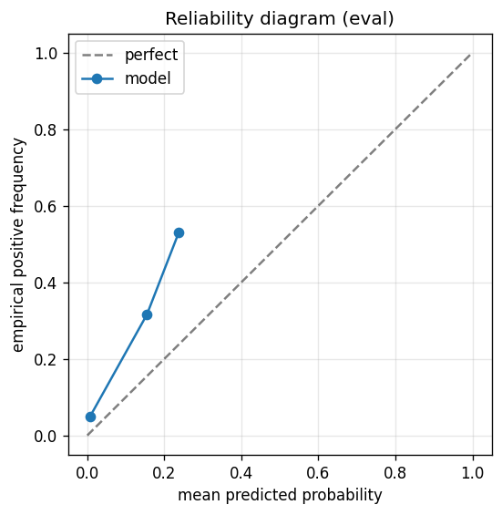

# gbdt experiment — russell1000_up_50pct_100d_dd25pct_aligned

## Warnings

- **hp_search**: HP search disabled in sweep mode (max_iter=3 < threshold=5); the FS+HP loop ran feature-selection only — see issue #32.

## Spec

- universe: `russell1000`
- direction: `up`
- threshold_pct: `50`
- horizon_days: `100`
- max_drawdown: `0.25`
- fs_hp_loop callback_mode: `default`

## Data

- tickers in universe: 1002
- tickers used: 889
- tickers excluded: NASDAQ:ABNB, NASDAQ:APP, NASDAQ:CEG, NASDAQ:DASH, NASDAQ:GEHC, NASDAQ:GFS, NASDAQ:PLTR, NYSE:ACI, NYSE:AFRM, NYSE:ALAB, NYSE:ALGM, NYSE:AMTM, NYSE:APG, NYSE:AS, NYSE:AUR, NYSE:BAM, NYSE:BEPC, NYSE:BIRK, NYSE:BLSH, NYSE:BROS, NYSE:BSY, NYSE:CAI, NYSE:CARR, NYSE:CART, NYSE:CAVA, NYSE:CBC, NYSE:CCC, NYSE:CERT, NYSE:CNM, NYSE:CNXC, NYSE:COIN, NYSE:CPNG, NYSE:CR, NYSE:CRCL, NYSE:DJT, NYSE:DOCS, NYSE:DTM, NYSE:DUOL, NYSE:DV, NYSE:ECG, NYSE:ESAB, NYSE:EXE, NYSE:FIGR, NYSE:FOUR, NYSE:FRMI, NYSE:GEV, NYSE:GLIBA, NYSE:GLIBK, NYSE:GTLB, NYSE:GTM, NYSE:GXO, NYSE:HAYW, NYSE:HOOD, NYSE:INGM, NYSE:IOT, NYSE:KD, NYSE:KRMN, NYSE:KVUE, NYSE:LCID, NYSE:LINE, NYSE:LLYVA, NYSE:LLYVK, NYSE:LOAR, NYSE:MDLN, NYSE:MP, NYSE:MRP, NYSE:NCNO, NYSE:NIQ, NYSE:NU, NYSE:OGN, NYSE:ONON, NYSE:OTIS, NYSE:OWL, NYSE:PATH, NYSE:PCOR, NYSE:Q, NYSE:QS, NYSE:RAL, NYSE:RBLX, NYSE:RBRK, NYSE:RDDT, NYSE:REYN, NYSE:RIVN, NYSE:RKLB, NYSE:RKT, NYSE:ROIV, NYSE:RPRX, NYSE:RVMD, NYSE:RYAN, NYSE:S, NYSE:SAIL, NYSE:SARO, NYSE:SFD, NYSE:SHC, NYSE:SN, NYSE:SNDK, NYSE:SNOW, NYSE:SOFI, NYSE:SOLS, NYSE:SOLV, NYSE:TEM, NYSE:TLN, NYSE:TOST, NYSE:TPG, NYSE:U, NYSE:UHAL-B, NYSE:UWMC, NYSE:VGNT, NYSE:VIK, NYSE:VLTO, NYSE:VNT, NYSE:VSNT, NYSE:WFRD
- train rows: 708264 (independent events ≈ 3564.0; overlap-inflation 198.73×)
- val rows: 355600 (independent events ≈ 1786.9; overlap-inflation 199.00×)
- eval rows: 177800 (independent events ≈ 893.5; overlap-inflation 199.00×)
- test rows: 177800 (independent events ≈ 893.5; overlap-inflation 199.00×)
- sample uniqueness weighting: `on` (horizon_days=100)
- positive prevalence (train): 0.079
- positive prevalence (eval): 0.057

## Segment windows

- split mode: `date_aligned`
- train_start anchor: `2019-01-01`
- train: `2019-01-02` → `2022-03-04`
- val: `2022-03-07` → `2023-10-06`
- eval: `2023-10-09` → `2024-07-25`
- test: `2024-07-26` → `2025-05-13`

## Iteration history

| iter | n_features | train Brier | val Brier | gap | rationale | inner_stop |
|---|---|---|---|---|---|---|
| 0 | 279 | 0.0496 | 0.0323 | -0.0173 | iteration 0 — full feature pool, default HPs :: algorithmic fallback: kept 50/27 |  |
| 1 | 50 | 0.0493 | 0.0316 | -0.0177 | iteration 1 from FS+HP callback :: algorithmic fallback: kept 48/50 features |  |
| 2 | 48 | 0.0490 | 0.0317 | -0.0173 | iteration 2 from FS+HP callback :: inner_stop=plateau | plateau |

## Final checkpoint

- best iteration: 1
- iterations run: 3
- inner stop signal: `plateau`
- fs_hp_loop callback_mode: `default`

## Calibration

- method requested: `conditional_isotonic`
- decision: `isotonic`
- Spiegelhalter Z: -55.793
- Spiegelhalter p: 0.0000

## Headline metrics

| segment | Brier | base-rate Brier | improvement | LogLoss | AUC |
|---|---|---|---|---|---|
| eval | 0.0528 | 0.0541 | +0.0013 | 0.2505 | 0.8185 |
| test | 0.0421 | 0.0461 | +0.0040 | 0.1643 | 0.8747 |

## Top-K precision (per-day + global)

Per-day: pick the top-K rows by ``p_calibrated`` each date, pool across days. ``P@k = sum_d(positives_in_top_k(d)) / sum_d(min(R(d), k))`` where ``R(d)`` is the count of positives on day ``d`` — the ``min(R(d), k)`` denominator is the achievable-positives count (mandatory; see ``.claude/memories/project-r-precision-methodology.md``). ``n_denom = sum_d(min(R(d), k))``; ``n_days_R<k`` = days with fewer than ``k`` positives. Global: top-K by score across the whole segment, denominator ``min(k, total_positives)``. ``base_rate`` = unweighted segment positive prevalence (compare P@k to base_rate directly; lift omitted from the table by project reporting convention).

### eval — n_rows=177800, base_rate=0.0574

Per-day:

| k | P@k | base_rate | n_picks | n_positives | n_denom | days_R<k / days_full_k / days_total |
|---|---|---|---|---|---|---|
| 1 | 0.4700 | 0.0574 | 200 | 94 | 200 | 0 / 200 / 200 |
| 5 | 0.5620 | 0.0574 | 1000 | 562 | 1000 | 0 / 200 / 200 |
| 10 | 0.4660 | 0.0574 | 2000 | 932 | 2000 | 0 / 200 / 200 |

Global (top-K across entire segment):

| k | P@k | base_rate | n_picks | n_positives | n_denom |
|---|---|---|---|---|---|
| 1 | 1.0000 | 0.0574 | 1 | 1 | 1 |
| 5 | 1.0000 | 0.0574 | 5 | 5 | 5 |
| 10 | 1.0000 | 0.0574 | 10 | 10 | 10 |

### test — n_rows=177800, base_rate=0.0484

Per-day:

| k | P@k | base_rate | n_picks | n_positives | n_denom | days_R<k / days_full_k / days_total |
|---|---|---|---|---|---|---|
| 1 | 0.4900 | 0.0484 | 200 | 98 | 200 | 0 / 200 / 200 |
| 5 | 0.4254 | 0.0484 | 1000 | 425 | 999 | 1 / 200 / 200 |
| 10 | 0.3515 | 0.0484 | 2000 | 670 | 1906 | 32 / 200 / 200 |

Global (top-K across entire segment):

| k | P@k | base_rate | n_picks | n_positives | n_denom |
|---|---|---|---|---|---|
| 1 | 1.0000 | 0.0484 | 1 | 1 | 1 |
| 5 | 1.0000 | 0.0484 | 5 | 5 | 5 |
| 10 | 0.7000 | 0.0484 | 10 | 7 | 10 |

## Per-ticker hit-rate when picked (k=5)

Aggregates per-day top-5 picks by ticker. Top 10 most-picked + bottom 5 most-anti-predictive (when picked at least once) shown; the full table is in ``metrics.json::segment_diagnostics.<seg>.per_ticker_hit_rate.rows``.

### eval

Top-10 by n_picks:

| ticker | n_picks | n_positives | hit_rate |
|---|---|---|---|
| NYSE:CVNA | 197 | 184 | 0.9340 |
| NASDAQ:MSTR | 162 | 88 | 0.5432 |
| NYSE:SMMT | 146 | 72 | 0.4932 |
| NYSE:ASTS | 136 | 74 | 0.5441 |
| NYSE:VKTX | 87 | 31 | 0.3563 |
| NYSE:SMCI | 75 | 17 | 0.2267 |
| NYSE:QXO | 63 | 50 | 0.7937 |
| NYSE:W | 45 | 7 | 0.1556 |
| NYSE:GME | 39 | 21 | 0.5385 |
| NYSE:CHWY | 20 | 0 | 0.0000 |

Bottom-5 by hit_rate (n_picks ≥ 5):

| ticker | n_picks | n_positives | hit_rate |
|---|---|---|---|
| NYSE:CHWY | 20 | 0 | 0.0000 |
| NYSE:BILL | 10 | 1 | 0.1000 |
| NYSE:W | 45 | 7 | 0.1556 |
| NYSE:SMCI | 75 | 17 | 0.2267 |
| NYSE:VKTX | 87 | 31 | 0.3563 |

### test

Top-10 by n_picks:

| ticker | n_picks | n_positives | hit_rate |
|---|---|---|---|
| NASDAQ:MSTR | 200 | 97 | 0.4850 |
| NYSE:ASTS | 189 | 73 | 0.3862 |
| NYSE:CVNA | 116 | 84 | 0.7241 |
| NYSE:SMMT | 108 | 71 | 0.6574 |
| NYSE:SMCI | 68 | 30 | 0.4412 |
| NYSE:GME | 67 | 13 | 0.1940 |
| NYSE:W | 46 | 0 | 0.0000 |
| NASDAQ:TSLA | 41 | 13 | 0.3171 |
| NYSE:VKTX | 33 | 0 | 0.0000 |
| NYSE:COHR | 31 | 8 | 0.2581 |

Bottom-5 by hit_rate (n_picks ≥ 5):

| ticker | n_picks | n_positives | hit_rate |
|---|---|---|---|
| NYSE:W | 46 | 0 | 0.0000 |
| NYSE:VKTX | 33 | 0 | 0.0000 |
| NYSE:ENPH | 17 | 0 | 0.0000 |
| NYSE:MRNA | 5 | 0 | 0.0000 |
| NYSE:CHWY | 27 | 4 | 0.1481 |

## Per-quarter P@5 stability

P@5 grouped by calendar quarter. ``base_rate`` is the segment-wide positive prevalence (constant across rows); regime-dependent collapse shows as a quarter where ``P@5`` falls toward ``base_rate`` or below. ``lift`` omitted from the table by project reporting convention.

### eval

| quarter | n_picks | n_positives | P@5 | base_rate |
|---|---|---|---|---|
| 2023Q4 | 290 | 200 | 0.6897 | 0.0574 |
| 2024Q1 | 305 | 155 | 0.5082 | 0.0574 |
| 2024Q2 | 315 | 153 | 0.4857 | 0.0574 |
| 2024Q3 | 90 | 54 | 0.6000 | 0.0574 |

### test

| quarter | n_picks | n_positives | P@5 | base_rate |
|---|---|---|---|---|
| 2024Q3 | 230 | 134 | 0.5826 | 0.0484 |
| 2024Q4 | 320 | 87 | 0.2719 | 0.0484 |
| 2025Q1 | 300 | 101 | 0.3367 | 0.0484 |
| 2025Q2 | 150 | 103 | 0.6867 | 0.0484 |

## Prediction-range diagnostics

Distribution of ``p_calibrated`` per segment. ``flag_low_separation = true`` when ``std < low_separation_threshold`` — a sign the model's predictions cluster so tightly that ranking is noise.

| segment | n_rows | min | max | mean | std | flag_low_separation |
|---|---|---|---|---|---|---|
| eval | 177800 | 0.0000 | 0.2942 | 0.0113 | 0.0314 | `True` |
| test | 177800 | 0.0000 | 0.2942 | 0.0184 | 0.0404 | `True` |

## Per-experiment verdict (algorithmic readout)

Calibration: required isotonic (|z|=55.79); shipped as `isotonic`. Brier vs base-rate: +0.0013 (model beats baseline).

> NOTE: this verdict is generated from the metrics by a simple rule (see ``report._algorithmic_verdict``); it is NOT an automated pass/fail gate. The user reads the artifact and decides whether the cell ships.
