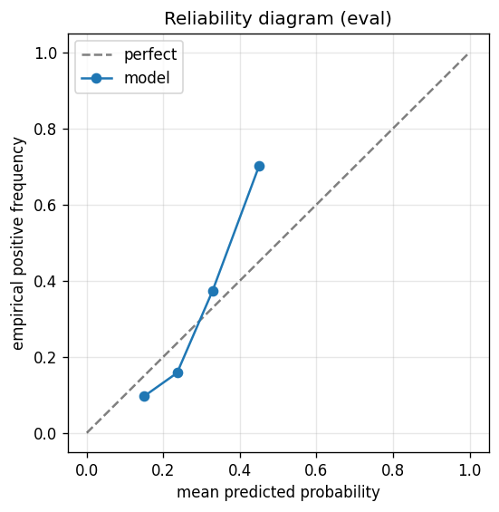

# gbdt experiment — sp500_up_10pct_25d_dd5pct_b_acceptance

## Spec

- universe: `sp500`
- direction: `up`
- threshold_pct: `10`
- horizon_days: `25`
- max_drawdown: `0.05`
- fs_hp_loop callback_mode: `default`

## Data

- tickers in universe: 503
- tickers used: 486
- tickers excluded: NASDAQ:ABNB, NASDAQ:APP, NASDAQ:CEG, NASDAQ:DASH, NASDAQ:GEHC, NASDAQ:PLTR, NYSE:CARR, NYSE:COIN, NYSE:EXE, NYSE:GEV, NYSE:HOOD, NYSE:KVUE, NYSE:OTIS, NYSE:Q, NYSE:SNDK, NYSE:SOLV, NYSE:VLTO
- train rows: 388800 (independent events ≈ 7934.7; overlap-inflation 49.00×)
- val rows: 194400 (independent events ≈ 3967.3; overlap-inflation 49.00×)
- eval rows: 97200 (independent events ≈ 1983.7; overlap-inflation 49.00×)
- test rows: 36450 (independent events ≈ 743.9; overlap-inflation 49.00×)
- sample uniqueness weighting: `on` (horizon_days=25)
- positive prevalence (train): 0.228
- positive prevalence (eval): 0.220

## Segment windows

- split mode: `trailing`
- train: `2020-06-03` → `2023-08-08`
- val: `2023-08-08` → `2025-03-13`
- eval: `2025-03-13` → `2025-12-29`
- test: `2025-12-30` → `2026-04-17`

## Iteration history

| iter | n_features | train Brier | val Brier | gap | rationale | inner_stop |
|---|---|---|---|---|---|---|
| 0 | 33 | 0.2305 | 0.2093 | -0.0213 | iteration 0 — full feature pool, default HPs :: algorithmic fallback: kept 10/33 |  |
| 1 | 10 | 0.2295 | 0.2026 | -0.0270 | iteration 1 from FS+HP callback :: algorithmic fallback: kept 10/10 features |  |
| 2 | 10 | 0.2298 | 0.2038 | -0.0260 | iteration 2 from FS+HP callback :: algorithmic fallback: kept 10/10 features |  |
| 3 | 10 | 0.2287 | 0.2041 | -0.0246 | iteration 3 from FS+HP callback :: inner_stop=plateau | plateau |

## Final checkpoint

- best iteration: 1
- iterations run: 4
- inner stop signal: `plateau`
- fs_hp_loop callback_mode: `default`

## Calibration

- method requested: `conditional_isotonic`
- decision: `isotonic`
- Spiegelhalter Z: -113.006
- Spiegelhalter p: 0.0000

## Headline metrics

| segment | Brier | base-rate Brier | improvement | LogLoss | AUC |
|---|---|---|---|---|---|
| eval | 0.1567 | 0.1714 | +0.0147 | 0.4855 | 0.7235 |
| test | 0.1920 | 0.1942 | +0.0022 | 0.5733 | 0.5780 |

## Top-K precision (per-day + global)

Per-day: pick the top-K rows by ``p_calibrated`` each date, pool across days. ``P@k = sum_d(positives_in_top_k(d)) / sum_d(min(R(d), k))`` where ``R(d)`` is the count of positives on day ``d`` — the ``min(R(d), k)`` denominator is the achievable-positives count (mandatory; see ``.claude/memories/project-r-precision-methodology.md``). ``n_denom = sum_d(min(R(d), k))``; ``n_days_R<k`` = days with fewer than ``k`` positives. Global: top-K by score across the whole segment, denominator ``min(k, total_positives)``. ``base_rate`` = unweighted segment positive prevalence (compare P@k to base_rate directly; lift omitted from the table by project reporting convention).

### eval — n_rows=97200, base_rate=0.2196

Per-day:

| k | P@k | base_rate | n_picks | n_positives | n_denom | days_R<k / days_full_k / days_total |
|---|---|---|---|---|---|---|
| 1 | 0.5050 | 0.2196 | 201 | 101 | 200 | 1 / 201 / 201 |
| 5 | 0.4735 | 0.2196 | 1001 | 473 | 999 | 2 / 200 / 201 |
| 10 | 0.4746 | 0.2196 | 2001 | 943 | 1987 | 4 / 200 / 201 |

Global (top-K across entire segment):

| k | P@k | base_rate | n_picks | n_positives | n_denom |
|---|---|---|---|---|---|
| 1 | 1.0000 | 0.2196 | 1 | 1 | 1 |
| 5 | 0.8000 | 0.2196 | 5 | 4 | 5 |
| 10 | 0.6000 | 0.2196 | 10 | 6 | 10 |

### test — n_rows=36450, base_rate=0.2638

Per-day:

| k | P@k | base_rate | n_picks | n_positives | n_denom | days_R<k / days_full_k / days_total |
|---|---|---|---|---|---|---|
| 1 | 0.5600 | 0.2638 | 75 | 42 | 75 | 0 / 75 / 75 |
| 5 | 0.3360 | 0.2638 | 375 | 126 | 375 | 0 / 75 / 75 |
| 10 | 0.3907 | 0.2638 | 750 | 293 | 750 | 0 / 75 / 75 |

Global (top-K across entire segment):

| k | P@k | base_rate | n_picks | n_positives | n_denom |
|---|---|---|---|---|---|
| 1 | 1.0000 | 0.2638 | 1 | 1 | 1 |
| 5 | 0.6000 | 0.2638 | 5 | 3 | 5 |
| 10 | 0.7000 | 0.2638 | 10 | 7 | 10 |

## Per-ticker hit-rate when picked (k=5)

Aggregates per-day top-5 picks by ticker. Top 10 most-picked + bottom 5 most-anti-predictive (when picked at least once) shown; the full table is in ``metrics.json::segment_diagnostics.<seg>.per_ticker_hit_rate.rows``.

### eval

Top-10 by n_picks:

| ticker | n_picks | n_positives | hit_rate |
|---|---|---|---|
| NASDAQ:INTC | 150 | 91 | 0.6067 |
| NASDAQ:LULU | 122 | 23 | 0.1885 |
| NASDAQ:AMD | 117 | 69 | 0.5897 |
| NASDAQ:MCHP | 108 | 29 | 0.2685 |
| NASDAQ:MU | 88 | 46 | 0.5227 |
| NASDAQ:AVGO | 85 | 55 | 0.6471 |
| NASDAQ:ON | 62 | 16 | 0.2581 |
| NASDAQ:TTD | 46 | 20 | 0.4348 |
| NASDAQ:TSLA | 44 | 13 | 0.2955 |
| NASDAQ:DXCM | 38 | 20 | 0.5263 |

Bottom-5 by hit_rate (n_picks ≥ 5):

| ticker | n_picks | n_positives | hit_rate |
|---|---|---|---|
| NASDAQ:LULU | 122 | 23 | 0.1885 |
| NYSE:ANET | 5 | 1 | 0.2000 |
| NASDAQ:ON | 62 | 16 | 0.2581 |
| NASDAQ:MCHP | 108 | 29 | 0.2685 |
| NASDAQ:TSLA | 44 | 13 | 0.2955 |

### test

Top-10 by n_picks:

| ticker | n_picks | n_positives | hit_rate |
|---|---|---|---|
| NASDAQ:AMD | 64 | 41 | 0.6406 |
| NASDAQ:INTC | 56 | 16 | 0.2857 |
| NASDAQ:SNPS | 54 | 12 | 0.2222 |
| NASDAQ:MU | 47 | 21 | 0.4468 |
| NASDAQ:DDOG | 46 | 14 | 0.3043 |
| NASDAQ:TTD | 34 | 2 | 0.0588 |
| NASDAQ:TSLA | 17 | 0 | 0.0000 |
| NASDAQ:LULU | 13 | 0 | 0.0000 |
| NASDAQ:BKNG | 10 | 2 | 0.2000 |
| NYSE:ALB | 7 | 3 | 0.4286 |

Bottom-5 by hit_rate (n_picks ≥ 5):

| ticker | n_picks | n_positives | hit_rate |
|---|---|---|---|
| NASDAQ:TSLA | 17 | 0 | 0.0000 |
| NASDAQ:LULU | 13 | 0 | 0.0000 |
| NASDAQ:TTD | 34 | 2 | 0.0588 |
| NASDAQ:BKNG | 10 | 2 | 0.2000 |
| NASDAQ:SNPS | 54 | 12 | 0.2222 |

## Per-quarter P@5 stability

P@5 grouped by calendar quarter. ``base_rate`` is the segment-wide positive prevalence (constant across rows); regime-dependent collapse shows as a quarter where ``P@5`` falls toward ``base_rate`` or below. ``lift`` omitted from the table by project reporting convention.

### eval

| quarter | n_picks | n_positives | P@5 | base_rate |
|---|---|---|---|---|
| 2025Q1 | 61 | 0 | 0.0000 | 0.2196 |
| 2025Q2 | 310 | 213 | 0.6871 | 0.2196 |
| 2025Q3 | 320 | 129 | 0.4031 | 0.2196 |
| 2025Q4 | 310 | 131 | 0.4226 | 0.2196 |

### test

| quarter | n_picks | n_positives | P@5 | base_rate |
|---|---|---|---|---|
| 2025Q4 | 10 | 4 | 0.4000 | 0.2638 |
| 2026Q1 | 305 | 83 | 0.2721 | 0.2638 |
| 2026Q2 | 60 | 39 | 0.6500 | 0.2638 |

## Prediction-range diagnostics

Distribution of ``p_calibrated`` per segment. ``flag_low_separation = true`` when ``std < low_separation_threshold`` — a sign the model's predictions cluster so tightly that ranking is noise.

| segment | n_rows | min | max | mean | std | flag_low_separation |
|---|---|---|---|---|---|---|
| eval | 97200 | 0.1081 | 0.4510 | 0.2419 | 0.0822 | `False` |
| test | 36450 | 0.1081 | 0.4510 | 0.2476 | 0.0684 | `False` |

## Per-experiment verdict (algorithmic readout)

Calibration: required isotonic (|z|=113.01); shipped as `isotonic`. Brier vs base-rate: +0.0147 (model beats baseline).

> NOTE: this verdict is generated from the metrics by a simple rule (see ``report._algorithmic_verdict``); it is NOT an automated pass/fail gate. The user reads the artifact and decides whether the cell ships.
