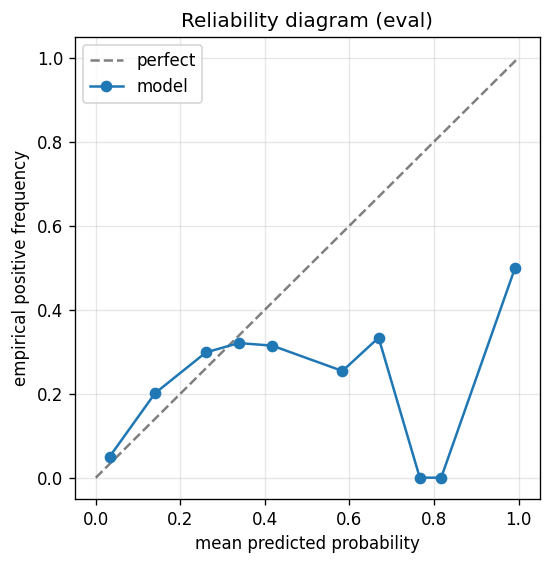

# gbdt experiment — sp500_up_20pct_25d_dd10pct_agentloop

## Spec

- universe: `sp500`
- direction: `up`
- threshold_pct: `20`
- horizon_days: `25`
- max_drawdown: `0.1`
- fs_hp_loop callback_mode: `agent_file_protocol`

## Data

- tickers in universe: 503
- tickers used: 486
- tickers excluded: NASDAQ:ABNB, NASDAQ:APP, NASDAQ:CEG, NASDAQ:DASH, NASDAQ:GEHC, NASDAQ:PLTR, NYSE:CARR, NYSE:COIN, NYSE:EXE, NYSE:GEV, NYSE:HOOD, NYSE:KVUE, NYSE:OTIS, NYSE:Q, NYSE:SNDK, NYSE:SOLV, NYSE:VLTO
- train rows: 388800 (independent events ≈ 7934.7; overlap-inflation 49.00×)
- val rows: 194400 (independent events ≈ 3967.3; overlap-inflation 49.00×)
- eval rows: 97200 (independent events ≈ 1983.7; overlap-inflation 49.00×)
- test rows: 36450 (independent events ≈ 743.9; overlap-inflation 49.00×)
- sample uniqueness weighting: `on` (horizon_days=25)
- positive prevalence (train): 0.054
- positive prevalence (eval): 0.066

## Iteration history

| iter | n_features | train Brier | val Brier | gap | rationale | inner_stop |
|---|---|---|---|---|---|---|
| 2 | 279 | 0.0328 | 0.0376 | 0.0049 | iteration 2 from FS+HP callback :: inner_stop=plateau | plateau |

## Final checkpoint

- best iteration: 2
- iterations run: 1
- inner stop signal: `plateau`
- fs_hp_loop callback_mode: `agent_file_protocol`

## Calibration

- method requested: `conditional_isotonic`
- decision: `isotonic`
- Spiegelhalter Z: 59.123
- Spiegelhalter p: 0.0000

## Headline metrics

| segment | Brier | base-rate Brier | improvement | LogLoss | AUC |
|---|---|---|---|---|---|
| eval | 0.0584 | 0.0614 | +0.0030 | 0.2183 | 0.7708 |
| test | 0.0768 | 0.0807 | +0.0039 | 0.2753 | 0.7560 |

## Top-K precision (per-day + global)

Per-day: pick the top-K rows by ``p_calibrated`` each date, pool across days. ``P@k = sum_d(positives_in_top_k(d)) / sum_d(min(R(d), k))`` where ``R(d)`` is the count of positives on day ``d`` — the ``min(R(d), k)`` denominator is the achievable-positives count (mandatory; see ``.claude/memories/project-r-precision-methodology.md``). ``n_denom = sum_d(min(R(d), k))``; ``n_days_R<k`` = days with fewer than ``k`` positives. Global: top-K by score across the whole segment, denominator ``min(k, total_positives)``. ``base_rate`` = unweighted segment positive prevalence (compare P@k to base_rate directly; lift omitted from the table by project reporting convention).

### eval — n_rows=97200, base_rate=0.0657

Per-day:

| k | P@k | base_rate | n_picks | n_positives | n_denom | days_R<k / days_full_k / days_total |
|---|---|---|---|---|---|---|
| 1 | 0.3166 | 0.0657 | 201 | 63 | 199 | 2 / 201 / 201 |
| 5 | 0.3678 | 0.0657 | 1001 | 356 | 968 | 12 / 200 / 201 |
| 10 | 0.3492 | 0.0657 | 2001 | 662 | 1896 | 18 / 200 / 201 |

Global (top-K across entire segment):

| k | P@k | base_rate | n_picks | n_positives | n_denom |
|---|---|---|---|---|---|
| 1 | 0.0000 | 0.0657 | 1 | 0 | 1 |
| 5 | 0.4000 | 0.0657 | 5 | 2 | 5 |
| 10 | 0.4000 | 0.0657 | 10 | 4 | 10 |

### test — n_rows=36450, base_rate=0.0886

Per-day:

| k | P@k | base_rate | n_picks | n_positives | n_denom | days_R<k / days_full_k / days_total |
|---|---|---|---|---|---|---|
| 1 | 0.4133 | 0.0886 | 75 | 31 | 75 | 0 / 75 / 75 |
| 5 | 0.4053 | 0.0886 | 375 | 152 | 375 | 0 / 75 / 75 |
| 10 | 0.4027 | 0.0886 | 750 | 302 | 750 | 0 / 75 / 75 |

Global (top-K across entire segment):

| k | P@k | base_rate | n_picks | n_positives | n_denom |
|---|---|---|---|---|---|
| 1 | 0.0000 | 0.0886 | 1 | 0 | 1 |
| 5 | 0.2000 | 0.0886 | 5 | 1 | 5 |
| 10 | 0.2000 | 0.0886 | 10 | 2 | 10 |

## Per-ticker hit-rate when picked (k=5)

Aggregates per-day top-5 picks by ticker. Top 10 most-picked + bottom 5 most-anti-predictive (when picked at least once) shown; the full table is in ``metrics.json::segment_diagnostics.<seg>.per_ticker_hit_rate.rows``.

### eval

Top-10 by n_picks:

| ticker | n_picks | n_positives | hit_rate |
|---|---|---|---|
| NYSE:SMCI | 135 | 55 | 0.4074 |
| NYSE:CVNA | 126 | 34 | 0.2698 |
| NYSE:MRNA | 103 | 21 | 0.2039 |
| NASDAQ:TSLA | 81 | 26 | 0.3210 |
| NYSE:LITE | 70 | 48 | 0.6857 |
| NYSE:COHR | 55 | 31 | 0.5636 |
| NYSE:VRT | 40 | 17 | 0.4250 |
| NYSE:VST | 34 | 10 | 0.2941 |
| NYSE:ALB | 31 | 11 | 0.3548 |
| NASDAQ:ON | 29 | 10 | 0.3448 |

Bottom-5 by hit_rate (n_picks ≥ 5):

| ticker | n_picks | n_positives | hit_rate |
|---|---|---|---|
| NASDAQ:LULU | 20 | 0 | 0.0000 |
| NYSE:NCLH | 16 | 0 | 0.0000 |
| NYSE:DLTR | 15 | 0 | 0.0000 |
| NYSE:XYZ | 10 | 0 | 0.0000 |
| NYSE:SATS | 9 | 0 | 0.0000 |

### test

Top-10 by n_picks:

| ticker | n_picks | n_positives | hit_rate |
|---|---|---|---|
| NASDAQ:TSLA | 36 | 0 | 0.0000 |
| NASDAQ:AMD | 32 | 21 | 0.6562 |
| NASDAQ:MU | 32 | 18 | 0.5625 |
| NYSE:COHR | 28 | 23 | 0.8214 |
| NASDAQ:TTD | 27 | 2 | 0.0741 |
| NYSE:SMCI | 26 | 5 | 0.1923 |
| NYSE:LITE | 24 | 15 | 0.6250 |
| NYSE:ALB | 21 | 11 | 0.5238 |
| NYSE:MRNA | 16 | 0 | 0.0000 |
| NYSE:ORCL | 16 | 2 | 0.1250 |

Bottom-5 by hit_rate (n_picks ≥ 5):

| ticker | n_picks | n_positives | hit_rate |
|---|---|---|---|
| NASDAQ:TSLA | 36 | 0 | 0.0000 |
| NYSE:MRNA | 16 | 0 | 0.0000 |
| NYSE:FSLR | 15 | 0 | 0.0000 |
| NYSE:CVNA | 6 | 0 | 0.0000 |
| NASDAQ:LULU | 5 | 0 | 0.0000 |

## Per-quarter P@5 stability

P@5 grouped by calendar quarter. ``base_rate`` is the segment-wide positive prevalence (constant across rows); regime-dependent collapse shows as a quarter where ``P@5`` falls toward ``base_rate`` or below. ``lift`` omitted from the table by project reporting convention.

### eval

| quarter | n_picks | n_positives | P@5 | base_rate |
|---|---|---|---|---|
| 2025Q1 | 61 | 8 | 0.1311 | 0.0657 |
| 2025Q2 | 310 | 173 | 0.5581 | 0.0657 |
| 2025Q3 | 320 | 103 | 0.3219 | 0.0657 |
| 2025Q4 | 310 | 72 | 0.2323 | 0.0657 |

### test

| quarter | n_picks | n_positives | P@5 | base_rate |
|---|---|---|---|---|
| 2025Q4 | 10 | 4 | 0.4000 | 0.0886 |
| 2026Q1 | 305 | 97 | 0.3180 | 0.0886 |
| 2026Q2 | 60 | 51 | 0.8500 | 0.0886 |

## Prediction-range diagnostics

Distribution of ``p_calibrated`` per segment. ``flag_low_separation = true`` when ``std < low_separation_threshold`` — a sign the model's predictions cluster so tightly that ranking is noise.

| segment | n_rows | min | max | mean | std | flag_low_separation |
|---|---|---|---|---|---|---|
| eval | 97200 | 0.0000 | 1.0000 | 0.0450 | 0.0513 | `False` |
| test | 36450 | 0.0000 | 0.5833 | 0.0543 | 0.0469 | `True` |

## Per-experiment verdict (algorithmic readout)

Calibration: required isotonic (|z|=59.12); shipped as `isotonic`. Brier vs base-rate: +0.0030 (model beats baseline).

> NOTE: this verdict is generated from the metrics by a simple rule (see ``report._algorithmic_verdict``); it is NOT an automated pass/fail gate. The user reads the artifact and decides whether the cell ships.
