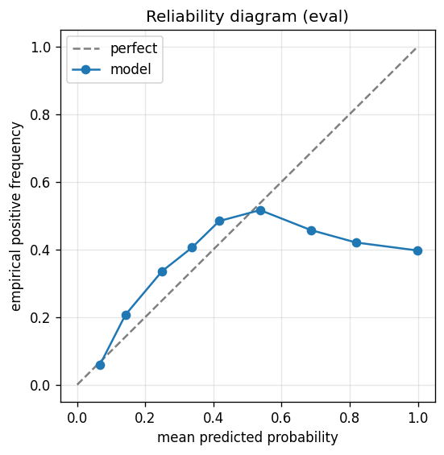

# gbdt experiment — sp500_up_20pct_50d_dd10pct_agentloop

## Spec

- universe: `sp500`
- direction: `up`
- threshold_pct: `20`
- horizon_days: `50`
- max_drawdown: `0.1`
- fs_hp_loop callback_mode: `agent_file_protocol`

## Data

- tickers in universe: 503
- tickers used: 486
- tickers excluded: NASDAQ:ABNB, NASDAQ:APP, NASDAQ:CEG, NASDAQ:DASH, NASDAQ:GEHC, NASDAQ:PLTR, NYSE:CARR, NYSE:COIN, NYSE:EXE, NYSE:GEV, NYSE:HOOD, NYSE:KVUE, NYSE:OTIS, NYSE:Q, NYSE:SNDK, NYSE:SOLV, NYSE:VLTO
- train rows: 388800 (independent events ≈ 3927.3; overlap-inflation 99.00×)
- val rows: 194400 (independent events ≈ 1963.6; overlap-inflation 99.00×)
- eval rows: 97200 (independent events ≈ 981.8; overlap-inflation 99.00×)
- test rows: 24300 (independent events ≈ 245.5; overlap-inflation 99.00×)
- sample uniqueness weighting: `on` (horizon_days=50)
- positive prevalence (train): 0.139
- positive prevalence (eval): 0.166

## Iteration history

| iter | n_features | train Brier | val Brier | gap | rationale | inner_stop |
|---|---|---|---|---|---|---|
| 2 | 279 | 0.0752 | 0.1070 | 0.0318 | iteration 2 from FS+HP callback :: inner_stop=plateau | plateau |

## Final checkpoint

- best iteration: 2
- iterations run: 1
- inner stop signal: `plateau`
- fs_hp_loop callback_mode: `agent_file_protocol`

## Calibration

- method requested: `conditional_isotonic`
- decision: `isotonic`
- Spiegelhalter Z: 117.951
- Spiegelhalter p: 0.0000

## Headline metrics

| segment | Brier | base-rate Brier | improvement | LogLoss | AUC |
|---|---|---|---|---|---|
| eval | 0.1309 | 0.1382 | +0.0074 | 0.4285 | 0.7148 |
| test | 0.1141 | 0.1180 | +0.0038 | 0.3905 | 0.6752 |

## Top-K precision (per-day + global)

Per-day: pick the top-K rows by ``p_calibrated`` each date, pool across days. ``P@k = sum_d(positives_in_top_k(d)) / sum_d(min(R(d), k))`` where ``R(d)`` is the count of positives on day ``d`` — the ``min(R(d), k)`` denominator is the achievable-positives count (mandatory; see ``.claude/memories/project-r-precision-methodology.md``). ``n_denom = sum_d(min(R(d), k))``; ``n_days_R<k`` = days with fewer than ``k`` positives. Global: top-K by score across the whole segment, denominator ``min(k, total_positives)``. ``base_rate`` = unweighted segment positive prevalence (compare P@k to base_rate directly; lift omitted from the table by project reporting convention).

### eval — n_rows=97200, base_rate=0.1657

Per-day:

| k | P@k | base_rate | n_picks | n_positives | n_denom | days_R<k / days_full_k / days_total |
|---|---|---|---|---|---|---|
| 1 | 0.5300 | 0.1657 | 201 | 106 | 200 | 1 / 201 / 201 |
| 5 | 0.4905 | 0.1657 | 1001 | 490 | 999 | 2 / 200 / 201 |
| 10 | 0.5018 | 0.1657 | 2001 | 995 | 1983 | 7 / 200 / 201 |

Global (top-K across entire segment):

| k | P@k | base_rate | n_picks | n_positives | n_denom |
|---|---|---|---|---|---|
| 1 | 0.0000 | 0.1657 | 1 | 0 | 1 |
| 5 | 0.0000 | 0.1657 | 5 | 0 | 5 |
| 10 | 0.4000 | 0.1657 | 10 | 4 | 10 |

### test — n_rows=24300, base_rate=0.1367

Per-day:

| k | P@k | base_rate | n_picks | n_positives | n_denom | days_R<k / days_full_k / days_total |
|---|---|---|---|---|---|---|
| 1 | 0.0800 | 0.1367 | 50 | 4 | 50 | 0 / 50 / 50 |
| 5 | 0.2400 | 0.1367 | 250 | 60 | 250 | 0 / 50 / 50 |
| 10 | 0.2740 | 0.1367 | 500 | 137 | 500 | 0 / 50 / 50 |

Global (top-K across entire segment):

| k | P@k | base_rate | n_picks | n_positives | n_denom |
|---|---|---|---|---|---|
| 1 | 0.0000 | 0.1367 | 1 | 0 | 1 |
| 5 | 0.0000 | 0.1367 | 5 | 0 | 5 |
| 10 | 0.0000 | 0.1367 | 10 | 0 | 10 |

## Per-ticker hit-rate when picked (k=5)

Aggregates per-day top-5 picks by ticker. Top 10 most-picked + bottom 5 most-anti-predictive (when picked at least once) shown; the full table is in ``metrics.json::segment_diagnostics.<seg>.per_ticker_hit_rate.rows``.

### eval

Top-10 by n_picks:

| ticker | n_picks | n_positives | hit_rate |
|---|---|---|---|
| NASDAQ:TSLA | 129 | 61 | 0.4729 |
| NASDAQ:ON | 59 | 37 | 0.6271 |
| NASDAQ:MU | 57 | 43 | 0.7544 |
| NYSE:CVNA | 55 | 13 | 0.2364 |
| NYSE:UAL | 55 | 32 | 0.5818 |
| NYSE:SMCI | 51 | 8 | 0.1569 |
| NYSE:FSLR | 47 | 27 | 0.5745 |
| NASDAQ:MCHP | 43 | 13 | 0.3023 |
| NYSE:MRNA | 43 | 7 | 0.1628 |
| NYSE:APA | 41 | 27 | 0.6585 |

Bottom-5 by hit_rate (n_picks ≥ 5):

| ticker | n_picks | n_positives | hit_rate |
|---|---|---|---|
| NYSE:SATS | 26 | 0 | 0.0000 |
| NYSE:TPL | 16 | 0 | 0.0000 |
| NASDAQ:DXCM | 12 | 0 | 0.0000 |
| NASDAQ:LULU | 7 | 0 | 0.0000 |
| NYSE:DLTR | 10 | 1 | 0.1000 |

### test

Top-10 by n_picks:

| ticker | n_picks | n_positives | hit_rate |
|---|---|---|---|
| NASDAQ:TSLA | 45 | 0 | 0.0000 |
| NASDAQ:TTD | 33 | 3 | 0.0909 |
| NYSE:ANET | 30 | 7 | 0.2333 |
| NASDAQ:SNPS | 22 | 2 | 0.0909 |
| NYSE:FSLR | 20 | 0 | 0.0000 |
| NASDAQ:AMD | 17 | 15 | 0.8824 |
| NYSE:SMCI | 17 | 2 | 0.1176 |
| NYSE:ALB | 9 | 8 | 0.8889 |
| NYSE:CVNA | 9 | 0 | 0.0000 |
| NYSE:ALGN | 7 | 3 | 0.4286 |

Bottom-5 by hit_rate (n_picks ≥ 5):

| ticker | n_picks | n_positives | hit_rate |
|---|---|---|---|
| NASDAQ:TSLA | 45 | 0 | 0.0000 |
| NYSE:FSLR | 20 | 0 | 0.0000 |
| NYSE:CVNA | 9 | 0 | 0.0000 |
| NASDAQ:DDOG | 6 | 0 | 0.0000 |
| NYSE:DLTR | 6 | 0 | 0.0000 |

## Per-quarter P@5 stability

P@5 grouped by calendar quarter. ``base_rate`` is the segment-wide positive prevalence (constant across rows); regime-dependent collapse shows as a quarter where ``P@5`` falls toward ``base_rate`` or below. ``lift`` omitted from the table by project reporting convention.

### eval

| quarter | n_picks | n_positives | P@5 | base_rate |
|---|---|---|---|---|
| 2025Q1 | 61 | 13 | 0.2131 | 0.1657 |
| 2025Q2 | 310 | 212 | 0.6839 | 0.1657 |
| 2025Q3 | 320 | 160 | 0.5000 | 0.1657 |
| 2025Q4 | 310 | 105 | 0.3387 | 0.1657 |

### test

| quarter | n_picks | n_positives | P@5 | base_rate |
|---|---|---|---|---|
| 2025Q4 | 10 | 3 | 0.3000 | 0.1367 |
| 2026Q1 | 240 | 57 | 0.2375 | 0.1367 |

## Prediction-range diagnostics

Distribution of ``p_calibrated`` per segment. ``flag_low_separation = true`` when ``std < low_separation_threshold`` — a sign the model's predictions cluster so tightly that ranking is noise.

| segment | n_rows | min | max | mean | std | flag_low_separation |
|---|---|---|---|---|---|---|
| eval | 97200 | 0.0000 | 1.0000 | 0.1290 | 0.0818 | `False` |
| test | 24300 | 0.0224 | 1.0000 | 0.1465 | 0.0655 | `False` |

## Per-experiment verdict (algorithmic readout)

Calibration: required isotonic (|z|=117.95); shipped as `isotonic`. Brier vs base-rate: +0.0074 (model beats baseline).

> NOTE: this verdict is generated from the metrics by a simple rule (see ``report._algorithmic_verdict``); it is NOT an automated pass/fail gate. The user reads the artifact and decides whether the cell ships.
