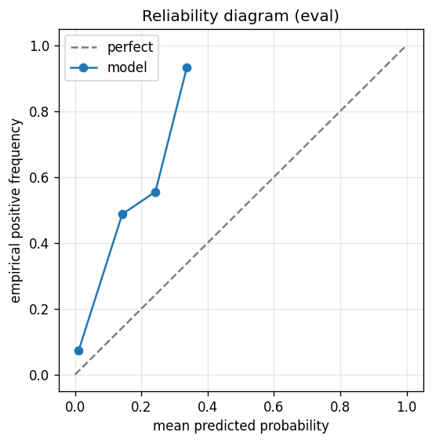

# gbdt experiment — sp500_up_40pct_100d_dd20pct_aligned

## Warnings

- **hp_search**: HP search disabled in sweep mode (max_iter=3 < threshold=5); the FS+HP loop ran feature-selection only — see issue #32.

## Spec

- universe: `sp500`
- direction: `up`
- threshold_pct: `40`
- horizon_days: `100`
- max_drawdown: `0.2`
- fs_hp_loop callback_mode: `default`

## Data

- tickers in universe: 503
- tickers used: 486
- tickers excluded: NASDAQ:ABNB, NASDAQ:APP, NASDAQ:CEG, NASDAQ:DASH, NASDAQ:GEHC, NASDAQ:PLTR, NYSE:CARR, NYSE:COIN, NYSE:EXE, NYSE:GEV, NYSE:HOOD, NYSE:KVUE, NYSE:OTIS, NYSE:Q, NYSE:SNDK, NYSE:SOLV, NYSE:VLTO
- train rows: 388173 (independent events ≈ 1952.1; overlap-inflation 198.85×)
- val rows: 194400 (independent events ≈ 976.9; overlap-inflation 199.00×)
- eval rows: 97200 (independent events ≈ 488.4; overlap-inflation 199.00×)
- test rows: 97200 (independent events ≈ 488.4; overlap-inflation 199.00×)
- sample uniqueness weighting: `on` (horizon_days=100)
- positive prevalence (train): 0.092
- positive prevalence (eval): 0.081

## Segment windows

- split mode: `date_aligned`
- train_start anchor: `2019-01-01`
- train: `2019-01-02` → `2022-03-04`
- val: `2022-03-07` → `2023-10-06`
- eval: `2023-10-09` → `2024-07-25`
- test: `2024-07-26` → `2025-05-13`

## Iteration history

| iter | n_features | train Brier | val Brier | gap | rationale | inner_stop |
|---|---|---|---|---|---|---|
| 0 | 279 | 0.0582 | 0.0469 | -0.0113 | iteration 0 — full feature pool, default HPs :: algorithmic fallback: kept 61/27 |  |
| 1 | 61 | 0.0584 | 0.0461 | -0.0123 | iteration 1 from FS+HP callback :: algorithmic fallback: kept 50/61 features |  |
| 2 | 50 | 0.0577 | 0.0465 | -0.0112 | iteration 2 from FS+HP callback :: inner_stop=plateau | plateau |

## Final checkpoint

- best iteration: 1
- iterations run: 3
- inner stop signal: `plateau`
- fs_hp_loop callback_mode: `default`

## Calibration

- method requested: `conditional_isotonic`
- decision: `isotonic`
- Spiegelhalter Z: -72.401
- Spiegelhalter p: 0.0000

## Headline metrics

| segment | Brier | base-rate Brier | improvement | LogLoss | AUC |
|---|---|---|---|---|---|
| eval | 0.0750 | 0.0741 | -0.0009 | 0.3271 | 0.7893 |
| test | 0.0598 | 0.0642 | +0.0044 | 0.2280 | 0.8549 |

## Top-K precision (per-day + global)

Per-day: pick the top-K rows by ``p_calibrated`` each date, pool across days. ``P@k = sum_d(positives_in_top_k(d)) / sum_d(min(R(d), k))`` where ``R(d)`` is the count of positives on day ``d`` — the ``min(R(d), k)`` denominator is the achievable-positives count (mandatory; see ``.claude/memories/project-r-precision-methodology.md``). ``n_denom = sum_d(min(R(d), k))``; ``n_days_R<k`` = days with fewer than ``k`` positives. Global: top-K by score across the whole segment, denominator ``min(k, total_positives)``. ``base_rate`` = unweighted segment positive prevalence (compare P@k to base_rate directly; lift omitted from the table by project reporting convention).

### eval — n_rows=97200, base_rate=0.0806

Per-day:

| k | P@k | base_rate | n_picks | n_positives | n_denom | days_R<k / days_full_k / days_total |
|---|---|---|---|---|---|---|
| 1 | 0.6450 | 0.0806 | 200 | 129 | 200 | 0 / 200 / 200 |
| 5 | 0.5020 | 0.0806 | 1000 | 502 | 1000 | 0 / 200 / 200 |
| 10 | 0.4500 | 0.0806 | 2000 | 900 | 2000 | 0 / 200 / 200 |

Global (top-K across entire segment):

| k | P@k | base_rate | n_picks | n_positives | n_denom |
|---|---|---|---|---|---|
| 1 | 1.0000 | 0.0806 | 1 | 1 | 1 |
| 5 | 1.0000 | 0.0806 | 5 | 5 | 5 |
| 10 | 1.0000 | 0.0806 | 10 | 10 | 10 |

### test — n_rows=97200, base_rate=0.0690

Per-day:

| k | P@k | base_rate | n_picks | n_positives | n_denom | days_R<k / days_full_k / days_total |
|---|---|---|---|---|---|---|
| 1 | 0.3250 | 0.0690 | 200 | 65 | 200 | 0 / 200 / 200 |
| 5 | 0.3785 | 0.0690 | 1000 | 363 | 959 | 21 / 200 / 200 |
| 10 | 0.3751 | 0.0690 | 2000 | 649 | 1730 | 61 / 200 / 200 |

Global (top-K across entire segment):

| k | P@k | base_rate | n_picks | n_positives | n_denom |
|---|---|---|---|---|---|
| 1 | 1.0000 | 0.0690 | 1 | 1 | 1 |
| 5 | 1.0000 | 0.0690 | 5 | 5 | 5 |
| 10 | 1.0000 | 0.0690 | 10 | 10 | 10 |

## Per-ticker hit-rate when picked (k=5)

Aggregates per-day top-5 picks by ticker. Top 10 most-picked + bottom 5 most-anti-predictive (when picked at least once) shown; the full table is in ``metrics.json::segment_diagnostics.<seg>.per_ticker_hit_rate.rows``.

### eval

Top-10 by n_picks:

| ticker | n_picks | n_positives | hit_rate |
|---|---|---|---|
| NYSE:CVNA | 200 | 177 | 0.8850 |
| NYSE:SMCI | 167 | 80 | 0.4790 |
| NYSE:SATS | 149 | 117 | 0.7852 |
| NYSE:PSKY | 144 | 1 | 0.0069 |
| NYSE:COHR | 105 | 81 | 0.7714 |
| NYSE:ALB | 73 | 0 | 0.0000 |
| NYSE:MRNA | 50 | 27 | 0.5400 |
| NASDAQ:TSLA | 44 | 0 | 0.0000 |
| NYSE:KEY | 24 | 7 | 0.2917 |
| NASDAQ:WBD | 16 | 0 | 0.0000 |

Bottom-5 by hit_rate (n_picks ≥ 5):

| ticker | n_picks | n_positives | hit_rate |
|---|---|---|---|
| NYSE:ALB | 73 | 0 | 0.0000 |
| NASDAQ:TSLA | 44 | 0 | 0.0000 |
| NASDAQ:WBD | 16 | 0 | 0.0000 |
| NYSE:CCL | 16 | 0 | 0.0000 |
| NYSE:PSKY | 144 | 1 | 0.0069 |

### test

Top-10 by n_picks:

| ticker | n_picks | n_positives | hit_rate |
|---|---|---|---|
| NYSE:CVNA | 181 | 102 | 0.5635 |
| NYSE:SMCI | 163 | 46 | 0.2822 |
| NASDAQ:TSLA | 145 | 67 | 0.4621 |
| NYSE:MRNA | 134 | 3 | 0.0224 |
| NYSE:SATS | 92 | 22 | 0.2391 |
| NYSE:VRT | 84 | 30 | 0.3571 |
| NYSE:COHR | 62 | 30 | 0.4839 |
| NYSE:ALB | 39 | 9 | 0.2308 |
| NASDAQ:NVDA | 26 | 6 | 0.2308 |
| NYSE:LITE | 24 | 24 | 1.0000 |

Bottom-5 by hit_rate (n_picks ≥ 5):

| ticker | n_picks | n_positives | hit_rate |
|---|---|---|---|
| NYSE:PSKY | 20 | 0 | 0.0000 |
| NYSE:MRNA | 134 | 3 | 0.0224 |
| NYSE:ALB | 39 | 9 | 0.2308 |
| NASDAQ:NVDA | 26 | 6 | 0.2308 |
| NYSE:SATS | 92 | 22 | 0.2391 |

## Per-quarter P@5 stability

P@5 grouped by calendar quarter. ``base_rate`` is the segment-wide positive prevalence (constant across rows); regime-dependent collapse shows as a quarter where ``P@5`` falls toward ``base_rate`` or below. ``lift`` omitted from the table by project reporting convention.

### eval

| quarter | n_picks | n_positives | P@5 | base_rate |
|---|---|---|---|---|
| 2023Q4 | 290 | 188 | 0.6483 | 0.0806 |
| 2024Q1 | 305 | 176 | 0.5770 | 0.0806 |
| 2024Q2 | 315 | 114 | 0.3619 | 0.0806 |
| 2024Q3 | 90 | 24 | 0.2667 | 0.0806 |

### test

| quarter | n_picks | n_positives | P@5 | base_rate |
|---|---|---|---|---|
| 2024Q3 | 230 | 86 | 0.3739 | 0.0690 |
| 2024Q4 | 320 | 88 | 0.2750 | 0.0690 |
| 2025Q1 | 300 | 59 | 0.1967 | 0.0690 |
| 2025Q2 | 150 | 130 | 0.8667 | 0.0690 |

## Prediction-range diagnostics

Distribution of ``p_calibrated`` per segment. ``flag_low_separation = true`` when ``std < low_separation_threshold`` — a sign the model's predictions cluster so tightly that ranking is noise.

| segment | n_rows | min | max | mean | std | flag_low_separation |
|---|---|---|---|---|---|---|
| eval | 97200 | 0.0000 | 0.3543 | 0.0133 | 0.0255 | `True` |
| test | 97200 | 0.0000 | 0.5111 | 0.0244 | 0.0457 | `True` |

## Per-experiment verdict (algorithmic readout)

Calibration: required isotonic (|z|=72.40); shipped as `isotonic`. Brier vs base-rate: -0.0009 (worse than baseline).

> NOTE: this verdict is generated from the metrics by a simple rule (see ``report._algorithmic_verdict``); it is NOT an automated pass/fail gate. The user reads the artifact and decides whether the cell ships.
