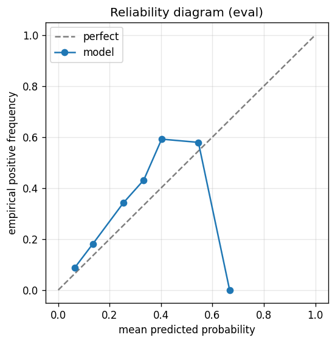

# gbdt experiment — sp500_up_40pct_200d_dd20pct_aligned_resnap

## Warnings

- **hp_search**: HP search disabled in sweep mode (max_iter=3 < threshold=5); the FS+HP loop ran feature-selection only — see issue #32.

## Spec

- universe: `sp500`
- direction: `up`
- threshold_pct: `40`
- horizon_days: `200`
- max_drawdown: `0.2`
- fs_hp_loop callback_mode: `default`

## Data

- tickers in universe: 503
- tickers used: 477
- tickers excluded: NASDAQ:ABNB, NASDAQ:APP, NASDAQ:CEG, NASDAQ:CRWD, NASDAQ:DASH, NASDAQ:DDOG, NASDAQ:GEHC, NASDAQ:PLTR, NYSE:CARR, NYSE:COIN, NYSE:CTVA, NYSE:DOW, NYSE:EXE, NYSE:FOX, NYSE:FOXA, NYSE:GEV, NYSE:HOOD, NYSE:KVUE, NYSE:MRNA, NYSE:OTIS, NYSE:Q, NYSE:SNDK, NYSE:SOLV, NYSE:UBER, NYSE:VLTO, NYSE:VRT
- train rows: 381600 (independent events ≈ 956.6; overlap-inflation 398.92×)
- val rows: 190800 (independent events ≈ 478.2; overlap-inflation 399.00×)
- eval rows: 95400 (independent events ≈ 239.1; overlap-inflation 399.00×)
- test rows: 143100 (independent events ≈ 358.6; overlap-inflation 399.00×)
- sample uniqueness weighting: `on` (horizon_days=200)
- positive prevalence (train): 0.212
- positive prevalence (eval): 0.176

## Segment windows

- split mode: `date_aligned`
- train_start anchor: `2018-01-01`
- train: `2018-01-02` → `2021-03-08`
- val: `2021-03-09` → `2022-10-06`
- eval: `2022-10-07` → `2023-07-26`
- test: `2023-07-27` → `2024-10-03`

## Iteration history

| iter | n_features | train Brier | val Brier | gap | rationale | inner_stop |
|---|---|---|---|---|---|---|
| 0 | 279 | 0.1167 | 0.1089 | -0.0079 | iteration 0 — full feature pool, default HPs :: algorithmic fallback: kept 55/27 |  |
| 1 | 55 | 0.1175 | 0.1098 | -0.0077 | iteration 1 from FS+HP callback :: algorithmic fallback: kept 48/55 features |  |
| 2 | 48 | 0.1162 | 0.1122 | -0.0040 | iteration 2 from FS+HP callback :: inner_stop=degradation | degradation |

## Final checkpoint

- best iteration: 0
- iterations run: 3
- inner stop signal: `degradation`
- fs_hp_loop callback_mode: `default`
- tie-break path: `v14_val_flat_eval_rp1` — Val_brier flat: tie set picked by eval R-Precision@1 (V1.4 P1)

## Calibration

- method requested: `conditional_isotonic`
- decision: `isotonic`
- Spiegelhalter Z: -83.613
- Spiegelhalter p: 0.0000

## Headline metrics

| segment | Brier | base-rate Brier | improvement | LogLoss | AUC |
|---|---|---|---|---|---|
| eval | 0.1373 | 0.1450 | +0.0077 | 0.4419 | 0.6741 |
| test | 0.1929 | 0.1710 | -0.0219 | 0.7542 | 0.6678 |

## Top-K precision (per-day + global)

Per-day: pick the top-K rows by ``p_calibrated`` each date, pool across days. ``P@k = sum_d(positives_in_top_k(d)) / sum_d(min(R(d), k))`` where ``R(d)`` is the count of positives on day ``d`` — the ``min(R(d), k)`` denominator is the achievable-positives count (mandatory; see ``.claude/memories/project-r-precision-methodology.md``). ``n_denom = sum_d(min(R(d), k))``; ``n_days_R<k`` = days with fewer than ``k`` positives. Global: top-K by score across the whole segment, denominator ``min(k, total_positives)``. ``base_rate`` = unweighted segment positive prevalence (compare P@k to base_rate directly; lift omitted from the table by project reporting convention).

### eval — n_rows=95400, base_rate=0.1760

Per-day:

| k | P@k | base_rate | n_picks | n_positives | n_denom | days_R<k / days_full_k / days_total |
|---|---|---|---|---|---|---|
| 1 | 0.8000 | 0.1760 | 200 | 160 | 200 | 0 / 200 / 200 |
| 5 | 0.6310 | 0.1760 | 1000 | 631 | 1000 | 0 / 200 / 200 |
| 10 | 0.5425 | 0.1760 | 2000 | 1085 | 2000 | 0 / 200 / 200 |

Global (top-K across entire segment):

| k | P@k | base_rate | n_picks | n_positives | n_denom |
|---|---|---|---|---|---|
| 1 | 0.0000 | 0.1760 | 1 | 0 | 1 |
| 5 | 0.0000 | 0.1760 | 5 | 0 | 5 |
| 10 | 0.3000 | 0.1760 | 10 | 3 | 10 |

### test — n_rows=143100, base_rate=0.2189

Per-day:

| k | P@k | base_rate | n_picks | n_positives | n_denom | days_R<k / days_full_k / days_total |
|---|---|---|---|---|---|---|
| 1 | 0.7267 | 0.2189 | 300 | 218 | 300 | 0 / 300 / 300 |
| 5 | 0.5213 | 0.2189 | 1500 | 782 | 1500 | 0 / 300 / 300 |
| 10 | 0.4500 | 0.2189 | 3000 | 1350 | 3000 | 0 / 300 / 300 |

Global (top-K across entire segment):

| k | P@k | base_rate | n_picks | n_positives | n_denom |
|---|---|---|---|---|---|
| 1 | 1.0000 | 0.2189 | 1 | 1 | 1 |
| 5 | 1.0000 | 0.2189 | 5 | 5 | 5 |
| 10 | 0.8000 | 0.2189 | 10 | 8 | 10 |

## R-Precision@K (canonical macro)

Per-day fixed K, **macro-averaged** across days with ``R_q > 0``: ``R-Precision@K = (1/Q) · Σ r_q / min(K, R_q)`` where ``R_q`` = positives that day, ``r_q`` = positives caught in top-K, sorted by ``(p_calibrated desc, ticker asc)`` stable mergesort. This is the cross-cell headline (matches ``results/gbdt/data/r_precision_at_k.csv``) — distinct from the Top-K block's ``per_day.p_at_k`` above, which is micro-aggregated (both forms are mathematically valid; macro is canonical for cross-cell comparison). See ``.claude/memories/project-r-precision-methodology.md``.

### eval — n_rows=95400, Q_days=200, base_rate=0.1760

| k | R-Precision@k | base_rate | Q_days |
|---|---|---|---|
| 1 | 0.8000 | 0.1760 | 200 |
| 3 | 0.6600 | 0.1760 | 200 |
| 5 | 0.6310 | 0.1760 | 200 |
| 10 | 0.5425 | 0.1760 | 200 |
| 20 | 0.4880 | 0.1760 | 200 |

### test — n_rows=143100, Q_days=300, base_rate=0.2189

| k | R-Precision@k | base_rate | Q_days |
|---|---|---|---|
| 1 | 0.7267 | 0.2189 | 300 |
| 3 | 0.5556 | 0.2189 | 300 |
| 5 | 0.5213 | 0.2189 | 300 |
| 10 | 0.4500 | 0.2189 | 300 |
| 20 | 0.4505 | 0.2189 | 300 |

## Per-ticker hit-rate when picked (k=5)

Aggregates per-day top-5 picks by ticker. Top 10 most-picked + bottom 5 most-anti-predictive (when picked at least once) shown; the full table is in ``metrics.json::segment_diagnostics.<seg>.per_ticker_hit_rate.rows``.

### eval

Top-10 by n_picks:

| ticker | n_picks | n_positives | hit_rate |
|---|---|---|---|
| NASDAQ:TSLA | 144 | 61 | 0.4236 |
| NYSE:CCL | 118 | 76 | 0.6441 |
| NYSE:CVNA | 92 | 74 | 0.8043 |
| NASDAQ:AMD | 71 | 66 | 0.9296 |
| NYSE:XYZ | 63 | 4 | 0.0635 |
| NYSE:NCLH | 61 | 51 | 0.8361 |
| NASDAQ:NFLX | 59 | 56 | 0.9492 |
| NASDAQ:WBD | 55 | 1 | 0.0182 |
| NASDAQ:TTD | 51 | 29 | 0.5686 |
| NASDAQ:NVDA | 50 | 48 | 0.9600 |

Bottom-5 by hit_rate (n_picks ≥ 5):

| ticker | n_picks | n_positives | hit_rate |
|---|---|---|---|
| NASDAQ:DXCM | 27 | 0 | 0.0000 |
| NYSE:ALGN | 16 | 0 | 0.0000 |
| NYSE:GNRC | 5 | 0 | 0.0000 |
| NASDAQ:WBD | 55 | 1 | 0.0182 |
| NYSE:XYZ | 63 | 4 | 0.0635 |

### test

Top-10 by n_picks:

| ticker | n_picks | n_positives | hit_rate |
|---|---|---|---|
| NYSE:CVNA | 300 | 233 | 0.7767 |
| NYSE:SMCI | 300 | 131 | 0.4367 |
| NYSE:SATS | 201 | 158 | 0.7861 |
| NYSE:COHR | 195 | 162 | 0.8308 |
| NYSE:PSKY | 188 | 2 | 0.0106 |
| NYSE:GNRC | 69 | 24 | 0.3478 |
| NASDAQ:WBD | 62 | 0 | 0.0000 |
| NASDAQ:TSLA | 51 | 11 | 0.2157 |
| NYSE:NCLH | 50 | 39 | 0.7800 |
| NYSE:DELL | 31 | 5 | 0.1613 |

Bottom-5 by hit_rate (n_picks ≥ 5):

| ticker | n_picks | n_positives | hit_rate |
|---|---|---|---|
| NASDAQ:WBD | 62 | 0 | 0.0000 |
| NYSE:GL | 5 | 0 | 0.0000 |
| NYSE:PSKY | 188 | 2 | 0.0106 |
| NYSE:DELL | 31 | 5 | 0.1613 |
| NYSE:ALB | 25 | 5 | 0.2000 |

## Per-quarter P@5 stability

P@5 grouped by calendar quarter. ``base_rate`` is the segment-wide positive prevalence (constant across rows); regime-dependent collapse shows as a quarter where ``P@5`` falls toward ``base_rate`` or below. ``lift`` omitted from the table by project reporting convention.

### eval

| quarter | n_picks | n_positives | P@5 | base_rate |
|---|---|---|---|---|
| 2022Q4 | 295 | 227 | 0.7695 | 0.1760 |
| 2023Q1 | 310 | 192 | 0.6194 | 0.1760 |
| 2023Q2 | 310 | 194 | 0.6258 | 0.1760 |
| 2023Q3 | 85 | 18 | 0.2118 | 0.1760 |

### test

| quarter | n_picks | n_positives | P@5 | base_rate |
|---|---|---|---|---|
| 2023Q3 | 230 | 61 | 0.2652 | 0.2189 |
| 2023Q4 | 315 | 218 | 0.6921 | 0.2189 |
| 2024Q1 | 305 | 185 | 0.6066 | 0.2189 |
| 2024Q2 | 315 | 185 | 0.5873 | 0.2189 |
| 2024Q3 | 320 | 128 | 0.4000 | 0.2189 |
| 2024Q4 | 15 | 5 | 0.3333 | 0.2189 |

## Prediction-range diagnostics

Distribution of ``p_calibrated`` per segment. ``flag_low_separation = true`` when ``std < low_separation_threshold`` — a sign the model's predictions cluster so tightly that ranking is noise.

| segment | n_rows | min | max | mean | std | flag_low_separation |
|---|---|---|---|---|---|---|
| eval | 95400 | 0.0067 | 0.6667 | 0.1298 | 0.0735 | `False` |
| test | 143100 | 0.0000 | 0.3810 | 0.0502 | 0.0406 | `True` |

## Per-experiment verdict (algorithmic readout)

Calibration: required isotonic (|z|=83.61); shipped as `isotonic`. Brier vs base-rate: +0.0077 (model beats baseline).

> NOTE: this verdict is generated from the metrics by a simple rule (see ``report._algorithmic_verdict``); it is NOT an automated pass/fail gate. The user reads the artifact and decides whether the cell ships.
