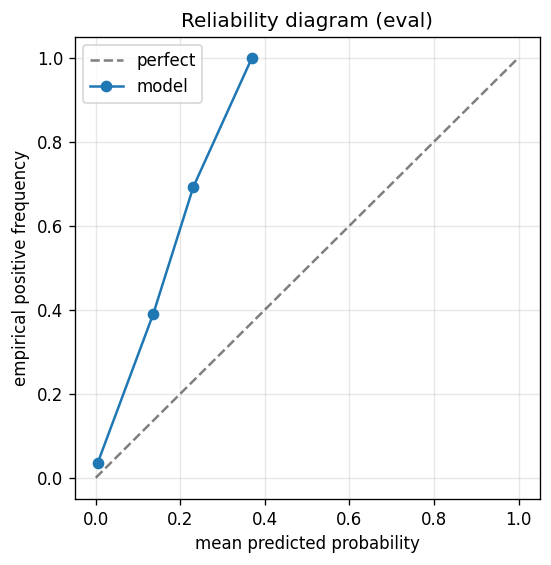

# gbdt experiment — sp500_up_50pct_100d_dd25pct_aligned

## Warnings

- **hp_search**: HP search disabled in sweep mode (max_iter=3 < threshold=5); the FS+HP loop ran feature-selection only — see issue #32.

## Spec

- universe: `sp500`
- direction: `up`
- threshold_pct: `50`
- horizon_days: `100`
- max_drawdown: `0.25`
- fs_hp_loop callback_mode: `default`

## Data

- tickers in universe: 503
- tickers used: 486
- tickers excluded: NASDAQ:ABNB, NASDAQ:APP, NASDAQ:CEG, NASDAQ:DASH, NASDAQ:GEHC, NASDAQ:PLTR, NYSE:CARR, NYSE:COIN, NYSE:EXE, NYSE:GEV, NYSE:HOOD, NYSE:KVUE, NYSE:OTIS, NYSE:Q, NYSE:SNDK, NYSE:SOLV, NYSE:VLTO
- train rows: 388173 (independent events ≈ 1952.1; overlap-inflation 198.85×)
- val rows: 194400 (independent events ≈ 976.9; overlap-inflation 199.00×)
- eval rows: 97200 (independent events ≈ 488.4; overlap-inflation 199.00×)
- test rows: 97200 (independent events ≈ 488.4; overlap-inflation 199.00×)
- sample uniqueness weighting: `on` (horizon_days=100)
- positive prevalence (train): 0.054
- positive prevalence (eval): 0.041

## Segment windows

- split mode: `date_aligned`
- train_start anchor: `2019-01-01`
- train: `2019-01-02` → `2022-03-04`
- val: `2022-03-07` → `2023-10-06`
- eval: `2023-10-09` → `2024-07-25`
- test: `2024-07-26` → `2025-05-13`

## Iteration history

| iter | n_features | train Brier | val Brier | gap | rationale | inner_stop |
|---|---|---|---|---|---|---|
| 0 | 279 | 0.0355 | 0.0226 | -0.0128 | iteration 0 — full feature pool, default HPs :: algorithmic fallback: kept 63/27 |  |
| 1 | 63 | 0.0361 | 0.0230 | -0.0131 | iteration 1 from FS+HP callback :: inner_stop=degradation | degradation |

## Final checkpoint

- best iteration: 1
- iterations run: 2
- inner stop signal: `degradation`
- fs_hp_loop callback_mode: `default`

## Calibration

- method requested: `conditional_isotonic`
- decision: `isotonic`
- Spiegelhalter Z: -65.677
- Spiegelhalter p: 0.0000

## Headline metrics

| segment | Brier | base-rate Brier | improvement | LogLoss | AUC |
|---|---|---|---|---|---|
| eval | 0.0383 | 0.0396 | +0.0012 | 0.1864 | 0.8289 |
| test | 0.0371 | 0.0407 | +0.0036 | 0.1500 | 0.9006 |

## Top-K precision (per-day + global)

Per-day: pick the top-K rows by ``p_calibrated`` each date, pool across days. ``P@k = sum_d(positives_in_top_k(d)) / sum_d(min(R(d), k))`` where ``R(d)`` is the count of positives on day ``d`` — the ``min(R(d), k)`` denominator is the achievable-positives count (mandatory; see ``.claude/memories/project-r-precision-methodology.md``). ``n_denom = sum_d(min(R(d), k))``; ``n_days_R<k`` = days with fewer than ``k`` positives. Global: top-K by score across the whole segment, denominator ``min(k, total_positives)``. ``base_rate`` = unweighted segment positive prevalence (compare P@k to base_rate directly; lift omitted from the table by project reporting convention).

### eval — n_rows=97200, base_rate=0.0413

Per-day:

| k | P@k | base_rate | n_picks | n_positives | n_denom | days_R<k / days_full_k / days_total |
|---|---|---|---|---|---|---|
| 1 | 0.6150 | 0.0413 | 200 | 123 | 200 | 0 / 200 / 200 |
| 5 | 0.4905 | 0.0413 | 1000 | 490 | 999 | 1 / 200 / 200 |
| 10 | 0.3690 | 0.0413 | 2000 | 696 | 1886 | 41 / 200 / 200 |

Global (top-K across entire segment):

| k | P@k | base_rate | n_picks | n_positives | n_denom |
|---|---|---|---|---|---|
| 1 | 1.0000 | 0.0413 | 1 | 1 | 1 |
| 5 | 1.0000 | 0.0413 | 5 | 5 | 5 |
| 10 | 1.0000 | 0.0413 | 10 | 10 | 10 |

### test — n_rows=97200, base_rate=0.0425

Per-day:

| k | P@k | base_rate | n_picks | n_positives | n_denom | days_R<k / days_full_k / days_total |
|---|---|---|---|---|---|---|
| 1 | 0.4769 | 0.0425 | 200 | 93 | 195 | 5 / 200 / 200 |
| 5 | 0.4120 | 0.0425 | 1000 | 356 | 864 | 59 / 200 / 200 |
| 10 | 0.4364 | 0.0425 | 2000 | 652 | 1494 | 81 / 200 / 200 |

Global (top-K across entire segment):

| k | P@k | base_rate | n_picks | n_positives | n_denom |
|---|---|---|---|---|---|
| 1 | 1.0000 | 0.0425 | 1 | 1 | 1 |
| 5 | 1.0000 | 0.0425 | 5 | 5 | 5 |
| 10 | 1.0000 | 0.0425 | 10 | 10 | 10 |

## Per-ticker hit-rate when picked (k=5)

Aggregates per-day top-5 picks by ticker. Top 10 most-picked + bottom 5 most-anti-predictive (when picked at least once) shown; the full table is in ``metrics.json::segment_diagnostics.<seg>.per_ticker_hit_rate.rows``.

### eval

Top-10 by n_picks:

| ticker | n_picks | n_positives | hit_rate |
|---|---|---|---|
| NYSE:SMCI | 200 | 90 | 0.4500 |
| NYSE:CVNA | 197 | 184 | 0.9340 |
| NASDAQ:TSLA | 161 | 55 | 0.3416 |
| NYSE:SATS | 152 | 91 | 0.5987 |
| NYSE:NCLH | 116 | 24 | 0.2069 |
| NASDAQ:WBD | 64 | 0 | 0.0000 |
| NYSE:PSKY | 23 | 0 | 0.0000 |
| NYSE:COHR | 22 | 18 | 0.8182 |
| NYSE:KEY | 22 | 9 | 0.4091 |
| NYSE:GL | 21 | 8 | 0.3810 |

Bottom-5 by hit_rate (n_picks ≥ 5):

| ticker | n_picks | n_positives | hit_rate |
|---|---|---|---|
| NASDAQ:WBD | 64 | 0 | 0.0000 |
| NYSE:PSKY | 23 | 0 | 0.0000 |
| NYSE:NCLH | 116 | 24 | 0.2069 |
| NASDAQ:TSLA | 161 | 55 | 0.3416 |
| NYSE:GL | 21 | 8 | 0.3810 |

### test

Top-10 by n_picks:

| ticker | n_picks | n_positives | hit_rate |
|---|---|---|---|
| NYSE:SMCI | 197 | 91 | 0.4619 |
| NYSE:MRNA | 180 | 0 | 0.0000 |
| NYSE:CVNA | 169 | 106 | 0.6272 |
| NASDAQ:TSLA | 165 | 89 | 0.5394 |
| NYSE:SATS | 97 | 11 | 0.1134 |
| NYSE:COHR | 72 | 35 | 0.4861 |
| NYSE:VRT | 29 | 8 | 0.2759 |
| NYSE:VST | 27 | 6 | 0.2222 |
| NYSE:FSLR | 19 | 0 | 0.0000 |
| NYSE:ALB | 16 | 0 | 0.0000 |

Bottom-5 by hit_rate (n_picks ≥ 5):

| ticker | n_picks | n_positives | hit_rate |
|---|---|---|---|
| NYSE:MRNA | 180 | 0 | 0.0000 |
| NYSE:FSLR | 19 | 0 | 0.0000 |
| NYSE:ALB | 16 | 0 | 0.0000 |
| NYSE:PSKY | 11 | 0 | 0.0000 |
| NASDAQ:NVDA | 8 | 0 | 0.0000 |

## Per-quarter P@5 stability

P@5 grouped by calendar quarter. ``base_rate`` is the segment-wide positive prevalence (constant across rows); regime-dependent collapse shows as a quarter where ``P@5`` falls toward ``base_rate`` or below. ``lift`` omitted from the table by project reporting convention.

### eval

| quarter | n_picks | n_positives | P@5 | base_rate |
|---|---|---|---|---|
| 2023Q4 | 290 | 173 | 0.5966 | 0.0413 |
| 2024Q1 | 305 | 128 | 0.4197 | 0.0413 |
| 2024Q2 | 315 | 151 | 0.4794 | 0.0413 |
| 2024Q3 | 90 | 38 | 0.4222 | 0.0413 |

### test

| quarter | n_picks | n_positives | P@5 | base_rate |
|---|---|---|---|---|
| 2024Q3 | 230 | 107 | 0.4652 | 0.0425 |
| 2024Q4 | 320 | 59 | 0.1844 | 0.0425 |
| 2025Q1 | 300 | 86 | 0.2867 | 0.0425 |
| 2025Q2 | 150 | 104 | 0.6933 | 0.0425 |

## Prediction-range diagnostics

Distribution of ``p_calibrated`` per segment. ``flag_low_separation = true`` when ``std < low_separation_threshold`` — a sign the model's predictions cluster so tightly that ranking is noise.

| segment | n_rows | min | max | mean | std | flag_low_separation |
|---|---|---|---|---|---|---|
| eval | 97200 | 0.0000 | 0.3694 | 0.0067 | 0.0212 | `True` |
| test | 97200 | 0.0000 | 0.3694 | 0.0118 | 0.0321 | `True` |

## Per-experiment verdict (algorithmic readout)

Calibration: required isotonic (|z|=65.68); shipped as `isotonic`. Brier vs base-rate: +0.0012 (model beats baseline).

> NOTE: this verdict is generated from the metrics by a simple rule (see ``report._algorithmic_verdict``); it is NOT an automated pass/fail gate. The user reads the artifact and decides whether the cell ships.
