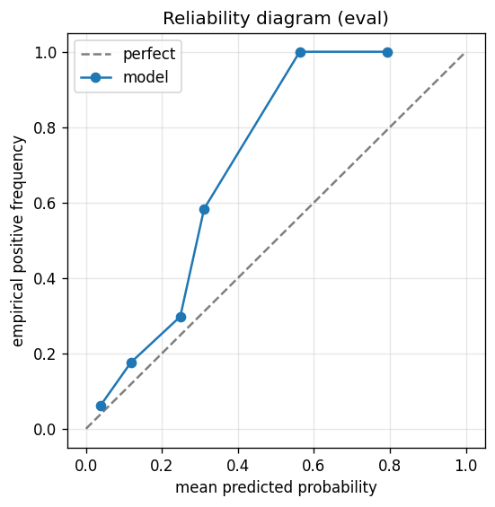

# gbdt experiment — sp500_up_50pct_200d_dd25pct_aligned

## Warnings

- **hp_search**: HP search disabled in sweep mode (max_iter=3 < threshold=5); the FS+HP loop ran feature-selection only — see issue #32.

## Spec

- universe: `sp500`
- direction: `up`
- threshold_pct: `50`
- horizon_days: `200`
- max_drawdown: `0.25`
- fs_hp_loop callback_mode: `default`

## Data

- tickers in universe: 503
- tickers used: 477
- tickers excluded: NASDAQ:ABNB, NASDAQ:APP, NASDAQ:CEG, NASDAQ:CRWD, NASDAQ:DASH, NASDAQ:DDOG, NASDAQ:GEHC, NASDAQ:PLTR, NYSE:CARR, NYSE:COIN, NYSE:CTVA, NYSE:DOW, NYSE:EXE, NYSE:FOX, NYSE:FOXA, NYSE:GEV, NYSE:HOOD, NYSE:KVUE, NYSE:MRNA, NYSE:OTIS, NYSE:Q, NYSE:SNDK, NYSE:SOLV, NYSE:UBER, NYSE:VLTO, NYSE:VRT
- train rows: 381600 (independent events ≈ 956.6; overlap-inflation 398.92×)
- val rows: 190800 (independent events ≈ 478.2; overlap-inflation 399.00×)
- eval rows: 95400 (independent events ≈ 239.1; overlap-inflation 399.00×)
- test rows: 143100 (independent events ≈ 358.6; overlap-inflation 399.00×)
- sample uniqueness weighting: `on` (horizon_days=200)
- positive prevalence (train): 0.147
- positive prevalence (eval): 0.107

## Segment windows

- split mode: `date_aligned`
- train_start anchor: `2018-01-01`
- train: `2018-01-02` → `2021-03-08`
- val: `2021-03-09` → `2022-10-06`
- eval: `2022-10-07` → `2023-07-26`
- test: `2023-07-27` → `2024-10-03`

## Iteration history

| iter | n_features | train Brier | val Brier | gap | rationale | inner_stop |
|---|---|---|---|---|---|---|
| 0 | 279 | 0.0851 | 0.0667 | -0.0184 | iteration 0 — full feature pool, default HPs :: algorithmic fallback: kept 52/27 |  |
| 1 | 52 | 0.0849 | 0.0665 | -0.0183 | iteration 1 from FS+HP callback :: algorithmic fallback: kept 46/52 features |  |
| 2 | 46 | 0.0852 | 0.0665 | -0.0187 | iteration 2 from FS+HP callback :: inner_stop=plateau | plateau |

## Final checkpoint

- best iteration: 2
- iterations run: 3
- inner stop signal: `plateau`
- fs_hp_loop callback_mode: `default`

## Calibration

- method requested: `conditional_isotonic`
- decision: `isotonic`
- Spiegelhalter Z: -90.294
- Spiegelhalter p: 0.0000

## Headline metrics

| segment | Brier | base-rate Brier | improvement | LogLoss | AUC |
|---|---|---|---|---|---|
| eval | 0.0879 | 0.0956 | +0.0078 | 0.3066 | 0.7526 |
| test | 0.1225 | 0.1168 | -0.0058 | 0.5071 | 0.7165 |

## Top-K precision (per-day + global)

Per-day: pick the top-K rows by ``p_calibrated`` each date, pool across days. ``P@k = sum_d(positives_in_top_k(d)) / sum_d(min(R(d), k))`` where ``R(d)`` is the count of positives on day ``d`` — the ``min(R(d), k)`` denominator is the achievable-positives count (mandatory; see ``.claude/memories/project-r-precision-methodology.md``). ``n_denom = sum_d(min(R(d), k))``; ``n_days_R<k`` = days with fewer than ``k`` positives. Global: top-K by score across the whole segment, denominator ``min(k, total_positives)``. ``base_rate`` = unweighted segment positive prevalence (compare P@k to base_rate directly; lift omitted from the table by project reporting convention).

### eval — n_rows=95400, base_rate=0.1071

Per-day:

| k | P@k | base_rate | n_picks | n_positives | n_denom | days_R<k / days_full_k / days_total |
|---|---|---|---|---|---|---|
| 1 | 0.7150 | 0.1071 | 200 | 143 | 200 | 0 / 200 / 200 |
| 5 | 0.6380 | 0.1071 | 1000 | 638 | 1000 | 0 / 200 / 200 |
| 10 | 0.5355 | 0.1071 | 2000 | 1071 | 2000 | 0 / 200 / 200 |

Global (top-K across entire segment):

| k | P@k | base_rate | n_picks | n_positives | n_denom |
|---|---|---|---|---|---|
| 1 | 1.0000 | 0.1071 | 1 | 1 | 1 |
| 5 | 1.0000 | 0.1071 | 5 | 5 | 5 |
| 10 | 1.0000 | 0.1071 | 10 | 10 | 10 |

### test — n_rows=143100, base_rate=0.1350

Per-day:

| k | P@k | base_rate | n_picks | n_positives | n_denom | days_R<k / days_full_k / days_total |
|---|---|---|---|---|---|---|
| 1 | 0.6067 | 0.1350 | 300 | 182 | 300 | 0 / 300 / 300 |
| 5 | 0.5427 | 0.1350 | 1500 | 814 | 1500 | 0 / 300 / 300 |
| 10 | 0.4877 | 0.1350 | 3000 | 1463 | 3000 | 0 / 300 / 300 |

Global (top-K across entire segment):

| k | P@k | base_rate | n_picks | n_positives | n_denom |
|---|---|---|---|---|---|
| 1 | 0.0000 | 0.1350 | 1 | 0 | 1 |
| 5 | 0.0000 | 0.1350 | 5 | 0 | 5 |
| 10 | 0.0000 | 0.1350 | 10 | 0 | 10 |

## Per-ticker hit-rate when picked (k=5)

Aggregates per-day top-5 picks by ticker. Top 10 most-picked + bottom 5 most-anti-predictive (when picked at least once) shown; the full table is in ``metrics.json::segment_diagnostics.<seg>.per_ticker_hit_rate.rows``.

### eval

Top-10 by n_picks:

| ticker | n_picks | n_positives | hit_rate |
|---|---|---|---|
| NYSE:NCLH | 179 | 90 | 0.5028 |
| NASDAQ:TSLA | 153 | 85 | 0.5556 |
| NYSE:CCL | 129 | 99 | 0.7674 |
| NYSE:CVNA | 96 | 78 | 0.8125 |
| NYSE:GNRC | 68 | 11 | 0.1618 |
| NASDAQ:AMD | 67 | 67 | 1.0000 |
| NASDAQ:NVDA | 58 | 58 | 1.0000 |
| NASDAQ:NFLX | 51 | 31 | 0.6078 |
| NYSE:SMCI | 50 | 46 | 0.9200 |
| NASDAQ:WBD | 41 | 5 | 0.1220 |

Bottom-5 by hit_rate (n_picks ≥ 5):

| ticker | n_picks | n_positives | hit_rate |
|---|---|---|---|
| NASDAQ:PYPL | 9 | 0 | 0.0000 |
| NASDAQ:WBD | 41 | 5 | 0.1220 |
| NYSE:XYZ | 20 | 3 | 0.1500 |
| NYSE:GNRC | 68 | 11 | 0.1618 |
| NYSE:NCLH | 179 | 90 | 0.5028 |

### test

Top-10 by n_picks:

| ticker | n_picks | n_positives | hit_rate |
|---|---|---|---|
| NYSE:CVNA | 300 | 241 | 0.8033 |
| NYSE:SMCI | 289 | 122 | 0.4221 |
| NYSE:SATS | 208 | 184 | 0.8846 |
| NYSE:COHR | 183 | 181 | 0.9891 |
| NYSE:PSKY | 179 | 1 | 0.0056 |
| NYSE:NCLH | 95 | 48 | 0.5053 |
| NYSE:KEY | 94 | 32 | 0.3404 |
| NYSE:ALB | 74 | 0 | 0.0000 |
| NASDAQ:TSLA | 40 | 3 | 0.0750 |
| NYSE:DELL | 10 | 0 | 0.0000 |

Bottom-5 by hit_rate (n_picks ≥ 5):

| ticker | n_picks | n_positives | hit_rate |
|---|---|---|---|
| NYSE:ALB | 74 | 0 | 0.0000 |
| NYSE:DELL | 10 | 0 | 0.0000 |
| NASDAQ:WBD | 9 | 0 | 0.0000 |
| NASDAQ:NVDA | 8 | 0 | 0.0000 |
| NASDAQ:TTD | 7 | 0 | 0.0000 |

## Per-quarter P@5 stability

P@5 grouped by calendar quarter. ``base_rate`` is the segment-wide positive prevalence (constant across rows); regime-dependent collapse shows as a quarter where ``P@5`` falls toward ``base_rate`` or below. ``lift`` omitted from the table by project reporting convention.

### eval

| quarter | n_picks | n_positives | P@5 | base_rate |
|---|---|---|---|---|
| 2022Q4 | 295 | 216 | 0.7322 | 0.1071 |
| 2023Q1 | 310 | 195 | 0.6290 | 0.1071 |
| 2023Q2 | 310 | 207 | 0.6677 | 0.1071 |
| 2023Q3 | 85 | 20 | 0.2353 | 0.1071 |

### test

| quarter | n_picks | n_positives | P@5 | base_rate |
|---|---|---|---|---|
| 2023Q3 | 230 | 74 | 0.3217 | 0.1350 |
| 2023Q4 | 315 | 211 | 0.6698 | 0.1350 |
| 2024Q1 | 305 | 212 | 0.6951 | 0.1350 |
| 2024Q2 | 315 | 177 | 0.5619 | 0.1350 |
| 2024Q3 | 320 | 137 | 0.4281 | 0.1350 |
| 2024Q4 | 15 | 3 | 0.2000 | 0.1350 |

## Prediction-range diagnostics

Distribution of ``p_calibrated`` per segment. ``flag_low_separation = true`` when ``std < low_separation_threshold`` — a sign the model's predictions cluster so tightly that ranking is noise.

| segment | n_rows | min | max | mean | std | flag_low_separation |
|---|---|---|---|---|---|---|
| eval | 95400 | 0.0000 | 0.7917 | 0.0693 | 0.0671 | `False` |
| test | 143100 | 0.0000 | 0.3108 | 0.0290 | 0.0381 | `True` |

## Per-experiment verdict (algorithmic readout)

Calibration: required isotonic (|z|=90.29); shipped as `isotonic`. Brier vs base-rate: +0.0078 (model beats baseline).

> NOTE: this verdict is generated from the metrics by a simple rule (see ``report._algorithmic_verdict``); it is NOT an automated pass/fail gate. The user reads the artifact and decides whether the cell ships.
