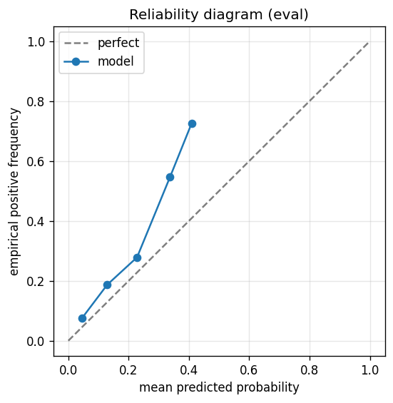

# gbdt experiment — sp500_up_50pct_200d_dd25pct_aligned_cbagent

## Spec

- universe: `sp500`
- direction: `up`
- threshold_pct: `50`
- horizon_days: `200`
- max_drawdown: `0.25`
- fs_hp_loop callback_mode: `agent_file_protocol`

## Data

- tickers in universe: 503
- tickers used: 477
- tickers excluded: NASDAQ:ABNB, NASDAQ:APP, NASDAQ:CEG, NASDAQ:CRWD, NASDAQ:DASH, NASDAQ:DDOG, NASDAQ:GEHC, NASDAQ:PLTR, NYSE:CARR, NYSE:COIN, NYSE:CTVA, NYSE:DOW, NYSE:EXE, NYSE:FOX, NYSE:FOXA, NYSE:GEV, NYSE:HOOD, NYSE:KVUE, NYSE:MRNA, NYSE:OTIS, NYSE:Q, NYSE:SNDK, NYSE:SOLV, NYSE:UBER, NYSE:VLTO, NYSE:VRT
- train rows: 381600 (independent events ≈ 956.6; overlap-inflation 398.92×)
- val rows: 190800 (independent events ≈ 478.2; overlap-inflation 399.00×)
- eval rows: 95400 (independent events ≈ 239.1; overlap-inflation 399.00×)
- test rows: 143100 (independent events ≈ 358.6; overlap-inflation 399.00×)
- sample uniqueness weighting: `on` (horizon_days=200)
- positive prevalence (train): 0.147
- positive prevalence (eval): 0.107

## Segment windows

- split mode: `date_aligned`
- train_start anchor: `2018-01-01`
- train: `2018-01-02` → `2021-03-08`
- val: `2021-03-09` → `2022-10-06`
- eval: `2022-10-07` → `2023-07-26`
- test: `2023-07-27` → `2024-10-03`

## Iteration history

| iter | n_features | train Brier | val Brier | gap | rationale | inner_stop |
|---|---|---|---|---|---|---|

## Final checkpoint

- best iteration: 0
- iterations run: 3
- inner stop signal: `agent_should_stop`
- fs_hp_loop callback_mode: `agent_file_protocol`
- tie-break path: `v14_val_flat_eval_rp1` — Val_brier flat: tie set picked by eval R-Precision@1 (V1.4 P1)

## Calibration

- method requested: `conditional_isotonic`
- decision: `isotonic`
- Spiegelhalter Z: -86.266
- Spiegelhalter p: 0.0000

## Headline metrics

| segment | Brier | base-rate Brier | improvement | LogLoss | AUC |
|---|---|---|---|---|---|
| eval | 0.0877 | 0.0956 | +0.0079 | 0.3067 | 0.7566 |
| test | 0.1223 | 0.1168 | -0.0055 | 0.4801 | 0.7161 |

## Top-K precision (per-day + global)

Per-day: pick the top-K rows by ``p_calibrated`` each date, pool across days. ``P@k = sum_d(positives_in_top_k(d)) / sum_d(min(R(d), k))`` where ``R(d)`` is the count of positives on day ``d`` — the ``min(R(d), k)`` denominator is the achievable-positives count (mandatory; see ``.claude/memories/project-r-precision-methodology.md``). ``n_denom = sum_d(min(R(d), k))``; ``n_days_R<k`` = days with fewer than ``k`` positives. Global: top-K by score across the whole segment, denominator ``min(k, total_positives)``. ``base_rate`` = unweighted segment positive prevalence (compare P@k to base_rate directly; lift omitted from the table by project reporting convention).

### eval — n_rows=95400, base_rate=0.1071

Per-day:

| k | P@k | base_rate | n_picks | n_positives | n_denom | days_R<k / days_full_k / days_total |
|---|---|---|---|---|---|---|
| 1 | 0.8450 | 0.1071 | 200 | 169 | 200 | 0 / 200 / 200 |
| 5 | 0.6440 | 0.1071 | 1000 | 644 | 1000 | 0 / 200 / 200 |
| 10 | 0.5360 | 0.1071 | 2000 | 1072 | 2000 | 0 / 200 / 200 |

Global (top-K across entire segment):

| k | P@k | base_rate | n_picks | n_positives | n_denom |
|---|---|---|---|---|---|
| 1 | 1.0000 | 0.1071 | 1 | 1 | 1 |
| 5 | 1.0000 | 0.1071 | 5 | 5 | 5 |
| 10 | 0.7000 | 0.1071 | 10 | 7 | 10 |

### test — n_rows=143100, base_rate=0.1350

Per-day:

| k | P@k | base_rate | n_picks | n_positives | n_denom | days_R<k / days_full_k / days_total |
|---|---|---|---|---|---|---|
| 1 | 0.9300 | 0.1350 | 300 | 279 | 300 | 0 / 300 / 300 |
| 5 | 0.5553 | 0.1350 | 1500 | 833 | 1500 | 0 / 300 / 300 |
| 10 | 0.4873 | 0.1350 | 3000 | 1462 | 3000 | 0 / 300 / 300 |

Global (top-K across entire segment):

| k | P@k | base_rate | n_picks | n_positives | n_denom |
|---|---|---|---|---|---|
| 1 | 1.0000 | 0.1350 | 1 | 1 | 1 |
| 5 | 1.0000 | 0.1350 | 5 | 5 | 5 |
| 10 | 1.0000 | 0.1350 | 10 | 10 | 10 |

## R-Precision@K (canonical macro)

Per-day fixed K, **macro-averaged** across days with ``R_q > 0``: ``R-Precision@K = (1/Q) · Σ r_q / min(K, R_q)`` where ``R_q`` = positives that day, ``r_q`` = positives caught in top-K, sorted by ``(p_calibrated desc, ticker asc)`` stable mergesort. This is the cross-cell headline (matches ``results/gbdt/data/r_precision_at_k.csv``) — distinct from the Top-K block's ``per_day.p_at_k`` above, which is micro-aggregated (both forms are mathematically valid; macro is canonical for cross-cell comparison). See ``.claude/memories/project-r-precision-methodology.md``.

### eval — n_rows=95400, Q_days=200, base_rate=0.1071

| k | R-Precision@k | base_rate | Q_days |
|---|---|---|---|
| 1 | 0.8450 | 0.1071 | 200 |
| 3 | 0.7383 | 0.1071 | 200 |
| 5 | 0.6440 | 0.1071 | 200 |
| 10 | 0.5360 | 0.1071 | 200 |
| 20 | 0.4386 | 0.1071 | 200 |

### test — n_rows=143100, Q_days=300, base_rate=0.1350

| k | R-Precision@k | base_rate | Q_days |
|---|---|---|---|
| 1 | 0.9300 | 0.1350 | 300 |
| 3 | 0.6167 | 0.1350 | 300 |
| 5 | 0.5553 | 0.1350 | 300 |
| 10 | 0.4873 | 0.1350 | 300 |
| 20 | 0.4600 | 0.1350 | 300 |

## Per-ticker hit-rate when picked (k=5)

Aggregates per-day top-5 picks by ticker. Top 10 most-picked + bottom 5 most-anti-predictive (when picked at least once) shown; the full table is in ``metrics.json::segment_diagnostics.<seg>.per_ticker_hit_rate.rows``.

### eval

Top-10 by n_picks:

| ticker | n_picks | n_positives | hit_rate |
|---|---|---|---|
| NASDAQ:TSLA | 133 | 77 | 0.5789 |
| NYSE:CCL | 123 | 83 | 0.6748 |
| NYSE:GNRC | 92 | 11 | 0.1196 |
| NASDAQ:AMD | 72 | 72 | 1.0000 |
| NASDAQ:NVDA | 71 | 71 | 1.0000 |
| NYSE:CVNA | 71 | 61 | 0.8592 |
| NASDAQ:TTD | 70 | 52 | 0.7429 |
| NASDAQ:NFLX | 67 | 47 | 0.7015 |
| NASDAQ:WBD | 46 | 0 | 0.0000 |
| NYSE:NCLH | 44 | 42 | 0.9545 |

Bottom-5 by hit_rate (n_picks ≥ 5):

| ticker | n_picks | n_positives | hit_rate |
|---|---|---|---|
| NASDAQ:WBD | 46 | 0 | 0.0000 |
| NASDAQ:DXCM | 25 | 0 | 0.0000 |
| NYSE:XYZ | 25 | 0 | 0.0000 |
| NYSE:ALGN | 9 | 0 | 0.0000 |
| NASDAQ:PYPL | 7 | 0 | 0.0000 |

### test

Top-10 by n_picks:

| ticker | n_picks | n_positives | hit_rate |
|---|---|---|---|
| NYSE:CVNA | 300 | 241 | 0.8033 |
| NYSE:SMCI | 284 | 121 | 0.4261 |
| NYSE:COHR | 217 | 194 | 0.8940 |
| NYSE:SATS | 204 | 178 | 0.8725 |
| NYSE:PSKY | 172 | 0 | 0.0000 |
| NASDAQ:TSLA | 84 | 36 | 0.4286 |
| NYSE:ALB | 66 | 1 | 0.0152 |
| NYSE:KEY | 54 | 20 | 0.3704 |
| NYSE:GNRC | 33 | 11 | 0.3333 |
| NYSE:CCL | 22 | 1 | 0.0455 |

Bottom-5 by hit_rate (n_picks ≥ 5):

| ticker | n_picks | n_positives | hit_rate |
|---|---|---|---|
| NYSE:PSKY | 172 | 0 | 0.0000 |
| NASDAQ:WBD | 15 | 0 | 0.0000 |
| NASDAQ:TTD | 12 | 0 | 0.0000 |
| NYSE:DELL | 5 | 0 | 0.0000 |
| NYSE:ALB | 66 | 1 | 0.0152 |

## Per-quarter P@5 stability

P@5 grouped by calendar quarter. ``base_rate`` is the segment-wide positive prevalence (constant across rows); regime-dependent collapse shows as a quarter where ``P@5`` falls toward ``base_rate`` or below. ``lift`` omitted from the table by project reporting convention.

### eval

| quarter | n_picks | n_positives | P@5 | base_rate |
|---|---|---|---|---|
| 2022Q4 | 295 | 224 | 0.7593 | 0.1071 |
| 2023Q1 | 310 | 189 | 0.6097 | 0.1071 |
| 2023Q2 | 310 | 212 | 0.6839 | 0.1071 |
| 2023Q3 | 85 | 19 | 0.2235 | 0.1071 |

### test

| quarter | n_picks | n_positives | P@5 | base_rate |
|---|---|---|---|---|
| 2023Q3 | 230 | 80 | 0.3478 | 0.1350 |
| 2023Q4 | 315 | 219 | 0.6952 | 0.1350 |
| 2024Q1 | 305 | 213 | 0.6984 | 0.1350 |
| 2024Q2 | 315 | 163 | 0.5175 | 0.1350 |
| 2024Q3 | 320 | 152 | 0.4750 | 0.1350 |
| 2024Q4 | 15 | 6 | 0.4000 | 0.1350 |

## Prediction-range diagnostics

Distribution of ``p_calibrated`` per segment. ``flag_low_separation = true`` when ``std < low_separation_threshold`` — a sign the model's predictions cluster so tightly that ranking is noise.

| segment | n_rows | min | max | mean | std | flag_low_separation |
|---|---|---|---|---|---|---|
| eval | 95400 | 0.0000 | 0.4088 | 0.0690 | 0.0697 | `False` |
| test | 143100 | 0.0000 | 0.3391 | 0.0299 | 0.0379 | `True` |

## Per-experiment verdict (algorithmic readout)

Calibration: required isotonic (|z|=86.27); shipped as `isotonic`. Brier vs base-rate: +0.0079 (model beats baseline).

> NOTE: this verdict is generated from the metrics by a simple rule (see ``report._algorithmic_verdict``); it is NOT an automated pass/fail gate. The user reads the artifact and decides whether the cell ships.
