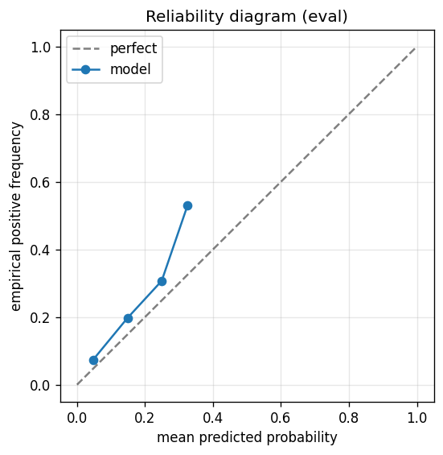

# gbdt experiment — sp500_up_50pct_200d_dd25pct_aligned_resnap

## Warnings

- **hp_search**: HP search disabled in sweep mode (max_iter=3 < threshold=5); the FS+HP loop ran feature-selection only — see issue #32.

## Spec

- universe: `sp500`
- direction: `up`
- threshold_pct: `50`
- horizon_days: `200`
- max_drawdown: `0.25`
- fs_hp_loop callback_mode: `default`

## Data

- tickers in universe: 503
- tickers used: 477
- tickers excluded: NASDAQ:ABNB, NASDAQ:APP, NASDAQ:CEG, NASDAQ:CRWD, NASDAQ:DASH, NASDAQ:DDOG, NASDAQ:GEHC, NASDAQ:PLTR, NYSE:CARR, NYSE:COIN, NYSE:CTVA, NYSE:DOW, NYSE:EXE, NYSE:FOX, NYSE:FOXA, NYSE:GEV, NYSE:HOOD, NYSE:KVUE, NYSE:MRNA, NYSE:OTIS, NYSE:Q, NYSE:SNDK, NYSE:SOLV, NYSE:UBER, NYSE:VLTO, NYSE:VRT
- train rows: 381600 (independent events ≈ 956.6; overlap-inflation 398.92×)
- val rows: 190800 (independent events ≈ 478.2; overlap-inflation 399.00×)
- eval rows: 95400 (independent events ≈ 239.1; overlap-inflation 399.00×)
- test rows: 143100 (independent events ≈ 358.6; overlap-inflation 399.00×)
- sample uniqueness weighting: `on` (horizon_days=200)
- positive prevalence (train): 0.147
- positive prevalence (eval): 0.107

## Segment windows

- split mode: `date_aligned`
- train_start anchor: `2018-01-01`
- train: `2018-01-02` → `2021-03-08`
- val: `2021-03-09` → `2022-10-06`
- eval: `2022-10-07` → `2023-07-26`
- test: `2023-07-27` → `2024-10-03`

## Iteration history

| iter | n_features | train Brier | val Brier | gap | rationale | inner_stop |
|---|---|---|---|---|---|---|
| 0 | 279 | 0.0851 | 0.0667 | -0.0184 | iteration 0 — full feature pool, default HPs :: algorithmic fallback: kept 52/27 |  |
| 1 | 52 | 0.0849 | 0.0665 | -0.0183 | iteration 1 from FS+HP callback :: algorithmic fallback: kept 46/52 features |  |
| 2 | 46 | 0.0852 | 0.0665 | -0.0187 | iteration 2 from FS+HP callback :: inner_stop=plateau | plateau |

## Final checkpoint

- best iteration: 1
- iterations run: 3
- inner stop signal: `plateau`
- fs_hp_loop callback_mode: `default`
- tie-break path: `v14_val_flat_eval_rp1` — Val_brier flat: tie set picked by eval R-Precision@1 (V1.4 P1)

## Calibration

- method requested: `conditional_isotonic`
- decision: `isotonic`
- Spiegelhalter Z: -87.231
- Spiegelhalter p: 0.0000

## Headline metrics

| segment | Brier | base-rate Brier | improvement | LogLoss | AUC |
|---|---|---|---|---|---|
| eval | 0.0877 | 0.0956 | +0.0079 | 0.3059 | 0.7516 |
| test | 0.1227 | 0.1168 | -0.0059 | 0.5355 | 0.7171 |

## Top-K precision (per-day + global)

Per-day: pick the top-K rows by ``p_calibrated`` each date, pool across days. ``P@k = sum_d(positives_in_top_k(d)) / sum_d(min(R(d), k))`` where ``R(d)`` is the count of positives on day ``d`` — the ``min(R(d), k)`` denominator is the achievable-positives count (mandatory; see ``.claude/memories/project-r-precision-methodology.md``). ``n_denom = sum_d(min(R(d), k))``; ``n_days_R<k`` = days with fewer than ``k`` positives. Global: top-K by score across the whole segment, denominator ``min(k, total_positives)``. ``base_rate`` = unweighted segment positive prevalence (compare P@k to base_rate directly; lift omitted from the table by project reporting convention).

### eval — n_rows=95400, base_rate=0.1071

Per-day:

| k | P@k | base_rate | n_picks | n_positives | n_denom | days_R<k / days_full_k / days_total |
|---|---|---|---|---|---|---|
| 1 | 0.8200 | 0.1071 | 200 | 164 | 200 | 0 / 200 / 200 |
| 5 | 0.6310 | 0.1071 | 1000 | 631 | 1000 | 0 / 200 / 200 |
| 10 | 0.5380 | 0.1071 | 2000 | 1076 | 2000 | 0 / 200 / 200 |

Global (top-K across entire segment):

| k | P@k | base_rate | n_picks | n_positives | n_denom |
|---|---|---|---|---|---|
| 1 | 1.0000 | 0.1071 | 1 | 1 | 1 |
| 5 | 1.0000 | 0.1071 | 5 | 5 | 5 |
| 10 | 1.0000 | 0.1071 | 10 | 10 | 10 |

### test — n_rows=143100, base_rate=0.1350

Per-day:

| k | P@k | base_rate | n_picks | n_positives | n_denom | days_R<k / days_full_k / days_total |
|---|---|---|---|---|---|---|
| 1 | 0.6300 | 0.1350 | 300 | 189 | 300 | 0 / 300 / 300 |
| 5 | 0.4940 | 0.1350 | 1500 | 741 | 1500 | 0 / 300 / 300 |
| 10 | 0.4913 | 0.1350 | 3000 | 1474 | 3000 | 0 / 300 / 300 |

Global (top-K across entire segment):

| k | P@k | base_rate | n_picks | n_positives | n_denom |
|---|---|---|---|---|---|
| 1 | 0.0000 | 0.1350 | 1 | 0 | 1 |
| 5 | 0.0000 | 0.1350 | 5 | 0 | 5 |
| 10 | 0.0000 | 0.1350 | 10 | 0 | 10 |

## R-Precision@K (canonical macro)

Per-day fixed K, **macro-averaged** across days with ``R_q > 0``: ``R-Precision@K = (1/Q) · Σ r_q / min(K, R_q)`` where ``R_q`` = positives that day, ``r_q`` = positives caught in top-K, sorted by ``(p_calibrated desc, ticker asc)`` stable mergesort. This is the cross-cell headline (matches ``results/gbdt/data/r_precision_at_k.csv``) — distinct from the Top-K block's ``per_day.p_at_k`` above, which is micro-aggregated (both forms are mathematically valid; macro is canonical for cross-cell comparison). See ``.claude/memories/project-r-precision-methodology.md``.

### eval — n_rows=95400, Q_days=200, base_rate=0.1071

| k | R-Precision@k | base_rate | Q_days |
|---|---|---|---|
| 1 | 0.8200 | 0.1071 | 200 |
| 3 | 0.7017 | 0.1071 | 200 |
| 5 | 0.6310 | 0.1071 | 200 |
| 10 | 0.5380 | 0.1071 | 200 |
| 20 | 0.4468 | 0.1071 | 200 |

### test — n_rows=143100, Q_days=300, base_rate=0.1350

| k | R-Precision@k | base_rate | Q_days |
|---|---|---|---|
| 1 | 0.6300 | 0.1350 | 300 |
| 3 | 0.5322 | 0.1350 | 300 |
| 5 | 0.4940 | 0.1350 | 300 |
| 10 | 0.4913 | 0.1350 | 300 |
| 20 | 0.4482 | 0.1350 | 300 |

## Per-ticker hit-rate when picked (k=5)

Aggregates per-day top-5 picks by ticker. Top 10 most-picked + bottom 5 most-anti-predictive (when picked at least once) shown; the full table is in ``metrics.json::segment_diagnostics.<seg>.per_ticker_hit_rate.rows``.

### eval

Top-10 by n_picks:

| ticker | n_picks | n_positives | hit_rate |
|---|---|---|---|
| NASDAQ:TSLA | 129 | 78 | 0.6047 |
| NYSE:CCL | 113 | 92 | 0.8142 |
| NYSE:CVNA | 89 | 74 | 0.8315 |
| NASDAQ:TTD | 80 | 56 | 0.7000 |
| NASDAQ:AMD | 71 | 71 | 1.0000 |
| NYSE:NCLH | 69 | 41 | 0.5942 |
| NASDAQ:NVDA | 64 | 64 | 1.0000 |
| NYSE:GNRC | 54 | 11 | 0.2037 |
| NASDAQ:WBD | 48 | 1 | 0.0208 |
| NASDAQ:NFLX | 41 | 22 | 0.5366 |

Bottom-5 by hit_rate (n_picks ≥ 5):

| ticker | n_picks | n_positives | hit_rate |
|---|---|---|---|
| NYSE:XYZ | 40 | 0 | 0.0000 |
| NASDAQ:DXCM | 26 | 0 | 0.0000 |
| NYSE:ALGN | 15 | 0 | 0.0000 |
| NASDAQ:PYPL | 13 | 0 | 0.0000 |
| NYSE:PSKY | 11 | 0 | 0.0000 |

### test

Top-10 by n_picks:

| ticker | n_picks | n_positives | hit_rate |
|---|---|---|---|
| NYSE:CVNA | 292 | 237 | 0.8116 |
| NYSE:PSKY | 198 | 0 | 0.0000 |
| NYSE:SATS | 185 | 164 | 0.8865 |
| NYSE:COHR | 179 | 177 | 0.9888 |
| NYSE:SMCI | 168 | 43 | 0.2560 |
| NYSE:ALB | 98 | 1 | 0.0102 |
| NYSE:NCLH | 85 | 32 | 0.3765 |
| NYSE:KEY | 81 | 33 | 0.4074 |
| NASDAQ:TSLA | 57 | 5 | 0.0877 |
| NYSE:DELL | 40 | 5 | 0.1250 |

Bottom-5 by hit_rate (n_picks ≥ 5):

| ticker | n_picks | n_positives | hit_rate |
|---|---|---|---|
| NYSE:PSKY | 198 | 0 | 0.0000 |
| NASDAQ:TTD | 32 | 0 | 0.0000 |
| NYSE:ALB | 98 | 1 | 0.0102 |
| NASDAQ:TSLA | 57 | 5 | 0.0877 |
| NYSE:DELL | 40 | 5 | 0.1250 |

## Per-quarter P@5 stability

P@5 grouped by calendar quarter. ``base_rate`` is the segment-wide positive prevalence (constant across rows); regime-dependent collapse shows as a quarter where ``P@5`` falls toward ``base_rate`` or below. ``lift`` omitted from the table by project reporting convention.

### eval

| quarter | n_picks | n_positives | P@5 | base_rate |
|---|---|---|---|---|
| 2022Q4 | 295 | 211 | 0.7153 | 0.1071 |
| 2023Q1 | 310 | 203 | 0.6548 | 0.1071 |
| 2023Q2 | 310 | 199 | 0.6419 | 0.1071 |
| 2023Q3 | 85 | 18 | 0.2118 | 0.1071 |

### test

| quarter | n_picks | n_positives | P@5 | base_rate |
|---|---|---|---|---|
| 2023Q3 | 230 | 45 | 0.1957 | 0.1350 |
| 2023Q4 | 315 | 200 | 0.6349 | 0.1350 |
| 2024Q1 | 305 | 200 | 0.6557 | 0.1350 |
| 2024Q2 | 315 | 184 | 0.5841 | 0.1350 |
| 2024Q3 | 320 | 109 | 0.3406 | 0.1350 |
| 2024Q4 | 15 | 3 | 0.2000 | 0.1350 |

## Prediction-range diagnostics

Distribution of ``p_calibrated`` per segment. ``flag_low_separation = true`` when ``std < low_separation_threshold`` — a sign the model's predictions cluster so tightly that ranking is noise.

| segment | n_rows | min | max | mean | std | flag_low_separation |
|---|---|---|---|---|---|---|
| eval | 95400 | 0.0000 | 0.3573 | 0.0717 | 0.0683 | `False` |
| test | 143100 | 0.0000 | 0.3240 | 0.0290 | 0.0368 | `True` |

## Per-experiment verdict (algorithmic readout)

Calibration: required isotonic (|z|=87.23); shipped as `isotonic`. Brier vs base-rate: +0.0079 (model beats baseline).

> NOTE: this verdict is generated from the metrics by a simple rule (see ``report._algorithmic_verdict``); it is NOT an automated pass/fail gate. The user reads the artifact and decides whether the cell ships.
