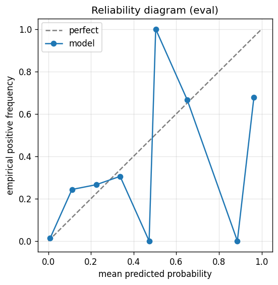

# gbdt experiment — sp500_up_50pct_50d_dd25pct_agentloop_mix

## Warnings

- **hp_search**: HP search disabled in sweep mode (max_iter=4 < threshold=5); the FS+HP loop ran feature-selection only — see issue #32.

## Spec

- universe: `sp500`
- direction: `up`
- threshold_pct: `50`
- horizon_days: `50`
- max_drawdown: `0.25`
- fs_hp_loop callback_mode: `agent_file_protocol`

## Data

- tickers in universe: 503
- tickers used: 486
- tickers excluded: NASDAQ:ABNB, NASDAQ:APP, NASDAQ:CEG, NASDAQ:DASH, NASDAQ:GEHC, NASDAQ:PLTR, NYSE:CARR, NYSE:COIN, NYSE:EXE, NYSE:GEV, NYSE:HOOD, NYSE:KVUE, NYSE:OTIS, NYSE:Q, NYSE:SNDK, NYSE:SOLV, NYSE:VLTO
- train rows: 388800 (independent events ≈ 3927.3; overlap-inflation 99.00×)
- val rows: 194400 (independent events ≈ 1963.6; overlap-inflation 99.00×)
- eval rows: 97200 (independent events ≈ 981.8; overlap-inflation 99.00×)
- test rows: 24300 (independent events ≈ 245.5; overlap-inflation 99.00×)
- sample uniqueness weighting: `on` (horizon_days=50)
- positive prevalence (train): 0.011
- positive prevalence (eval): 0.021

## Iteration history

| iter | n_features | train Brier | val Brier | gap | rationale | inner_stop |
|---|---|---|---|---|---|---|

## Final checkpoint

- best iteration: 1
- iterations run: 0
- inner stop signal: `agent_should_stop`
- fs_hp_loop callback_mode: `agent_file_protocol`

## Calibration

- method requested: `conditional_isotonic`
- decision: `isotonic`
- Spiegelhalter Z: 27.130
- Spiegelhalter p: 0.0000

## Headline metrics

| segment | Brier | base-rate Brier | improvement | LogLoss | AUC |
|---|---|---|---|---|---|
| eval | 0.0180 | 0.0201 | +0.0022 | 0.0701 | 0.9198 |
| test | 0.0225 | 0.0250 | +0.0025 | 0.0891 | 0.8836 |

## Top-K precision (per-day + global)

Per-day: pick the top-K rows by ``p_calibrated`` each date, pool across days. ``P@k = sum_d(positives_in_top_k(d)) / sum_d(min(R(d), k))`` where ``R(d)`` is the count of positives on day ``d`` — the ``min(R(d), k)`` denominator is the achievable-positives count (mandatory; see ``.claude/memories/project-r-precision-methodology.md``). ``n_denom = sum_d(min(R(d), k))``; ``n_days_R<k`` = days with fewer than ``k`` positives. Global: top-K by score across the whole segment, denominator ``min(k, total_positives)``. ``base_rate`` = unweighted segment positive prevalence (compare P@k to base_rate directly; lift omitted from the table by project reporting convention).

### eval — n_rows=97200, base_rate=0.0206

Per-day:

| k | P@k | base_rate | n_picks | n_positives | n_denom | days_R<k / days_full_k / days_total |
|---|---|---|---|---|---|---|
| 1 | 0.2100 | 0.0206 | 201 | 42 | 200 | 1 / 201 / 201 |
| 5 | 0.2934 | 0.0206 | 1001 | 274 | 934 | 30 / 200 / 201 |
| 10 | 0.3260 | 0.0206 | 2001 | 501 | 1537 | 112 / 200 / 201 |

Global (top-K across entire segment):

| k | P@k | base_rate | n_picks | n_positives | n_denom |
|---|---|---|---|---|---|
| 1 | 1.0000 | 0.0206 | 1 | 1 | 1 |
| 5 | 1.0000 | 0.0206 | 5 | 5 | 5 |
| 10 | 0.8000 | 0.0206 | 10 | 8 | 10 |

### test — n_rows=24300, base_rate=0.0257

Per-day:

| k | P@k | base_rate | n_picks | n_positives | n_denom | days_R<k / days_full_k / days_total |
|---|---|---|---|---|---|---|
| 1 | 0.3600 | 0.0257 | 50 | 18 | 50 | 0 / 50 / 50 |
| 5 | 0.3120 | 0.0257 | 250 | 78 | 250 | 0 / 50 / 50 |
| 10 | 0.2888 | 0.0257 | 500 | 134 | 464 | 17 / 50 / 50 |

Global (top-K across entire segment):

| k | P@k | base_rate | n_picks | n_positives | n_denom |
|---|---|---|---|---|---|
| 1 | 0.0000 | 0.0257 | 1 | 0 | 1 |
| 5 | 0.0000 | 0.0257 | 5 | 0 | 5 |
| 10 | 0.4000 | 0.0257 | 10 | 4 | 10 |

## Per-ticker hit-rate when picked (k=5)

Aggregates per-day top-5 picks by ticker. Top 10 most-picked + bottom 5 most-anti-predictive (when picked at least once) shown; the full table is in ``metrics.json::segment_diagnostics.<seg>.per_ticker_hit_rate.rows``.

### eval

Top-10 by n_picks:

| ticker | n_picks | n_positives | hit_rate |
|---|---|---|---|
| NYSE:CVNA | 191 | 32 | 0.1675 |
| NYSE:SMCI | 123 | 10 | 0.0813 |
| NYSE:LITE | 121 | 110 | 0.9091 |
| NYSE:SATS | 101 | 35 | 0.3465 |
| NYSE:MRNA | 89 | 0 | 0.0000 |
| NYSE:COHR | 64 | 15 | 0.2344 |
| NYSE:VRT | 60 | 13 | 0.2167 |
| NASDAQ:MU | 52 | 39 | 0.7500 |
| NASDAQ:TSLA | 40 | 5 | 0.1250 |
| NYSE:VST | 38 | 0 | 0.0000 |

Bottom-5 by hit_rate (n_picks ≥ 5):

| ticker | n_picks | n_positives | hit_rate |
|---|---|---|---|
| NYSE:MRNA | 89 | 0 | 0.0000 |
| NYSE:VST | 38 | 0 | 0.0000 |
| NYSE:CIEN | 17 | 0 | 0.0000 |
| NASDAQ:TTD | 13 | 0 | 0.0000 |
| NYSE:ALB | 12 | 0 | 0.0000 |

### test

Top-10 by n_picks:

| ticker | n_picks | n_positives | hit_rate |
|---|---|---|---|
| NYSE:LITE | 50 | 42 | 0.8400 |
| NYSE:SATS | 48 | 0 | 0.0000 |
| NASDAQ:TTD | 39 | 0 | 0.0000 |
| NASDAQ:INTC | 37 | 21 | 0.5676 |
| NASDAQ:MU | 16 | 4 | 0.2500 |
| NASDAQ:TSLA | 14 | 0 | 0.0000 |
| NYSE:COHR | 14 | 10 | 0.7143 |
| NYSE:STX | 7 | 0 | 0.0000 |
| NYSE:WDC | 7 | 1 | 0.1429 |
| NASDAQ:MCHP | 3 | 0 | 0.0000 |

Bottom-5 by hit_rate (n_picks ≥ 5):

| ticker | n_picks | n_positives | hit_rate |
|---|---|---|---|
| NYSE:SATS | 48 | 0 | 0.0000 |
| NASDAQ:TTD | 39 | 0 | 0.0000 |
| NASDAQ:TSLA | 14 | 0 | 0.0000 |
| NYSE:STX | 7 | 0 | 0.0000 |
| NYSE:WDC | 7 | 1 | 0.1429 |

## Per-quarter P@5 stability

P@5 grouped by calendar quarter. ``base_rate`` is the segment-wide positive prevalence (constant across rows); regime-dependent collapse shows as a quarter where ``P@5`` falls toward ``base_rate`` or below. ``lift`` omitted from the table by project reporting convention.

### eval

| quarter | n_picks | n_positives | P@5 | base_rate |
|---|---|---|---|---|
| 2025Q1 | 61 | 10 | 0.1639 | 0.0206 |
| 2025Q2 | 310 | 61 | 0.1968 | 0.0206 |
| 2025Q3 | 320 | 59 | 0.1844 | 0.0206 |
| 2025Q4 | 310 | 144 | 0.4645 | 0.0206 |

### test

| quarter | n_picks | n_positives | P@5 | base_rate |
|---|---|---|---|---|
| 2025Q4 | 10 | 3 | 0.3000 | 0.0257 |
| 2026Q1 | 240 | 75 | 0.3125 | 0.0257 |

## Prediction-range diagnostics

Distribution of ``p_calibrated`` per segment. ``flag_low_separation = true`` when ``std < low_separation_threshold`` — a sign the model's predictions cluster so tightly that ranking is noise.

| segment | n_rows | min | max | mean | std | flag_low_separation |
|---|---|---|---|---|---|---|
| eval | 97200 | 0.0000 | 1.0000 | 0.0132 | 0.0383 | `True` |
| test | 24300 | 0.0001 | 0.5238 | 0.0167 | 0.0379 | `True` |

## Per-experiment verdict (algorithmic readout)

Calibration: required isotonic (|z|=27.13); shipped as `isotonic`. Brier vs base-rate: +0.0022 (model beats baseline).

> NOTE: this verdict is generated from the metrics by a simple rule (see ``report._algorithmic_verdict``); it is NOT an automated pass/fail gate. The user reads the artifact and decides whether the cell ships.
